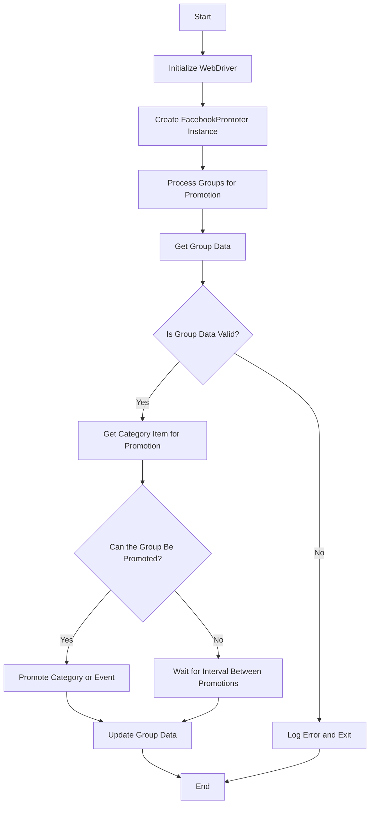

# Документация модуля Facebook Promoter

## Обзор

Модуль **Facebook Promoter** автоматизирует продвижение товаров и событий AliExpress в группах Facebook. Модуль обрабатывает публикацию рекламных акций в Facebook, гарантируя, что категории и события продвигаются без дубликатов. Он использует WebDriver для автоматизации браузера, чтобы эффективно обрабатывать рекламные акции.

## Возможности модуля

*   Продвижение категорий и событий в группы Facebook.
*   Избежание дублирования рекламных акций путем отслеживания ранее продвигаемых элементов.
*   Поддержка конфигурации данных группы через файлы.
*   Возможность отключения загрузки видео в рекламных акциях.

## Требования

*   **Python** 3.x
*   Необходимые библиотеки:

    *   `random`
    *   `datetime`
    *   `pathlib`
    *   `urllib.parse`
    *   `types.SimpleNamespace`
    *   `src` (пользовательский модуль)

## Схема



## Использование

### Пример использования класса FacebookPromoter

```python
from src.endpoints.advertisement.facebook.promoter import FacebookPromoter
from src.webdriver.driver import Driver
from src.utils.jjson import j_loads_ns

# Setup WebDriver instance (replace with actual WebDriver)
d = Driver()

# Create an instance of FacebookPromoter
promoter = FacebookPromoter(
    d=d, 
    promoter="aliexpress", 
    group_file_paths=["path/to/group/file1.json", "path/to/group/file2.json"]
)

# Start promoting products or events
promoter.process_groups(
    campaign_name="Campaign1",
    events=[], 
    group_categories_to_adv=["sales"],
    language="en",
    currency="USD"
)
```

## Документация по классам

### Класс `FacebookPromoter`

Этот класс управляет процессом продвижения товаров и событий AliExpress в группах Facebook.

#### Методы

##### `__init__(self, d: Driver, promoter: str, group_file_paths: Optional[list[str | Path] | str | Path] = None, no_video: bool = False)`

Инициализирует промоутер Facebook с необходимыми конфигурациями.

*   **Args:**

    *   `d (Driver)`: Экземпляр WebDriver для автоматизации.
    *   `promoter (str)`: Имя пользователя, осуществляющего продвижение (например, "aliexpress").
    *   `group_file_paths (Optional[list[str | Path] | str | Path])`: Пути к файлам данных группы.
    *   `no_video (bool)`: Флаг для отключения видео в сообщениях. По умолчанию - `False`.

##### `promote(self, group: SimpleNamespace, item: SimpleNamespace, is_event: bool = False, language: str = None, currency: str = None) -> bool`

Продвигает категорию или событие в указанной группе Facebook.

*   **Args:**

    *   `group (SimpleNamespace)`: Данные группы.
    *   `item (SimpleNamespace)`: Элемент категории или события для продвижения.
    *   `is_event (bool)`: Указывает, является ли элемент событием или нет.
    *   `language (str)`: Язык продвижения.
    *   `currency (str)`: Валюта для продвижения.
*   **Returns:**

    *   `bool`: Успешно ли прошло продвижение.

##### `log_promotion_error(self, is_event: bool, item_name: str)`

Регистрирует ошибку при неудачном продвижении.

*   **Args:**

    *   `is_event (bool)`: Указывает, является ли элемент событием или нет.
    *   `item_name (str)`: Название элемента.

##### `update_group_promotion_data(self, group: SimpleNamespace, item_name: str, is_event: bool = False)`

Обновляет данные группы после продвижения, добавляя продвигаемый элемент в список продвигаемых категорий или событий.

*   **Args:**

    *   `group (SimpleNamespace)`: Данные группы.
    *   `item_name (str)`: Название продвигаемого элемента.
    *   `is_event (bool)`: Указывает, является ли элемент событием или нет.

##### `process_groups(self, campaign_name: str = None, events: list[SimpleNamespace] = None, is_event: bool = False, group_file_paths: list[str] = None, group_categories_to_adv: list[str] = ['sales'], language: str = None, currency: str = None)`

Обрабатывает группы для текущей рекламной кампании или продвижения события.

*   **Args:**

    *   `campaign_name (str)`: Название кампании.
    *   `events (list[SimpleNamespace])`: Список событий для продвижения.
    *   `is_event (bool)`: Указывает, следует ли продвигать события или категории.
    *   `group_file_paths (list[str])`: Пути к файлам данных группы.
    *   `group_categories_to_adv (list[str])`: Категории для продвижения.
    *   `language (str)`: Язык продвижения.
    *   `currency (str)`: Валюта для продвижения.

##### `get_category_item(self, campaign_name: str, group: SimpleNamespace, language: str, currency: str) -> SimpleNamespace`

Извлекает элемент категории для продвижения на основе кампании и промоутера.

*   **Args:**

    *   `campaign_name (str)`: Название кампании.
    *   `group (SimpleNamespace)`: Данные группы.
    *   `language (str)`: Язык продвижения.
    *   `currency (str)`: Валюта для продвижения.
*   **Returns:**

    *   `SimpleNamespace`: Элемент категории для продвижения.

##### `check_interval(self, group: SimpleNamespace) -> bool`

Проверяет, достаточно ли времени прошло для повторного продвижения этой группы.

*   **Args:**

    *   `group (SimpleNamespace)`: Данные группы.
*   **Returns:**

    *   `bool`: Доступна ли группа для продвижения.

##### `validate_group(self, group: SimpleNamespace) -> bool`

Проверяет данные группы, чтобы убедиться, что у них есть необходимые атрибуты.

*   **Args:**

    *   `group (SimpleNamespace)`: Данные группы.
*   **Returns:**

    *   `bool`: Являются ли данные группы действительными.

## Лицензия

Этот модуль является частью более крупного пакета **Facebook Promoter** и лицензирован в соответствии с лицензией MIT.