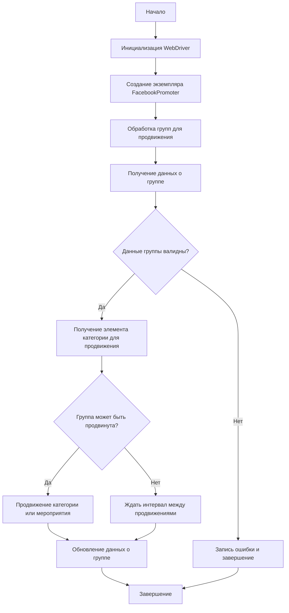

# Документация модуля Facebook Promoter

## Обзор

Модуль **Facebook Promoter** автоматизирует продвижение товаров и мероприятий AliExpress в группах Facebook. Модуль управляет публикациями рекламных материалов на Facebook, избегая дублирования. Для эффективного продвижения используется WebDriver для автоматизации браузера.

## Особенности модуля

*   Продвижение категорий и мероприятий в группах Facebook.
*   Избежание дублирования публикаций через отслеживание уже опубликованных элементов.
*   Поддержка конфигурации данных групп через файлы.
*   Возможность отключения загрузки видео в публикациях.

## Требования

*   **Python** 3.x
*   Необходимые библиотеки:

    *   `random`
    *   `datetime`
    *   `pathlib`
    *   `urllib.parse`
    *   `types.SimpleNamespace`
    *   `src` (пользовательский модуль)

## Использование

### Пример использования класса FacebookPromoter

```python
from src.endpoints.advertisement.facebook.promoter import FacebookPromoter
from src.webdriver.driver import Driver
from src.utils.jjson import j_loads_ns

# Настройка экземпляра WebDriver (замените на реальный WebDriver)
d = Driver()

# Создание экземпляра FacebookPromoter
promoter = FacebookPromoter(
    d=d,
    promoter="aliexpress",
    group_file_paths=["path/to/group/file1.json", "path/to/group/file2.json"]
)

# Начало продвижения товаров или мероприятий
promoter.process_groups(
    campaign_name="Campaign1",
    events=[],
    group_categories_to_adv=["sales"],
    language="en",
    currency="USD"
)
```

## Документация классов

### Класс `FacebookPromoter`

Этот класс управляет процессом продвижения товаров и мероприятий AliExpress в группах Facebook.



#### Методы

##### `__init__(self, d: Driver, promoter: str, group_file_paths: Optional[list[str | Path] | str | Path] = None, no_video: bool = False)`

Инициализирует промоутер для Facebook с необходимыми конфигурациями.

*   **Аргументы:**

    *   `d (Driver)`: Экземпляр WebDriver для автоматизации.
    *   `promoter (str)`: Имя промоутера (например, "aliexpress").
    *   `group_file_paths (Optional[list[str | Path] | str | Path])`: Пути к файлам с данными групп.
    *   `no_video (bool)`: Флаг для отключения видео в публикациях. По умолчанию `False`.

##### `promote(self, group: SimpleNamespace, item: SimpleNamespace, is_event: bool = False, language: str = None, currency: str = None) -> bool`

Продвигает категорию или мероприятие в указанной группе Facebook.

*   **Аргументы:**

    *   `group (SimpleNamespace)`: Данные группы.
    *   `item (SimpleNamespace)`: Категория или мероприятие для продвижения.
    *   `is_event (bool)`: Является ли элемент мероприятием.
    *   `language (str)`: Язык публикации.
    *   `currency (str)`: Валюта для продвижения.
*   **Возвращает:**

    *   `bool`: Успешно ли прошло продвижение.

##### `log_promotion_error(self, is_event: bool, item_name: str)`

Записывает ошибку, если продвижение не удалось.

*   **Аргументы:**

    *   `is_event (bool)`: Является ли элемент мероприятием.
    *   `item_name (str)`: Название элемента.

##### `update_group_promotion_data(self, group: SimpleNamespace, item_name: str, is_event: bool = False)`

Обновляет данные группы после продвижения, добавляя продвигаемый элемент в список продвигаемых категорий или мероприятий.

*   **Аргументы:**

    *   `group (SimpleNamespace)`: Данные группы.
    *   `item_name (str)`: Название продвигаемого элемента.
    *   `is_event (bool)`: Является ли элемент мероприятием.

##### `process_groups(self, campaign_name: str = None, events: list[SimpleNamespace] = None, is_event: bool = False, group_file_paths: list[str] = None, group_categories_to_adv: list[str] = ['sales'], language: str = None, currency: str = None)`

Обрабатывает группы для текущей кампании или продвижения мероприятия.

*   **Аргументы:**

    *   `campaign_name (str)`: Название кампании.
    *   `events (list[SimpleNamespace])`: Список мероприятий для продвижения.
    *   `is_event (bool)`: Является ли продвижение мероприятий или категорий.
    *   `group_file_paths (list[str])`: Пути к файлам с данными групп.
    *   `group_categories_to_adv (list[str])`: Категории для продвижения.
    *   `language (str)`: Язык публикации.
    *   `currency (str)`: Валюта для продвижения.

##### `get_category_item(self, campaign_name: str, group: SimpleNamespace, language: str, currency: str) -> SimpleNamespace`

Получает элемент категории для продвижения в зависимости от кампании и промоутера.

*   **Аргументы:**

    *   `campaign_name (str)`: Название кампании.
    *   `group (SimpleNamespace)`: Данные группы.
    *   `language (str)`: Язык для публикации.
    *   `currency (str)`: Валюта для публикации.
*   **Возвращает:**

    *   `SimpleNamespace`: Элемент категории для продвижения.

##### `check_interval(self, group: SimpleNamespace) -> bool`

Проверяет, прошло ли достаточно времени, чтобы снова продвигать эту группу.

*   **Аргументы:**

    *   `group (SimpleNamespace)`: Данные группы.
*   **Возвращает:**

    *   `bool`: Можно ли снова продвигать группу.

##### `validate_group(self, group: SimpleNamespace) -> bool`

Проверяет данные группы, чтобы убедиться в их корректности.

*   **Аргументы:**

    *   `group (SimpleNamespace)`: Данные группы.
*   **Возвращает:**

    *   `bool`: Корректны ли данные группы.

## Лицензия

Модуль является частью пакета **Facebook Promoter** и лицензируется по лицензии MIT.