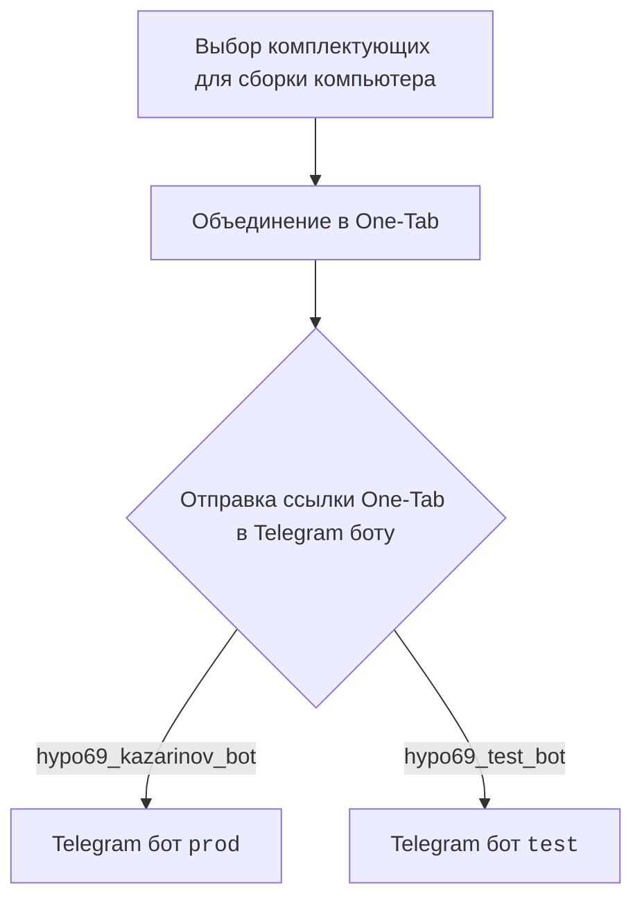
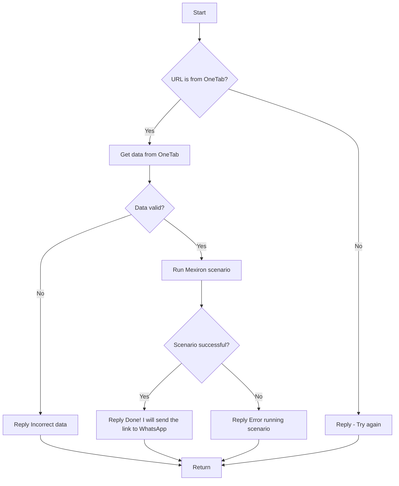

# Модуль Kazarinov. Создатель прайс-листов в формате PDF

## Обзор

Модуль `src.endpoints.kazarinov` предназначен для создания прайс-листов в формате PDF на основе данных, полученных от Сергея Казаринова.

## Подробней

Модуль обеспечивает интеграцию с Telegram-ботом и веб-сайтами поставщиков комплектующих для компьютеров, чтобы автоматизировать процесс создания прайс-листов.

## Описание

KazarinovTelegramBot

*   [https://one-tab.co.il](https://one-tab.co.il)
*   [https://morlevi.co.il](https://morlevi.co.il)
*   [https://grandavance.co.il](https://grandavance.co.il)
*   [https://ivory.co.il](https://ivory.co.il)
*   [https://ksp.co.il](https://ksp.co.il)

BotHandler

Client side (Kazarinov):

Code side:

## Ссылки

Следующий

*   [Kazarinov bot](https://github.com/hypo69/hypotez/blob/master/src/endpoints/kazarinov/kazarinov_bot.md)
*   [Scenario Execution](https://github.com/hypo69/hypotez/blob/master/src/endpoints/kazarinov/scenarios/README.MD)

[Root ↑](https://github.com/hypo69/hypotez/blob/master/readme.ru.md)
[Русский](https://github.com/hypo69/hypotez/blob/master/src/endpoints/kazarinov/readme.ru.md)