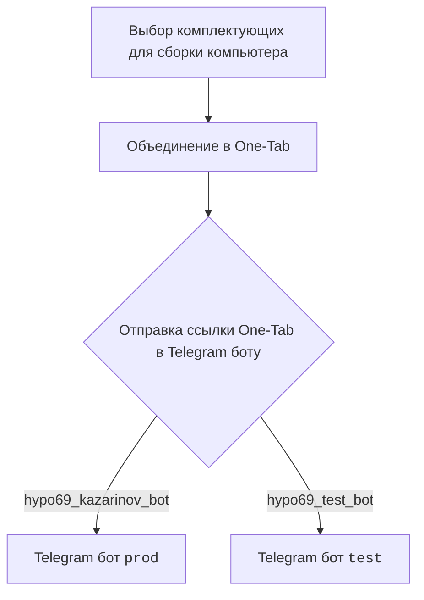
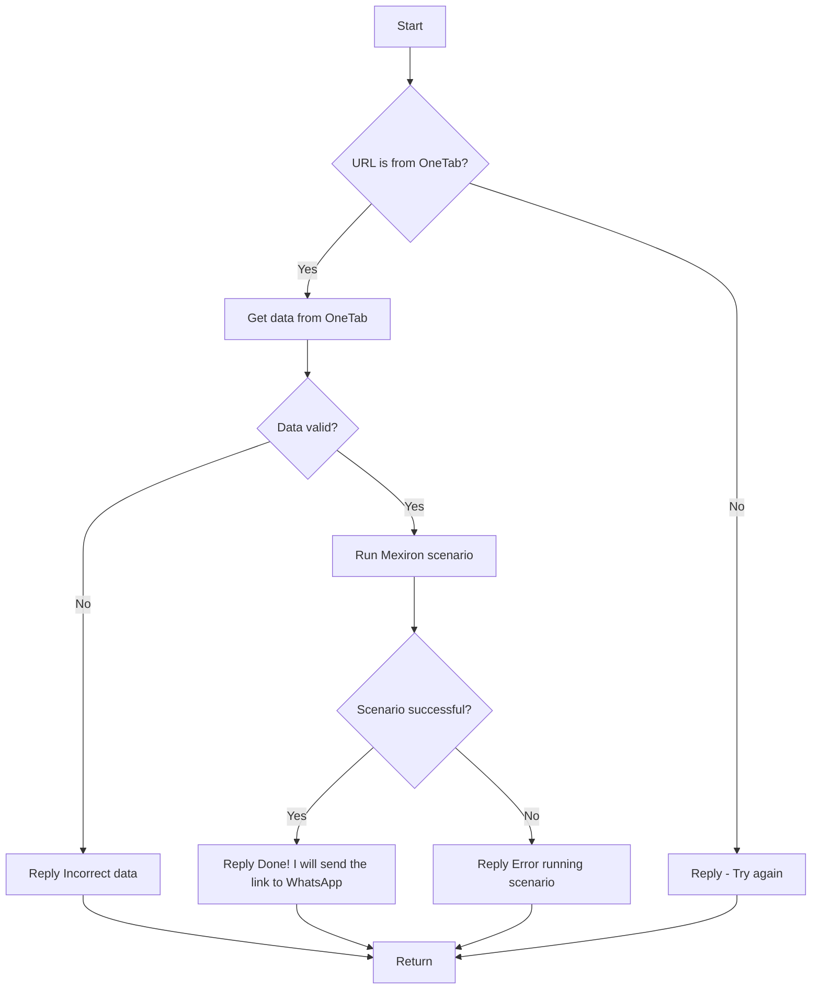

# Модуль Kazarinov. Мехирон в pdf

## Обзор

Модуль `src.endpoints.kazarinov` предназначен для создания прайс-листов (мехирон) в формате PDF.

## Подробней

Этот модуль автоматизирует процесс сбора данных о товарах с различных веб-сайтов и формирования прайс-листов для Сергея Казаринова.

## Описание

KazarinovTelegramBot

*   [https://one-tab.co.il](https://one-tab.co.il)
*   [https://morlevi.co.il](https://morlevi.co.il)
*   [https://grandavance.co.il](https://grandavance.co.il)
*   [https://ivory.co.il](https://ivory.co.il)
*   [https://ksp.co.il](https://ksp.co.il)

BotHandler

На стороне клиента:

На стороне кода:

*   `kazarinov_bot.handle_message()` -> `kazarinov.scenarios.run_scenario()`:

## Ссылки

Далее

*   [Казарионв бот](https://github.com/hypo69/hypotez/blob/master/src/endpoints/kazarinov/kazarinov_bot.ru.md)
*   [Испоолнение сценария](https://github.com/hypo69/hypotez/blob/master/src/endpoints/kazarinov/scenarios/readme.ru.md)

[Root ↑](https://github.com/hypo69/hypotez/blob/master/readme.ru.md)
[English](https://github.com/hypo69/hypotez/blob/master/src/endpoints/kazarinov/README.MD)