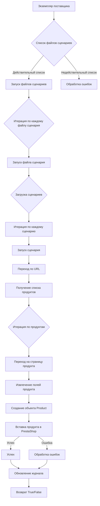

# Модуль `scenario`

## Обзор

Модуль `src.scenario` предназначен для автоматизации взаимодействия с поставщиками с использованием сценариев, описанных в JSON-файлах. Он упрощает процесс извлечения и обработки данных о продуктах с веб-сайтов поставщиков и синхронизации этой информации с базой данных (например, PrestaShop). Модуль включает функциональность для чтения сценариев, взаимодействия с веб-сайтами, обработки данных, ведения журналов выполнения и организации всего рабочего процесса.

## Подробней

Модуль предоставляет инструменты для автоматизации сбора данных о товарах с сайтов поставщиков и их интеграции с PrestaShop.

## Основные функции модуля

1.  **Чтение сценариев**: Загрузка сценариев из JSON-файлов, содержащих информацию о товарах и URL на веб-сайте поставщика.
2.  **Взаимодействие с веб-сайтами**: Обработка URL из сценариев для извлечения данных о товарах.
3.  **Обработка данных**: Преобразование извлеченных данных в формат, подходящий для базы данных и сохранение.
4.  **Ведение журнала выполнения**: Ведение журналов с подробной информацией о выполнении сценария и результатах для отслеживания прогресса и выявления ошибок.



## Основные компоненты модуля

### `run_scenario_files(s, scenario_files_list)`

**Описание**: Принимает список файлов сценариев и последовательно выполняет их, вызывая функцию `run_scenario_file` для каждого файла.

**Параметры**:

*   `s`: Объект настроек (например, для подключения к базе данных).
*   `scenario_files_list` (list): Список путей к файлам сценариев.

**Возвращает**:

*   `None`

**Вызывает исключения**:

*   `FileNotFoundError`: Если файл сценария не найден.
*   `JSONDecodeError`: Если файл сценария содержит невалидный JSON.

### `run_scenario_file(s, scenario_file)`

**Описание**: Загружает сценарии из указанного файла и вызывает функцию `run_scenario` для каждого сценария в файле.

**Параметры**:

*   `s`: Объект настроек.
*   `scenario_file` (str): Путь к файлу сценария.

**Возвращает**:

*   `None`

**Вызывает исключения**:

*   `FileNotFoundError`: Если файл сценария не найден.
*   `JSONDecodeError`: Если файл сценария содержит невалидный JSON.
*   `Exception`: При любых других проблемах во время выполнения сценария.

### `run_scenario(s, scenario)`

**Описание**: Обрабатывает отдельный сценарий, переходя по URL, извлекая данные о продукте и сохраняя их в базе данных.

**Параметры**:

*   `s`: Объект настроек.
*   `scenario` (dict): Словарь, содержащий сценарий (например, с URL и категориями).

**Возвращает**:

*   `None`

**Вызывает исключения**:

*   `requests.exceptions.RequestException`: При проблемах с запросом к веб-сайту.
*   `Exception`: При любых других проблемах во время обработки сценария.

### `dump_journal(s, journal)`

**Описание**: Сохраняет журнал выполнения в файл для последующего анализа.

**Параметры**:

*   `s`: Объект настроек.
*   `journal` (list): Список записей журнала выполнения.

**Возвращает**:

*   `None`

**Вызывает исключения**:

*   `Exception`: При проблемах записи в файл.

### `main()`

**Описание**: Главная функция для запуска модуля.

**Параметры**:

*   `None`

**Возвращает**:

*   `None`

**Вызывает исключения**:

*   `Exception`: При любых критических ошибках во время выполнения.

## Пример сценария

Пример JSON сценария, описывающего взаимодействие с категориями товаров на веб-сайте. Он включает URL, имя категории и идентификаторы категорий в базе данных PrestaShop.

```json
{
    "scenarios": {
        "mineral+creams": {
            "url": "https://example.com/category/mineral-creams/",
            "name": "mineral+creams",
            "presta_categories": {
                "default_category": 12345,
                "additional_categories": [12346, 12347]
            }
        }
    }
}
```