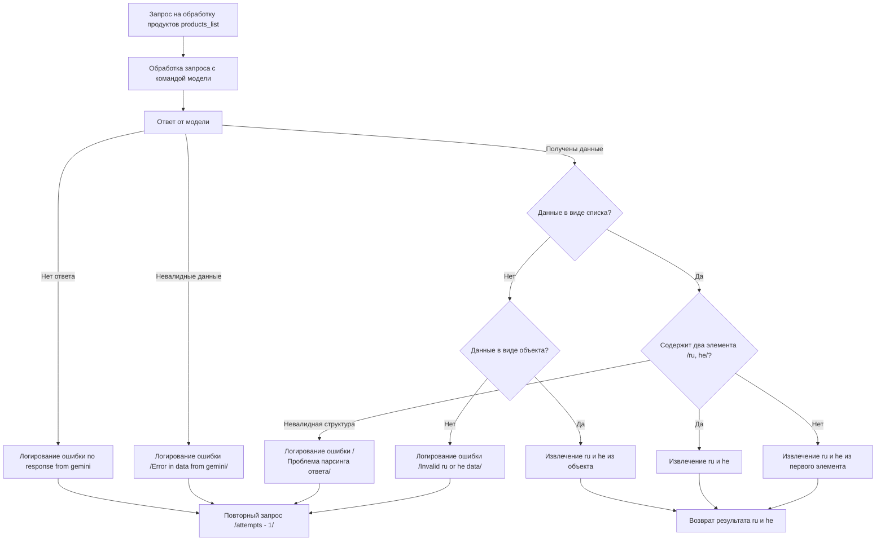

# Модуль `scenarios`

## Обзор

Этот модуль описывает основные этапы обработки данных и взаимодействия с моделью Gemini для создания отчетов о товарах, начиная от запроса на обработку продуктов и заканчивая формированием и извлечением данных на разных языках.

## Подробней

В этом модуле визуализированы шаги обработки запроса на основе блок-схемы, что позволяет лучше понять логику работы и взаимодействия между компонентами.

## Блок-схема

## Описание этапов

1.  **A \[Запрос на обработку продуктов products\_list]**: Начало процесса, когда поступает запрос на обработку списка продуктов.
2.  **B \[Обработка запроса с командой модели]**: Отправка запроса в модель Gemini с командой для обработки данных.
3.  **C \[Ответ от модели]**: Получение ответа от модели Gemini.

### Обработка ошибок и валидация данных

*   **D \[Логирование ошибки no response from gemini]**: В случае отсутствия ответа от модели регистрируется ошибка.
*   **E \[Повторный запрос /attempts - 1/]**: Повторная отправка запроса с уменьшенным количеством попыток.
*   **F \[Логирование ошибки /Error in data from gemini/]**: В случае получения невалидных данных регистрируется ошибка.
*   **K \[Логирование ошибки /Проблема парсинга ответа/]**: При наличии проблем с разбором ответа регистрируется ошибка.
*   **N \[Логирование ошибки /Invalid ru or he data/]**: Если данные на русском или иврите невалидны, регистрируется ошибка.

### Проверка и извлечение данных

*   **G {Данные в виде списка?}**: Проверка, представлен ли ответ от модели в виде списка.
*   **H {Содержит два элемента /ru, he/?}**: Проверка, содержит ли список два элемента (для русского и ивритского языков).
*   **I \[Извлечение ru и he]**: Извлечение данных на русском и иврите из списка.
*   **J \[Извлечение ru и he из первого элемента]**: Извлечение данных на русском и иврите из первого элемента списка.
*   **L {Данные в виде объекта?}**: Проверка, представлены ли данные в виде объекта.
*   **M \[Извлечение ru и he из объекта]**: Извлечение данных на русском и иврите из объекта.
*   **O \[Возврат результата ru и he]**: Возврат полученных данных на русском и иврите.

## Замечания

Представленная блок-схема описывает логику работы модуля и шаги обработки данных, но не включает детали реализации конкретных функций и классов.