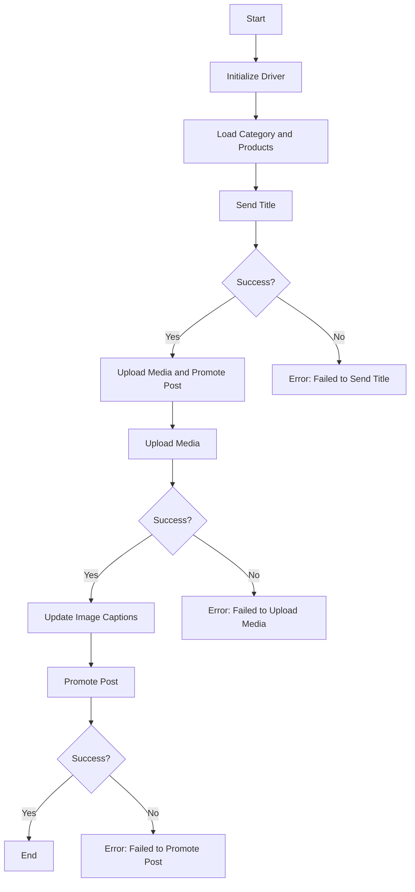

# Асинхронный модуль для публикации сообщений в Facebook

```rst
... module:: src.endpoints.advertisement.facebook.post_message_async
```

## Обзор

Этот скрипт является частью каталога `hypotez/src/endpoints/advertisement/facebook/scenarios` и предназначен для автоматизации процесса публикации сообщений в Facebook. Скрипт взаимодействует со страницей Facebook, используя локаторы для выполнения различных действий, таких как отправка сообщений, загрузка медиафайлов и обновление подписей.

## Ключевые особенности

1.  **Отправка заголовка и описания**: Отправляет заголовок и описание кампании в поле сообщения Facebook.
2.  **Загрузка медиафайлов**: Загружает медиафайлы (изображения и видео) в сообщение Facebook и обновляет их подписи.
3.  **Продвижение сообщения**: Управляет всем процессом продвижения сообщения с заголовком, описанием и медиафайлами.

## Структура модуля



## Легенда

1.  **Start**: Начало выполнения скрипта.
2.  **InitDriver**: Создание экземпляра класса `Driver`.
3.  **LoadCategoryAndProducts**: Загрузка данных о категории и товарах.
4.  **SendTitle**: Вызов функции `post_title` для отправки заголовка.
5.  **CheckTitleSuccess**: Проверка, успешно ли отправлен заголовок.

    *   **Yes**: Переход к загрузке медиа и продвижению сообщения.
    *   **No**: Вывод ошибки "Failed to send title".
6.  **UploadMediaAndPromotePost**: Вызов функции `promote_post`.
7.  **UploadMedia**: Вызов функции `upload_media` для загрузки медиафайлов.
8.  **CheckMediaSuccess**: Проверка, успешно ли загружены медиафайлы.

    *   **Yes**: Переход к обновлению подписей изображений.
    *   **No**: Вывод ошибки "Failed to upload media".
9.  **UpdateCaptions**: Вызов функции `update_images_captions` для обновления подписей.
10. **PromotePost**: Завершение процесса продвижения сообщения.
11. **CheckPromoteSuccess**: Проверка, успешно ли продвинуто сообщение.

    *   **Yes**: Завершение выполнения скрипта.
    *   **No**: Вывод ошибки "Failed to promote post".

---

#### Функции

*   **`post_title(d: Driver, category: SimpleNamespace) -> bool`**:

    *   **Назначение**: Отправляет заголовок и описание кампании в поле сообщения Facebook.
    *   **Параметры**:

        *   `d`: Экземпляр `Driver`, используемый для взаимодействия с веб-страницей.
        *   `category`: Категория, содержащая заголовок и описание для отправки.
    *   **Возвращает**: `True`, если заголовок и описание отправлены успешно, иначе `None`.
*   **`upload_media(d: Driver, products: List[SimpleNamespace], no_video: bool = False) -> bool`**:

    *   **Назначение**: Загружает медиафайлы в сообщение Facebook и обновляет их подписи.
    *   **Параметры**:

        *   `d`: Экземпляр `Driver`, используемый для взаимодействия с веб-страницей.
        *   `products`: Список товаров, содержащих пути к медиафайлам.
        *   `no_video`: Флаг, указывающий, следует ли пропускать загрузку видео.
    *   **Возвращает**: `True`, если медиафайлы загружены успешно, иначе `None`.
*   **`update_images_captions(d: Driver, products: List[SimpleNamespace], textarea_list: List[WebElement]) -> None`**:

    *   **Назначение**: Асинхронно добавляет описания к загруженным медиафайлам.
    *   **Параметры**:

        *   `d`: Экземпляр `Driver`, используемый для взаимодействия с веб-страницей.
        *   `products`: Список товаров с деталями для обновления.
        *   `textarea_list`: Список текстовых областей, где добавляются подписи.

*   **`promote_post(d: Driver, category: SimpleNamespace, products: List[SimpleNamespace], no_video: bool = False) -> bool`**:

    *   **Назначение**: Управляет процессом продвижения сообщения с заголовком, описанием и медиафайлами.
    *   **Параметры**:

        *   `d`: Экземпляр `Driver`, используемый для взаимодействия с веб-страницей.
        *   `category`: Категория, содержащая заголовок и описание.
        *   `products`: Список товаров, содержащих медиафайлы.
        *   `no_video`: Флаг для пропуска видео.
    *   **Возвращает**: `True`, если сообщение было продвинуто успешно, иначе `None`.

### Использование

Чтобы использовать этот скрипт, выполните следующие действия:

1.  **Инициализация Driver**: Создайте экземпляр класса `Driver`.
2.  **Загрузка Locators**: Загрузите локаторы из файла JSON.
3.  **Вызов функций**: Используйте предоставленные функции для отправки заголовка, загрузки медиа и продвижения сообщения.

#### Пример

```python
from src.webdriver.driver import Driver
from types import SimpleNamespace

# Initialize Driver
driver = Driver(...)

# Load category and products
category = SimpleNamespace(title="Campaign Title", description="Campaign Description")
products = [SimpleNamespace(local_image_path='path/to/image.jpg', ...)]

# Send title
post_title(driver, category)

# Upload media and promote post
await promote_post(driver, category, products)
```

### Зависимости

*   `selenium`: Для автоматизации веб-интерфейса.
*   `asyncio`: Для асинхронных операций.
*   `pathlib`: Для работы с путями к файлам.
*   `types`: Для создания простых пространств имен.
*   `typing`: Для аннотаций типов.

### Обработка ошибок

Скрипт включает надежную обработку ошибок, чтобы обеспечить продолжение выполнения, даже если определенные элементы не найдены или возникли проблемы с веб-страницей. Это особенно полезно для обработки динамических или нестабильных веб-страниц.

### Вклад

Приветствуются вклады в этот скрипт. Пожалуйста, убедитесь, что любые изменения хорошо документированы и включают соответствующие тесты.

### Лицензия

Этот скрипт лицензируется в соответствии с лицензией MIT. Подробности см. в файле `LICENSE`.