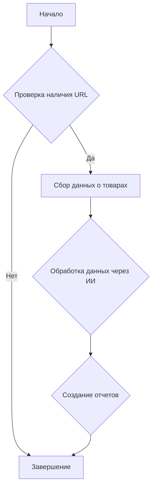

## Сценарий создания мехирона для Сергея Казаринова

### Обзор

Этот скрипт является частью директории `hypotez/src/endpoints/kazarinov/scenarios` и предназначен для автоматизации процесса создания "мехирона" для Сергея Казаринова. Скрипт извлекает, парсит и обрабатывает данные о продуктах от различных поставщиков, подготавливает данные, обрабатывает их через ИИ и интегрирует с Facebook для публикации продуктов.

### Основные возможности

1.  **Извлечение и парсинг данных**: Извлекает и парсит данные о продуктах от различных поставщиков.
2.  **Обработка данных через ИИ**: Обрабатывает извлеченные данные через модель Google Generative AI.
3.  **Хранение данных**: Сохраняет обработанные данные в файлы.
4.  **Генерация отчетов**: Генерирует HTML и PDF отчеты из обработанных данных.
5.  **Публикация в Facebook**: Публикует обработанные данные в Facebook.

### Модульная блок-схема

Ниже представлена модульная блок-схема, иллюстрирующая основные этапы работы скрипта:



### Классы

#### Класс: `Scenario(QuotationBuilder)`

Этот класс отвечает за выполнение основного сценария создания мехирона.

-   **Наследует**: `QuotationBuilder`

-   **Описание**:

    Класс `Scenario` предназначен для организации всего процесса создания мехирона, начиная от сбора данных о товарах и заканчивая созданием отчетов. Он включает в себя методы для взаимодействия с различными поставщиками, обработки данных через ИИ и генерации отчетов.

    **Методы**:

    *   `__init__(self, mexiron_name: Optional[str] = gs.now, driver: Optional[Firefox | Playwrid | str] = None, **kwards)`
        *   **Назначение**: Инициализирует класс `Scenario`.

        *   **Параметры**:

            *   `mexiron_name` (Optional[str]): Пользовательское имя для процесса мехирона (по умолчанию текущее время).
            *   `driver` (Optional[Firefox | Playwrid | str]): Экземпляр веб-драйвера (Firefox или Playwright).
            *   `**kwards`: Дополнительные параметры.

        *   **Как работает функция**:

            1.  Устанавливает оконный режим для веб-драйвера (если не указан, используется режим `normal`).
            2.  Инициализирует веб-драйвер на основе переданного аргумента `driver` (Firefox или Playwright).
            3.  Вызывает конструктор родительского класса `QuotationBuilder` с переданными параметрами.
    *   **`run_scenario_async(self, urls: List[str], price: Optional[str] = '', mexiron_name: Optional[str] = gs.now, bot: Optional[telebot.TeleBot] = None, chat_id: Optional[int] = 0, attempts: int = 3) -> bool`**
        *   **Назначение**: Асинхронно выполняет сценарий, включающий в себя парсинг товаров, обработку с помощью ИИ и сохранение данных.
        *   **Параметры**:
            *   `urls` (List[str]): Список URL страниц товаров.
            *   `price` (Optional[str]): Цена (по умолчанию '').
            *   `mexiron_name` (Optional[str]): Имя мехирона (по умолчанию текущее время).
            *   `bot` (Optional[telebot.TeleBot]): Объект Telegram бота (по умолчанию None).
            *   `chat_id` (Optional[int]): ID чата Telegram (по умолчанию 0).
            *   `attempts` (int): Количество попыток для выполнения операции (по умолчанию 3).
        *   **Возвращает**: `True`, если сценарий выполнен успешно, иначе `False`.
        *   **Как работает функция**:

            1.  **Сбор данных о товарах**: Для каждого URL из списка `urls`:
                *   Определяет грабер (scraper) на основе URL поставщика.
                *   Извлекает данные о товаре с помощью метода `grab_page_async` объекта `graber`.
                *   Конвертирует данные о товаре в нужный формат.
                *   Сохраняет данные о товаре в файл с помощью метода `save_product_data`.
                *   Добавляет данные о товаре в список `products_list`.
            2.  **Обработка данных через ИИ**: Обрабатывает список товаров с использованием модели Gemini для каждого языка (иврит и русский) с помощью метода `process_llm_async`.
            3.  **Создание отчетов**: Создает отчеты в формате HTML и PDF для каждого языка с помощью класса `ReportGenerator`.

## Функции

### `fetch_target_urls_onetab(url)`

*   **Назначение**: Извлекает данные из OneTab (реализация не предоставлена).

### `run_sample_scenario`

```python
def run_sample_scenario():
    """"""
    ...
```

**Назначение**: Выполняет пример сценария с заданными URL.

**Как работает функция**:

1.  Создает список URL-адресов для тестовых поставщиков.
2.  Создает экземпляр класса `Scenario` с режимом окна `'normal'`.
3.  Запускает асинхронный сценарий с помощью метода `run_scenario_async`.

## Примеры

В конце модуля приведен пример вызова функции `run_sample_scenario` для демонстрации работы модуля.

```python
if __name__ == '__main__':
    run_sample_scenario()
```

## Справочная информация

При работе с данным модулем следует учитывать:

*   Класс `Scenario` использует класс `QuotationBuilder` для основных операций.
*   Для работы с веб-страницами используются веб-драйверы (например, Firefox, Playwright).
*   Обработка данных включает использование модели Google Gemini для перевода и анализа информации.

## Зависимости

*   `telebot`: Для интеграции с Telegram ботом.
*   `bs4`: Для парсинга HTML.
*   `requests`: Для выполнения HTTP запросов.
*   `asyncio`: Для асинхронных операций.
*   `pathlib`: Для обработки путей к файлам.
*   `typing`: Для аннотаций типов.

## Примеры

Пример использования метода `run_sample_scenario` для выполнения основного сценария:

```python
if __name__ == '__main__':
    run_sample_scenario()
```

### Предостережения

1.  Скрипт требует настройки переменных окружения или файла конфигурации `config.json` для работы с Telegram и Gemini API.
2.  Обработка ошибок в коде не всегда полная и может потребовать доработки для обеспечения стабильной работы.