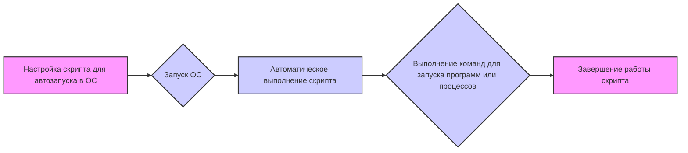
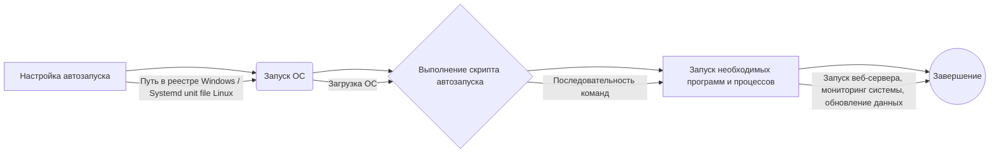

# Документация модуля autostart.ru.md

## Обзор

Этот модуль предоставляет документацию для скрипта автозапуска, который предназначен для автоматического запуска определенных процессов или программ при включении компьютера. Документация содержит обзор, подробное описание, информацию о функциях и примеры использования скрипта автозапуска.

## Содержание

- [Обзор](#обзор)
- [Подробней](#подробней)
- [Функции](#функции)
  - [`auto_start_script`](#auto_start_script)
- [Блок-схема](#блок-схема)
- [Диаграмма](#диаграмма)
- [Объяснение](#объяснение)

## Подробней

Данный скрипт предназначен для автоматического запуска определенных процессов или программ при включении компьютера. Это может быть полезно для задач, требующих постоянной работы в фоновом режиме или для автоматизации рутинных операций.

## Функции

В предоставленном коде содержится только ссылка на обсуждение ([start script on os starting](https://chatgpt.com/share/674356d7-7ef8-800d-a6ee-476fae293594)), поэтому детальное описание функций и методов невозможно. Однако, общая логика скрипта автозапуска может быть следующей:

### `auto_start_script`

**Назначение**: Запуск скрипта при старте операционной системы.

**Параметры**:

*   Отсутствуют, т.к. код не предоставлен.

**Возвращает**:

*   Зависит от функциональности скрипта, но, как правило, ничего не возвращает.

**Вызывает исключения**:

*   В зависимости от реализации скрипта, могут возникать различные исключения при его выполнении (например, ошибки при запуске программ, нехватка ресурсов и т.д.).

**Как работает функция**:

1.  Скрипт настраивается таким образом, чтобы он запускался при старте операционной системы. Способы настройки зависят от конкретной ОС (например, для Windows это может быть реестр или папка "Автозагрузка", для Linux - systemd или init-скрипты).
2.  При запуске ОС скрипт автоматически выполняется.
3.  Скрипт выполняет последовательность команд, необходимую для запуска нужных программ или процессов.

**Примеры**:

*   Поскольку код скрипта не предоставлен, примеры использования невозможны. Однако, примеры скриптов автозапуска могут включать:
    *   Запуск веб-сервера (Starting a web server).
    *   Запуск программы для мониторинга системы (Starting a system monitoring program).
    *   Автоматическое обновление данных (Automatic data update).

## Блок-схема

Учитывая, что конкретный код скрипта отсутствует, блок-схема описывает общую логику скрипта автозапуска.

Примеры для каждого логического блока:

*   **A (Настройка скрипта для автозапуска в ОС)**:
    *   Windows: добавление записи в реестр или помещение скрипта в папку "Автозагрузка".
    *   Linux: использование systemd или init-скриптов.
    *   macOS: использование launchd.
*   **B (Запуск ОС)**:
    *   Включение компьютера или перезагрузка системы.
*   **C (Автоматическое выполнение скрипта)**:
    *   Скрипт начинает выполняться сразу после загрузки операционной системы.
*   **D (Выполнение команд для запуска программ или процессов)**:
    *   Запуск веб-сервера (например, `python -m http.server`).
    *   Запуск скрипта мониторинга системы (например, `python monitor.py`).
    *   Обновление данных (например, `python update_data.py`).
*   **E (Завершение работы скрипта)**:
    *   Скрипт завершает свою работу после выполнения всех команд, или продолжает работать в фоновом режиме.

## Диаграмма

**Объяснение:**

1.  **Настройка автозапуска**: Скрипт настраивается для автоматического запуска при старте операционной системы. Это может включать добавление записи в реестр Windows, создание systemd unit file в Linux или использование launchd в macOS.
2.  **Запуск ОС**: Операционная система запускается (включается или перезагружается).
3.  **Выполнение скрипта автозапуска**: Скрипт автоматически выполняется после загрузки операционной системы.
4.  **Запуск необходимых программ и процессов**: Скрипт выполняет последовательность команд для запуска необходимых программ или процессов (например, веб-сервер, мониторинг системы, обновление данных).
5.  **Завершение**: Скрипт завершает свою работу после выполнения всех команд.

## Объяснение

Данный документ представляет собой описание скрипта автозапуска, предназначенного для автоматического запуска определенных процессов или программ при включении компьютера.

*   **Обзор**: Описывает общую цель и назначение скрипта.
*   **Подробней**: Предоставляет дополнительную информацию о том, для чего может быть полезен данный скрипт.
*   **Функции**: Описывает основную логику работы скрипта автозапуска.
    *   **`auto_start_script`**:
        *   **Назначение**: Запуск скрипта при старте операционной системы.
        *   **Параметры**: Отсутствуют, т.к. код не предоставлен.
        *   **Возвращает**: Зависит от функциональности скрипта, но обычно ничего не возвращает.
        *   **Вызывает исключения**: В зависимости от реализации скрипта, могут возникать различные исключения при его выполнении.
        *   **Как работает**: Скрипт настраивается для запуска при старте ОС, затем выполняется автоматически и выполняет необходимые команды.
        *   **Примеры**: Запуск веб-сервера, программы мониторинга системы, автоматическое обновление данных.

**Потенциальные ошибки и области для улучшения:**

*   Отсутствие конкретного кода скрипта делает документ менее полезным.
*   Недостаточно деталей о настройке автозапуска для разных операционных систем.
*   Нет примеров использования, что снижает практическую ценность документа.

**Рекомендации:**

1.  Добавить конкретный код скрипта, чтобы предоставить пользователям отправную точку.
2.  Описать настройку автозапуска для разных ОС (Windows, Linux, macOS).
3.  Включить примеры скриптов автозапуска для различных задач.
4.  Перевести описание на английский язык.

Цепочка взаимосвязей с другими частями проекта не может быть установлена, поскольку конкретный код скрипта отсутствует.