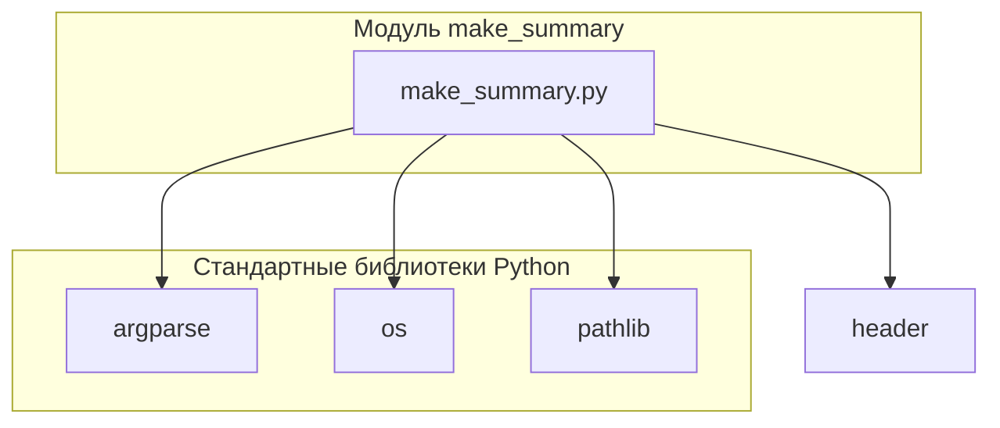

## Анализ кода модуля `make_summary.py`

### Качество кода:
- **Соответствие стандартам**: 7/10
- **Плюсы**:
    - Подробное описание функциональности модуля и функции `main`.
    - Описание аргументов командной строки и их влияния на работу скрипта.
    - Примеры запуска скрипта из командной строки.
- **Минусы**:
    - Отсутствует описание импортируемых модулей и их роли.
    - Нет информации о зависимостях модуля от других модулей проекта `hypotez`.
    - Не указаны константы, используемые в модуле (если есть).\
    - Отсутствует описание структуры генерируемого файла `SUMMARY.md`.
    - docstring функции `main` не соответствует формату.

### Рекомендации по улучшению:

1.  **Добавить описание импортируемых модулей**:
    - Указать, какие модули импортируются и для чего они используются.
2.  **Описать зависимость от других модулей `hypotez`**:
    - Если модуль зависит от других модулей проекта, указать это и описать взаимодействие.
3.  **Добавить описание структуры генерируемого файла `SUMMARY.md`**:
    - Описать формат файла `SUMMARY.md`, который генерируется скриптом.
4. **Привести docstring функции `main` к требуемому формату**:
    - Изменить docstring в соответствии с указанным форматом.

### Оптимизированный код:

```python
# Документация модуля `make_summary.py`

## Обзор

Модуль предназначен для автоматической генерации файла `SUMMARY.md`, который используется для компиляции документации с помощью таких инструментов, как `mdbook`. Модуль рекурсивно обходит указанный каталог, содержащий исходные `.md` файлы, и генерирует оглавление, включая или исключая файлы на основе указанного языка.

## Подробнее

Этот модуль автоматизирует процесс создания файла `SUMMARY.md`, который необходим для `mdbook` и других инструментов для генерации документации. Он фильтрует файлы по языку (русский или английский), чтобы в оглавление включались только релевантные файлы. Все пути указываются относительно корня проекта, что обеспечивает устойчивость модуля к изменениям структуры каталогов.

## Классы

### `make_summary.py`

**Описание**: В данном файле нет классов. Модуль содержит функциональность для создания файла `SUMMARY.md`, который используется для компиляции документации.

## Функции

### `make_summary`

```python
def make_summary(docs_dir: Path, lang: str = 'en') -> None:
    """
    Создает файл SUMMARY.md, рекурсивно обходя папку.

    Args:
        docs_dir (Path): Путь к исходной директории 'src'.
        lang (str): Язык фильтрации файлов. Возможные значения: 'ru' или 'en'.

    Returns:
        None

    Raises:
        FileNotFoundError: Если указанный исходный каталог не существует.
        Exception: При возникновении любых других ошибок в процессе генерации.

    Example:
        python src/endpoints/hypo69/code_assistant/make_summary.py -lang ru src
    """
    ...
```

**Назначение**: Создает файл `SUMMARY.md`, рекурсивно обходя папку.

**Параметры**:
- `docs_dir` (Path): Путь к исходной директории `src`.
- `lang` (str, optional): Язык фильтрации файлов. Возможные значения: `'ru'` или `'en'`. По умолчанию `'en'`.

**Возвращает**:
- `None`

**Как работает функция**:

1. Формирует путь к файлу `SUMMARY.md` с помощью функции `prepare_summary_path`.
2. Создает целевую директорию, если она не существует.
3. Вызывает функцию `_make_summary` для рекурсивного обхода директории и создания содержимого файла `SUMMARY.md`.

### `_make_summary`

```python
def _make_summary(src_dir: Path, summary_file: Path, lang: str = 'en') -> bool:
    """
    Рекурсивно обходит папку и создает файл SUMMARY.md с главами на основе .md файлов.

    Args:
        src_dir (Path): Путь к папке с исходниками .md.
        summary_file (Path): Путь для сохранения файла SUMMARY.md.
        lang (str): Язык фильтрации файлов. Возможные значения: 'ru' или 'en'.
    
    Returns:
        bool: True в случае успешного завершения, False в случае ошибки.

    Raises:
        FileNotFoundError: Если указанный исходный каталог не существует.
        Exception: При возникновении любых других ошибок в процессе генерации.
    """
    ...
```

**Назначение**: Рекурсивно обходит папку и создает файл `SUMMARY.md` с главами на основе `.md` файлов.

**Параметры**:
- `src_dir` (Path): Путь к папке с исходниками `.md`.
- `summary_file` (Path): Путь для сохранения файла `SUMMARY.md`.
- `lang` (str, optional): Язык фильтрации файлов. Возможные значения: `'ru'` или `'en'`. По умолчанию `'en'`.

**Возвращает**:
- `bool`: `True` в случае успешного завершения, `False` в случае ошибки.

**Как работает функция**:

1. Проверяет, существует ли файл `SUMMARY.md`, и если да, выводит сообщение о его перезаписи.
2. Открывает файл `SUMMARY.md` для записи в кодировке UTF-8.
3. Записывает в файл заголовок `# Summary\n\n`.
4. Рекурсивно обходит все файлы с расширением `.md` в директории `src_dir`.
5. Фильтрует файлы по языку в соответствии со значением параметра `lang`.
6. Формирует относительный путь к файлу относительно родительской директории `src_dir`.
7. Записывает в файл строку в формате `- [{path.stem}]({relative_path.as_posix()})\n`, где `path.stem` - имя файла без расширения, а `relative_path.as_posix()` - относительный путь к файлу.
8. Обрабатывает возможные исключения и возвращает `False` в случае ошибки.

### `prepare_summary_path`

```python
def prepare_summary_path(src_dir: Path, file_name: str = 'SUMMARY.md') -> Path:
    """
    Формирует путь к файлу, заменяя часть пути 'src' на 'docs' и добавляя имя файла.

    Args:
        src_dir (Path): Исходный путь с 'src'.
        file_name (str): Имя файла, который нужно создать. По умолчанию 'SUMMARY.md'.

    Returns:
        Path: Новый путь к файлу.

    Raises:
        FileNotFoundError: Если указанный исходный каталог не существует.
        Exception: При возникновении любых других ошибок в процессе генерации.
    """
    ...
```

**Назначение**: Формирует путь к файлу, заменяя часть пути `'src'` на `'docs'` и добавляя имя файла.

**Параметры**:
- `src_dir` (Path): Исходный путь с `'src'`.
- `file_name` (str, optional): Имя файла, который нужно создать. По умолчанию `'SUMMARY.md'`.

**Возвращает**:
- `Path`: Новый путь к файлу.

**Как работает функция**:

1. Заменяет часть пути `'src'` на `'docs'`.
2. Добавляет имя файла к полученному пути.
3. Возвращает новый путь к файлу.

### `if __name__ == "__main__":`

```python
if __name__ == '__main__':
    # Парсинг аргументов командной строки
    parser = argparse.ArgumentParser(description="Создание файла SUMMARY.md с фильтрацией по языку.")
    parser.add_argument('-lang', type=str, choices=['ru', 'en'], default='en', help="Язык фильтрации файлов (ru или en). По умолчанию 'en'.")
    parser.add_argument('src_dir', type=str, help="Путь к исходной директории 'src'.")
    args = parser.parse_args()

    # Преобразование пути в объект Path
    src_dir = PROJECT_ROOT / args.src_dir

    # Вызов функции make_summary с переданными аргументами
    make_summary(src_dir, args.lang)
```

**Назначение**:
Обеспечивает запуск функции `main`, только если скрипт запущен как основная программа.

**Параметры**:
- Отсутствуют.

**Возвращает**:
- Отсутствует.

**Как работает функция**:
Проверяет, является ли текущий модуль основным, и если да, вызывает функцию `make_summary`.
1. Создает парсер аргументов командной строки с помощью `argparse.ArgumentParser`.
2. Добавляет аргументы `-lang` (язык фильтрации) и `src_dir` (путь к исходной директории).
3. Разбирает аргументы командной строки с помощью `parser.parse_args()`.
4. Формирует полный путь к исходной директории, объединяя `PROJECT_ROOT` и `args.src_dir`.
5. Вызывает функцию `make_summary`, передавая ей сформированный путь и язык фильтрации.

## 1. Блок-схема

```mermaid
graph LR
    A[Начало] --> B{Аргументы командной строки};
    B -- Есть аргументы --> C{Определение целевого каталога};
    B -- Нет аргументы --> E[Вывод справки и завершение];
    C --> D{Создание целевого каталога (если необходимо)};
    D --> F{Формирование списка .md файлов};
    F --> G{Фильтрация файлов по языку};
    G -- Язык указан --> H{Формирование содержимого SUMMARY.md};
    G -- Язык не указан --> I[Включить все .md файлы];
    H --> J{Запись содержимого в SUMMARY.md};
    I --> J
    J --> K[Конец];
    K -- Успешно --> L[Файл SUMMARY.md создан];
    K -- Ошибка --> M[Вывод сообщения об ошибке];
```

**Примеры для логических блоков:**

- **B{Аргументы командной строки}**:
    - Пример: `python make_summary.py -lang ru src`
    - Пример: `python make_summary.py -lang en docs`
- **D{Создание целевого каталога (если необходимо)}**:
    - Если каталога `docs` не существует, он будет создан.
- **G{Фильтрация файлов по языку}**:
    - Если указан `-lang ru`, то включаются только файлы с `.ru.md`.
    - Если указан `-lang en`, то файлы с `.ru.md` исключаются.

## 2. Диаграмма зависимостей



**Объяснение зависимостей:**

-   **argparse**: Используется для обработки аргументов командной строки, позволяя скрипту принимать параметры, такие как язык и путь к исходному каталогу.
-   **os**: Предоставляет функции для взаимодействия с операционной системой, такие как работа с файловой системой (создание каталогов, обход дерева каталогов).
-   **pathlib**:  Облегчает работу с путями к файлам и каталогам, предоставляя объектно-ориентированный интерфейс.
-   **header**:  Импортируется для получения корневого пути проекта.

## 3. Объяснение

**Импорты:**

-   `argparse`: Модуль используется для разбора аргументов командной строки, что позволяет пользователю указывать параметры, такие как язык и исходный каталог.
-   `os`: Модуль предоставляет функции для взаимодействия с операционной системой, включая работу с файловой системой.
-   `pathlib`: Модуль предоставляет классы для представления путей к файлам и каталогам, что упрощает работу с файловой системой.
-   `header`: Модуль содержит информацию о конфигурации проекта, включая корневую директорию.

**Классы:**

-   В данном файле нет классов.

**Функции:**

-   `make_summary()`:
    -   **Аргументы:**
        -   `docs_dir` (Path): Путь к исходной директории `src`.
        -   `lang` (str, optional): Язык фильтрации файлов (ru или en). По умолчанию 'en'.
    -   **Назначение:** Создает файл `SUMMARY.md`, рекурсивно обходя папку.
    - **Возвращаемое значение:** `None`

-   `_make_summary()`:
    -   **Аргументы:**
        -   `src_dir` (Path): Путь к папке с исходниками .md.
        -   `summary_file` (Path): Путь для сохранения файла SUMMARY.md.
        -   `lang` (str, optional): Язык фильтрации файлов (ru или en). По умолчанию 'en'.
    -   **Назначение:** Создает файл `SUMMARY.md` с главами на основе .md файлов.
    -   **Возвращаемое значение:** `bool`: `True` в случае успешного завершения, `False` в случае ошибки.

-   `prepare_summary_path()`:
    -   **Аргументы:**
        -   `src_dir` (Path): Исходный путь с 'src'.
        -   `file_name` (str, optional): Имя файла, который нужно создать. По умолчанию 'SUMMARY.md'.
    -   **Назначение:** Формирует путь к файлу, заменяя часть пути 'src' на 'docs' и добавляя имя файла.
    -   **Возвращаемое значение:** Новый путь к файлу (`Path`).

**Переменные:**

-   `PROJECT_ROOT`: Корневой путь проекта, полученный из модуля `header`.
    # Модуль для сбора информации о зависимостях

## Обзор

## Подробней

## Функции

## Классы

## Запуск

## Пример

##

**Потенциальные ошибки и области для улучшения:**

-   Отсутствует обработка ситуаций, когда указанный язык не поддерживается (например, если указан `-lang de`).
-   Нет проверки на существование исходных файлов перед их добавлением в `SUMMARY.md`.
-   Docstring функции `main` не соответствует формату.

**Взаимосвязи с другими частями проекта:**

- Модуль `make_summary.py` располагается в директории `src/endpoints/hypo69/code_assistant/`, что указывает на его принадлежность к подсистеме `code_assistant` в рамках функциональности `hypo69`.  Этот модуль может использоваться для автоматической генерации документации для других модулей проекта.