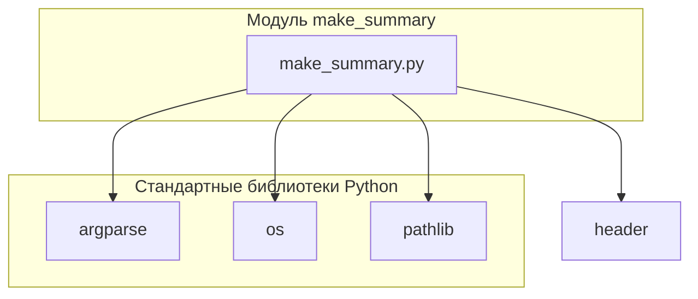

### **Анализ кода `hypotez/toolbox/make_summary.py`**

#### **1. Блок-схема**

```mermaid
graph TD
    A[Начало: Скрипт запускается] --> B{Указан ли путь к исходной директории 'src' и язык?};
    B -- Да --> C{Является ли указанный язык 'ru' или 'en'?};
    B -- Нет --> D[Использовать значения по умолчанию: язык = 'en', путь к 'src' должен быть указан];
    C -- Да --> E[Преобразование пути к 'src' в объект Path];
    C -- Нет --> F[Вывод сообщения об ошибке: Недопустимый язык];
    E --> G[Вызов функции make_summary(src_dir, lang)];
    G --> H[Функция make_summary вызывает prepare_summary_path(src_dir)];
    H --> I[Функция prepare_summary_path формирует путь к файлу SUMMARY.md в директории 'docs'];
    I --> J[Функция make_summary вызывает _make_summary(src_dir, summary_file, lang)];
    J --> K{Существует ли файл SUMMARY.md?};
    K -- Да --> L[Вывод предупреждения о перезаписи файла];
    K -- Нет --> M[Создание файла SUMMARY.md];
    M --> N[Запись заголовка '# Summary' в файл];
    N --> O[Рекурсивный обход директории 'src' в поиске файлов '.md'];
    O --> P{Имя файла 'SUMMARY.md'?};
    P -- Да --> Q[Пропустить файл];
    P -- Нет --> R{Фильтрация файлов по языку};\n    R -- 'ru' --> S{Имя файла заканчивается на '.ru.md'?};\n    S -- Да --> U[Формирование относительного пути к файлу];\n    S -- Нет --> Q;\n    R -- 'en' --> T{Имя файла заканчивается на '.ru.md'?};\n    T -- Нет --> U;\n    T -- Да --> Q;\n    U --> V[Запись строки в файл SUMMARY.md в формате '- [path.stem](relative_path)'];\n    V --> O;\n    O --> W[Закрытие файла SUMMARY.md];\n    W --> X[Завершение: Файл SUMMARY.md создан/перезаписан];\n    F --> X;\n    L --> M;\n    D --> G;\n    

    style A fill:#f9f,stroke:#333,stroke-width:2px
    style X fill:#f9f,stroke:#333,stroke-width:2px
```

**Примеры для каждого логического блока**:\n\n-   **B{Указан ли путь к исходной директории 'src' и язык?}**:\n    -   Да: `python make_summary.py --lang ru src_dir`\n    -   Нет: `python make_summary.py src_dir` (язык по умолчанию 'en')\
-   **C{Является ли указанный язык 'ru' или 'en'?}**:\
    -   Да: `--lang ru` или `--lang en`\n    -   Нет: `--lang de` (вызовет ошибку, так как допустимые значения 'ru' или 'en')\
-   **P{Имя файла 'SUMMARY.md'?}**:\n    -   Да: Файл `SUMMARY.md` будет пропущен при обходе директории.\n    -   Нет: Файлы, такие как `example.md` или `another.ru.md`, будут обработаны.\
-   **S{Имя файла заканчивается на '.ru.md'?}**:\n    -   Да: `example.ru.md` (файл будет включен, если указан язык 'ru')\
    -   Нет: `example.md` (файл будет пропущен, если указан язык 'ru')\
-   **T{Имя файла заканчивается на '.ru.md'?}**:\
    -   Да: `example.ru.md` (файл будет пропущен, если указан язык 'en')\
    -   Нет: `example.md` (файл будет включен, если указан язык 'en')\
-    **D{Использовать значения по умолчанию: язык = 'en', путь к 'src' должен быть указан}**:
    - Если аргумент `-lang` не указан, используется значение по умолчанию `'en'`.
    - Путь к директории `src` должен быть указан явно.

#### **2. Диаграмма зависимостей**



**Объяснение зависимостей:**

-   **argparse**: Используется для обработки аргументов командной строки, позволяя скрипту принимать параметры, такие как язык и путь к исходному каталогу.\
-   **os**: Предоставляет функции для взаимодействия с операционной системой, такие как работа с файловой системой (создание каталогов, обход дерева каталогов).\
-   **pathlib**:  Облегчает работу с путями к файлам и каталогам, предоставляя объектно-ориентированный интерфейс.\
-   **header**: Это модуль, специфичный для проекта, который, вероятно, определяет корневой путь проекта (`PROJECT_ROOT`). Он используется для формирования абсолютных путей к директориям `src` и `docs`.\
    Предполагается, что `header` импортирует глобальные настройки из `src.gs`.\

#### **3. Объяснение**\
**Импорты:**

-   `from pathlib import Path`: Импортирует класс `Path` из модуля `pathlib`, который предоставляет способ представления путей к файлам и директориям и работы с ними.\
-   `import argparse`: Импортирует модуль `argparse`, который используется для разбора аргументов командной строки.\
-   `import header`: Импортирует модуль `header`, который, как предполагается, содержит информацию о корневом пути проекта.\

**Классы:**
- В данном файле нет классов.\

**Функции:**
- `make_summary(docs_dir: Path, lang: str = 'en') -> None`:\
    - **Аргументы:**\
        - `docs_dir` (Path): Путь к исходной директории `src`.\
        - `lang` (str): Язык фильтрации файлов (`'ru'` или `'en'`). По умолчанию `'en'`.\
    - **Назначение:** Создает файл `SUMMARY.md` в директории `docs`, рекурсивно обходя директорию `src` и добавляя в `SUMMARY.md` ссылки на найденные `.md` файлы, отфильтрованные по языку.\
    - **Возвращаемое значение:** `None`.\
    - **Пример:**\
        ```python\
        make_summary(Path('src/module1'), 'ru')\
        ```\
        Эта функция создаст `SUMMARY.md` в директории `docs/module1`, содержащий ссылки на все `.ru.md` файлы в директории `src/module1` и ее поддиректориях.\
- `_make_summary(src_dir: Path, summary_file: Path, lang: str = 'en') -> bool`:\
    - **Аргументы:**\
        - `src_dir` (Path): Путь к папке с исходниками `.md`.\
        - `summary_file` (Path): Путь для сохранения файла `SUMMARY.md`.\
        - `lang` (str): Язык фильтрации файлов (`'ru'` или `'en'`). По умолчанию `'en'`.\
    - **Назначение:** Создает файл `SUMMARY.md` с главами на основе `.md` файлов.\
    - **Возвращаемое значение:** `bool` (True в случае успеха, False в случае ошибки).\
    - **Пример:**\
        ```python\
        _make_summary(Path('src/module1'), Path('docs/module1/SUMMARY.md'), 'en')\
        ```\
        Эта функция создаст или перезапишет файл `docs/module1/SUMMARY.md`, содержащий ссылки на все `.md` файлы (кроме `.ru.md`, если `lang='en'`) в директории `src/module1` и ее поддиректориях.\
- `prepare_summary_path(src_dir: Path, file_name: str = 'SUMMARY.md') -> Path`:\
    - **Аргументы:**\
        - `src_dir` (Path): Исходный путь с `src`.\
        - `file_name` (str): Имя файла, который нужно создать. По умолчанию `'SUMMARY.md'`.\
    - **Назначение:** Формирует путь к файлу, заменяя часть пути `src` на `docs` и добавляя имя файла.\
    - **Возвращаемое значение:** Новый путь к файлу (`Path`).\
    - **Пример:**\
        ```python\
        prepare_summary_path(Path('src/module1'), 'SUMMARY.md')\
        ```\
        Эта функция вернет объект `Path` с путем `docs/module1/SUMMARY.md`.\

**Переменные:**

-   `PROJECT_ROOT`:  Путь к корневой директории проекта. Определяется модулем `header`.\
-   `args`: Объект, возвращаемый `parser.parse_args()`, содержащий значения аргументов командной строки.\
    Атрибуты: `lang` (язык фильтрации), `src_dir` (путь к исходной директории).\
-   `summary_file`: Объект `Path`, представляющий путь к файлу `SUMMARY.md`.\
-   `relative_path`: Объект `Path`, представляющий относительный путь от `src_dir.parent` до текущего файла `.md`.\

**Потенциальные ошибки и области для улучшения:**

-   Отсутствует обработка исключений при открытии и записи в файл `SUMMARY.md` в функции `_make_summary`.\
    Хотя есть общий блок `try...except`, он просто выводит сообщение об ошибке, но не предпринимает никаких действий для восстановления.\
    Было бы полезно добавить логирование ошибки и, возможно, возвращать более конкретный код ошибки.\
-   Проверка существования файла `SUMMARY.md` перед перезаписью выполняется только для вывода сообщения.\
    Можно добавить опцию командной строки для предотвращения перезаписи существующих файлов.\
-   Код использует `print` для вывода сообщений об ошибках и предупреждений.\
    Рекомендуется использовать модуль `logging` для более гибкого и управляемого логирования.\
-   Жестко заданные строки `'src'` и `'docs'` в функции `prepare_summary_path`.\
    Можно вынести их в константы или сделать параметрами функции.\
-   В функции `_make_summary` не используется аннотация типов для переменных `path` и `summary`.\

**Взаимосвязи с другими частями проекта:**

-   Модуль `header` определяет корневой путь проекта (`PROJECT_ROOT`), который используется для формирования путей к директориям `src` и `docs`.\
    Предполагается, что `header` импортирует глобальные настройки из `src.gs`.\
-   Функция `make_summary` используется для создания файла `SUMMARY.md`, который затем может быть использован другими инструментами (например, `mdbook`) для генерации документации.