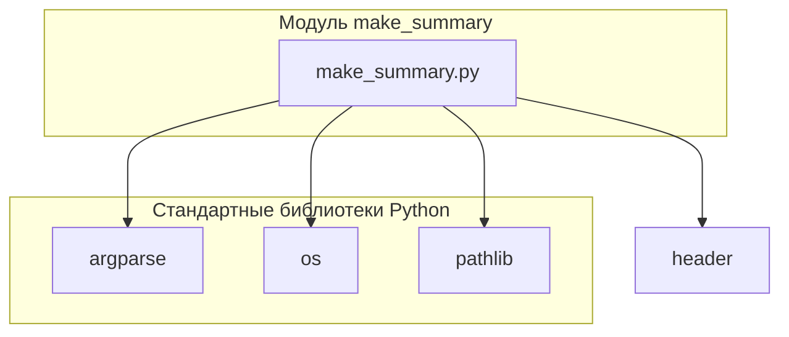

### **Анализ кода модуля `make_summary.ru.md`**

#### **1. Блок-схема**

```mermaid
graph LR
    A[Начало: Скрипт запускается] --> B{Указан ли путь к исходной директории 'src' и язык?};
    B -- Да --> C{Является ли указанный язык 'ru' или 'en'?};
    B -- Нет --> D[Использовать значения по умолчанию: язык = 'en', путь к 'src' должен быть указан];
    C -- Да --> E[Преобразование пути к 'src' в объект Path];
    C -- Нет --> F[Вывод сообщения об ошибке: Недопустимый язык];
    E --> G[Вызов функции make_summary(src_dir, lang)];
    G --> H[Функция make_summary вызывает prepare_summary_path(src_dir)];
    H --> I[Функция prepare_summary_path формирует путь к файлу SUMMARY.md в директории 'docs'];
    I --> J[Функция make_summary вызывает _make_summary(src_dir, summary_file, lang)];
    J --> K{Существует ли файл SUMMARY.md?};
    K -- Да --> L[Вывод предупреждения о перезаписи файла];
    K -- Нет --> M[Создание файла SUMMARY.md];
    M --> N[Запись заголовка '# Summary' в файл];
    N --> O[Рекурсивный обход директории 'src' в поиске файлов '.md'];
    O --> P{Имя файла 'SUMMARY.md'?};
    P -- Да --> Q[Пропустить файл];
    P -- Нет --> R{Фильтрация файлов по языку};\n    R -- 'ru' --> S{Имя файла заканчивается на '.ru.md'?};\n    S -- Да --> U[Формирование относительного пути к файлу];\n    S -- Нет --> Q;\n    R -- 'en' --> T{Имя файла заканчивается на '.ru.md'?};\n    T -- Нет --> U;\n    T -- Да --> Q;\n    U --> V[Запись строки в файл SUMMARY.md в формате '- [path.stem](relative_path)'];\n    V --> O;\n    O --> W[Закрытие файла SUMMARY.md];\n    W --> X[Завершение: Файл SUMMARY.md создан/перезаписан];\n    F --> X;\n    L --> M;\n    D --> G;
    

    style A fill:#f9f,stroke:#333,stroke-width:2px
    style X fill:#f9f,stroke:#333,stroke-width:2px
```

**Примеры для логических блоков:**

-   **B{Указан ли путь к исходной директории 'src' и язык?}**:
    -   Да: `python make_summary.py --lang ru src_dir`
    -   Нет: `python make_summary.py src_dir` (язык по умолчанию 'en')
-   **C{Является ли указанный язык 'ru' или 'en'?}**:
    -   Да: `--lang ru` или `--lang en`
    -   Нет: `--lang de` (вызовет ошибку, так как допустимые значения 'ru' или 'en')
-   **P{Имя файла 'SUMMARY.md'?}**:
    -   Да: Файл `SUMMARY.md` будет пропущен при обходе директории.
    -   Нет: Файлы, такие как `example.md` или `another.ru.md`, будут обработаны.
-   **S{Имя файла заканчивается на '.ru.md'?}**:
    -   Да: `example.ru.md` (файл будет включен, если указан язык 'ru')
    -   Нет: `example.md` (файл будет пропущен, если указан язык 'ru')
-   **T{Имя файла заканчивается на '.ru.md'?}**:
    -   Да: `example.ru.md` (файл будет пропущен, если указан язык 'en')
    -   Нет: `example.md` (файл будет включен, если указан язык 'en')
- **D{Использовать значения по умолчанию: язык = 'en', путь к 'src' должен быть указан}**:
    - Если аргумент `-lang` не указан, используется значение по умолчанию `'en'`.
    - Путь к директории `src` должен быть указан явно.

#### **2. Диаграмма зависимостей**



**Объяснение зависимостей:**

-   **argparse**: Используется для обработки аргументов командной строки, позволяя скрипту принимать параметры, такие как язык и путь к исходному каталогу.\
-   **os**: Предоставляет функции для взаимодействия с операционной системой, такие как работа с файловой системой (создание каталогов, обход дерева каталогов).\
-   **pathlib**:  Облегчает работу с путями к файлам и каталогам, предоставляя объектно-ориентированный интерфейс.\
-   **header**: Это модуль, специфичный для проекта, который, вероятно, определяет корневой путь проекта (`PROJECT_ROOT`). Он используется для формирования абсолютных путей к директориям `src` и `docs`.
    Предполагается, что `header` импортирует глобальные настройки из `src.gs`.

#### **3. Объяснение**

Поскольку предоставлен текст, а не код, я могу дать только общее описание компонентов и их функций на основе текста.

*   **`make_summary.py`**: Это основной скрипт, который автоматизирует создание файла `SUMMARY.md`. Он принимает аргументы командной строки, такие как язык и путь к директории с `.md` файлами.\
*   **`SUMMARY.md`**: Это файл оглавления, используемый `mdbook` для организации структуры документации.  Он содержит список ссылок на `.md` файлы.\
*   **`-lang`**: Параметр командной строки, указывающий язык документации (например, `ru` или `en`).\
*   **`src`**: Аргумент командной строки, указывающий путь к директории с исходными `.md` файлами.\
*   **Рекурсивный обход директории**:  Скрипт рекурсивно обходит указанную директорию и все ее поддиректории в поисках файлов `.md`.\
*   **Фильтрация файлов по языку**: Скрипт фильтрует найденные `.md` файлы на основе указанного языка. Например, если указан язык `ru`, то будут включены файлы `file.ru.md` и `file.md`, а файлы `file.en.md` будут исключены.\
*   **Создание списка ссылок**: Скрипт создает список ссылок на найденные `.md` файлы в формате, необходимом для файла `SUMMARY.md`.\
*   **Запись в файл `SUMMARY.md`**: Скрипт записывает созданный список ссылок в файл `SUMMARY.md` в директории `docs`.\

**Потенциальные ошибки и области для улучшения (основываясь на тексте и здравом смысле):**

*   **Отсутствие обработки ошибок**: В скрипте может не быть обработки ошибок, таких как отсутствие указанной директории, отсутствие прав доступа к файлам или другие ошибки файловой системы.\
*   **Отсутствие документации кода**:  Отсутствие docstring затрудняет понимание внутреннего устройства скрипта.\
*   **Жестко заданные пути**:  Возможно, пути к файлам и директориям заданы жестко, что может затруднить использование скрипта в различных окружениях.\
*   **Зависимости**:  Не указаны точные зависимости скрипта (версии библиотек).\

**Цепочка взаимосвязей с другими частями проекта (предположительно):**\

Этот скрипт, вероятно, является частью процесса сборки документации для проекта `hypotez`.  Он может быть вызван автоматически при обновлении документации или вручную разработчиками.  Результат работы скрипта (`SUMMARY.md`) используется инструментом `mdbook` для создания финальной версии документации.