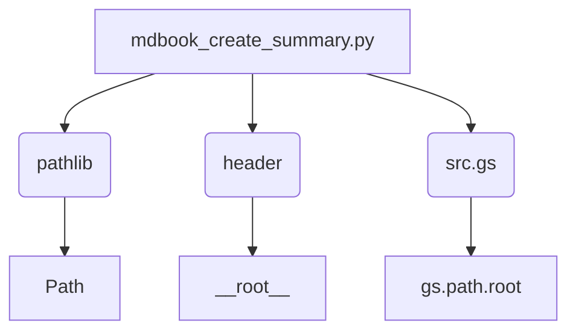

### **Анализ кода модуля `mdbook_create_summary.py`**

#### **1. Блок-схема**

```mermaid
graph TD
    A[Начало] --> B{Определение путей к исходной директории и SUMMARY.md};\n    B --> C{Проверка существования файла SUMMARY.md};\n    C -- Не существует --> D[Создание SUMMARY.md];\n    C -- Существует --> E[Вывод сообщения о перезаписи];\n    D --> F[Открытие файла SUMMARY.md для записи];\n    E --> F
    F --> G[Запись заголовка '# Summary' в файл];\n    G --> H{Рекурсивный обход директории src_dir};\n    H --> I{Проверка, является ли текущий файл SUMMARY.md?};\n    I -- Да --> J[Пропустить файл];\n    I -- Нет --> K[Формирование относительного пути и названия главы];\n    K --> L[Определение уровня вложенности];\n    L --> M[Запись главы в файл SUMMARY.md];\n    M --> H;\n    H -- Все файлы обработаны --> N[Закрытие файла SUMMARY.md];\n    N --> O[Вывод сообщения об успешном создании/перезаписи];\n    O --> P[Завершение];
```

**Примеры для логических блоков:**

-   **B{Определение путей к исходной директории и SUMMARY.md}**:
    - `src_path = Path(gs.path.root / 'docs' / 'gemini' / 'consultant' / 'ru' / 'src')`
    - `summary_path = src_path / 'SUMMARY.md'`
-   **C{Проверка существования файла SUMMARY.md}**:
    -  `if not summary_file.exists():`
-   **F{Открытие файла SUMMARY.md для записи}**:
    - `with summary_file.open('w', encoding='utf-8') as summary:`
-   **K{Формирование относительного пути и названия главы}**:
    -   `rel_path = path.relative_to(src_dir).as_posix()`
    -   `chapter_name = path.stem.replace('_', ' ').capitalize()`
-   **L{Определение уровня вложенности}**:
    - `indent = '  ' * rel_path.count('/')`
-   **M{Запись главы в файл SUMMARY.md}**:
    - `summary.write(f'{indent}- [{chapter_name}]({rel_path})\n')`

#### **2. Диаграмма зависимостей**



**Объяснение зависимостей:**

*   `pathlib`: Используется для работы с путями к файлам и директориям. В частности, используется класс `Path` для представления и манипулирования путями.
*   `header`:  Модуль, предположительно, содержащий информацию о конфигурации проекта, включая корневую директорию (определённую как `header.__root__`).
*   `src.gs`: Доступ к переменной `gs.path.root`, которая, вероятно, определяет корневой путь проекта или его части.

#### **3. Объяснение**\

**Импорты:**

-   `from pathlib import Path`: Импортирует класс `Path` из модуля `pathlib`, который предоставляет способ представления путей к файлам и директориям и работы с ними.\
-   `import header`: Импортирует модуль `header`, который, как предполагается, содержит информацию о корневом пути проекта.\
-   `from src import gs`: Импортирует модуль `gs` из пакета `src`, который используется для получения информации о путях.

**Функции:**

-   `make_summary(src_dir: Path = src_path, summary_file: Path = summary_path) -> None`:\
    -   **Аргументы:**\
        -   `src_dir` (Path, optional): Путь к директории, содержащей исходные `.md` файлы. Значение по умолчанию берётся из переменной `src_path`.
        - `summary_file` (Path, optional): Путь к файлу `SUMMARY.md`. Значение по умолчанию берётся из переменной `summary_path`.
    -   **Назначение:** Рекурсивно обходит указанную директорию и создает файл `SUMMARY.md` в формате, необходимом для `mdbook`. Если файл уже существует, он перезаписывается.\
    -   **Пример:**\
        ```python\
        make_summary(Path('/path/to/docs'), Path('/path/to/docs/SUMMARY.md'))\
        ```
- _Аргументы_

_docs_dir (Path, optional):Путь к исходной директории 'src'.

lang (str, optional):Язык фильтрации файлов. Возможные значения: 'ru' или 'en'.
Используется для указания каталога, где необходимо создать файл `SUMMARY.md`. Если каталог не указан, используются значения по умолчанию.

- _Назначение_
Сохраняет все `.md` файлы в структуре
Устанавливает doc_mode="mdbook_create_summary"
```

**Переменные:**
-   `src_path`: Объект `Path`, представляющий путь к директории с `.md` файлами. Путь формируется на основе `gs.path.root`.
-   `summary_path`: Объект `Path`, представляющий путь к файлу `SUMMARY.md`. Путь формируется на основе `src_path`.
-   `PROJECT_ROOT (Path)`: Базовый путь к файлу.

**Потенциальные ошибки и области для улучшения:**

-  Обработка ошибок: В коде отсутствует явная обработка исключений (например, `try...except`) для обработки возможных ошибок при работе с файловой системой (например, если директория `src_path` не существует или нет прав на запись в файл `summary_path`).
-  Жестко заданные пути: Использование `gs.path.root` и констант для формирования путей может быть негибким. Возможно, стоит сделать пути настраиваемыми параметрами.
-  Отсутствие логирования: В коде отсутствуют логи, которые могли бы помочь в отладке и мониторинге работы скрипта.
-  Ограниченность функциональности: Скрипт генерирует только базовый файл `SUMMARY.md` без поддержки дополнительных функций, таких как фильтрация файлов по шаблону или добавление дополнительных метаданных.
  - Отстутсвие обработки исключений при открытии или записи файлов.

**Цепочка взаимосвязей с другими частями проекта:**
*   Зависимость от `gs`: Предполагается, что модуль `src.gs` предоставляет доступ к глобальным настройкам проекта, включая корневой путь к директории документации.
*   Использование для генерации документации: Скрипт создает файл `SUMMARY.md`, который используется инструментом `mdbook` для генерации документации.