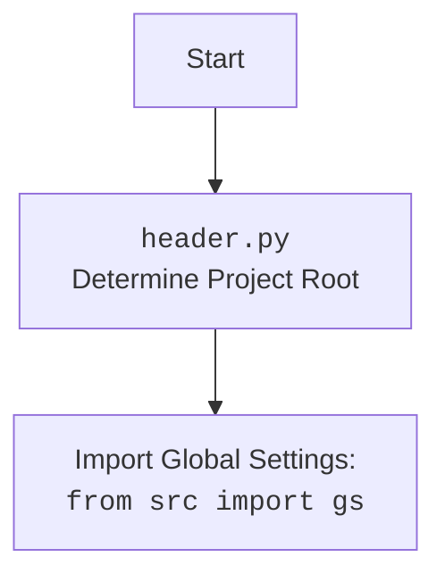

### **Анализ кода `hypotez/toolbox/mdbook_create_summary.py`**

#### **1. Блок-схема**

```mermaid
graph TD
    A[Начало: Определение путей к исходным .md файлам и файлу SUMMARY.md] --> B{Проверка существования файла SUMMARY.md};
    B -- Файл не существует --> C[Создание файла SUMMARY.md];
    B -- Файл существует --> D[Перезапись файла SUMMARY.md];
    C --> E[Открытие файла SUMMARY.md для записи];
    D --> E;
    E --> F[Запись заголовка "# Summary" в файл];
    F --> G[Рекурсивный обход директории с .md файлами];
    G --> H{Имя файла == "SUMMARY.md"?};
    H -- Да --> G;\n    H -- Нет --> I[Формирование относительного пути и названия главы];\n    I --> J[Определение уровня вложенности];\n    J --> K[Запись главы в файл SUMMARY.md с учетом отступов];\n    K --> L{Больше .md файлов?};\n    L -- Да --> G;\n    L -- Нет --> M[Закрытие файла SUMMARY.md];\n    M --> N[Вывод сообщения об успешном создании/перезаписи файла];\n    N --> O[Конец];
```

### 2. Диаграмма

```mermaid
flowchart TD
    A[<code>mdbook_create_summary.py</code><br>Создание SUMMARY.md для mdbook] --> B(pathlib);
    A --> C(header);
    A --> D[<code>src</code><br>gs (Global Settings)];
    B --> E[Path];
    style A fill:#f9f,stroke:#333,stroke-width:2px
    style B fill:#ccf,stroke:#333,stroke-width:2px
    style C fill:#ccf,stroke:#333,stroke-width:2px
    style D fill:#ccf,stroke:#333,stroke-width:2px
    style E fill:#ccf,stroke:#333,stroke-width:2px
```

Данная диаграмма `mermaid` отражает зависимости модуля `mdbook_create_summary.py`. Он импортирует:\
- `pathlib` для работы с путями файловой системы.\
- `header` для общих задач инициализации.\
- `gs` (Global Settings) из пакета `src` для получения глобальных настроек, в частности, корневого пути проекта.



### 3. Объяснение

#### Импорты:
- `from pathlib import Path`: Импортирует класс `Path` из модуля `pathlib`, который предоставляет способ представления путей к файлам и директориям и работы с ними.\
- `import header`: Импортирует модуль `header`, который, как предполагается, содержит информацию о корневом пути проекта.\
- `from src import gs`: Импортирует модуль `gs` из пакета `src`, который используется для получения информации о путях.

#### Переменные:
- `src_path: Path`: Объект `Path`, представляющий путь к директории, содержащей исходные `.md` файлы. Путь формируется на основе `gs.path.root`.
- `summary_path: Path`: Объект `Path`, представляющий путь к файлу `SUMMARY.md`, который будет создан или перезаписан. Он формируется путем добавления имени файла `SUMMARY.md` к `src_path`.
- `PROJECT_ROOT (Path)`: Базовый путь к файлу.

#### Функции:
- `make_summary(src_dir: Path = src_path, summary_file: Path = summary_path) -> None`:\
    - **Аргументы:**\
        - `src_dir` (Path, optional): Путь к директории, содержащей исходные `.md` файлы. Значение по умолчанию берётся из переменной `src_path`.\
        - `summary_file` (Path, optional): Путь к файлу `SUMMARY.md`. Значение по умолчанию берётся из переменной `summary_path`.\
    - **Назначение:** Рекурсивно обходит указанную директорию и создает файл `SUMMARY.md` в формате, необходимом для `mdbook`. Если файл уже существует, он перезаписывается.\
    - **Возвращаемое значение:** `None`.\
    - **Пример использования:**\
        ```python\
        from pathlib import Path\
        from src import gs  # Предполагается, что gs инициализирован где-то еще\

        # Пример пути (предполагается, что gs.path.root определен)\
        example_src_path = Path(gs.path.root / 'docs' / 'example')\
        example_summary_file = example_src_path / 'SUMMARY.md'\
\
        # Создаем директорию и несколько файлов для примера\
        example_src_path.mkdir(parents=True, exist_ok=True)\
        (example_src_path / 'file1.md').write_text('# File 1')\
        (example_src_path / 'subdir').mkdir(exist_ok=True)\
        (example_src_path / 'subdir' / 'file2.md').write_text('# File 2')\
\
        # Вызываем функцию для создания SUMMARY.md\
        make_summary(example_src_path, example_summary_file)\
\
        # Теперь в example_summary_file будет сгенерированный SUMMARY.md\
        ```\
        После выполнения этого примера в `example_summary_file` будет создан файл со следующим содержимым:\
        ```\
        # Summary\
\
        - [File1](file1.md)\
        - [File2](subdir/file2.md)\
        ```

#### Потенциальные ошибки и области для улучшения:
- **Обработка исключений**: В коде отсутствует явная обработка исключений (например, `try...except`) для обработки возможных ошибок при работе с файловой системой (например, если директория `src_path` не существует или нет прав на запись в файл `summary_path`).\
- **Жестко заданные пути**: Использование `gs.path.root` и констант для формирования путей может быть негибким. Возможно, стоит сделать пути настраиваемыми параметрами.\
- **Отсутствие логирования**: В коде отсутствуют логи, которые могли бы помочь в отладке и мониторинге работы скрипта.\
- **Ограниченность функциональности**: Скрипт генерирует только базовый файл `SUMMARY.md` без поддержки дополнительных функций, таких как фильтрация файлов по шаблону или добавление дополнительных метаданных.
  - Отстутсвие обработки исключений при открытии или записи файлов.

#### Взаимосвязи с другими частями проекта:
- Скрипт использует `gs.path.root` для определения корневого пути проекта. Это предполагает, что в проекте существует механизм для определения и хранения глобальных настроек.\
-  Взаимодействует с файловой системой через модуль `pathlib`, что позволяет создавать, читать и записывать файлы и директории.