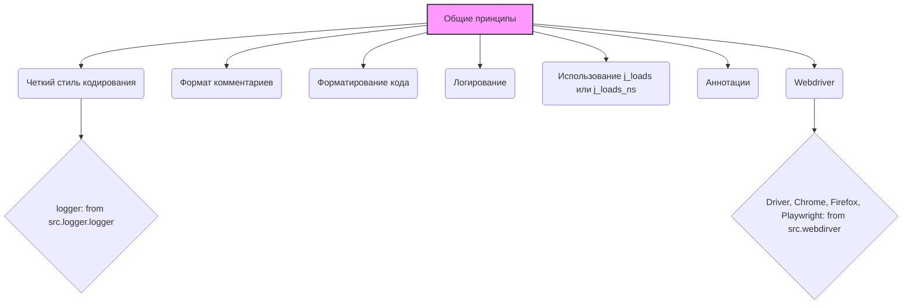

### **Анализ кода `hypotez/toolbox/prepare_code_for_ai_input.py.md`**

#### **1. Блок-схема**

```mermaid
flowchart TD
    A[Начало] --> B{Общие указания: Четкий стиль кодирования};
    B --> C{Комментарии: `#` для внутренних, формат для документации};
    C --> D{Форматирование кода: `\'` одинарные кавычки, пробелы вокруг `=`, аннотации типов, `|` вместо `Union`};
    D --> E{Логирование: `src.logger.logger`, `logger.error` для ошибок};
    E --> F{Основные требования: Markdown, Формат комментариев, Пробелы вокруг `=`, `j_loads`/`j_loads_ns`, Сохранение комментариев, Обработка `...`, Аннотации};
    F --> G{Webdriver: Импорт из `src.webdirver`, использование `driver.execute_locator`};
    G --> H[Конец];
```

**Примеры для логических блоков:**

-   **Общие указания**:
    *   Соблюдение PEP 8.
    *   Использование осмысленных имен переменных.
-   **Комментарии**:
    *   `# Это комментарий.`
    *   Формат документации:

        ```python
        def function(param: str) -> None:
            """
            Args:
                param (str): Описание параметра `param`.
            """
            ...
        ```
-   **Форматирование кода**:
    *   `a: str = 'value'`
    *   `x = 5`
    *   `def function(param: str) -> None:`
    *   `x: str | int`
-   **Логирование**:

    ```python
    from src.logger.logger import logger

    try:
        ...
    except Exception as e:
        logger.error('Произошла ошибка', e, exc_info=True)
    ```
-   **Основные требования**:
    *   Ответы в формате Markdown.
    *   Использование `j_loads('config.json')` вместо `open` и `json.load`.
    *   Сохранение всех существующих комментариев.
    *   Аннотирование всех переменных и параметров функций.
-   **Webdriver**:

    ```python
    from src.webdirver import Driver, Firefox

    driver = Driver(Firefox)
    result = driver.execute_locator(locator)
    ```

### 2. Диаграмма



**Объяснение зависимостей:**

-   `src.logger.logger`: Используется для логирования. Инструкция предписывает всегда использовать этот модуль для логирования, особенно для ошибок.
-   `src.webdirver`:  Используется для автоматизации веб-браузера. Инструкция показывает, как импортировать и использовать `Driver` для выполнения действий с веб-элементами.

### 3. Объяснение

#### Импорты

-   `src.logger.logger`: Модуль логирования, используемый для записи информации о работе программы, включая ошибки.
-   `src.webdirver`:  Модуль для управления веб-браузерами (например, Chrome, Firefox) в автоматическом режиме.

#### Классы

-   `Driver` (из `src.webdirver`): Класс, представляющий собой драйвер для управления веб-браузером. Он позволяет выполнять различные действия, такие как открытие страниц, ввод данных, нажатие кнопок и т.д.

#### Функции

В предоставленном коде нет конкретных функций, но описывается формат документирования функций:

```python
def function(param: str, param1: Optional[str | dict | str] = None) -> dict | None:
    """
    Args:
        param (str): Описание параметра `param`.
        param1 (Optional[str | dict | str], optional): Описание параметра `param1`. По умолчанию `None`.

    Returns:
        dict | None: Описание возвращаемого значения. Возвращает словарь или `None`.

    Raises:
        SomeError: Описание ситуации, в которой возникает исключение `SomeError`.

    Example:
        >>> function('param', 'param1')
        {'param': 'param1'}
    """
    ...
```

#### Переменные

В основном описываются правила и примеры использования переменных.
-   Все переменные должны быть аннотированы типами (например, `x: str = "hello"`).
-   При присваивании значений оператору `=` должны быть пробелы (например, `x = 5`).

#### Потенциальные ошибки и области для улучшения

-   **Непоследовательность в использовании кавычек**: Хотя инструкция предписывает использование одинарных кавычек, в примерах кода встречаются и двойные.
-   **Недостаточная детализация примеров**: Некоторые примеры кода слишком общие и не показывают конкретное использование на практике.

#### Взаимосвязи с другими частями проекта

Этот код является частью общей системы инструкций для проекта `hypotez`. Он влияет на все остальные части проекта, определяя стандарты кодирования и документирования.