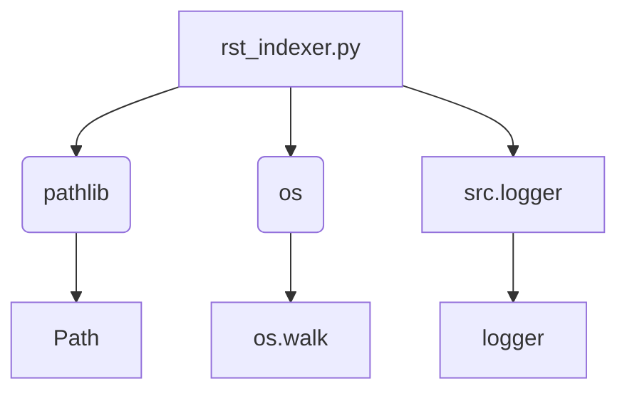

### Анализ кода проекта `hypotez`

=========================================================================================

**Расположение файла в проекте:** `hypotez/toolbox/rst_indexer.py`

**Замечание:** Модуль предназначен для рекурсивного обхода директорий, поиска Python-файлов и создания файла `index.rst` для документации Sphinx.

---

### 1. Блок-схема

```mermaid
graph TD
    A[Начало: Определение пути к исходной директории] --> B{Определение пути к директории 'docs' и файлу 'index.rst'};\n    B --> C{Проверка существования директории 'docs'?};\n    C -- Нет --> D[Создание директории 'docs'];\n    C -- Да --> E[Продолжить];\n    D --> E;\n    E --> F[Открытие файла 'index.rst' для записи];\n    F --> G[Запись заголовка в Sphinx-формате];\n    G --> H[Рекурсивный обход исходной директории];\n    H --> I{Найден Python файл?};\n    I -- Да --> J{Формирование относительного пути к файлу};\n    J --> K[Преобразование пути в имя модуля для Sphinx];\n    K --> L[Добавление имени модуля в 'index.rst'];\n    I -- Нет --> H;\n    H --> M{Все поддиректории просмотрены?};\n    M -- Да --> N{Найдены ли Python файлы?};\n    N -- Да --> O[Завершение: сохранение 'index.rst'];\n    N -- Нет --> P[Запись сообщения об отсутствии модулей];\n    P --> O;\n    O --> Q[Конец];
```

**Примеры для каждого логического блока:**

-   **A[Начало: Определение пути к исходной директории]**:
    -   `start_dir` передается в функцию `create_index_rst`.
-   **B{Определение пути к директории 'docs' и файлу 'index.rst'}**:
    -   `docs_dir = start_path / 'docs'`
    -   `index_file_path = docs_dir / 'index.rst'`
-   **C{Проверка существования директории 'docs'?}**:
    -   `if not docs_dir.exists():`
-   **D[Создание директории 'docs']**:
    -   `docs_dir.mkdir(parents=True)`
-   **F[Открытие файла 'index.rst' для записи]**:
    -   `with index_file_path.open('w', encoding='utf-8') as index_file:`
-   **G[Запись заголовка в Sphinx-формате]**:
    ```python
    index_file.write("Welcome to the Project's Documentation\n")
    index_file.write("======================================\n\n")
    index_file.write(".. toctree::\n")
    index_file.write("   :maxdepth: 2\n")
    index_file.write("   :caption: Contents:\n\n")
    ```
-   **I{Найден Python файл?}**:
    -   Проверяется, что имя файла заканчивается на `.py`
-   **J{Формирование относительного пути к файлу}**:
    -   `rel_root = Path(root).relative_to(start_path)`
-   **K[Преобразование пути в имя модуля для Sphinx]**:
    -   `module_name = str(module_path).replace('.py', '').replace(os.sep, '.')`
-   **L[Добавление имени модуля в 'index.rst']**:
    -   `index_file.write(f"   {module_name}\n")`
-   **N{Найдены ли Python файлы?}**:
    -   Проверяется, что список `py_files` не пуст.
-   **P[Запись сообщения об отсутствии модулей]**:
    -   `index_file.write("\nNo modules found.\n")`

---

### 2. Диаграмма



**Объяснение зависимостей:**

-   `pathlib`: Используется для работы с путями файловой системы в объектно-ориентированном стиле (класс `Path`).
-   `os`:  Используется для обхода директорий и получения списка файлов (функция `os.walk`).
-   `src.logger`: Используется для логирования событий (переменная `logger`).

---

### 3. Объяснение

#### Импорты:

-   `import header`: Этот импорт может указывать на использование общего файла конфигурации или настроек проекта.
-   `from pathlib import Path`: Импортирует класс `Path` из модуля `pathlib`, предназначенный для объектно-ориентированной работы с путями к файлам и директориям.
-   `import os`: Импортирует модуль `os`, предоставляющий функции для взаимодействия с операционной системой, такие как обход файловой системы.
-   `from src.logger import logger`: Импортирует объект `logger` из пользовательского модуля логирования. Этот объект используется для записи информации о работе скрипта.

#### Функции:

-   `create_index_rst(start_dir: str) -> None`:\
    -   **Аргументы:**\
        -   `start_dir` (str): Путь к корневой директории, в которой будет производиться поиск Python файлов и создание `index.rst`.\
    -   **Возвращает:**\
        -   `None` (Функция ничего не возвращает).\
    -   **Назначение:**\
        Функция выполняет следующие действия:\
        1.  Определяет пути к директории `docs` и файлу `index.rst`.\
        2.  Создает директорию `docs`, если она не существует.\
        3.  Открывает файл `index.rst` для записи (перезаписывая его, если он уже существует).\
        4.  Записывает в файл заголовок и директивы Sphinx, необходимые для создания оглавления.\
        5.  Рекурсивно обходит поддиректории, начиная с `start_dir`.\
        6.  Для каждого найденного Python файла формирует относительный путь и добавляет его в файл `index.rst` в формате, требуемом Sphinx.\
        7.  Логирует процесс создания файла и добавления файлов, используя объект `logger`.\
        8.  В случае возникновения ошибки, перехватывает исключение, логирует ошибку и поднимает исключение снова.\
    -   **Пример использования:**\
        ```python\
        create_index_rst("src")\
        ```

#### Переменные:

-   `start_path (Path)`: Объект `Path`, представляющий путь к начальной директории.\
-   `docs_dir (Path)`: Объект `Path`, представляющий путь к директории `docs`, в которой будет создан файл `index.rst`.\
-   `index_file_path (Path)`: Объект `Path`, представляющий путь к файлу `index.rst`.\
-   `found_files (bool)`: Флаг, указывающий, были ли найдены Python файлы в процессе обхода директорий.\
-   `rel_root (Path)`: Объект `Path`, представляющий относительный путь от начальной директории до текущей директории.\
-   `module_path (Path)`: Объект `Path`, представляющий путь к модулю относительно начальной директории.\
-   `module_name (str)`: Строка, представляющая имя модуля в формате, требуемом Sphinx.\

#### Потенциальные ошибки и области для улучшения:

-   **Жестко заданные пути**: Путь к директории `docs` и правила формирования имен модулей заданы непосредственно в коде. Было бы полезно сделать их более гибкими, например, задавать через аргументы командной строки или конфигурационный файл.\
-   **Отсутствие обработки ошибок при создании файла**: Код не обрабатывает возможные ошибки при создании или открытии файла `index.rst`, такие как отсутствие прав доступа.
-   **Общая обработка исключений**:  Блок `except Exception as ex` перехватывает все исключения, что может затруднить отладку.  Лучше перехватывать конкретные типы исключений (например, `OSError`, `IOError`).\
-   **Ограниченная гибкость в форматировании**:  Формат файла `index.rst` жестко задан в коде.  Возможно, стоит добавить возможность настройки формата через шаблоны.\
-   **Отсутствие docstring**:  Код содержит docstring только для функции `create_index_rst`, но отсутствуют docstring для других частей модуля (например, для переменных).\

#### Взаимосвязи с другими частями проекта:

-   Модуль зависит от `header` для определения корневого пути проекта (предположительно).\
-   Он использует модуль `src.logger` для логирования, что позволяет интегрировать его в общую систему логирования проекта.\
-   Создаваемый файл `index.rst` используется системой документации Sphinx, что указывает на интеграцию с системой документации проекта.