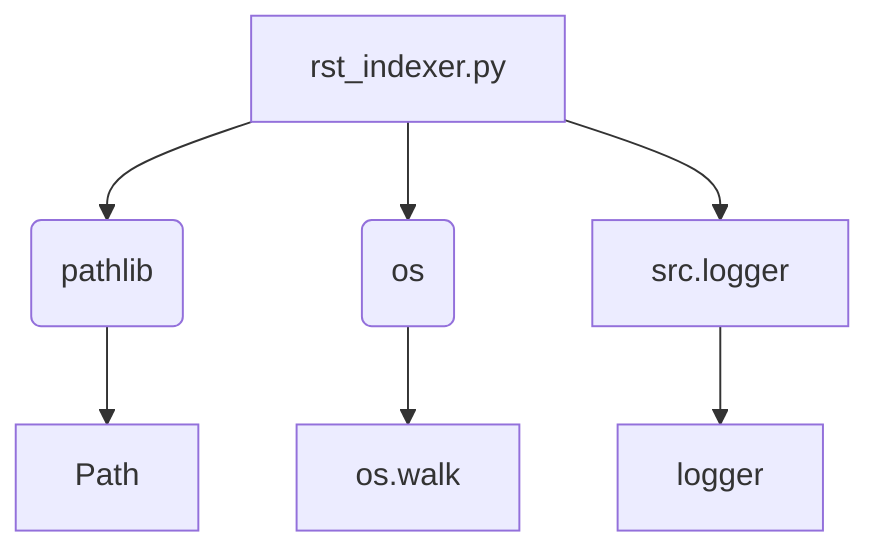

### Анализ кода `hypotez/toolbox/rst_indexer.py.md`

#### 1. Блок-схема

```mermaid
graph TD
    A[Начало: Вызов create_index_rst(start_dir)] --> B{Проверка существования docs_dir};
    B -- Нет --> C[Создание docs_dir];
    C --> D[Логирование: Создание каталога docs];
    B -- Да --> D;
    D --> E[Логирование: Начало создания index.rst];
    E --> F[Открытие index_file_path для записи];
    F --> G[Запись заголовка в Sphinx-формате];
    G --> H[Инициализация found_files = False];
    H --> I{Начало обхода os.walk(start_path)};
    I -- Для каждого root, _, files --> J[Фильтрация py_files: .py, без \'(\' и \')\'];
    J --> K{Если py_files не пуст};\n    K -- Да --> L[found_files = True];\n    L --> M[Вычисление относительного пути rel_root];\n    M --> N{Для каждого py_file в py_files};\n    N --> O[Формирование module_path];\n    O --> P[Удаление .py и замена os.sep на \'.\' в module_name];\n    P --> Q[Запись module_name в index_file (Sphinx формат)];\n    Q --> R[Логирование: Добавление Python файлов];\n    N -- Конец цикла --> I;\n    K -- Нет --> I;\n    I -- Конец обхода --> S{Если not found_files};\n    S -- Да --> T[Логирование: Нет Python файлов];\n    T --> U[Запись сообщения "No modules found." в index_file];\n    S -- Нет --> U;\n    U --> V[Логирование: Успешная запись в файл];\n    V --> W[Конец: Закрытие index_file];\n    F -- Ошибка --> X[Логирование: Ошибка при создании index.rst];\n    X --> Y[Выброс исключения];
```

#### 2. Диаграмма



**Объяснение зависимостей:**

-   `pathlib`: Используется для работы с путями файловой системы в объектно-ориентированном стиле (класс `Path`).
-   `os`:  Используется для обхода директорий и получения списка файлов (функция `os.walk`).
-   `src.logger`: Используется для логирования событий (переменная `logger`).

#### 3. Объяснение

**Импорты:**

-   `import header`: Этот импорт может указывать на использование общего файла конфигурации или настроек проекта.
-   `from pathlib import Path`: Импортирует класс `Path` из модуля `pathlib`, предназначенный для объектно-ориентированной работы с путями к файлам и директориям.
-   `import os`: Импортирует модуль `os`, предоставляющий функции для взаимодействия с операционной системой, такие как обход файловой системы.
-   `from src.logger import logger`: Импортирует объект `logger` из пользовательского модуля логирования. Этот объект используется для записи информации о работе скрипта.

**Функции:**

-   `create_index_rst(start_dir: str) -> None`:\
    -   **Аргументы:**\
        -   `start_dir` (str): Путь к корневой директории, с которой начинается обход поддиректорий.\
    -   **Возвращает:**\
        -   `None` (Функция ничего не возвращает).\
    -   **Назначение:**\
        Функция выполняет следующие действия:\
        1.  Определяет пути к директории `docs` и файлу `index.rst`.\
        2.  Создает директорию `docs`, если она не существует.\
        3.  Открывает файл `index.rst` для записи (перезаписывая его, если он уже существует).\
        4.  Записывает в файл заголовок и директивы Sphinx, необходимые для создания оглавления.\
        5.  Рекурсивно обходит поддиректории, начиная с `start_dir`.\
        6.  Для каждого найденного Python файла формирует относительный путь и добавляет его в файл `index.rst` в формате, требуемом Sphinx.\
        7.  Логирует процесс создания файла и добавления файлов, используя объект `logger`.\
        8.  В случае возникновения ошибки, перехватывает исключение, логирует ошибку и поднимает исключение снова.\
    -   **Пример использования:**\
        ```python\
        create_index_rst("src")\
        ```\
        Эта функция создаст `index.rst` в директории `docs`, содержащий список всех Python файлов в проекте, начиная с директории `src`.\

**Переменные:**

-   `MODE: str = 'development'` - глобальная переменная, указывающая на режим работы приложения.
-   `start_path: Path` - объект `Path`, представляющий путь к начальной директории для обхода.\
-   `docs_dir: Path` - объект `Path`, представляющий директорию `docs`, в которой будет создан файл `index.rst`.\
-   `index_file_path: Path` - объект `Path`, представляющий путь к файлу `index.rst`.\
-   `found_files: bool` - флаг, указывающий, были ли найдены какие-либо файлы Python в процессе обхода директорий.\
-   `root: str` - текущая директория в процессе обхода `os.walk`.\
-   `files: list` - список файлов в текущей директории `root`.\
-   `py_files: list` - отфильтрованный список файлов, содержащий только файлы Python (с расширением `.py`).\
-   `rel_root: Path` - относительный путь от `start_path` до текущей директории `root`.\
-   `py_file: str` - имя текущего файла Python.\
-   `module_path: Path` - объект `Path`, представляющий путь к модулю относительно `start_path`.\
-   `module_name: str` - строка, представляющая имя модуля, полученное из `module_path` путем удаления расширения `.py` и замены разделителей директорий на точки.\

**Потенциальные ошибки и области для улучшения:**

-   Обработка исключений: В случае возникновения исключения во время создания `index.rst`, оно логируется и перевыбрасывается. Возможно, стоит добавить более детальную обработку исключений, чтобы, например, попытаться продолжить обработку других файлов в случае ошибки с одним файлом.\
-   Исключение файлов: Сейчас исключаются файлы, содержащие символы "(" или ")". Это может быть недостаточно гибким. Возможно, стоит добавить возможность настройки списка исключаемых файлов или директорий.\
-   Ограниченная гибкость в форматировании:  Формат файла `index.rst` жестко задан в коде.  Возможно, стоит добавить возможность настройки формата через шаблоны.\
-   Отсутствие docstring:  Код содержит docstring только для функции `create_index_rst`, но отсутствуют docstring для других частей модуля (например, для переменных).

**Взаимосвязи с другими частями проекта:**

-   `header`: Модуль `header` используется для определения корневой директории проекта. Это позволяет скрипту правильно определять, где начинать поиск файлов для индексации, и где создавать `index.rst`.\
-   Он использует модуль `src.logger` для логирования, что позволяет интегрировать его в общую систему логирования проекта.\
-   Создаваемый файл `index.rst` используется системой документации Sphinx, что указывает на интеграцию с системой документации проекта.