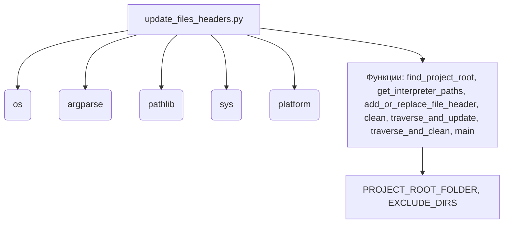

### Анализ кода модуля `update_files_headers.py.md`

#### 1. Блок-схема

```mermaid
graph TD
    A[Начало: Вызов main()] --> B{Определение `PROJECT_ROOT_FOLDER` и `EXCLUDE_DIRS`};
    B --> C[Вызов `traverse_and_update` или `traverse_and_clean`];

    subgraph traverse_and_update
        C -- traverse_and_update --> D{Обход директории os.walk(directory)};
        D --> E{Для каждого файла в files: file.endswith('.py')?};
        E -- Да --> F[Вызов add_or_replace_file_header(file_path, directory, force_update)];
        E -- Нет --> D;
        F --> D;
    end

    subgraph traverse_and_clean
        C -- traverse_and_clean --> G{Обход директории os.walk(directory)};
        G --> H{Для каждого файла в files: file.endswith(('.py'))?};
        H -- Да --> I[Вызов clean(os.path.join(root, file))];
        H -- Нет --> G;
        I --> G;
    end

    subgraph add_or_replace_file_header
        F --> J{Формирование заголовков, строк интерпретатора, docstring};
        J --> K{Чтение файла и фильтрация строк};
        K --> L{Нужно ли обновление (force_update или сравнение)?};
        L -- Да --> M[Запись новых строк в начало файла];
        L -- Нет --> N[Пропуск обновления];
    end

    subgraph clean
        I --> O{Чтение файла и фильтрация строк (удаление заголовков)};
        O --> P[Запись отфильтрованных строк обратно в файл];
    end

    C --> Q[Конец];
```

**Примеры для каждого логического блока:**

-   **B (Определение аргументов командной строки):**
    -   Пример 1: `python update_files_headers.py --force-update` (аргумент `force_update` установлен в `True`).
    -   Пример 2: `python update_files_headers.py --clean` (аргумент `clean` установлен в `True`).
    -   Пример 3: `python update_files_headers.py -p /path/to/project` (аргумент `project` указывает путь к корневой папке проекта).

-   **G (Для каждого файла: вызов функции `clean(file)`):**
    -   Пример: Если текущий файл `example.py`, то вызывается функция `clean("example.py")`.

-   **H (Для каждого файла: вызов функции `add_or_replace_file_header(file, project_root, force_update)`):**
    -   Пример: Если текущий файл `example.py`, корневая папка проекта `/path/to/project`, и `force_update` установлен в `True`, то вызывается функция `add_or_replace_file_header("example.py", "/path/to/project", True)`.

-   **O (Необходимо обновление?):**
    -   Пример 1: Если в файле отсутствуют строки заголовка, то `needs_update` будет `True`.
    -   Пример 2: Если содержимое строк заголовка не соответствует ожидаемому, то `needs_update` будет `True`.
    -   Пример 3: Если `force_update` установлен в `True`, то `needs_update` будет `True`.

### 2. Диаграмма



**Объяснение зависимостей:**

-   `os`: Модуль `os` используется для взаимодействия с операционной системой, например, для работы с файловой системой (обход директорий, объединение путей).\
-   `argparse`: Используется для обработки аргументов командной строки, позволяя настраивать поведение скрипта (например, принудительное обновление).\
-   `pathlib`: Предоставляет объектно-ориентированный способ работы с файловыми путями (класс `Path`).
-   `sys`: Используется для доступа к системным переменным, в частности, `sys.path` для добавления путей поиска модулей.\
-   `platform`: Используется для определения операционной системы.\

### 3. Объяснение

**Импорты:**\
- `from csv import QUOTE_STRINGS`: Импортирует константу `QUOTE_STRINGS` из модуля `csv`, что на самом деле не используется в коде, представленном. Это может быть удалено.\
- `import os`: Модуль `os` используется для взаимодействия с операционной системой, например, для работы с файловой системой (обход директорий, объединение путей).\
- `import argparse`: Модуль `argparse` используется для разбора аргументов командной строки, позволяя настраивать поведение скрипта (например, принудительное обновление).\
- `from pathlib import Path`:  Импортирует класс `Path` из модуля `pathlib`, который предоставляет объектно-ориентированный способ работы с файловыми путями.
- `import sys`: Используется для доступа к системным переменным, в частности, `sys.path` для добавления путей поиска модулей.\
- `import platform`: Используется для определения операционной системы.\

**Переменные:**\
- `PROJECT_ROOT_FOLDER = os.path.abspath('..')`: Определяет абсолютный путь к корневой папке проекта, находящейся на один уровень выше текущей директории.\
- `EXCLUDE_DIRS = ['venv', 'tmp', 'docs', 'data', '__pycache__','.ipynb_checkpoints']`: Список директорий, которые будут исключены из обработки скриптом.\
- `MODE: str`: Устанавливает режим работы проекта (`development`).\

**Функции:**\
- `find_project_root(start_path: Path, project_root_folder: str) -> Path`:\
    - **Аргументы:**\
        - `start_path (Path)`: Путь к начальной директории, с которой начинается поиск.\
        - `project_root_folder (str)`: Имя папки, которая считается корневой (например, "src").\
    - **Назначение:** Функция рекурсивно ищет корневую папку проекта, начиная с указанного пути.\
    - **Возвращаемое значение:** Объект `Path`, представляющий путь к корневой папке проекта, или вызывает исключение `FileNotFoundError`, если корневая папка не найдена.\
- `get_interpreter_paths(project_root: Path) -> tuple`:\
    - **Аргументы:**\
        - `project_root (Path)`: Путь к корневой папке проекта.\
    - **Назначение:** Функция определяет пути к интерпретаторам Python для Windows и Linux/macOS.\
    - **Возвращаемое значение:** Кортеж, содержащий пути к интерпретаторам для Windows и Linux/macOS.\
- `add_or_replace_file_header(file_path: str, project_root: Path, force_update: bool)`:\
    -   **Аргументы**:\
        -   `file_path` (str): Путь к файлу, в котором нужно добавить или заменить заголовок.\
        -   `project_root` (Path): Корневой путь проекта.\
        -   `force_update` (bool): Флаг, указывающий, следует ли принудительно обновить заголовок, даже если он уже существует.\\\
    -   **Возвращаемое значение:** `None`.\\\
    -   **Назначение:** Функция добавляет или заменяет заголовок, строки интерпретатора и docstring модуля в указанном Python-файле.\
- `clean(file_path: str)`:\
    -   **Аргументы**:\
        -   `file_path` (str): Путь к файлу, из которого нужно удалить заголовки.\
    -   **Назначение:** Функция удаляет определенные строки заголовка из указанного файла.\
    -   **Возвращаемое значение:** Нет
- `traverse_and_update(directory: Path, force_update: bool)`:\
    -   **Аргументы**:\
        -   `directory` (Path): Путь к директории, которую нужно обойти.\
        -   `force_update` (bool): Флаг, указывающий, следует ли принудительно обновлять заголовки.\
    -   **Назначение:** Рекурсивно обходит указанную директорию и обновляет заголовки во всех Python файлах, вызывая функцию `add_or_replace_file_header` для каждого файла.\
    -   **Возвращаемое значение:** Нет
-   `traverse_and_clean(directory: Path)`:\
    -   **Аргументы**:\
        -   `directory` (Path): Путь к директории, которую нужно обойти.\
    -   **Назначение:** Функция рекурсивно проходит по указанной директории и удаляет заголовки из указанных файлов.\
    -   **Возвращаемое значение:** Нет
-   `main()`:\
    -   **Назначение:** Основная функция, которая запускает процесс обновления заголовков в файлах проекта.\
    - Аргументы, если раскомментированы:\
        -   `--force-update`: Флаг для принудительного обновления заголовков.\
        -   `--clean`: Флаг для удаления определенных строк заголовка.\
        -   `-p, --project`:  Путь к корневой папке проекта.\

**Потенциальные ошибки и области для улучшения:**\
- Жестко заданные пути: Функция `get_interpreter_paths` содержит жестко заданные пути к интерпретаторам, что может быть проблематично, если структура проекта или версия Python изменится.\
- Отсутствие обработки ошибок: Отсутствуют блоки `try...except` для обработки возможных исключений, таких как `FileNotFoundError` или `PermissionError`, при работе с файловой системой.\
- Закомментированный код: Большая часть логики функции `main` закомментирована. Это затрудняет понимание текущего поведения скрипта и может привести к путанице.\
- Неиспользуемый импорт: Импорт `from csv import QUOTE_STRINGS` не используется в коде и должен быть удален.\
- Функция clean: используется непоследовательно с функцией traverse_and_update, потенциально, не все файлы обрабатываются.

**Взаимосвязи с другими частями проекта:**\
- Скрипт предполагает наличие определенной структуры директорий в проекте (например, наличие корневой папки и подпапки `src`).\
- Он использует модуль `header` для определения корневого пути проекта, что указывает на наличие общей системы конфигурации.