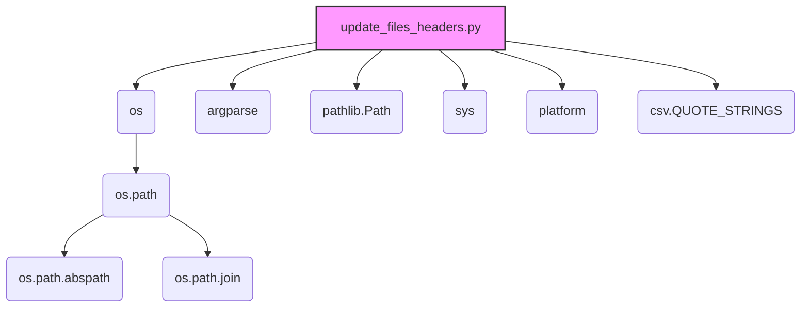

### Анализ кода модуля `update_files_headers.py.md`

#### 1. Блок-схема

```mermaid
graph TD
    A[Начало] --> B{Определение аргументов командной строки: force-update, clean, project};
    B -- clean=True --> C[Вызов функции traverse_and_clean(project_root)]
    B -- clean=False --> D[Вызов функции traverse_and_update(project_root, force_update)]
    C --> E[Функция traverse_and_clean: обход файлов и очистка заголовков]
    D --> F[Функция traverse_and_update: обход файлов и обновление заголовков]
    E --> G{Для каждого файла: вызов функции clean(file)}
    F --> H{Для каждого файла: вызов функции add_or_replace_file_header(file, project_root, force_update)}
    G --> I[Функция clean: удаление строк заголовков]
    H --> J[Функция add_or_replace_file_header: добавление или замена заголовков]
    I --> K[Запись отфильтрованных строк обратно в файл]
    J --> L[Определение необходимых строк заголовка]
    L --> M[Чтение строк файла]
    M --> N[Фильтрация существующих строк заголовка]
    N --> O{Необходимо обновление?}
    O -- Да --> P[Запись новых строк заголовка и отфильтрованных строк в файл]
    O -- Нет --> Q[Сообщение об отсутствии необходимости обновления]
    P --> R[Конец обработки файла]
    Q --> R
    K --> R
```

**Примеры для логических блоков:**

- **B (Определение аргументов командной строки):**
    - Пример 1: `python update_files_headers.py --force-update` (аргумент `force_update` установлен в `True`).
    - Пример 2: `python update_files_headers.py --clean` (аргумент `clean` установлен в `True`).
    - Пример 3: `python update_files_headers.py -p /path/to/project` (аргумент `project` указывает путь к корневой папке проекта).

- **G (Для каждого файла: вызов функции `clean(file)`):**
    - Пример: Если текущий файл `example.py`, то вызывается функция `clean("example.py")`.

- **H (Для каждого файла: вызов функции `add_or_replace_file_header(file, project_root, force_update)`):**
    - Пример: Если текущий файл `example.py`, корневая папка проекта `/path/to/project`, и `force_update` установлен в `True`, то вызывается функция `add_or_replace_file_header("example.py", "/path/to/project", True)`.

- **O (Необходимо обновление?):**
    - Пример 1: Если в файле отсутствуют строки заголовка, то `needs_update` будет `True`.
    - Пример 2: Если содержимое строк заголовка не соответствует ожидаемому, то `needs_update` будет `True`.
    - Пример 3: Если `force_update` установлен в `True`, то `needs_update` будет `True`.

### 2. Диаграмма



**Объяснение зависимостей:**

- **os**: Модуль `os` используется для взаимодействия с операционной системой, например, для работы с файловой системой (обход директорий, объединение путей).\
    - **os.path**: Подмодуль `os`, содержащий функции для манипулирования путями.\
        - **os.path.abspath**: Используется для получения абсолютного пути к папке проекта.\
        - **os.path.join**: Используется для объединения компонентов пути к файлу.\
- **argparse**: Используется для обработки аргументов командной строки, позволяя скрипту принимать параметры, такие как `--force-update` и `--clean`.\
- **pathlib.Path**: Предоставляет способ представления путей к файлам и каталогам в виде объектов, упрощая операции с путями.\
- **sys**: Предоставляет доступ к некоторым переменным и функциям, взаимодействующим с интерпретатором Python, например, `sys.argv` для получения аргументов командной строки.\
- **platform**: Предоставляет информацию об операционной системе и платформе, на которой выполняется скрипт.\
- **csv.QUOTE_STRINGS**: Константа из модуля `csv`, которая, хотя и импортирована, не используется в предоставленном коде. Вероятно, это остаток от предыдущей версии скрипта или запланированная, но не реализованная функциональность.\

### 3. Объяснение

**Импорты:**

- `os`: Используется для работы с файловой системой, например, для определения абсолютного пути к папке проекта и обхода директорий.\
- `argparse`: Используется для обработки аргументов командной строки, что позволяет запускать скрипт с различными опциями (`--force-update`, `--clean`).\
- `pathlib.Path`: Используется для представления путей к файлам и каталогам как объектов, упрощая манипуляции с путями.\
- `sys`: Используется для доступа к параметрам и функциям, специфичным для среды выполнения Python.\
- `platform`: Используется для получения информации об операционной системе и платформе, на которой запущен скрипт.\
- `csv.QUOTE_STRINGS`: Импортируется константа из модуля `csv`, но не используется в коде.\

**Переменные:**

- `PROJECT_ROOT_FOLDER: str`: Определяет имя папки, которая считается корневой папкой проекта ("..").\
- `EXCLUDE_DIRS: List[str]`: Список директорий, которые исключаются из обхода (`venv`, `tmp`, `docs`, `data`, `__pycache__`).\
- `MODE: str`: Устанавливает режим работы проекта (`development`).

**Функции:**

- `find_project_root(start_path: Path, project_root_folder: str) -> Path`:\
    - **Аргументы:**\
        - `start_path (Path)`: Путь к начальной директории, с которой начинается поиск.\
        - `project_root_folder (str)`: Имя папки, которая считается корневой (например, "src").\
    - **Назначение:** Функция рекурсивно ищет корневую папку проекта, начиная с указанного пути.\
    - **Возвращаемое значение:** Объект `Path`, представляющий путь к корневой папке проекта, или вызывает исключение `FileNotFoundError`, если корневая папка не найдена.\
- `get_interpreter_paths(project_root: Path) -> tuple`:\
    - **Аргументы:**\
        - `project_root (Path)`: Путь к корневой папке проекта.\
    - **Назначение:** Функция определяет пути к интерпретаторам Python для Windows и Linux/macOS.\
    - **Возвращаемое значение:** Кортеж, содержащий пути к интерпретаторам для Windows и Linux/macOS.\
- `add_or_replace_file_header(file_path: str, project_root: Path, force_update: bool)`:\
    -   **Аргументы**:\
        -   `file_path` (str): Путь к файлу, в котором нужно добавить или заменить заголовок.\
        -   `project_root` (Path): Корневой путь проекта.\
        -   `force_update` (bool): Флаг, указывающий, следует ли принудительно обновить заголовок, даже если он уже существует.\\\
    -   **Возвращаемое значение:** `None`.\\\
    -   **Назначение:** Функция добавляет или заменяет заголовок, строки интерпретатора и docstring модуля в указанном Python-файле.\
- `clean(file_path: str)`:\
    -   **Аргументы**:\
        -   `file_path` (str): Путь к файлу, из которого нужно удалить заголовки.\
    -   **Назначение:** Функция удаляет определенные строки заголовка из указанного файла.\
    -   **Возвращаемое значение:** Нет
- `traverse_and_update(directory: Path, force_update: bool)`:\
    -   **Аргументы**:\
        -   `directory` (Path): Путь к директории, которую нужно обойти.\
        -   `force_update` (bool): Флаг, указывающий, следует ли принудительно обновлять заголовки.\
    -   **Назначение:** Рекурсивно обходит указанную директорию и обновляет заголовки во всех Python файлах, вызывая функцию `add_or_replace_file_header` для каждого файла.\
    -   **Возвращаемое значение:** Нет
-   `traverse_and_clean(directory: Path)`:\
    -   **Аргументы**:\
        -   `directory` (Path): Путь к директории, которую нужно обойти.\
    -   **Назначение:** Функция рекурсивно проходит по указанной директории и удаляет заголовки из указанных файлов.\
    -   **Возвращаемое значение:** Нет
-   `main()`:\
    -   **Назначение:** Основная функция, которая запускает процесс обновления заголовков в файлах проекта.\
    - Аргументы, если раскомментированы:\
        -   `--force-update`: Флаг для принудительного обновления заголовков.\
        -   `--clean`: Флаг для удаления определенных строк заголовка.\
        -   `-p, --project`:  Путь к корневой папке проекта.\

**Потенциальные ошибки и области для улучшения:**\
- Жестко заданные пути: Функция `get_interpreter_paths` содержит жестко заданные пути к интерпретаторам, что может быть проблематично, если структура проекта или версия Python изменится.\
- Отсутствие обработки ошибок: Отсутствуют блоки `try...except` для обработки возможных исключений, таких как `FileNotFoundError` или `PermissionError`, при работе с файловой системой.\
- Закомментированный код: Большая часть логики функции `main` закомментирована. Это затрудняет понимание текущего поведения скрипта и может привести к путанице.\
- Неиспользуемый импорт: Импорт `from csv import QUOTE_STRINGS` не используется в коде и должен быть удален.\
- Функция clean: используется непоследовательно с функцией traverse_and_update, потенциально, не все файлы обрабатываются.\

**Взаимосвязи с другими частями проекта:**\
- Скрипт предполагает наличие определенной структуры директорий в проекте (например, наличие корневой папки и подпапки `src`).\
- Он использует модуль `header` для определения корневого пути проекта, что указывает на наличие общей системы конфигурации.