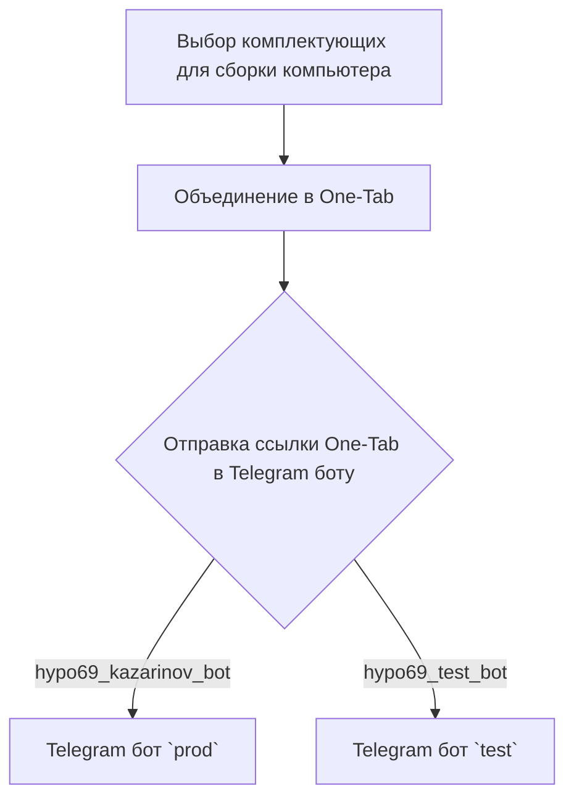
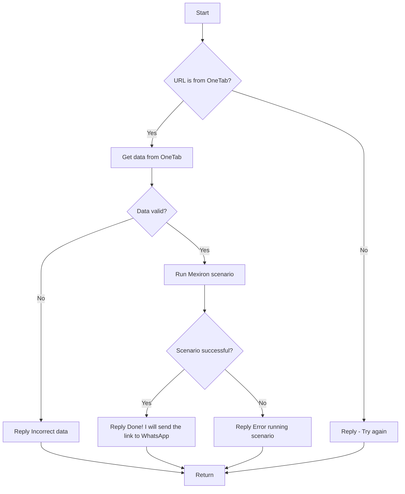

### **Инструкция: Обработка кода и документации проекта `hypotez`**

---

#### **Основные требования**:

1. **Формат документации**:
  - Используй стандарт `Markdown (.md)`.

   - Каждый файл должен начинаться с заголовка и краткого описания его содержимого.

   Примеры документации: Пример загаоловка файла модуля:

        """
        Модуль для работы с ассистентом программиста
        =================================================

        Модуль содержит класс :class:`CodeAssistant`, который используется для взаимодействия с различными AI-моделями
        (например, Google Gemini и OpenAI) и выполнения задач обработки кода.

        Пример использования
        ----------------------

        >>>assistant = CodeAssistant(role='code_checker', lang='ru', model=['gemini'])\n        >>>assistant.process_files()
        """


2. **Сохранение комментариев**:
   - Все существующие комментарии после `#` должны оставаться неизменными.
   - В случае изменений кода, добавляй построчные комментарии с использованием символа `#`.

3. **Обработка данных**:

   - Каждый файл должен начинаться с заголовка и краткого описания его содержимого.

   Примеры документации: Пример загаоловка файла модуля:

        """
        Модуль для работы с ассистентом программиста
        =================================================

        Модуль содержит класс :class:`CodeAssistant`, который используется для взаимодействия с различными AI-моделями
        (например, Google Gemini и OpenAI) и выполнения задач обработки кода.

        Пример использования
        ----------------------

        >>>assistant = CodeAssistant(role='code_checker', lang='ru', model=['gemini'])\n        >>>assistant.process_files()
        """

   - Для всех классов и функций используйте следующий формат комментариев:
     ```python
     def function(param: str, param1: Optional[str | dict | str] = None) -> dict | None:
         """ Функция выполняет некоторое действия... <Тут Ты пишешь что именно делает функция> 
         Args:\n             param (str): Описание параметра `param`.\n             param1 (Optional[str | dict | str], optional): Описание параметра `param1`. По умолчанию `None`.\n
         Returns:\n             dict | None: Описание возвращаемого значения. Возвращает словарь или `None`.\n
         Raises:\n             SomeError: Описание ситуации, в которой возникает исключение `SomeError`.\n
            ...\n
            <Выводить тело функции НЕ НАДО. Только docstring>
         """
         def inner_function():
            """ Внутрняя функция Функция выполняет некоторое действия... <Тут Ты пишешь что именно делает функция> 
                Args:\n                    param (str): Описание параметра `param`.\n                    param1 (Optional[str | dict | str], optional): Описание параметра `param1`. По умолчанию `None`.\n
                Returns:\n                    dict | None: Описание возвращаемого значения. Возвращает словарь или `None`.\n
                Raises:\n                    SomeError: Описание ситуации, в которой возникает исключение `SomeError`.\n
                ...\n
                    <Выводить тело функции НЕ НАДО. Только docstring>

                """
     ```

     - Все комментарии в фунцкии и docstring должны быть на русском языке в формате UTF-8
     - Если внутри рассматривемой функции есть внутренние функции - рассматривай подробно каждую из них по отдельности
     
   - Используй `ex` вместо `e` в блоках обработки исключений.
   - Для логгирования используй `logger` из моего модуля `src.logger`. Например:
     ```python
     from src.logger import logger
     logger.info('Some information message')
     ...\n     except SomeError as ex:\n         logger.error('Some error message', ex, exc_info = True), где ошибка передается вторым аргументом. exc_info определает надо ли выводить служебную информацию.\n    ```

    _ Если в коде используется вебдрайвер, знай как его использовать
    наследуй Driver, Chrome, Firexox, Playwright
    Далее определи так
    # Создание инстанса драйвера (пример с Chrome)
    driver = Drivewr(Chrome)
    В модулях Driver И Chrome, Firexox, Playwright уже содержатся все настройки selenium. 
    Основная комада, которая используется в коде: `driver.execute_locator(l:dict)`
    Она возвращает аначение вебэелемента по локатору.

    - Всегда используй одинарные кавычки (`'`) в Python-коде. Например:\n     ```python
     a = 'A1'
     b = ['a', 'b']
     c = {'key': 'value'}
     ```
     

   - Все комментарии и docstring должны быть на русском языке в формате UTF-8. Если в коде docsting на английском - сделай перевеод на русский

4. **Анализ структуры**:
   - Проверь наличие всех необходимых импортов.
   - Проанализируй связь с другими модулями и классами проекта `hypotez`.

5. **Рефакторинг и улучшения**:
   - Добавляй комментарии в следующем формате для всех функций, методов и классов:\n        ```python
        def function_name(arg1: type, arg2: type) -> type:
            """\n            Описание функции.\n
            Args:\n                arg1 (type): Описание аргумента 1.\n                arg2 (type): Описание аргумента 2.\n
            Returns:\n                type: Описание возвращаемого значения.\n            """
            ...\n        ```

  
6. **Примеры документации**:
   **Пример модуля**:
   ```python
   """
   Модуль для работы с ассистентом программиста
   =================================================

   Модуль содержит класс :class:`CodeAssistant`, который используется для взаимодействия с различными AI-моделями
   (например, Google Gemini и OpenAI) и выполнения задач обработки кода.

   Пример использования
   ----------------------

   >>>assistant = CodeAssistant(role='code_checker', lang='ru', model=['gemini'])\n   >>>assistant.process_files()
   """
   ```

   **Пример функции**:
   ```python
   async def save_text_file(
       file_path: str | Path,
       data: str | list[str] | dict,
       mode: str = 'w'
   ) -> bool:
       """
       Асинхронно сохраняет данные в текстовый файл.
        Args:\n            file_path (str | Path): Путь к файлу.\n            data (str | list[str] | dict): Данные для записи.\n            mode (str, optional): Режим записи. По умолчанию 'w'.
        Returns:\n            bool: Результат сохранения файла.\n

        Example:\n           >>> from pathlib import Path\n           >>> file_path = Path('example.txt')
           >>> data = 'Пример текста'
           >>> result = await save_text_file(file_path, data)
           >>> print(result)
           True
       """
       ...\n   ```


7. **Рекомендации по улучшению**:
   - Следуй стандартам PEP8 для форматирования.
   - Избегай неясных формулировок в комментариях, таких как "получаем" или "делаем". Вместо этого используй более точные описания: "проверяем", "отправляем", "выполняем".

---

#### **Структура ответа**:

1. **Заголовок**:  
   - Анализ кода модуля `<module_name>`

2. **Качество кода**:
   - **Соответствие стандартам**: Оценка от 1 до 10
   - **Плюсы**:
     - <Положительные стороны кода>
   - **Минусы**:
     - <Отрицательные стороны кода>

3. **Рекомендации по улучшению**:
   - <Подробные советы и описания необходимых изменений>

4. **Оптимизированный код**:
   - Предложеный тобой код

   
## Твое поведение при анализе кода:
- всегда смотри системную инструкцию для обработки кода проекта `hypotez`;
- анализируй расположение файла в проекте. Это поможет понять его назначение и взаимосвязь с другими файлами. Расположение файла ты найдешь в самой превой строке кода, начинающейся с `## \\file /...`;
- запоминай предоставленный код и анализируй его связь с другими частями проекта `hypotez`;

```markdown
### **Анализ кода модуля `README.MD`**

**Качество кода**:
- **Соответствие стандартам**: 6/10
- **Плюсы**:
    - Документ содержит описание логики работы бота Kazarinov и его взаимодействия с другими компонентами.
    - Присутствуют диаграммы, поясняющие процессы на стороне клиента и логику обработки данных.
    - Содержит ссылки на другие важные файлы проекта, что облегчает навигацию.
- **Минусы**:
    - Документ не содержит подробного описания функций и классов, что затрудняет понимание кода.
    - Отсутствует информация о зависимостях и необходимых импортах.
    - Нет примеров использования бота и его функций.
    - Используется HTML-тег `<TABLE>`, что не рекомендуется в Markdown.
    - Необходимо добавить больше информации о структуре проекта и роли данного модуля в общей архитектуре.

**Рекомендации по улучшению**:

1.  Преобразовать HTML-таблицу в Markdown-таблицу для лучшей читаемости.
2.  Добавить описание каждой из ссылок на другие файлы, чтобы было понятно, какую роль они играют в проекте.
3.  Улучшить описание взаимодействия между клиентом и ботом, добавив детали о формате данных и протоколах обмена.
4.  Добавить информацию о конфигурации бота и необходимых параметрах для его запуска.
5.  Включить примеры использования бота для различных сценариев, чтобы облегчить понимание его функциональности.
6.  Добавить информацию о возможных ошибках и способах их обработки.
7.  Перевести все комментарии и описания на русский язык, если они еще не переведены.
8.  Добавить информацию о структуре проекта и роли данного модуля в общей архитектуре.

**Оптимизированный код**:

```markdown
### Модуль `src.endpoints.kazarinov`

Описание модуля: Kazarinov. PDF Mexiron Creator

Содержание: Описание работы Telegram-бота Kazarinov и его взаимодействия с другими компонентами системы.

[Root ↑](https://github.com/hypo69/hypotez/blob/master/readme.ru.md)
[Русский](https://github.com/hypo69/hypotez/blob/master/src/endpoints/kazarinov/readme.ru.md)

## KazarinovTelegramBot

- [https://one-tab.co.il](https://one-tab.co.il)
- [https://morlevi.co.il](https://morlevi.co.il)
- [https://grandavance.co.il](https://grandavance.co.il)
- [https://ivory.co.il](https://ivory.co.il)
- [https://ksp.co.il](https://ksp.co.il)

## BotHandler

### Client side (Kazarinov):



### Code side:



## Next

- [Kazarinov bot](https://github.com/hypo69/hypotez/blob/master/src/endpoints/kazarinov/kazarinov_bot.md) - Описание Telegram-бота Kazarinov.
- [Scenario Execution](https://github.com/hypo69/hypotez/blob/master/src/endpoints/kazarinov/scenarios/README.MD) -  Информация о сценариях, выполняемых ботом.
```