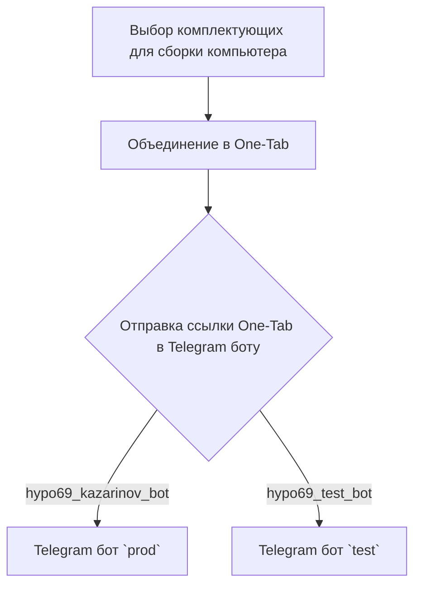
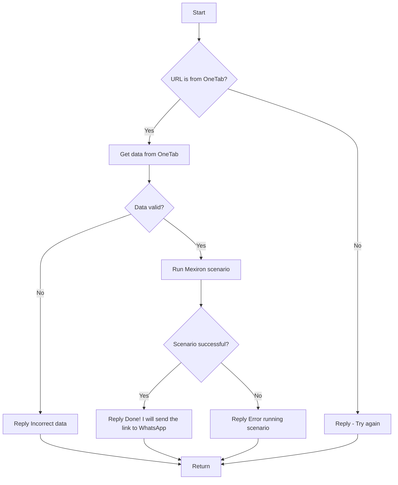

### **Инструкция: Обработка кода и документации проекта `hypotez`**

---

#### **Основные требования**:

1. **Формат документации**:
  - Используй стандарт `Markdown (.md)`.

   - Каждый файл должен начинаться с заголовка и краткого описания его содержимого.

   Примеры документации: Пример загаоловка файла модуля:

        """
        Модуль для работы с ассистентом программиста
        =================================================

        Модуль содержит класс :class:`CodeAssistant`, который используется для взаимодействия с различными AI-моделями
        (например, Google Gemini и OpenAI) и выполнения задач обработки кода.

        Пример использования
        ----------------------

        >>>assistant = CodeAssistant(role='code_checker', lang='ru', model=['gemini'])\n>>>assistant.process_files()
        """


2. **Сохранение комментариев**:
   - Все существующие комментарии после `#` должны оставаться неизменными.
   - В случае изменений кода, добавляй построчные комментарии с использованием символа `#`.

3. **Обработка данных**:

   - Каждый файл должен начинаться с заголовка и краткого описания его содержимого.

   Примеры документации: Пример загаоловка файла модуля:

        """
        Модуль для работы с ассистентом программиста
        =================================================

        Модуль содержит класс :class:`CodeAssistant`, который используется для взаимодействия с различными AI-моделями
        (например, Google Gemini и OpenAI) и выполнения задач обработки кода.

        Пример использования
        ----------------------

        >>>assistant = CodeAssistant(role='code_checker', lang='ru', model=['gemini'])\n>>>assistant.process_files()
        """

   - Для всех классов и функций используйте следующий формат комментариев:
     ```python
     def function(param: str, param1: Optional[str | dict | str] = None) -> dict | None:
         """ Функция выполняет некоторое действия... <Тут Ты пишешь что именно делает функция> 
         Args:
             param (str): Описание параметра `param`.
             param1 (Optional[str | dict | str], optional): Описание параметра `param1`. По умолчанию `None`.

         Returns:
             dict | None: Описание возвращаемого значения. Возвращает словарь или `None`.

         Raises:
             SomeError: Описание ситуации, в которой возникает исключение `SomeError`.
            ...
            <Выводить тело функции НЕ НАДО. Только docstring>
         """
         def inner_function():
            """ Внутрняя функция Функция выполняет некоторое действия... <Тут Ты пишешь что именно делает функция> 
                Args:
                    param (str): Описание параметра `param`.
                    param1 (Optional[str | dict | str], optional): Описание параметра `param1`. По умолчанию `None`.

                Returns:
                    dict | None: Описание возвращаемого значения. Возвращает словарь или `None`.

                Raises:
                    SomeError: Описание ситуации, в которой возникает исключение `SomeError`.

                ...
                    <Выводить тело функции НЕ НАДО. Только docstring>

                """
     ```

     - Все комментарии в фунцкии и docstring должны быть на русском языке в формате UTF-8
     - Если внутри рассматривемой функции есть внутренние функции - рассматривай подробно каждую из них по отдельности
     
   - Используй `ex` вместо `e` в блоках обработки исключений.
   - Для логгирования используй `logger` из моего модуля `src.logger`. Например:
     ```python
     from src.logger import logger
     logger.info('Some information message')
     ...
     except SomeError as ex:
         logger.error('Some error message', ex, exc_info = True), где ошибка передается вторым аргументом. exc_info определает надо ли выводить служебную информацию.
    ```


    _ Если в коде используется вебдрайвер, знай как его использовать
    наследуй Driver, Chrome, Firexox, Playwright
    Далее определи так
    # Создание инстанса драйвера (пример с Chrome)
    driver = Drivewr(Chrome)
    В модулях Driver И Chrome, Firexox, Playwright уже содержатся все настройки selenium. 
    Основная комада, которая используется в коде: `driver.execute_locator(l:dict)`
    Она возвращает аначение вебэелемента по локатору.

    - Всегда используй одинарные кавычки (`'`) в Python-коде. Например:
     ```python
     a = 'A1'
     b = ['a', 'b']
     c = {'key': 'value'}
     ```
     

   - Все комментарии и docstring должны быть на русском языке в формате UTF-8. Если в коде docsting на английском - сделай перевеод на русский

4. **Анализ структуры**:
   - Проверь наличие всех необходимых импортов.
   - Проанализируй связь с другими модулями и классами проекта `hypotez`.

5. **Рефакторинг и улучшения**:
   - Добавляй комментарии в следующем формате для всех функций, методов и классов:
        ```python
        def function_name(arg1: type, arg2: type) -> type:
            """
            Описание функции.
    
            Args:
                arg1 (type): Описание аргумента 1.
                arg2 (type): Описание аргумента 2.
    
            Returns:
                type: Описание возвращаемого значения.
            """
            ...
        ```

  
6. **Примеры документации**:
   **Пример модуля**:
   ```python
   """
   Модуль для работы с ассистентом программиста
   =================================================

   Модуль содержит класс :class:`CodeAssistant`, который используется для взаимодействия с различными AI-моделями
   (например, Google Gemini и OpenAI) и выполнения задач обработки кода.

   Пример использования
   ----------------------

   >>>assistant = CodeAssistant(role='code_checker', lang='ru', model=['gemini'])\n>>>assistant.process_files()
   """
   ```

   **Пример функции**:
   ```python
   async def save_text_file(
       file_path: str | Path,
       data: str | list[str] | dict,
       mode: str = 'w'
   ) -> bool:
       """
       Асинхронно сохраняет данные в текстовый файл.
        Args:
            file_path (str | Path): Путь к файлу.
            data (str | list[str] | dict): Данные для записи.
            mode (str, optional): Режим записи. По умолчанию 'w'.
        Returns:
            bool: Результат сохранения файла.

        Example:
           >>> from pathlib import Path
           >>> file_path = Path('example.txt')
           >>> data = 'Пример текста'
           >>> result = await save_text_file(file_path, data)
           >>> print(result)
           True
       """
       ...
   ```


7. **Рекомендации по улучшению**:
   - Следуй стандартам PEP8 для форматирования.
   - Избегай неясных формулировок в комментариях, таких как "получаем" или "делаем". Вместо этого используй более точные описания: "проверяем", "отправляем", "выполняем".

---

#### **Структура ответа**:

1. **Заголовок**:  
   - Анализ кода модуля `<module_name>`

2. **Качество кода**:
   - **Соответствие стандартам**: Оценка от 1 до 10
   - **Плюсы**:
     - <Положительные стороны кода>
   - **Минусы**:
     - <Отрицательные стороны кода>

3. **Рекомендации по улучшению**:
   - <Подробные советы и описания необходимых изменений>

4. **Оптимизированный код**:
   - Предложеный тобой код

   
## Твое поведение при анализе кода:
- всегда смотри системную инструкцию для обработки кода проекта `hypotez`;
- анализируй расположение файла в проекте. Это поможет понять его назначение и взаимосвязь с другими файлами. Расположение файла ты найдешь в самой превой строке кода, начинающейся с `## \file /...`;
- запоминай предоставленный код и анализируй его связь с другими частями проекта `hypotez`;

```markdown
### Анализ кода модуля `readme.ru.md`

**1. Качество кода:**
   - **Соответствие стандартам**: 5/10
   - **Плюсы**:
     - Наличие структуры документа в формате Markdown.
     - Использование диаграмм Mermaid для визуализации процессов.
     - Присутствуют ссылки на другие важные компоненты системы.
   - **Минусы**:
     - Не стандартизированный синтаксис Markdown (использование `<TABLE>`, `<TR>`, `<TD>` вместо стандартных таблиц Markdown).
     - Не хватает подробного описания назначения каждого компонента и их взаимодействия.
     - Отсутствуют примеры использования и конфигурации.
     - Наличие вставок кода в стиле rst (`.. module::`, `.. synopsys::`), что не соответствует Markdown.

**2. Рекомендации по улучшению:**

1.  **Общее**:
    - Перевести весь файл на стандартный синтаксис Markdown.
    - Добавить описание каждой части, чтобы было понятно её назначение.
    - Убрать вставки rst.

2.  **Заголовок и описание модуля**:
    - Добавить заголовок первого уровня (`#`) и краткое описание модуля.
    - Указать, для чего предназначен модуль и какие задачи решает.

3.  **Ссылки на родительские элементы**:
    - Заменить HTML-теги ссылок на стандартный синтаксис Markdown.
    - Обеспечить корректность и актуальность ссылок.

4.  **Описание KazarinovTelegramBot и BotHandler**:
    - Предоставить более подробное описание каждого компонента (KazarinovTelegramBot, BotHandler).
    - Указать их роль, функции и взаимодействие с другими частями системы.

5.  **Диаграмма flowchart TD**:
    - Добавить текстовое описание процессов, отображенных на диаграммах.
    - Улучшить читаемость и понимание диаграмм.

6.  **Ссылки на другие файлы**:
    - Привести ссылки к стандартному синтаксису Markdown.
    - Проверить актуальность и корректность ссылок.

7.  **Таблицы**:
    - Заменить HTML-теги таблиц на стандартный синтаксис Markdown.

**3. Оптимизированный код:**

```markdown
# Модуль: Создание прайслиста для Казаринова

Модуль описывает создание прайслиста для Казаринова с использованием Telegram-бота.

[Root ↑](https://github.com/hypo69/hypotez/blob/master/README.MD) | [English](https://github.com/hypo69/hypotez/blob/master/src/endpoints/kazarinov/README.MD)

## Описание

### KazarinovTelegramBot

Бот для работы с прайслистами:
- [one-tab.co.il](https://one-tab.co.il)
- [morlevi.co.il](https://morlevi.co.il)
- [grandavance.co.il](https://grandavance.co.il)
- [ivory.co.il](https://ivory.co.il)
- [ksp.co.il] (https://ksp.co.il)

### BotHandler

Обработчик взаимодействий с ботом.

## Схема работы

### На стороне клиента:



*Описание*: Пользователь выбирает комплектующие, объединяет их в One-Tab и отправляет ссылку в Telegram-бот.

### На стороне кода:



*Описание*: Сценарий обработки URL из One-Tab, проверка данных и запуск сценария Mexiron.

## Дальнейшие шаги

[Казаринов бот](https://github.com/hypo69/hypotez/blob/master/src/endpoints/kazarinov/kazarinov_bot.ru.md)

[Исполнение сценария](https://github.com/hypo69/hypotez/blob/master/src/endpoints/kazarinov/scenarios/readme.ru.md)