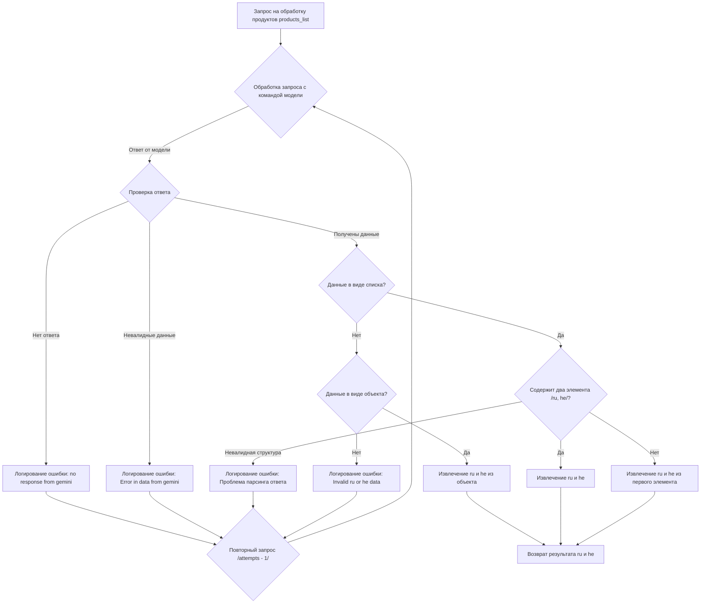

### **Анализ кода модуля `README.MD`**

#### **Качество кода**:
- **Соответствие стандартам**: 7/10
- **Плюсы**:
  - Представлена блок-схема процесса обработки запроса.
  - Наличие логики обработки различных вариантов ответов.
- **Минусы**:
  - Отсутствует текстовое описание блок-схемы.
  - Недостаточно комментариев, объясняющих каждый шаг блок-схемы.
  - Отсутствует информация о том, как эта схема связана с остальным кодом проекта `hypotez`.

#### **Рекомендации по улучшению**:
1. **Добавить текстовое описание**:
   - Необходимо добавить текстовое описание блок-схемы, чтобы объяснить процесс обработки запроса более подробно. Указать, какие входные и выходные данные используются на каждом шаге.

2. **Добавить комментарии**:
   - Добавить комментарии к каждому шагу блок-схемы, чтобы объяснить логику обработки данных.
   - Указать, какие ошибки могут возникнуть на каждом шаге и как они обрабатываются.

3. **Улучшить структуру**:
   - Разбить блок-схему на более мелкие части, чтобы упростить ее понимание.
   - Использовать более понятные названия для блоков и связей.

4. **Связать с кодом проекта**:
   - Указать, какие модули и классы проекта `hypotez` используются для реализации этой блок-схемы.
   - Добавить примеры использования этой схемы в коде проекта.

#### **Оптимизированный код**:

```markdown
### Обработка запросов на основе блок-схемы

#### Описание

Данный раздел содержит описание блок-схемы процесса обработки запроса для получения данных о продуктах `products_list`. Блок-схема описывает шаги обработки запроса, проверки данных и возврата результата.

#### Блок-схема



#### Описание шагов

1.  **A \[Запрос на обработку продуктов products\_list]**:
    -   Начальный шаг процесса. Получение запроса на обработку списка продуктов.

2.  **B {Обработка запроса с командой модели}**:
    -   Обработка запроса с использованием модели (например, Gemini).
    -   Отправка запроса в модель и получение ответа.

3.  **C {Проверка ответа}**:
    -   Проверка наличия и валидности ответа от модели.
    -   Если ответа нет или данные невалидны, выполняются соответствующие действия по логированию и повторному запросу.

4.  **D \[Логирование ошибки: no response from gemini]**:
    -   Логирование ошибки в случае отсутствия ответа от модели.
    -   Используется для отслеживания проблем с доступностью модели.

5.  **E {Повторный запрос /attempts - 1/}**:
    -   Повторная отправка запроса в модель.
    -   Уменьшение счетчика попыток. Если количество попыток исчерпано, процесс завершается с ошибкой.

6.  **F \[Логирование ошибки: Error in data from gemini]**:
    -   Логирование ошибки в случае получения невалидных данных от модели.
    -   Используется для отслеживания проблем с качеством данных, возвращаемых моделью.

7.  **G {Данные в виде списка?}**:
    -   Проверка, что данные от модели представлены в виде списка.

8.  **H {Содержит два элемента /ru, he/?}**:
    -   Проверка, что список содержит два элемента, предположительно `ru` и `he`.

9.  **I \[Извлечение ru и he]**:
    -   Извлечение данных для русского и иврита из списка.

10. **J \[Извлечение ru и he из первого элемента]**:

    -   Извлечение данных для русского и иврита из первого элемента списка (в случае, если список содержит только один элемент).
11. **K \[Логирование ошибки: Проблема парсинга ответа]**:
    -   Логирование ошибки, если структура ответа не соответствует ожидаемой.

12. **L {Данные в виде объекта?}**:

    -   Проверка, что данные от модели представлены в виде объекта (словаря).
13. **M \[Извлечение ru и he из объекта]**:

    -   Извлечение данных для русского и иврита из объекта.
14. **N \[Логирование ошибки: Invalid ru or he data]**:
    -   Логирование ошибки, если данные для русского и иврита не найдены в объекте.

15. **O \[Возврат результата ru и he]**:

    -   Возврат извлеченных данных для русского и иврита.

#### Связь с кодом проекта

Данная блок-схема описывает логику обработки ответов от AI-модели, используемой в модуле `src/endpoints/kazarinov/scenarios`. 
Для логирования ошибок используется модуль `src.logger.logger`.

Пример использования:

```python
from src.logger import logger

try:
    # Обработка запроса и получение данных
    data = process_request(products_list) # type: ignore
    ru_data = data['ru']
    he_data = data['he']
    logger.info(f"Получены данные: ru={ru_data}, he={he_data}")
except Exception as ex:
    logger.error("Ошибка при обработке запроса", ex, exc_info=True)
```