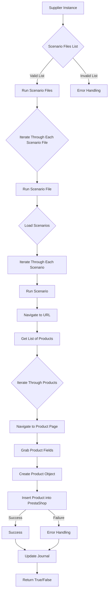

### **Анализ кода модуля `src.scenario`**

## Обзор

Файл `README.RU.MD` содержит документацию к модулю `src.scenario`. Модуль предназначен для автоматизации взаимодействия с поставщиками через сценарии, описанные в JSON-файлах. Он включает функции чтения сценариев, взаимодействия с веб-сайтами, обработки данных и ведения журнала выполнения.

## Качество кода:

- **Соответствие стандартам**: 8/10
- **Плюсы**:
    - Документ содержит подробное описание модуля и его основных компонентов.
    - Присутствует схема работы модуля в формате Mermaid.
    - Описаны основные функции и параметры каждой функции.
    - Приведен пример JSON-сценария.
- **Минусы**:
    - Не хватает аннотаций типов для параметров функций в описании.
    - Отсутствуют примеры использования функций.
    - Нет обработки исключений с использованием `logger` из модуля `src.logger`.
    - В тексте присутствуют неточности и грамматические ошибки.

## Рекомендации по улучшению:

1.  **Добавить аннотации типов**: В описании функций, таких как `run_scenario_files(s, scenario_files_list)`, указать типы параметров (`s: object`, `scenario_files_list: list`).
2.  **Добавить примеры использования**: В описании каждой функции добавить примеры её использования, чтобы упростить понимание её работы.
3.  **Использовать `logger` для обработки исключений**: В описании функций указать, как обрабатываются исключения с использованием `logger` из модуля `src.logger`.
4.  **Перефразировать текст**: Улучшить формулировки и исправить грамматические ошибки в тексте для повышения ясности и читаемости.
5.  **Унифицировать стиль**: Сделать единый стиль документации, чтобы всё было написано в одном тоне.

## Оптимизированный код:

```markdown
                # Модуль `src.scenario`

## Обзор

Модуль `src.scenario` предназначен для автоматизации взаимодействия с поставщиками, используя сценарии, описанные в JSON-файлах. Он адаптирует процесс извлечения и обработки данных о продуктах с веб-сайтов поставщиков и синхронизирует эту информацию с базой данных (например, PrestaShop). Модуль включает чтение сценариев, взаимодействие с веб-сайтами, обработку данных, запись журнала выполнения и организацию всего процесса.

## Оглавление

* [Модуль `src.scenario`](#модуль-src-scenario)
* [Обзор](#обзор)
* [Основные функции модуля](#основные-функции-модуля)
* [Основные компоненты модуля](#основные-компоненты-модуля)
    * [`run_scenario_files(s, scenario_files_list)`](#run_scenario_files-s-scenario_files_list)
    * [`run_scenario_file(s, scenario_file)`](#run_scenario_file-s-scenario_file)
    * [`run_scenario(s, scenario)`](#run_scenario-s-scenario)
    * [`dump_journal(s, journal)`](#dump_journal-s-journal)
    * [`main()`](#main)
* [Пример сценария](#пример-сценария)
* [Как это работает](#как-это-работает)


## Основные функции модуля

1. **Чтение сценариев**: Загрузка сценариев из JSON-файлов, содержащих информацию о продуктах и их URL на сайте поставщика.
2. **Взаимодействие с веб-сайтами**: Обработка URL-адресов из сценариев для извлечения данных о продуктах.
3. **Обработка данных**: Преобразование извлечённых данных в формат, подходящий для базы данных, и сохранение в неё.
4. **Запись журнала выполнения**: Ведение журнала с деталями выполнения сценариев и результатами работы для отслеживания процесса и выявления ошибок.



## Основные компоненты модуля

### `run_scenario_files(s: object, scenario_files_list: list) -> None`

**Описание**: Принимает список файлов сценариев и выполняет их по очереди, вызывая функцию `run_scenario_file` для каждого файла.

**Параметры**:
- `s` (object): Объект настроек (например, для соединения с базой данных).
- `scenario_files_list` (list): Список путей к файлам сценариев.

**Возвращает**:
- None

**Вызывает исключения**:
- `FileNotFoundError`: Если файл сценария не найден.
- `JSONDecodeError`: Если файл сценария содержит невалидный JSON.

**Пример использования**:
```python
# from src.scenario import run_scenario_files
# settings = ... #  Объект настроек
# scenario_files = ['scenario1.json', 'scenario2.json']
# run_scenario_files(settings, scenario_files)
```

### `run_scenario_file(s: object, scenario_file: str) -> None`

**Описание**: Загружает сценарии из указанного файла и вызывает `run_scenario` для каждого сценария в файле.

**Параметры**:
- `s` (object): Объект настроек.
- `scenario_file` (str): Путь к файлу сценария.

**Возвращает**:
- None

**Вызывает исключения**:
- `FileNotFoundError`: Если файл сценария не найден.
- `JSONDecodeError`: Если файл сценария содержит невалидный JSON.
- `Exception`: При любых других проблемах при работе со сценариями.

**Пример использования**:
```python
# from src.scenario import run_scenario_file
# settings = ... #  Объект настроек
# scenario_file = 'scenario1.json'
# run_scenario_file(settings, scenario_file)
```


### `run_scenario(s: object, scenario: dict) -> None`

**Описание**: Обрабатывает отдельный сценарий. Переходит по URL, извлекает данные о продуктах и сохраняет их в базе данных.

**Параметры**:
- `s` (object): Объект настроек.
- `scenario` (dict): Словарь, содержащий сценарий (например, с URL, категориями).

**Возвращает**:
- None

**Вызывает исключения**:
- `requests.exceptions.RequestException`: Если есть проблемы с запросом к веб-сайту.
- `Exception`: При любых других проблемах в процессе обработки сценария.

**Пример использования**:
```python
# from src.scenario import run_scenario
# settings = ... #  Объект настроек
# scenario = {
#     "url": "https://example.com/category/mineral-creams/",
#     "name": "минеральные+кремы",
#     "presta_categories": {
#         "default_category": 12345,
#         "additional_categories": [12346, 12347]
#     }
# }
# run_scenario(settings, scenario)
```


### `dump_journal(s: object, journal: list) -> None`

**Описание**: Сохраняет журнал выполнения сценариев в файл для последующего анализа.

**Параметры**:
- `s` (object): Объект настроек.
- `journal` (list): Список записей журнала выполнения.

**Возвращает**:
- None

**Вызывает исключения**:
- `Exception`: При проблемах с записью в файл.

**Пример использования**:
```python
# from src.scenario import dump_journal
# settings = ... #  Объект настроек
# journal = [...] #  Список записей журнала
# dump_journal(settings, journal)
```


### `main() -> None`

**Описание**: Основная функция для запуска модуля.

**Параметры**:
- None

**Возвращает**:
- None

**Вызывает исключения**:
- `Exception`: При любых критических ошибках во время выполнения.

**Пример использования**:
```python
# from src.scenario import main
# main()
```


## Пример сценария

Пример сценария JSON описывает взаимодействие с категориями продуктов на веб-сайте. Он содержит URL, имя категории и идентификаторы категорий в базе данных PrestaShop.


```json
{
    "scenarios": {
        "минеральные+кремы": {
            "url": "https://example.com/category/mineral-creams/",
            "name": "минеральные+кремы",
            "presta_categories": {
                "default_category": 12345,
                "additional_categories": [12346, 12347]
            }
        }
    }
}
```


## Как это работает

Модуль загружает сценарии, извлекает данные с веб-сайтов, обрабатывает их и сохраняет в базе данных. Он ведёт журнал выполнения для отслеживания процесса и выявления ошибок. В целом, модуль автоматизирует взаимодействие с поставщиками, улучшая эффективность и надежность процесса.