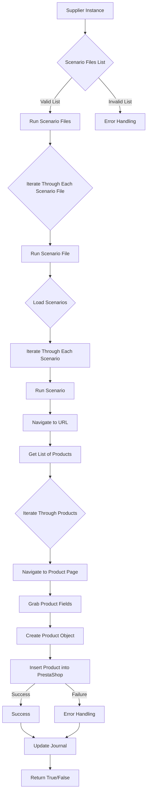

### **Анализ кода модуля `src.scenario`**

## \file hypotez/src/suppliers/scenario/README.MD

**Качество кода**:
- **Соответствие стандартам**: 7/10
- **Плюсы**:
  - Документация хорошо структурирована и предоставляет общее представление о функциональности модуля.
  - Описаны основные компоненты и их взаимодействие.
  - Приведен пример JSON-сценария для наглядности.
  - Используется Mermaid для визуализации workflow.
- **Минусы**:
  - Нет аннотации типов.
  - Не хватает подробностей о том, как именно происходит взаимодействие с базами данных и обработка ошибок.
  - Отсутствует описание используемых классов и структур данных.
  - В документации используются английский язык. Необходимо перевести документацию на русский язык в формате UTF-8
  - Mermaid-схема имеет слишком общий вид.
  - Нет информации об используемых модулях логгирования.

**Рекомендации по улучшению**:

1.  **Добавить аннотации типов**:
    -   В описании функций и методов добавить аннотации типов для параметров и возвращаемых значений.

2.  **Детализировать взаимодействие с БД**:
    -   Более подробно описать, как происходит взаимодействие с базой данных PrestaShop, включая используемые запросы и обработку результатов.

3.  **Расширить описание обработки ошибок**:
    -   Добавить информацию о том, как обрабатываются различные исключения и ошибки, возникающие в процессе выполнения сценариев.

4.  **Добавить описание классов и структур данных**:
    -   Описать основные классы и структуры данных, используемые в модуле, включая их атрибуты и методы.

5.  **Улучшить Mermaid-схему**:
    -   Сделать Mermaid-схему более подробной, отобразив взаимодействие между компонентами и этапами обработки данных. Добавить описание ошибок и логирование.

6.  **Добавить информацию о логгировании**:
    -   Описать, как используется модуль `logger` из `src.logger.logger` для логгирования событий и ошибок.

7.  **Перевести документацию на русский язык**:
    -   Всю документацию, включая описания функций, параметров и возвращаемых значений, необходимо перевести на русский язык.

**Оптимизированный код**:

```markdown
                # Module `src.scenario`

## Обзор

Модуль `src.scenario` предназначен для автоматизации взаимодействия с поставщиками с использованием сценариев, описанных в JSON-файлах. Он оптимизирует процесс извлечения и обработки данных о продуктах с веб-сайтов поставщиков и синхронизирует эту информацию с базой данных (например, PrestaShop). Модуль включает функциональность для чтения сценариев, взаимодействия с веб-сайтами, обработки данных, ведения журнала выполнения и организации всего рабочего процесса.

## Содержание

* [Модуль `src.scenario`](#module-src-scenario)
* [Обзор](#обзор)
* [Основные функции модуля](#основные-функции-модуля)
* [Основные компоненты модуля](#основные-компоненты-модуля)
    * [`run_scenario_files(s: object, scenario_files_list: list)`](#run_scenario_files-s-object-scenario_files_list-list)
    * [`run_scenario_file(s: object, scenario_file: str)`](#run_scenario_file-s-object-scenario_file-str)
    * [`run_scenario(s: object, scenario: dict)`](#run_scenario-s-object-scenario-dict)
    * [`dump_journal(s: object, journal: list)`](#dump_journal-s-object-journal-list)
    * [`main()`](#main)
* [Пример сценария](#пример-сценария)
* [Как это работает](#как-это-работает)

## Основные функции модуля

1. **Чтение сценариев**: Загрузка сценариев из JSON-файлов, содержащих информацию о продуктах и URL-адреса на веб-сайте поставщика.
2. **Взаимодействие с веб-сайтами**: Обработка URL-адресов из сценариев для извлечения данных о продуктах.
3. **Обработка данных**: Преобразование извлеченных данных в формат, подходящий для базы данных, и их сохранение.
4. **Ведение журнала выполнения**: Поддержание журналов с деталями выполнения сценариев и результатами для отслеживания прогресса и выявления ошибок.



## Основные компоненты модуля

### `run_scenario_files(s: object, scenario_files_list: list)`

**Описание**: Принимает список файлов сценариев и выполняет их последовательно, вызывая функцию `run_scenario_file` для каждого файла.

```python
def run_scenario_files(s: object, scenario_files_list: list) -> None:
    """
    Принимает список файлов сценариев и выполняет их последовательно, вызывая функцию `run_scenario_file` для каждого файла.

    Args:
        s (object): Объект настроек (например, для подключения к базе данных).
        scenario_files_list (list): Список путей к файлам сценариев.

    Returns:
        None

    Raises:
        FileNotFoundError: Если файл сценария не найден.
        JSONDecodeError: Если файл сценария содержит недействительный JSON.

    Example:
        >>> s = ...  # some settings object
        >>> scenario_files_list = ['scenario1.json', 'scenario2.json']
        >>> run_scenario_files(s, scenario_files_list)
    """
    ...
```

**Параметры**:
- `s`: Объект настроек (например, для подключения к базе данных).
- `scenario_files_list` (list): Список путей к файлам сценариев.

**Возвращает**:
- None

**Вызывает исключения**:
- `FileNotFoundError`: Если файл сценария не найден.
- `JSONDecodeError`: Если файл сценария содержит недействительный JSON.

### `run_scenario_file(s: object, scenario_file: str)`

**Описание**: Загружает сценарии из указанного файла и вызывает `run_scenario` для каждого сценария в файле.

```python
def run_scenario_file(s: object, scenario_file: str) -> None:
    """
    Загружает сценарии из указанного файла и вызывает `run_scenario` для каждого сценария в файле.

    Args:
        s (object): Объект настроек.
        scenario_file (str): Путь к файлу сценария.

    Returns:
        None

    Raises:
        FileNotFoundError: Если файл сценария не найден.
        JSONDecodeError: Если файл сценария содержит недействительный JSON.
        Exception: При любых других проблемах во время выполнения сценария.

    Example:
        >>> s = ...  # some settings object
        >>> scenario_file = 'scenario.json'
        >>> run_scenario_file(s, scenario_file)
    """
    ...
```

**Параметры**:
- `s`: Объект настроек.
- `scenario_file` (str): Путь к файлу сценария.

**Возвращает**:
- None

**Вызывает исключения**:
- `FileNotFoundError`: Если файл сценария не найден.
- `JSONDecodeError`: Если файл сценария содержит недействительный JSON.
- `Exception`: При любых других проблемах во время выполнения сценария.

### `run_scenario(s: object, scenario: dict)`

**Описание**: Обрабатывает отдельный сценарий, переходя по URL-адресу, извлекая данные о продукте и сохраняя их в базу данных.

```python
def run_scenario(s: object, scenario: dict) -> None:
    """
    Обрабатывает отдельный сценарий, переходя по URL-адресу, извлекая данные о продукте и сохраняя их в базу данных.

    Args:
        s (object): Объект настроек.
        scenario (dict): Словарь, содержащий сценарий (например, с URL-адресом и категориями).

    Returns:
        None

    Raises:
        requests.exceptions.RequestException: Если возникли проблемы с запросом к веб-сайту.
        Exception: При любых других проблемах во время обработки сценария.

    Example:
        >>> s = ...  # some settings object
        >>> scenario = {'url': 'https://example.com/product', 'category': 'creams'}
        >>> run_scenario(s, scenario)
    """
    ...
```

**Параметры**:
- `s`: Объект настроек.
- `scenario` (dict): Словарь, содержащий сценарий (например, с URL-адресом и категориями).

**Возвращает**:
- None

**Вызывает исключения**:
- `requests.exceptions.RequestException`: Если возникли проблемы с запросом к веб-сайту.
- `Exception`: При любых других проблемах во время обработки сценария.

### `dump_journal(s: object, journal: list)`

**Описание**: Сохраняет журнал выполнения в файл для последующего анализа.

```python
def dump_journal(s: object, journal: list) -> None:
    """
    Сохраняет журнал выполнения в файл для последующего анализа.

    Args:
        s (object): Объект настроек.
        journal (list): Список записей журнала выполнения.

    Returns:
        None

    Raises:
        Exception: Если возникли проблемы при записи в файл.

    Example:
        >>> s = ...  # some settings object
        >>> journal = [{'event': 'navigation', 'url': 'https://example.com'}]
        >>> dump_journal(s, journal)
    """
    ...
```

**Параметры**:
- `s`: Объект настроек.
- `journal` (list): Список записей журнала выполнения.

**Возвращает**:
- None

**Вызывает исключения**:
- `Exception`: Если возникли проблемы при записи в файл.

### `main()`

**Описание**: Основная функция для запуска модуля.

```python
def main() -> None:
    """
    Основная функция для запуска модуля.

    Args:
        None

    Returns:
        None

    Raises:
        Exception: При любых критических ошибках во время выполнения.

    Example:
        >>> main()
    """
    ...
```

**Параметры**:
- None

**Возвращает**:
- None

**Вызывает исключения**:
- `Exception`: При любых критических ошибках во время выполнения.

## Пример сценария

Пример JSON-сценария описывает взаимодействие с категориями продуктов на веб-сайте. Он включает URL-адрес, название категории и идентификаторы категории в базе данных PrestaShop.

```json
{
    "scenarios": {
        "mineral+creams": {
            "url": "https://example.com/category/mineral-creams/",
            "name": "mineral+creams",
            "presta_categories": {
                "default_category": 12345,
                "additional_categories": [12346, 12347]
            }
        }
    }
}
```