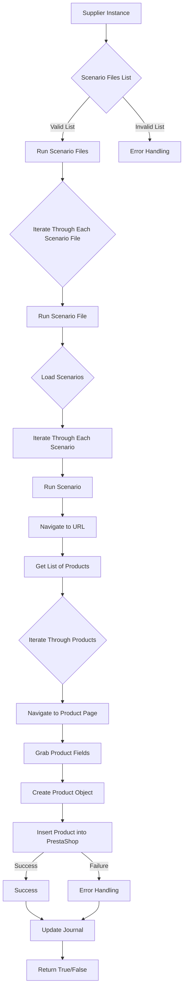

# Модуль `src.scenario`

## Обзор

Модуль `src.scenario` предназначен для автоматизации взаимодействия с поставщиками, используя сценарии, описанные в JSON-файлах. Он адаптирует процесс извлечения и обработки данных о продуктах с веб-сайтов поставщиков и синхронизирует эту информацию с базой данных (например, PrestaShop).  Модуль включает чтение сценариев, взаимодействие с веб-сайтами, обработку данных, запись журнала выполнения и организацию всего процесса.

## Оглавление

* [Модуль `src.scenario`](#модуль-srcscenario)
* [Обзор](#обзор)
* [Подробнее](#подробнее)
* [Основные функции модуля](#основные-функции-модуля)
* [Основные компоненты модуля](#основные-компоненты-модуля)
    * [`run_scenario_files(s, scenario_files_list)`](#run_scenario_files-s-scenario_files_list)
    * [`run_scenario_file(s, scenario_file)`](#run_scenario_file-s-scenario_file)
    * [`run_scenario(s, scenario)`](#run_scenario-s-scenario)
    * [`dump_journal(s, journal)`](#dump_journal-s-journal)
    * [`main()`](#main)
* [Пример сценария](#пример-сценария)
* [Как это работает](#как-это-работает)

## Подробнее

Модуль `src.scenario` автоматизирует процесс извлечения информации о продуктах с веб-сайтов поставщиков и загрузки этих данных в базу данных, например, PrestaShop. Это достигается за счет использования JSON-файлов, описывающих сценарии взаимодействия с веб-сайтами.  Он ведет журнал выполнения, что позволяет отслеживать процесс и выявлять ошибки. Модуль улучшает эффективность и надежность взаимодействия с поставщиками.

## Основные функции модуля

1. **Чтение сценариев**: Загрузка сценариев из JSON-файлов, содержащих информацию о продуктах и их URL на сайте поставщика.
2. **Взаимодействие с веб-сайтами**:  Обработка URL-адресов из сценариев для извлечения данных о продуктах.
3. **Обработка данных**: Преобразование извлечённых данных в формат, подходящий для базы данных, и сохранение в неё.
4. **Запись журнала выполнения**: Ведение журнала с деталями выполнения сценариев и результатами работы для отслеживания процесса и выявления ошибок.



## Основные компоненты модуля

### `run_scenario_files(s, scenario_files_list)`

**Описание**: Принимает список файлов сценариев и выполняет их по очереди, вызывая функцию `run_scenario_file` для каждого файла.

**Параметры**:
- `s`: Объект настроек (например, для соединения с базой данных).
- `scenario_files_list` (list): Список путей к файлам сценариев.

**Возвращает**:
- `None`

**Вызывает исключения**:
- `FileNotFoundError`: Если файл сценария не найден.
- `JSONDecodeError`: Если файл сценария содержит невалидный JSON.

**Как работает функция**:
- Функция `run_scenario_files` принимает на вход объект настроек `s` и список путей к файлам сценариев `scenario_files_list`.
- Она итерируется по каждому файлу в списке `scenario_files_list`.
- Для каждого файла вызывается функция `run_scenario_file`, которая обрабатывает сценарии, содержащиеся в файле.

**Примеры**:
```python
# Пример вызова функции run_scenario_files
# s - это объект настроек, например, для соединения с базой данных
# scenario_files_list - список путей к файлам сценариев
s = {} # Объект настроек
scenario_files_list = ['scenario1.json', 'scenario2.json']
run_scenario_files(s, scenario_files_list)
```

### `run_scenario_file(s, scenario_file)`

**Описание**: Загружает сценарии из указанного файла и вызывает `run_scenario` для каждого сценария в файле.

**Параметры**:
- `s`: Объект настроек.
- `scenario_file` (str): Путь к файлу сценария.

**Возвращает**:
- `None`

**Вызывает исключения**:
- `FileNotFoundError`: Если файл сценария не найден.
- `JSONDecodeError`: Если файл сценария содержит невалидный JSON.
- `Exception`: При любых других проблемах при работе со сценариями.

**Как работает функция**:
- Функция `run_scenario_file` принимает на вход объект настроек `s` и путь к файлу сценария `scenario_file`.
- Она пытается открыть и загрузить JSON-данные из указанного файла.
- Если загрузка прошла успешно, функция итерируется по каждому сценарию в загруженных данных.
- Для каждого сценария вызывается функция `run_scenario`, которая выполняет действия, описанные в сценарии.

**Примеры**:
```python
# Пример вызова функции run_scenario_file
# s - это объект настроек
# scenario_file - путь к файлу сценария
s = {} # Объект настроек
scenario_file = 'scenario.json'
run_scenario_file(s, scenario_file)
```

### `run_scenario(s, scenario)`

**Описание**: Обрабатывает отдельный сценарий. Переходит по URL, извлекает данные о продуктах и сохраняет их в базе данных.

**Параметры**:
- `s`: Объект настроек.
- `scenario` (dict): Словарь, содержащий сценарий (например, с URL, категориями).

**Возвращает**:
- `None`

**Вызывает исключения**:
- `requests.exceptions.RequestException`: Если есть проблемы с запросом к веб-сайту.
- `Exception`: При любых других проблемах в процессе обработки сценария.

**Как работает функция**:
- Функция `run_scenario` принимает на вход объект настроек `s` и словарь `scenario`, содержащий параметры сценария.
- Функция переходит по URL, указанному в сценарии.
- Далее, извлекает данные о продуктах с веб-сайта.
- Сохраняет извлеченные данные в базе данных.

**Примеры**:
```python
# Пример вызова функции run_scenario
# s - это объект настроек
# scenario - словарь, содержащий параметры сценария
s = {} # Объект настроек
scenario = {
    "url": "https://example.com/category/mineral-creams/",
    "name": "минеральные+кремы",
    "presta_categories": {
        "default_category": 12345,
        "additional_categories": [12346, 12347]
    }
}
run_scenario(s, scenario)
```

### `dump_journal(s, journal)`

**Описание**: Сохраняет журнал выполнения сценариев в файл для последующего анализа.

**Параметры**:
- `s`: Объект настроек.
- `journal` (list): Список записей журнала выполнения.

**Возвращает**:
- `None`

**Вызывает исключения**:
- `Exception`: При проблемах с записью в файл.

**Как работает функция**:
- Функция `dump_journal` принимает на вход объект настроек `s` и список `journal`, содержащий записи журнала выполнения.
- Сохраняет журнал выполнения сценариев в файл для последующего анализа.

**Примеры**:
```python
# Пример вызова функции dump_journal
# s - это объект настроек
# journal - список записей журнала выполнения
s = {} # Объект настроек
journal = [{'scenario': 'scenario1', 'status': 'success'}, {'scenario': 'scenario2', 'status': 'failure'}]
dump_journal(s, journal)
```

### `main()`

**Описание**: Основная функция для запуска модуля.

**Параметры**:
- `None`

**Возвращает**:
- `None`

**Вызывает исключения**:
- `Exception`: При любых критических ошибках во время выполнения.

**Как работает функция**:
- Функция `main` является точкой входа в модуль.
- Она выполняет основные задачи по инициализации и запуску сценариев.

**Примеры**:
```python
# Пример вызова функции main
main()
```

## Пример сценария

Пример сценария JSON описывает взаимодействие с категориями продуктов на веб-сайте. Он содержит URL, имя категории и идентификаторы категорий в базе данных PrestaShop.

```json
{
    "scenarios": {
        "минеральные+кремы": {
            "url": "https://example.com/category/mineral-creams/",
            "name": "минеральные+кремы",
            "presta_categories": {
                "default_category": 12345,
                "additional_categories": [12346, 12347]
            }
        }
    }
}
```

## Как это работает

Модуль загружает сценарии, извлекает данные с веб-сайтов, обрабатывает их и сохраняет в базе данных.  Он ведёт журнал выполнения для отслеживания процесса и выявления ошибок.  В целом, модуль автоматизирует взаимодействие с поставщиками, улучшая эффективность и надежность процесса.