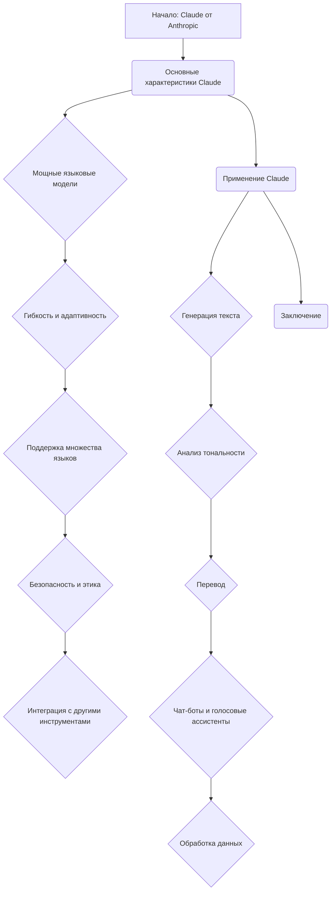

### **Системные инструкции для обработки кода проекта `hypotez`**

=========================================================================================

Описание функциональности и правил для генерации, анализа и улучшения кода. Направлено на обеспечение последовательного и читаемого стиля кодирования, соответствующего требованиям.

---

### **Основные принципы**

#### **1. Общие указания**:
- Соблюдай четкий и понятный стиль кодирования.
- Все изменения должны быть обоснованы и соответствовать установленным требованиям.

#### **2. Комментарии**:
- Используй `#` для внутренних комментариев.
- Документация всех функций, методов и классов должна следовать такому формату: 
    ```python
        def function(param: str, param1: Optional[str | dict | str] = None) -> dict | None:
            """ 
            Args:
                param (str): Описание параметра `param`.
                param1 (Optional[str | dict | str], optional): Описание параметра `param1`. По умолчанию `None`.
    
            Returns:
                dict | None: Описание возвращаемого значения. Возвращает словарь или `None`.
    
            Raises:
                SomeError: Описание ситуации, в которой возникает исключение `SomeError`.

            Ехаmple:
                >>> function('param', 'param1')
                {'param': 'param1'}
            """
    ```
- Комментарии и документация должны быть четкими, лаконичными и точными.

#### **3. Форматирование кода**:
- Используй одинарные кавычки. `a:str = 'value'`, `print('Hello World!')`;
- Добавляй пробелы вокруг операторов. Например, `x = 5`;
- Все параметры должны быть аннотированы типами. `def function(param: str, param1: Optional[str | dict | str] = None) -> dict | None:`;
- Не используй `Union`. Вместо этого используй `|`.

#### **4. Логирование**:
- Для логгирования Всегда Используй модуль `logger` из `src.logger.logger`.
- Ошибки должны логироваться с использованием `logger.error`.
Пример:
    ```python
        try:
            ...
        except Exception as ex:
            logger.error('Error while processing data', ех, exc_info=True)
    ```
#### **5 Не используй `Union[]` в коде. Вместо него используй `|`
Например:
```python
x: str | int ...
```


---

### **Основные требования**:

#### **1. Формат ответов в Markdown**:
- Все ответы должны быть выполнены в формате **Markdown**.

#### **2. Формат комментариев**:
- Используй указанный стиль для комментариев и документации в коде.
- Пример:

```python
from typing import Generator, Optional, List
from pathlib import Path


def read_text_file(
    file_path: str | Path,
    as_list: bool = False,
    extensions: Optional[List[str]] = None,
    chunk_size: int = 8192,
) -> Generator[str, None, None] | str | None:
    """
    Считывает содержимое файла (или файлов из каталога) с использованием генератора для экономии памяти.

    Args:
        file_path (str | Path): Путь к файлу или каталогу.
        as_list (bool): Если `True`, возвращает генератор строк.
        extensions (Optional[List[str]]): Список расширений файлов для чтения из каталога.
        chunk_size (int): Размер чанков для чтения файла в байтах.

    Returns:
        Generator[str, None, None] | str | None: Генератор строк, объединенная строка или `None` в случае ошибки.

    Raises:
        Exception: Если возникает ошибка при чтении файла.

    Example:
        >>> from pathlib import Path
        >>> file_path = Path('example.txt')
        >>> content = read_text_file(file_path)
        >>> if content:
        ...    print(f'File content: {content[:100]}...')
        File content: Example text...
    """
    ...
```
- Всегда делай подробные объяснения в комментариях. Избегай расплывчатых терминов, 
- таких как *«получить»* или *«делать»*. Вместо этого используйте точные термины, такие как *«извлечь»*, *«проверить»*, *«выполнить»*.
- Вместо: *«получаем»*, *«возвращаем»*, *«преобразовываем»* используй имя объекта *«функция получае»*, *«переменная возвращает»*, *«код преобразовывает»* 
- Комментарии должны непосредственно предшествовать описываемому блоку кода и объяснять его назначение.

#### **3. Пробелы вокруг операторов присваивания**:
- Всегда добавляйте пробелы вокруг оператора `=`, чтобы повысить читаемость.
- Примеры:
  - **Неправильно**: `x=5`
  - **Правильно**: `x = 5`

#### **4. Использование `j_loads` или `j_loads_ns`**:
- Для чтения JSON или конфигурационных файлов замените стандартное использование `open` и `json.load` на `j_loads` или `j_loads_ns`.
- Пример:

```python
# Неправильно:
with open('config.json', 'r', encoding='utf-8') as f:
    data = json.load(f)

# Правильно:
data = j_loads('config.json')
```

#### **5. Сохранение комментариев**:
- Все существующие комментарии, начинающиеся с `#`, должны быть сохранены без изменений в разделе «Улучшенный код».
- Если комментарий кажется устаревшим или неясным, не изменяйте его. Вместо этого отметьте его в разделе «Изменения».

#### **6. Обработка `...` в коде**:
- Оставляйте `...` как указатели в коде без изменений.
- Не документируйте строки с `...`.
```

#### **7. Аннотации**
Для всех переменных должны быть определены аннотации типа. 
Для всех функций все входные и выходные параметры аннотириваны
Для все параметров должны быть аннотации типа.


### **8. webdriver**
В коде используется webdriver. Он импртируется из модуля `webdriver` проекта `hypotez`
```python
from src.webdirver import Driver, Chrome, Firefox, Playwright, ...
driver = Driver(Firefox)

Пoсле чего может использоваться как

close_banner = {
  "attribute": null,
  "by": "XPATH",
  "selector": "//button[@id = 'closeXButton']",
  "if_list": "first",
  "use_mouse": false,
  "mandatory": false,
  "timeout": 0,
  "timeout_for_event": "presence_of_element_located",
  "event": "click()",
  "locator_description": "Закрываю pop-up окно, если оно не появилось - не страшно (`mandatory`:`false`)"
}

result = driver.execute_locator(close_banner)
```

## Анализ кода файла `hypotez/src/ai/anthropic/about.ru.md`

### 1. Блок-схема

Этот код представляет собой текстовое описание Claude от Anthropic на русском языке. Блок-схема будет отражать структуру этого текста, выделяя основные темы и разделы.



**Примеры для каждого логического блока:**

-   **A (Начало: Claude от Anthropic):** Вводное описание Claude как семейства мощных языковых моделей, разработанных компанией Anthropic.
-   **B (Основные характеристики Claude):** Перечисление ключевых особенностей модели Claude.
-   **C (Мощные языковые модели):** Claude основан на архитектуре, которая позволяет модели обрабатывать и генерировать текст с высокой точностью и разнообразием.
-   **D (Гибкость и адаптивность):** Модели Claude могут быть настроены для конкретных задач и областей применения, что делает их универсальным инструментом для различных приложений.
-   **E (Поддержка множества языков):** Claude поддерживает несколько языков, что делает его пригодным для глобальных проектов и многоязычных приложений.
-   **F (Безопасность и этика):** Anthropic уделяет большое внимание этике и безопасности при разработке моделей. Claude разработан с учетом принципов ответственного использования ИИ.
-   **G (Интеграция с другими инструментами):** Claude может быть интегрирован с другими инструментами и сервисами, такими как Google Cloud, AWS, и другими, что облегчает его использование в существующих экосистемах.
-   **H (Применение Claude):** Описание различных вариантов использования Claude.
-   **I (Генерация текста):** Claude может использоваться для генерации текста, включая создание статей, отчетов, и других документов.
-   **J (Анализ тональности):** Модель может анализировать текст на предмет тональности (позитивная, негативная, нейтральная) и предоставлять ценные аналитические данные.
-   **K (Перевод):** Claude может использоваться для перевода текста с одного языка на другой с высокой точностью.
-   **L (Чат-боты и голосовые ассистенты):** Модель может быть интегрирована в чат-боты и голосовые ассистенты для создания естественного и интуитивно понятного взаимодействия с пользователями.
-   **M (Обработка данных):** Claude может использоваться для обработки и анализа больших объемов текстовых данных, что полезно в таких областях, как финансы, медицина, и другие.
-   **N (Заключение):** Подведение итогов и подчеркивание преимуществ Claude.

### 2. Диаграмма

В данном случае код не содержит импортов или зависимостей. Он представляет собой статический текст на языке Markdown. Поэтому диаграмма зависимостей не требуется.

### 3. Объяснение

Этот документ представляет собой описание языковой модели Claude от Anthropic на русском языке. Текст разбит на несколько разделов, описывающих основные характеристики модели, области применения и заключение.

-   **Основные характеристики**:
    -   Мощные языковые модели: Claude основан на передовой архитектуре, позволяющей обрабатывать и генерировать текст с высокой точностью.
    -   Гибкость и адаптивность: Модель можно настроить для конкретных задач и интегрировать в различные системы.
    -   Поддержка множества языков: Claude поддерживает несколько языков, что расширяет область его применения.
    -   Безопасность и этика: Anthropic уделяет внимание безопасной и этичной разработке моделей ИИ.
    -   Интеграция с другими инструментами: Claude может быть интегрирован с другими сервисами, такими как Google Cloud и AWS.
-   **Применение Claude**:
    -   Генерация текста: Создание статей, отчетов, маркетингового контента.
    -   Анализ тональности: Определение эмоциональной окраски текста.
    -   Перевод: Перевод текста с одного языка на другой.
    -   Чат-боты и голосовые ассистенты: Создание естественного и интуитивно понятного взаимодействия.
    -   Обработка данных: Анализ больших объемов текстовых данных.

**Потенциальные области для улучшения:**

-   Добавить примеры использования Claude в каждой из перечисленных областей применения.
-   Указать конкретные технические характеристики модели Claude (например, размер модели, используемые алгоритмы).
-   Включить информацию о стоимости использования Claude.

**Цепочка взаимосвязей с другими частями проекта:**

Этот документ может быть связан с другими частями проекта `hypotez`, которые используют или описывают возможности Claude. Например, он может быть использован в качестве справочной информации для модулей, которые интегрируются с Claude API. Также, он может быть частью документации, предоставляемой пользователям `hypotez`.