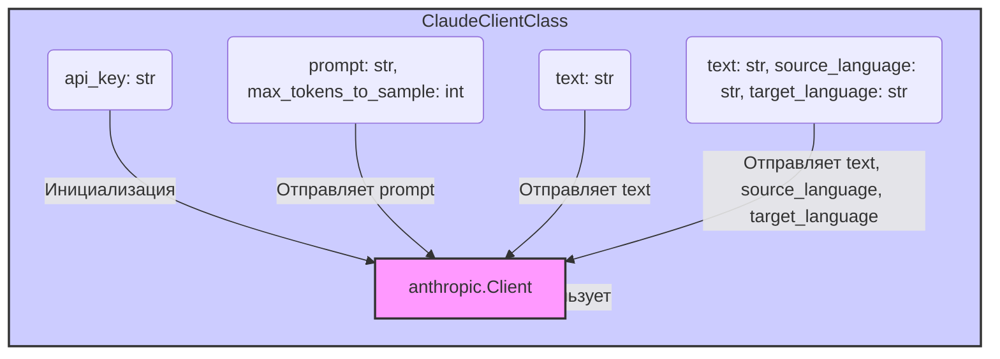

### **Системные инструкции для обработки кода проекта `hypotez`**

=========================================================================================

Описание функциональности и правил для генерации, анализа и улучшения кода. Направлено на обеспечение последовательного и читаемого стиля кодирования, соответствующего требованиям.

---

### **Основные принципы**

#### **1. Общие указания**:
- Соблюдай четкий и понятный стиль кодирования.
- Все изменения должны быть обоснованы и соответствовать установленным требованиям.

#### **2. Комментарии**:
- Используй `#` для внутренних комментариев.
- Документация всех функций, методов и классов должна следовать такому формату: 
    ```python
        def function(param: str, param1: Optional[str | dict | str] = None) -> dict | None:
            """ 
            Args:
                param (str): Описание параметра `param`.
                param1 (Optional[str | dict | str], optional): Описание параметра `param1`. По умолчанию `None`.
    
            Returns:
                dict | None: Описание возвращаемого значения. Возвращает словарь или `None`.
    
            Raises:
                SomeError: Описание ситуации, в которой возникает исключение `SomeError`.

            Ехаmple:
                >>> function('param', 'param1')
                {'param': 'param1'}
            """
    ```
- Комментарии и документация должны быть четкими, лаконичными и точными.

#### **3. Форматирование кода**:
- Используй одинарные кавычки. `a:str = 'value'`, `print('Hello World!')`;
- Добавляй пробелы вокруг операторов. Например, `x = 5`;
- Все параметры должны быть аннотированы типами. `def function(param: str, param1: Optional[str | dict | str] = None) -> dict | None:`;
- Не используй `Union`. Вместо этого используй `|`.

#### **4. Логирование**:
- Для логгирования Всегда Используй модуль `logger` из `src.logger.logger`.
- Ошибки должны логироваться с использованием `logger.error`.
Пример:
    ```python
        try:
            ...
        except Exception as ex:
            logger.error('Error while processing data', ех, exc_info=True)
    ```
#### **5 Не используй `Union[]` в коде. Вместо него используй `|`
Например:
```python
x: str | int ...
```


---

### **Основные требования**:

#### **1. Формат ответов в Markdown**:
- Все ответы должны быть выполнены в формате **Markdown**.

#### **2. Формат комментариев**:
- Используй указанный стиль для комментариев и документации в коде.
- Пример:

```python
from typing import Generator, Optional, List
from pathlib import Path


def read_text_file(
    file_path: str | Path,
    as_list: bool = False,
    extensions: Optional[List[str]] = None,
    chunk_size: int = 8192,
) -> Generator[str, None, None] | str | None:
    """
    Считывает содержимое файла (или файлов из каталога) с использованием генератора для экономии памяти.

    Args:
        file_path (str | Path): Путь к файлу или каталогу.
        as_list (bool): Если `True`, возвращает генератор строк.
        extensions (Optional[List[str]]): Список расширений файлов для чтения из каталога.
        chunk_size (int): Размер чанков для чтения файла в байтах.

    Returns:
        Generator[str, None, None] | str | None: Генератор строк, объединенная строка или `None` в случае ошибки.

    Raises:
        Exception: Если возникает ошибка при чтении файла.

    Example:
        >>> from pathlib import Path
        >>> file_path = Path('example.txt')
        >>> content = read_text_file(file_path)
        >>> if content:
        ...    print(f'File content: {content[:100]}...')
        File content: Example text...
    """
    ...
```
- Всегда делай подробные объяснения в комментариях. Избегай расплывчатых терминов, 
- таких как *«получить»* или *«делать»*. Вместо этого используйте точные термины, такие как *«извлечь»*, *«проверить»*, *«выполнить»*.
- Вместо: *«получаем»*, *«возвращаем»*, *«преобразовываем»* используй имя объекта *«функция получае»*, *«переменная возвращает»*, *«код преобразовывает»* 
- Комментарии должны непосредственно предшествовать описываемому блоку кода и объяснять его назначение.

#### **3. Пробелы вокруг операторов присваивания**:
- Всегда добавляйте пробелы вокруг оператора `=`, чтобы повысить читаемость.
- Примеры:
  - **Неправильно**: `x=5`
  - **Правильно**: `x = 5`

#### **4. Использование `j_loads` или `j_loads_ns`**:
- Для чтения JSON или конфигурационных файлов замените стандартное использование `open` и `json.load` на `j_loads` или `j_loads_ns`.
- Пример:

```python
# Неправильно:
with open('config.json', 'r', encoding='utf-8') as f:
    data = json.load(f)

# Правильно:
data = j_loads('config.json')
```

#### **5. Сохранение комментариев**:
- Все существующие комментарии, начинающиеся с `#`, должны быть сохранены без изменений в разделе «Улучшенный код».
- Если комментарий кажется устаревшим или неясным, не изменяйте его. Вместо этого отметьте его в разделе «Изменения».

#### **6. Обработка `...` в коде**:
- Оставляйте `...` как указатели в коде без изменений.
- Не документируйте строки с `...`.
```

#### **7. Аннотации**
Для всех переменных должны быть определены аннотации типа. 
Для всех функций все входные и выходные параметры аннотириваны
Для все параметров должны быть аннотации типа.


### **8. webdriver**
В коде используется webdriver. Он импртируется из модуля `webdriver` проекта `hypotez`
```python
from src.webdirver import Driver, Chrome, Firefox, Playwright, ...
driver = Driver(Firefox)

Пoсле чего может использоваться как

close_banner = {
  "attribute": null,
  "by": "XPATH",
  "selector": "//button[@id = 'closeXButton']",
  "if_list": "first",
  "use_mouse": false,
  "mandatory": false,
  "timeout": 0,
  "timeout_for_event": "presence_of_element_located",
  "event": "click()",
  "locator_description": "Закрываю pop-up окно, если оно не появилось - не страшно (`mandatory`:`false`)"
}

result = driver.execute_locator(close_banner)
```

### **Анализ кода `hypotez/src/ai/anthropic/claude.py`**

#### **1. Блок-схема**

```mermaid
graph LR
    A[Начало] --> B(Инициализация ClaudeClient);
    B --> C{Вызов метода?};
    C -- Да --> D{Метод: generate_text?};
    D -- Да --> E[Генерация текста с Claude API];
    E --> F[Возврат сгенерированного текста];
    D -- Нет --> G{Метод: analyze_sentiment?};
    G -- Да --> H[Анализ тональности текста с Claude API];
    H --> I[Возврат результата анализа тональности];
    G -- Нет --> J{Метод: translate_text?};
    J -- Да --> K[Перевод текста с Claude API];
    K --> L[Возврат переведенного текста];
    J -- Нет --> M[Конец (другой метод)];
    C -- Нет --> M[Конец (нет вызова метода)];
    F --> M[Конец];
    I --> M[Конец];
    L --> M[Конец];
```

**Примеры для каждого логического блока:**

-   **A (Начало)**: Начало выполнения программы.
-   **B (Инициализация ClaudeClient)**: Создание экземпляра класса `ClaudeClient` с использованием API-ключа.
    ```python
    api_key = 'your-api-key'
    claude_client = ClaudeClient(api_key)
    ```
-   **C (Вызов метода?)**: Проверка, какой метод вызывается у экземпляра `claude_client`.
-   **D (Метод: generate\_text?)**: Проверка, вызывается ли метод `generate_text`.
-   **E (Генерация текста с Claude API)**: Вызов API Claude для генерации текста на основе запроса.
    ```python
    prompt = 'Write a short story about a robot learning to love.'
    generated_text = claude_client.generate_text(prompt)
    ```
-   **F (Возврат сгенерированного текста)**: Возврат сгенерированного текста.
-   **G (Метод: analyze\_sentiment?)**: Проверка, вызывается ли метод `analyze_sentiment`.
-   **H (Анализ тональности текста с Claude API)**: Вызов API Claude для анализа тональности текста.
    ```python
    text_to_analyze = 'I am very happy today!'
    sentiment_analysis = claude_client.analyze_sentiment(text_to_analyze)
    ```
-   **I (Возврат результата анализа тональности)**: Возврат результата анализа тональности.
-   **J (Метод: translate\_text?)**: Проверка, вызывается ли метод `translate_text`.
-   **K (Перевод текста с Claude API)**: Вызов API Claude для перевода текста с одного языка на другой.
    ```python
    text_to_translate = 'Hello, how are you?'
    source_language = 'en'
    target_language = 'es'
    translated_text = claude_client.translate_text(text_to_translate, source_language, target_language)
    ```
-   **L (Возврат переведенного текста)**: Возврат переведенного текста.
-   **M (Конец)**: Конец выполнения программы.

#### **2. Диаграмма**



**Объяснение зависимостей:**

-   `anthropic`: Этот модуль используется для взаимодействия с API Claude. Класс `ClaudeClient` инициализируется с использованием `anthropic.Client`, который предоставляет методы для отправки запросов к API Claude.

#### **3. Объяснение**

**Импорты:**

-   `anthropic`: Этот модуль предоставляет клиент для взаимодействия с API Claude. Он используется для отправки запросов на генерацию текста, анализ тональности и перевод текста.
-   `typing.Optional`: Этот модуль используется для обозначения параметров, которые могут быть `None`.

**Классы:**

-   `ClaudeClient`:
    -   **Роль**: Этот класс предоставляет интерфейс для взаимодействия с API Claude. Он инкапсулирует логику инициализации клиента и выполнения различных операций, таких как генерация текста, анализ тональности и перевод текста.
    -   **Атрибуты**:
        -   `client`: Экземпляр класса `anthropic.Client`, используемый для отправки запросов к API Claude.
    -   **Методы**:
        -   `__init__(self, api_key: str) -> None`: Инициализирует клиент Claude с предоставленным API-ключом.
        -   `generate_text(self, prompt: str, max_tokens_to_sample: int = 100) -> str`: Генерирует текст на основе предоставленного запроса.
        -   `analyze_sentiment(self, text: str) -> str`: Анализирует тональность предоставленного текста.
        -   `translate_text(self, text: str, source_language: str, target_language: str) -> str`: Переводит предоставленный текст с исходного языка на целевой язык.
    -   **Взаимодействие с другими компонентами проекта**:
        -   Этот класс использует модуль `anthropic` для взаимодействия с API Claude.

**Функции:**

-   `__init__(self, api_key: str) -> None`:
    -   **Аргументы**:
        -   `api_key (str)`: API-ключ для доступа к сервисам Claude.
    -   **Возвращаемое значение**: `None`.
    -   **Назначение**: Инициализирует клиент Claude с предоставленным API-ключом.
    -   **Пример**:
        ```python
        claude_client = ClaudeClient('your_api_key')
        ```
-   `generate_text(self, prompt: str, max_tokens_to_sample: int = 100) -> str`:
    -   **Аргументы**:
        -   `prompt (str)`: Запрос для генерации текста.
        -   `max_tokens_to_sample (int, optional)`: Максимальное количество токенов для генерации. По умолчанию 100.
    -   **Возвращаемое значение**: `str`: Сгенерированный текст.
    -   **Назначение**: Генерирует текст на основе предоставленного запроса.
    -   **Пример**:
        ```python
        claude_client.generate_text('Write a short story.')
        ```
-   `analyze_sentiment(self, text: str) -> str`:
    -   **Аргументы**:
        -   `text (str)`: Текст для анализа.
    -   **Возвращаемое значение**: `str`: Результат анализа тональности.
    -   **Назначение**: Анализирует тональность предоставленного текста.
    -   **Пример**:
        ```python
        claude_client.analyze_sentiment('I am very happy!')
        ```
-   `translate_text(self, text: str, source_language: str, target_language: str) -> str`:
    -   **Аргументы**:
        -   `text (str)`: Текст для перевода.
        -   `source_language (str)`: Код исходного языка.
        -   `target_language (str)`: Код целевого языка.
    -   **Возвращаемое значение**: `str`: Переведенный текст.
    -   **Назначение**: Переводит предоставленный текст с исходного языка на целевой язык.
    -   **Пример**:
        ```python
        claude_client.translate_text('Hello', 'en', 'es')
        ```

**Переменные:**

-   `api_key (str)`: API-ключ для доступа к сервисам Claude.
-   `claude_client (ClaudeClient)`: Экземпляр класса `ClaudeClient`, используемый для взаимодействия с API Claude.
-   `prompt (str)`: Запрос для генерации текста.
-   `generated_text (str)`: Сгенерированный текст.
-   `text_to_analyze (str)`: Текст для анализа тональности.
-   `sentiment_analysis (str)`: Результат анализа тональности.
-   `text_to_translate (str)`: Текст для перевода.
-   `source_language (str)`: Код исходного языка.
-   `target_language (str)`: Код целевого языка.
-   `translated_text (str)`: Переведенный текст.

**Потенциальные ошибки или области для улучшения:**

-   Обработка ошибок при вызове API Claude не реализована. В случае ошибки API, программа завершится с исключением. Необходимо добавить обработку исключений и логирование ошибок.
-   Использование фиксированной модели `'claude-v1'` может быть негибким. Возможно, стоит добавить возможность выбора модели.
-   Примеры использования класса находятся в блоке `if __name__ == '__main__':`, что затрудняет тестирование класса. Рекомендуется вынести примеры в отдельные тесты.

**Цепочка взаимосвязей с другими частями проекта:**

-   Этот модуль может быть использован другими частями проекта, которые требуют взаимодействия с API Claude для генерации текста, анализа тональности или перевода текста. Например, он может быть использован в модулях, связанных с обработкой естественного языка или машинным обучением.
    Модуль может быть использован в `src.api` для создания HTTP endpoints.