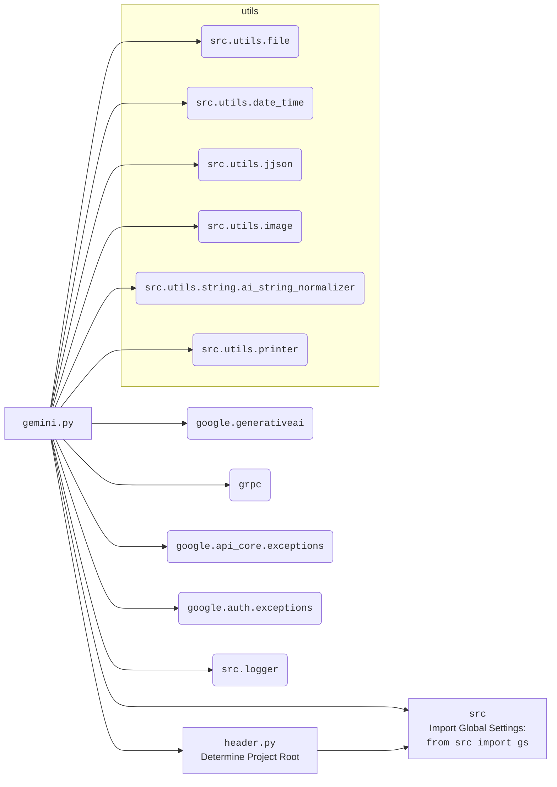

### **Системные инструкции для обработки кода проекта `hypotez`**

=========================================================================================

Описание функциональности и правил для генерации, анализа и улучшения кода. Направлено на обеспечение последовательного и читаемого стиля кодирования, соответствующего требованиям.

---

### **Основные принципы**

#### **1. Общие указания**:
- Соблюдай четкий и понятный стиль кодирования.
- Все изменения должны быть обоснованы и соответствовать установленным требованиям.

#### **2. Комментарии**:
- Используй `#` для внутренних комментариев.
- Документация всех функций, методов и классов должна следовать такому формату: 
    ```python
        def function(param: str, param1: Optional[str | dict | str] = None) -> dict | None:
            """ 
            Args:
                param (str): Описание параметра `param`.
                param1 (Optional[str | dict | str], optional): Описание параметра `param1`. По умолчанию `None`.
    
            Returns:
                dict | None: Описание возвращаемого значения. Возвращает словарь или `None`.
    
            Raises:
                SomeError: Описание ситуации, в которой возникает исключение `SomeError`.

            Ехаmple:
                >>> function('param', 'param1')
                {'param': 'param1'}
            """
    ```
- Комментарии и документация должны быть четкими, лаконичными и точными.

#### **3. Форматирование кода**:
- Используй одинарные кавычки. `a:str = 'value'`, `print('Hello World!')`;
- Добавляй пробелы вокруг операторов. Например, `x = 5`;
- Все параметры должны быть аннотированы типами. `def function(param: str, param1: Optional[str | dict | str] = None) -> dict | None:`;
- Не используй `Union`. Вместо этого используй `|`.

#### **4. Логирование**:
- Для логгирования Всегда Используй модуль `logger` из `src.logger.logger`.
- Ошибки должны логироваться с использованием `logger.error`.
Пример:
    ```python
        try:
            ...
        except Exception as ex:
            logger.error('Error while processing data', ех, exc_info=True)
    ```
#### **5 Не используй `Union[]` в коде. Вместо него используй `|`
Например:
```python
x: str | int ...
```


---

### **Основные требования**:

#### **1. Формат ответов в Markdown**:
- Все ответы должны быть выполнены в формате **Markdown**.

#### **2. Формат комментариев**:
- Используй указанный стиль для комментариев и документации в коде.
- Пример:

```python
from typing import Generator, Optional, List
from pathlib import Path


def read_text_file(
    file_path: str | Path,
    as_list: bool = False,
    extensions: Optional[List[str]] = None,
    chunk_size: int = 8192,
) -> Generator[str, None, None] | str | None:
    """
    Считывает содержимое файла (или файлов из каталога) с использованием генератора для экономии памяти.

    Args:
        file_path (str | Path): Путь к файлу или каталогу.
        as_list (bool): Если `True`, возвращает генератор строк.
        extensions (Optional[List[str]]): Список расширений файлов для чтения из каталога.
        chunk_size (int): Размер чанков для чтения файла в байтах.

    Returns:
        Generator[str, None, None] | str | None: Генератор строк, объединенная строка или `None` в случае ошибки.

    Raises:
        Exception: Если возникает ошибка при чтении файла.

    Example:
        >>> from pathlib import Path
        >>> file_path = Path('example.txt')
        >>> content = read_text_file(file_path)
        >>> if content:
        ...    print(f'File content: {content[:100]}...')
        File content: Example text...
    """
    ...
```
- Всегда делай подробные объяснения в комментариях. Избегай расплывчатых терминов, 
- таких как *«получить»* или *«делать»*. Вместо этого используйте точные термины, такие как *«извлечь»*, *«проверить»*, *«выполнить»*.
- Вместо: *«получаем»*, *«возвращаем»*, *«преобразовываем»* используй имя объекта *«функция получае»*, *«переменная возвращает»*, *«код преобразовывает»* 
- Комментарии должны непосредственно предшествовать описываемому блоку кода и объяснять его назначение.

#### **3. Пробелы вокруг операторов присваивания**:
- Всегда добавляйте пробелы вокруг оператора `=`, чтобы повысить читаемость.
- Примеры:
  - **Неправильно**: `x=5`
  - **Правильно**: `x = 5`

#### **4. Использование `j_loads` или `j_loads_ns`**:
- Для чтения JSON или конфигурационных файлов замените стандартное использование `open` и `json.load` на `j_loads` или `j_loads_ns`.
- Пример:

```python
# Неправильно:
with open('config.json', 'r', encoding='utf-8') as f:
    data = json.load(f)

# Правильно:
data = j_loads('config.json')
```

#### **5. Сохранение комментариев**:
- Все существующие комментарии, начинающиеся с `#`, должны быть сохранены без изменений в разделе «Улучшенный код».
- Если комментарий кажется устаревшим или неясным, не изменяйте его. Вместо этого отметьте его в разделе «Изменения».

#### **6. Обработка `...` в коде**:
- Оставляйте `...` как указатели в коде без изменений.
- Не документируйте строки с `...`.
```

#### **7. Аннотации**
Для всех переменных должны быть определены аннотации типа. 
Для всех функций все входные и выходные параметры аннотириваны
Для все параметров должны быть аннотации типа.


### **8. webdriver**
В коде используется webdriver. Он импртируется из модуля `webdriver` проекта `hypotez`
```python
from src.webdirver import Driver, Chrome, Firefox, Playwright, ...
driver = Driver(Firefox)

Пoсле чего может использоваться как

close_banner = {
  "attribute": null,
  "by": "XPATH",
  "selector": "//button[@id = 'closeXButton']",
  "if_list": "first",
  "use_mouse": false,
  "mandatory": false,
  "timeout": 0,
  "timeout_for_event": "presence_of_element_located",
  "event": "click()",
  "locator_description": "Закрываю pop-up окно, если оно не появилось - не страшно (`mandatory`:`false`)"
}

result = driver.execute_locator(close_banner)
```

### **Анализ кода `src/ai/gemini/gemini.py`**

#### **1. Блок-схема**

```mermaid
graph LR
    A[Начало] --> B(Инициализация GoogleGenerativeAi);
    B --> C{Выбор метода: ask / ask_async / chat / describe_image / upload_file};

    subgraph ask [Метод ask]
        A1(Прием текстового запроса q) --> A2{Цикл попыток};
        A2 --> A3{Вызов model.generate_content(q)};
        A3 -- Успешно --> A4{Сохранение истории диалога (опционально)};
        A4 --> A5(Нормализация ответа);
        A5 --> A6(Возврат ответа);
        A3 -- Ошибка --> A7{Обработка исключений};
        A7 --> A2;
        A2 -- Превышено число попыток --> A8(Возврат None);
    end

    subgraph ask_async [Метод ask_async]
        B1(Прием текстового запроса q) --> B2{Цикл попыток};
        B2 --> B3(Вызов asyncio.to_thread(model.generate_content, q));
        B3 -- Успешно --> B4{Сохранение истории диалога (опционально)};
        B4 --> B5(Нормализация ответа);
        B5 --> B6(Возврат ответа);
        B3 -- Ошибка --> B7{Обработка исключений};
        B7 --> B2;
        B2 -- Превышено число попыток --> B8(Возврат None);
    end

    subgraph chat [Метод chat]
        C1(Прием вопроса q и параметров чата) --> C2{Управление историей чата (flag)};
        C2 -- "save_chat" --> C3(Загрузка истории);
        C2 -- "read_and_clear" --> C3;
        C2 -- "clear" --> C4(Очистка истории);
        C2 -- "start_new" --> C5(Архивация и очистка истории);
        C3 --> C6(Отправка сообщения _chat.send_message_async(q));
        C4 --> C6
        C5 --> C6;
        C6 -- Успех --> C7(Сохранение истории);
        C7 --> C8(Возврат ответа);
        C6 -- Ошибка --> C9(Обработка ошибок);
        C9 --> C8(Возврат None);
    end

    subgraph describe_image [Метод describe_image]
        D1(Прием изображения и параметров) --> D2{Преобразование изображения в байты};
        D2 --> D3(Формирование запроса);
        D3 --> D4(Отправка запроса model.generate_content);
        D4 -- Успех --> D5(Возврат текстового описания);
        D4 -- Ошибка --> D6(Обработка ошибок);
        D6 --> D5(Возврат None);
    end
    
    subgraph upload_file [Метод upload_file]
        E1(Прием файла) --> E2(Вызов genai.upload_file_async);
        E2 -- Успех --> E3(Логирование успеха);
        E3 --> E4(Возврат response);
        E2 -- Ошибка --> E5(Обработка исключений);
        E5 --> E6{Попытка удаления файла};
        E6 -- Успех --> E7{Повторная загрузка файла};
        E7 --> E2;
        E6 -- Ошибка --> E8(Логирование общей ошибки);
        E8 --> E4(Возврат None);
    end

    C --> A1
    C --> B1
    C --> C1
    C --> D1
    C --> E1

    style A fill:#f9f,stroke:#333,stroke-width:2px
    style B fill:#f9f,stroke:#333,stroke-width:2px
    style C fill:#f9f,stroke:#333,stroke-width:2px
```

#### **2. Диаграмма зависимостей `mermaid`**



Диаграмма `mermaid` демонстрирует зависимости `gemini.py` от внешних библиотек и внутренних модулей проекта `hypotez`.

-   `google.generativeai`, `grpc`, `google.api_core.exceptions`, `google.auth.exceptions`: это внешние библиотеки Google для работы с генеративными моделями, обработки удаленных вызовов и обработки исключений аутентификации и API.
-   `header.py`: Определяет корень проекта.
-   `src`: Содержит глобальные настройки проекта.
-   `src.utils`: Содержит набор утилит для работы с файлами, датой и временем, JSON, изображениями и строками.
-    `src.utils.file`: Используется для чтения и сохранения текстовых файлов.
-    `src.utils.date_time`:  Используется для работы с датой и временем.
-    `src.utils.jjson`: Используется для загрузки и сохранения JSON данных.
-    `src.utils.image`: Используется для обработки изображений.
-    `src.utils.string.ai_string_normalizer`: Используется для нормализации строк.
-    `src.utils.printer`: Используется для печати данных.
-   `src.logger`: Модуль для логирования событий.

#### **3. Объяснение кода**

**Импорты:**

-   `codecs`, `re`, `asyncio`, `time`, `json`, `requests`, `base64`: Стандартные библиотеки Python для кодирования, работы с регулярными выражениями, асинхронного программирования, работы со временем, JSON, выполнения HTTP-запросов и кодирования Base64.
-   `IOBase`, `Path`: Из модуля `io` и `pathlib` для работы с файлами и путями.
-   `Optional`, `Dict`, `List`, `Any`: Из модуля `typing` для аннотации типов.
-   `SimpleNamespace`: Из модуля `types` для создания простых объектов с атрибутами.
-   `dataclass`, `field`: Из модуля `dataclasses` для создания классов данных.
-   `google.generativeai as genai`: Библиотека Google для работы с генеративными моделями ИИ.
-   `grpc`: Библиотека для создания gRPC клиентов и серверов.
-   `google.api_core.exceptions`: Исключения, специфичные для API Google.
-   `google.auth.exceptions`: Исключения, связанные с аутентификацией Google.
-   `header`: Модуль, определяющий корень проекта.
-   `src`: Модуль, содержащий глобальные настройки проекта.
-   `src.utils.file`: Функции для чтения и записи файлов.
-   `src.utils.date_time`: Функции для работы с датой и временем.
-   `src.utils.jjson`: Функции для работы с JSON.
-   `src.utils.image`: Функции для работы с изображениями.
-   `src.utils.string.ai_string_normalizer`: Функции для нормализации строк.
-   `src.utils.printer`: Функция для печати данных с форматированием.
-   `src.logger`: Модуль для логирования событий.

**Классы:**

-   `Config`: Класс конфигурации (содержимое не указано в предоставленном коде).
-   `GoogleGenerativeAi`: Класс для взаимодействия с моделями Google Generative AI.

    -   **Атрибуты:**
        -   `api_key`: Ключ API для доступа к сервисам Google Generative AI. Тип: `str`.
        -   `model_name`: Имя используемой модели. По умолчанию `"gemini-2.0-flash-exp"`. Тип: `str`.
        -   `dialogue_txt_path`: Путь к файлу для записи логов диалога. Тип: `Path`.
        -   `generation_config`: Конфигурация генерации ответов. По умолчанию `{"response_mime_type": "text/plain"}`. Тип: `Dict`.
        -    `system_instruction: Optional[str]`:  Системные инструкции для модели.
        -   `history_dir`: Директория для хранения истории чата. Тип: `Path`.
        -   `history_txt_file`: Путь к файлу для хранения истории чата в текстовом формате. Тип: `Path`.
        -   `history_json_file`: Путь к файлу для хранения истории чата в JSON формате. Тип: `Path`.
        -   `config`: Конфигурация, загруженная из `gemini.json`. Тип: `SimpleNamespace`.
        -   `chat_history`: Список словарей, представляющих историю чата. Тип: `List[Dict]`.
        -   `model`: Объект модели, инициализируется `genai.GenerativeModel`. Тип: `Any`.
        -   `_chat`: Объект чата, инициализируется `self._start_chat()`. Тип: `Any`.
        -   `MODELS`: Список доступных моделей. Тип: `List[str]`.

    -   **Методы:**
        -   `__post_init__(self)`: Инициализирует объект `GoogleGenerativeAi` после создания экземпляра класса. Выполняет настройку API, инициализирует модель и запускает чат.
        -   `normalize_answer(self, text: str) -> str`: Очищает текстовый вывод от различных маркеров (например, ```md, ```python).
        -   `_start_chat(self)`: Запускает чат с начальной настройкой (системные инструкции, если есть).
        -   `clear_history(self)`: Очищает историю чата в памяти и удаляет файл истории.
        -   `_save_chat_history(self, chat_data_folder: Optional[str | Path])`: Сохраняет историю чата в JSON файл.
        -   `_load_chat_history(self, chat_data_folder: Optional[str | Path])`: Загружает историю чата из JSON файла.
        -   `chat(self, q: str, chat_data_folder: Optional[str | Path], flag: str = "save_chat") -> Optional[str]`: Обрабатывает чат-запрос с различными режимами управления историей чата.
        -   `ask(self, q: str, attempts: int = 15, save_history: bool = False, clean_response:bool = True) -> Optional[str]`: Отправляет текстовый запрос модели и возвращает ответ (синхронный режим).
        -   `ask_async(self, q: str, attempts: int = 15, save_history: bool = False, clean_response:bool = True) -> Optional[str]`: Отправляет текстовый запрос модели и возвращает ответ (асинхронный режим).
        -   `describe_image(self, image: Path | bytes, mime_type: Optional[str] = 'image/jpeg', prompt: Optional[str] = '') -> Optional[str]`: Отправляет изображение в Gemini Pro Vision и возвращает его текстовое описание.
        -   `upload_file(self, file: str | Path | IOBase, file_name: Optional[str] = None) -> bool`: Загружает файл в Google Generative AI.

**Функции:**

-   `main()`: Асинхронная функция, демонстрирующая примеры использования класса `GoogleGenerativeAi`, включая:
    -   Инициализацию класса `GoogleGenerativeAi`.
    -   Вызов метода `describe_image` для анализа изображения.
    -   Вызов метода `upload_file` для загрузки файла.
    -   Взаимодействие в чате через метод `chat`.

**Переменные:**

-   `timeout_check`: Экземпляр класса `TimeoutCheck` из `src.utils.date_time`.
-   `gs`: Объект с глобальными настройками из `src`.

**Потенциальные ошибки и области для улучшения:**

-   Обработка исключений в методах `ask` и `ask_async` может быть улучшена за счет более детальной обработки различных типов ошибок и предоставления более информативных сообщений об ошибках.
-   Метод `upload_file` содержит рекурсивный вызов `self.upload_file(file, file_name)` в блоке `except`, что может привести к бесконечной рекурсии в случае постоянной ошибки.
-   В методе `describe_image` контент запроса формируется не оптимально.
-   Следует унифицировать подходы к логированию и обработке ошибок во всех методах.

**Взаимосвязи с другими частями проекта:**

-   Класс `GoogleGenerativeAi` использует глобальные настройки из модуля `src` (переменная `gs`) для получения API ключа и путей к файлам.
-   Для работы с файлами используются функции из модуля `src.utils.file`.
-   Для логирования используется модуль `src.logger`.
-   Используются функции для работы с JSON `src.utils.jjson`.