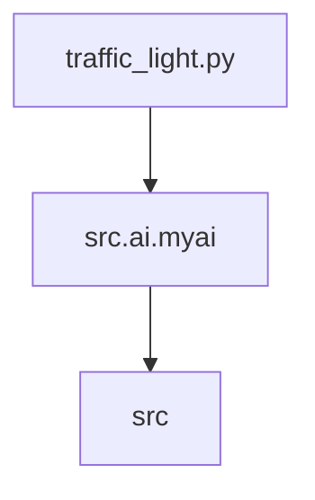

### **Анализ кода проекта `hypotez`**

=========================================================================================

#### **Расположение файла в проекте**:
Файл расположен по пути `hypotez/src/ai/myai/traffic_light.py`. Это указывает на то, что файл, вероятно, содержит логику, связанную с искусственным интеллектом (AI) и, возможно, с управлением трафиком или моделированием поведения, аналогичного работе светофора.

---

### **1. Блок-схема**

Поскольку предоставленный код состоит только из комментариев и метаданных, реальную блок-схему построить невозможно. Однако, предположим, что в файле будут реализованы функции, связанные с управлением трафиком, можно представить следующую блок-схему:

```mermaid
graph LR
    A[Начало] --> B{Определение текущего состояния};
    B --> C{Анализ окружения};
    C --> D{Принятие решения};
    D --> E{Изменение состояния};
    E --> F[Конец];
    
    subgraph Пример блока "Определение текущего состояния"
        I[Получение данных о текущем состоянии светофора]
        J[Получение данных о времени работы текущего состояния]
        I --> J
    end
    
    subgraph Пример блока "Анализ окружения"
        K[Получение данных о трафике на перекрестке]
        L[Анализ плотности трафика]
        K --> L
    end
    
    subgraph Пример блока "Принятие решения"
        M{Если трафик плотный}
        N[Увеличение времени работы зеленого света]
        O[Уменьшение времени работы красного света]
        M -- Да --> N
        M -- Нет --> O
    end
    
    subgraph Пример блока "Изменение состояния"
        P[Изменение цвета светофора]
        Q[Запись нового состояния]
        P --> Q
    end
```

- **Начало**: Начальная точка процесса.
- **Определение текущего состояния**: Определение текущего состояния светофора (красный, желтый, зеленый) и времени, проведенного в этом состоянии.
    - *Пример*: Получение данных о текущем цвете светофора и времени работы этого цвета.
- **Анализ окружения**: Сбор данных об окружении, например, о трафике на перекрестке.
    - *Пример*: Анализ плотности трафика на основе данных с камер или датчиков.
- **Принятие решения**: Принятие решения о дальнейших действиях на основе анализа окружения.
    - *Пример*: Если трафик плотный, увеличить время работы зеленого света.
- **Изменение состояния**: Изменение состояния светофора в соответствии с принятым решением.
    - *Пример*: Переключение светофора с красного на зеленый.
- **Конец**: Конечная точка процесса.

---

### **2. Диаграмма**

Поскольку предоставленный код не содержит импортов, создать mermaid-диаграмму зависимостей невозможно. Но если бы они были, выглядело бы это так:



- **traffic_light.py**: Основной файл, содержащий логику управления трафиком.
- **src.ai.myai**: Пакет, к которому принадлежит файл `traffic_light.py`.
- **src**: Корневой каталог проекта, содержащий все пакеты.

---

### **3. Объяснение**

#### **Импорты**:
Отсутствуют. Если бы были, указывались бы назначение и взаимосвязь с другими пакетами `src`.

#### **Классы**:
Отсутствуют. Если бы были, описывались бы их роль, атрибуты, методы и взаимодействие с другими компонентами проекта.

#### **Функции**:
Отсутствуют. Если бы были, описывались бы их аргументы, возвращаемые значения, назначение и примеры.

#### **Переменные**:
Отсутствуют. Если бы были, описывались бы их типы и использование.

#### **Потенциальные ошибки и области для улучшения**:
- Отсутствие реализации логики управления трафиком.
- Необходимость добавления функций для определения состояния светофора, анализа трафика и принятия решений.

#### **Взаимосвязи с другими частями проекта**:
- Поскольку файл находится в пакете `src.ai.myai`, можно предположить, что он может взаимодействовать с другими модулями, отвечающими за искусственный интеллект и анализ данных. Например, с модулями, отвечающими за обработку изображений с камер или за анализ данных о трафике.