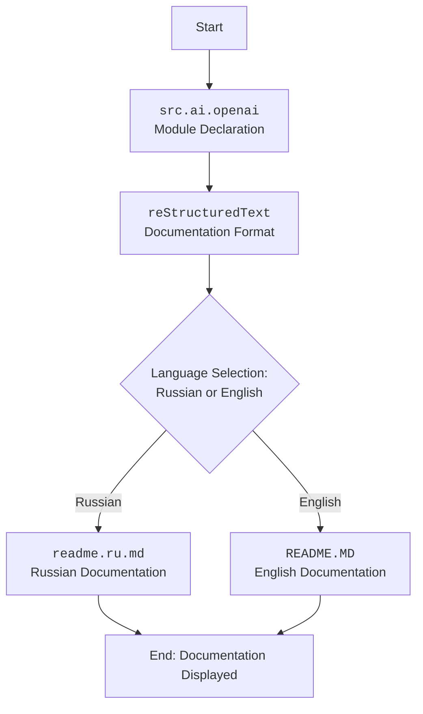

### Анализ кода проекта `hypotez`

=========================================================================================

**Расположение файла в проекте:** `hypotez/src/ai/openai/README.MD`

**Назначение:** Документация модуля `src.ai.openai`.

---

### 1. Блок-схема:

Описание рабочего процесса для модуля `src.ai.openai` на основе предоставленного кода:

1.  **Начало**:
    *   Пример: Загрузка документации модуля `src.ai.openai`.
2.  **Чтение документации**:
    *   Пример: Чтение текста в формате reStructuredText (`.rst`).
3.  **Выбор языка**:
    *   Пример: Переключение между английской и русской версиями документации.
4.  **Завершение**:
    *   Пример: Отображение документации.

```mermaid
graph TD
    A[Начало: Загрузка документации модуля src.ai.openai] --> B{Чтение документации: Чтение текста в формате reStructuredText (.rst)}
    B --> C{Выбор языка: Переключение между английской и русской версиями документации}
    C --> D[Завершение: Отображение документации]
```

### 2. Диаграмма:



**Объяснение диаграммы:**

*   **`src.ai.openai`**: Объявление модуля, описываемого в документации.
*   **`reStructuredText`**: Формат, в котором написана документация.
*   **`Language Selection`**: Блок выбора между русской и английской версиями документации.
*   **`readme.ru.md`**: Русская версия документации.
*   **`README.MD`**: Английская версия документации.
*   **`End`**: Завершение процесса, документация отображается.

### 3. Объяснение:

*   **`.. module:: src.ai.openai`**: Указывает, что данный reStructuredText документ относится к модулю `src.ai.openai`.
*   **`[Русский](https://github.com/hypo69/hypotez/blob/master/src/аи/readme.ru.md)`**: Ссылка на русскую версию документации, расположенную в репозитории GitHub.

**Импорты**:

*   В данном коде отсутствуют явные импорты. Однако, подразумевается, что для обработки reStructuredText и отображения документации могут использоваться различные библиотеки.

**Классы**:

*   В данном коде отсутствуют классы. Документация описывает модуль, а не конкретный класс.

**Функции**:

*   В данном коде отсутствуют функции. Документация описывает модуль, а не конкретную функцию.

**Переменные**:

*   В данном коде отсутствуют переменные. Документация описывает модуль, а не конкретную переменную.

**Потенциальные ошибки и области для улучшения**:

*   Отсутствуют. Документ является простым README файлом.

**Взаимосвязь с другими частями проекта**:

*   Данный модуль `src.ai.openai` вероятно связан с другими модулями в проекте `hypotez`, касающимися искусственного интеллекта.  Этот файл является отправной точкой для понимания функциональности этого модуля.