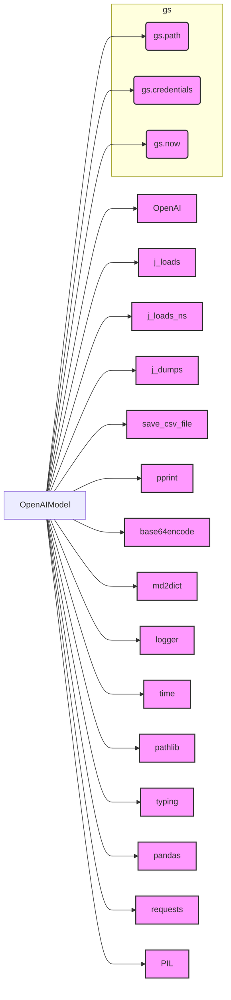

### **Системные инструкции для обработки кода проекта `hypotez`**

=========================================================================================

Описание функциональности и правил для генерации, анализа и улучшения кода. Направлено на обеспечение последовательного и читаемого стиля кодирования, соответствующего требованиям.

---

### **Основные принципы**

#### **1. Общие указания**:
- Соблюдай четкий и понятный стиль кодирования.
- Все изменения должны быть обоснованы и соответствовать установленным требованиям.

#### **2. Комментарии**:
- Используй `#` для внутренних комментариев.
- Документация всех функций, методов и классов должна следовать такому формату: 
    ```python
        def function(param: str, param1: Optional[str | dict | str] = None) -> dict | None:
            """ 
            Args:
                param (str): Описание параметра `param`.
                param1 (Optional[str | dict | str], optional): Описание параметра `param1`. По умолчанию `None`.
    
            Returns:
                dict | None: Описание возвращаемого значения. Возвращает словарь или `None`.
    
            Raises:
                SomeError: Описание ситуации, в которой возникает исключение `SomeError`.

            Ехаmple:
                >>> function('param', 'param1')
                {'param': 'param1'}
            """
    ```
- Комментарии и документация должны быть четкими, лаконичными и точными.

#### **3. Форматирование кода**:
- Используй одинарные кавычки. `a:str = 'value'`, `print('Hello World!')`;
- Добавляй пробелы вокруг операторов. Например, `x = 5`;
- Все параметры должны быть аннотированы типами. `def function(param: str, param1: Optional[str | dict | str] = None) -> dict | None:`;
- Не используй `Union`. Вместо этого используй `|`.

#### **4. Логирование**:
- Для логгирования Всегда Используй модуль `logger` из `src.logger.logger`.
- Ошибки должны логироваться с использованием `logger.error`.
Пример:
    ```python
        try:
            ...
        except Exception as ex:
            logger.error('Error while processing data', ех, exc_info=True)
    ```
#### **5 Не используй `Union[]` в коде. Вместо него используй `|`
Например:
```python
x: str | int ...
```


---

### **Основные требования**:

#### **1. Формат ответов в Markdown**:
- Все ответы должны быть выполнены в формате **Markdown**.

#### **2. Формат комментариев**:
- Используй указанный стиль для комментариев и документации в коде.
- Пример:

```python
from typing import Generator, Optional, List
from pathlib import Path


def read_text_file(
    file_path: str | Path,
    as_list: bool = False,
    extensions: Optional[List[str]] = None,
    chunk_size: int = 8192,
) -> Generator[str, None, None] | str | None:
    """
    Считывает содержимое файла (или файлов из каталога) с использованием генератора для экономии памяти.

    Args:
        file_path (str | Path): Путь к файлу или каталогу.
        as_list (bool): Если `True`, возвращает генератор строк.
        extensions (Optional[List[str]]): Список расширений файлов для чтения из каталога.
        chunk_size (int): Размер чанков для чтения файла в байтах.

    Returns:
        Generator[str, None, None] | str | None: Генератор строк, объединенная строка или `None` в случае ошибки.

    Raises:
        Exception: Если возникает ошибка при чтении файла.

    Example:
        >>> from pathlib import Path
        >>> file_path = Path('example.txt')
        >>> content = read_text_file(file_path)
        >>> if content:
        ...    print(f'File content: {content[:100]}...')
        File content: Example text...
    """
    ...
```
- Всегда делай подробные объяснения в комментариях. Избегай расплывчатых терминов, 
- таких как *«получить»* или *«делать»*. Вместо этого используйте точные термины, такие как *«извлечь»*, *«проверить»*, *«выполнить»*.
- Вместо: *«получаем»*, *«возвращаем»*, *«преобразовываем»* используй имя объекта *«функция получае»*, *«переменная возвращает»*, *«код преобразовывает»* 
- Комментарии должны непосредственно предшествовать описываемому блоку кода и объяснять его назначение.

#### **3. Пробелы вокруг операторов присваивания**:
- Всегда добавляйте пробелы вокруг оператора `=`, чтобы повысить читаемость.
- Примеры:
  - **Неправильно**: `x=5`
  - **Правильно**: `x = 5`

#### **4. Использование `j_loads` или `j_loads_ns`**:
- Для чтения JSON или конфигурационных файлов замените стандартное использование `open` и `json.load` на `j_loads` или `j_loads_ns`.
- Пример:

```python
# Неправильно:
with open('config.json', 'r', encoding='utf-8') as f:
    data = json.load(f)

# Правильно:
data = j_loads('config.json')
```

#### **5. Сохранение комментариев**:
- Все существующие комментарии, начинающиеся с `#`, должны быть сохранены без изменений в разделе «Улучшенный код».
- Если комментарий кажется устаревшим или неясным, не изменяйте его. Вместо этого отметьте его в разделе «Изменения».

#### **6. Обработка `...` в коде**:
- Оставляйте `...` как указатели в коде без изменений.
- Не документируйте строки с `...`.
```

#### **7. Аннотации**
Для всех переменных должны быть определены аннотации типа. 
Для всех функций все входные и выходные параметры аннотириваны
Для все параметров должны быть аннотации типа.


### **8. webdriver**
В коде используется webdriver. Он импртируется из модуля `webdriver` проекта `hypotez`
```python
from src.webdirver import Driver, Chrome, Firefox, Playwright, ...
driver = Driver(Firefox)

Пoсле чего может использоваться как

close_banner = {
  "attribute": null,
  "by": "XPATH",
  "selector": "//button[@id = 'closeXButton']",
  "if_list": "first",
  "use_mouse": false,
  "mandatory": false,
  "timeout": 0,
  "timeout_for_event": "presence_of_element_located",
  "event": "click()",
  "locator_description": "Закрываю pop-up окно, если оно не появилось - не страшно (`mandatory`:`false`)"
}

result = driver.execute_locator(close_banner)
```

### **Анализ кода `hypotez/src/ai/openai/model/training.py`**

#### **1. Блок-схема**

```mermaid
graph LR
    A[Начало] --> B{Инициализация OpenAIModel};
    B --> C{Загрузка моделей и ассистентов};
    C --> D{Определение тональности сообщения};
    D --> E{Отправка сообщения в OpenAI API};
    E --> F{Обработка ответа от OpenAI API};
    F --> G{Сохранение диалога};
    G --> H{Обучение модели};
    H --> I{Сохранение job ID};
    I --> J[Конец];

    subgraph Инициализация OpenAIModel
        B1[Создание OpenAI клиента]
        B2[Загрузка ассистента и thread]
        B --> B1
        B --> B2
        B1 --> C
        B2 --> C
    end

    subgraph Загрузка моделей и ассистентов
        C1[Получение списка моделей из OpenAI API]
        C2[Загрузка списка ассистентов из JSON файла]
        C --> C1
        C --> C2
        C1 --> D
        C2 --> D
    end

    subgraph Определение тональности сообщения
        D1[Анализ сообщения на наличие позитивных слов]
        D2[Анализ сообщения на наличие негативных слов]
        D3[Анализ сообщения на наличие нейтральных слов]
        D --> D1
        D --> D2
        D --> D3
        D1 --> E
        D2 --> E
        D3 --> E
    end

    subgraph Отправка сообщения в OpenAI API
        E1[Формирование запроса к OpenAI API]
        E2[Отправка запроса]
        E --> E1
        E --> E2
        E2 --> F
    end

    subgraph Обработка ответа от OpenAI API
        F1[Извлечение ответа из response]
        F2[Анализ тональности ответа]
        F --> F1
        F --> F2
        F1 --> G
        F2 --> G
    end

    subgraph Сохранение диалога
        G1[Добавление сообщений в диалог]
        G2[Сохранение диалога в JSON файл]
        G --> G1
        G --> G2
        G2 --> H
    end

    subgraph Обучение модели
        H1[Загрузка данных для обучения]
        H2[Отправка запроса на обучение в OpenAI API]
        H --> H1
        H --> H2
        H2 --> I
    end

    subgraph Сохранение job ID
        I1[Создание job data]
        I2[Сохранение job data в JSON файл]
        I --> I1
        I --> I2
        I2 --> J
    end
```



Пример для логических блоков:

- **Инициализация OpenAIModel**: `model = OpenAIModel(api_key="YOUR_API_KEY", system_instruction="You are a helpful assistant.")`
- **Загрузка моделей**: `models = model.list_models`
- **Отправка сообщения**: `response = model.ask("Hello, how are you?")`
- **Обучение модели**: `training_result = model.train(data_file="training_data.csv")`

#### **2. Диаграмма**



**Объяснение зависимостей:**

- `OpenAI`: Клиент для взаимодействия с OpenAI API. Используется для отправки запросов и получения ответов от модели.
- `j_loads`, `j_loads_ns`, `j_dumps`: Функции для работы с JSON файлами. Используются для загрузки и сохранения данных, таких как диалоги и job ID.
- `save_csv_file`: Функция для сохранения данных в CSV файл.
- `pprint`: Функция для красивого вывода данных.
- `base64encode`: Функция для кодирования изображений в формат Base64.
- `md2dict`: Функция для преобразования Markdown в словарь.
- `logger`: Модуль для логирования событий и ошибок.
- `gs_path`, `gs_credentials`, `gs_now`: Переменные, содержащие пути, учетные данные и текущее время из модуля `src.gs`.
- `time`: Модуль для работы со временем.
- `pathlib`: Модуль для работы с путями к файлам и каталогам.
- `typing`: Модуль для аннотации типов.
- `pandas`: Библиотека для работы с данными в формате таблиц.
- `requests`: Библиотека для выполнения HTTP-запросов.
- `PIL`: Библиотека для работы с изображениями.

#### **3. Объяснение**

**Импорты:**

- `time`: Используется для работы со временем, например, для задержек при повторных попытках отправки сообщения.
- `pathlib`: Используется для работы с путями к файлам и каталогам.
- `types.SimpleNamespace`: Используется для создания объектов, к которым можно обращаться по атрибутам.
- `typing`: Используется для аннотации типов, что улучшает читаемость и облегчает отладку кода.
- `pandas`: Используется для работы с данными в табличном формате, например, для чтения и обработки CSV файлов.
- `openai`: Используется для взаимодействия с OpenAI API.
- `requests`: Используется для отправки HTTP-запросов, например, для описания изображений.
- `PIL.Image`: Используется для работы с изображениями.
- `io.BytesIO`: Используется для работы с данными в памяти как с файлами.
- `src.gs`: Модуль, содержащий глобальные настройки проекта, такие как пути к файлам и учетные данные.
- `src.utils.jjson`: Модуль, содержащий функции для работы с JSON файлами.
- `src.utils.csv`: Модуль, содержащий функции для работы с CSV файлами.
- `src.utils.printer`: Модуль, содержащий функции для красивого вывода данных.
- `src.utils.convertors.base64`: Модуль, содержащий функции для кодирования данных в формат Base64.
- `src.utils.convertors.md`: Модуль, содержащий функции для преобразования Markdown в словарь.
- `src.logger.logger`: Модуль для логирования событий и ошибок.

**Классы:**

- `OpenAIModel`: Класс, представляющий модель OpenAI.
    - Атрибуты:
        - `model` (str): Имя используемой модели OpenAI.
        - `client` (OpenAI): Клиент для взаимодействия с OpenAI API.
        - `current_job_id` (str): ID текущей задачи обучения.
        - `assistant_id` (str): ID используемого ассистента OpenAI.
        - `assistant`: Объект ассистента OpenAI.
        - `thread`: Объект thread OpenAI.
        - `system_instruction` (str): Инструкция для модели.
        - `dialogue_log_path` (str | Path): Путь к файлу для сохранения диалога.
        - `dialogue` (List[Dict[str, str]]): Список сообщений в диалоге.
        - `assistants` (List[SimpleNamespace]): Список доступных ассистентов.
        - `models_list` (List[str]): Список доступных моделей.
    - Методы:
        - `__init__`: Инициализирует объект `OpenAIModel`, загружает ассистента и thread.
        - `list_models`: Возвращает список доступных моделей из OpenAI API.
        - `list_assistants`: Возвращает список доступных ассистентов из JSON файла.
        - `set_assistant`: Устанавливает ассистента по ID.
        - `_save_dialogue`: Сохраняет диалог в JSON файл.
        - `determine_sentiment`: Определяет тональность сообщения.
        - `ask`: Отправляет сообщение модели и возвращает ответ.
        - `describe_image`: Описывает изображение, используя OpenAI API.
        - `describe_image_by_requests`: Описывает изображение, используя HTTP-запросы.
        - `dynamic_train`: Динамически обучает модель на основе предыдущего диалога.
        - `train`: Обучает модель на основе предоставленных данных.
        - `save_job_id`: Сохраняет ID задачи обучения в файл.

**Функции:**

- `main`: Главная функция для демонстрации использования класса `OpenAIModel`.
    - Инициализирует модель.
    - Выводит список доступных моделей и ассистентов.
    - Отправляет сообщение модели и выводит ответ.
    - Выполняет динамическое обучение.
    - Обучает модель на основе данных из файла.
    - Сохраняет ID задачи обучения.

**Переменные:**

- `model` (OpenAIModel): Объект класса `OpenAIModel`, используемый для взаимодействия с OpenAI API.
- `models` (List[str]): Список доступных моделей.
- `assistants` (List[str]): Список доступных ассистентов.
- `user_input` (str): Ввод пользователя.
- `response` (str): Ответ модели.
- `training_result` (str): ID задачи обучения.
- `image_path` (Path): Путь к изображению.
- `description` (str): Описание изображения.

**Потенциальные ошибки и области для улучшения:**

- Обработка ошибок в методах `describe_image` и `describe_image_by_requests` неполная. В случае ошибки возвращается `None`, что может привести к проблемам в вызывающем коде.
- Метод `dynamic_train` использует фиксированный путь к файлу диалога. Следует сделать путь настраиваемым.
- В методе `train` отсутствует проверка наличия данных для обучения.
- Использование `try...except` блоков с общим исключением `Exception` может затруднить отладку. Следует использовать более конкретные типы исключений.
- В методе `ask` используется `time.sleep(3)` в случае ошибки. Следует использовать более гибкий механизм задержки.

**Взаимосвязи с другими частями проекта:**

- Класс `OpenAIModel` использует модуль `src.gs` для получения глобальных настроек проекта, таких как пути к файлам и учетные данные.
- Класс `OpenAIModel` использует модули `src.utils.jjson`, `src.utils.csv`, `src.utils.printer`, `src.utils.convertors.base64`, `src.utils.convertors.md` для работы с данными.
- Класс `OpenAIModel` использует модуль `src.logger.logger` для логирования событий и ошибок.