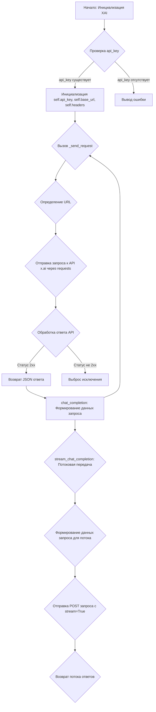
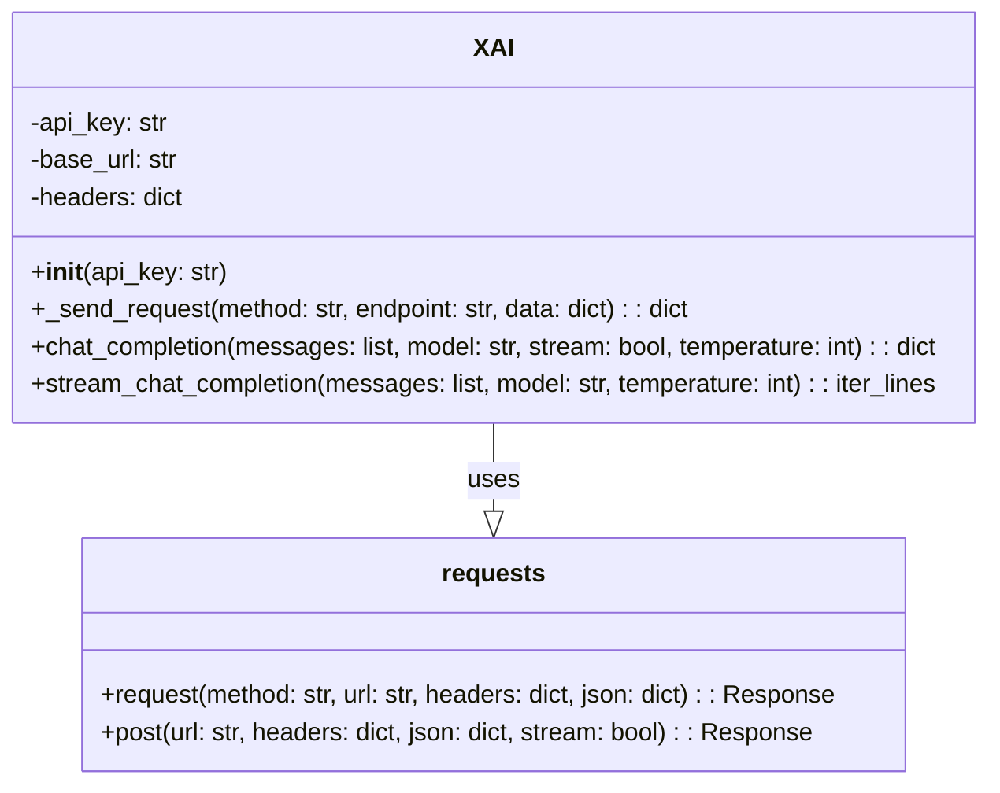

### **Системные инструкции для обработки кода проекта `hypotez`**

=========================================================================================

Описание функциональности и правил для генерации, анализа и улучшения кода. Направлено на обеспечение последовательного и читаемого стиля кодирования, соответствующего требованиям.

---

### **Основные принципы**

#### **1. Общие указания**:
- Соблюдай четкий и понятный стиль кодирования.
- Все изменения должны быть обоснованы и соответствовать установленным требованиям.

#### **2. Комментарии**:
- Используй `#` для внутренних комментариев.
- Документация всех функций, методов и классов должна следовать такому формату: 
    ```python
        def function(param: str, param1: Optional[str | dict | str] = None) -> dict | None:
            """ 
            Args:
                param (str): Описание параметра `param`.
                param1 (Optional[str | dict | str], optional): Описание параметра `param1`. По умолчанию `None`.
    
            Returns:
                dict | None: Описание возвращаемого значения. Возвращает словарь или `None`.
    
            Raises:
                SomeError: Описание ситуации, в которой возникает исключение `SomeError`.

            Ехаmple:
                >>> function('param', 'param1')
                {'param': 'param1'}
            """
    ```
- Комментарии и документация должны быть четкими, лаконичными и точными.

#### **3. Форматирование кода**:
- Используй одинарные кавычки. `a:str = 'value'`, `print('Hello World!')`;
- Добавляй пробелы вокруг операторов. Например, `x = 5`;
- Все параметры должны быть аннотированы типами. `def function(param: str, param1: Optional[str | dict | str] = None) -> dict | None:`;
- Не используй `Union`. Вместо этого используй `|`.

#### **4. Логирование**:
- Для логгирования Всегда Используй модуль `logger` из `src.logger.logger`.
- Ошибки должны логироваться с использованием `logger.error`.
Пример:
    ```python
        try:
            ...
        except Exception as ex:
            logger.error('Error while processing data', ех, exc_info=True)
    ```
#### **5 Не используй `Union[]` в коде. Вместо него используй `|`
Например:
```python
x: str | int ...
```


---

### **Основные требования**:

#### **1. Формат ответов в Markdown**:
- Все ответы должны быть выполнены в формате **Markdown**.

#### **2. Формат комментариев**:
- Используй указанный стиль для комментариев и документации в коде.
- Пример:

```python
from typing import Generator, Optional, List
from pathlib import Path


def read_text_file(
    file_path: str | Path,
    as_list: bool = False,
    extensions: Optional[List[str]] = None,
    chunk_size: int = 8192,
) -> Generator[str, None, None] | str | None:
    """
    Считывает содержимое файла (или файлов из каталога) с использованием генератора для экономии памяти.

    Args:
        file_path (str | Path): Путь к файлу или каталогу.
        as_list (bool): Если `True`, возвращает генератор строк.
        extensions (Optional[List[str]]): Список расширений файлов для чтения из каталога.
        chunk_size (int): Размер чанков для чтения файла в байтах.

    Returns:
        Generator[str, None, None] | str | None: Генератор строк, объединенная строка или `None` в случае ошибки.

    Raises:
        Exception: Если возникает ошибка при чтении файла.

    Example:
        >>> from pathlib import Path
        >>> file_path = Path('example.txt')
        >>> content = read_text_file(file_path)
        >>> if content:
        ...    print(f'File content: {content[:100]}...')
        File content: Example text...
    """
    ...
```
- Всегда делай подробные объяснения в комментариях. Избегай расплывчатых терминов, 
- таких как *«получить»* или *«делать»*
-  . Вместо этого используйте точные термины, такие как *«извлечь»*, *«проверить»*, *«выполнить»*.
- Вместо: *«получаем»*, *«возвращаем»*, *«преобразовываем»* используй имя объекта *«функция получае»*, *«переменная возвращает»*, *«код преобразовывает»* 
- Комментарии должны непосредственно предшествовать описываемому блоку кода и объяснять его назначение.

#### **3. Пробелы вокруг операторов присваивания**:
- Всегда добавляйте пробелы вокруг оператора `=`, чтобы повысить читаемость.
- Примеры:
  - **Неправильно**: `x=5`
  - **Правильно**: `x = 5`

#### **4. Использование `j_loads` или `j_loads_ns`**:
- Для чтения JSON или конфигурационных файлов замените стандартное использование `open` и `json.load` на `j_loads` или `j_loads_ns`.
- Пример:

```python
# Неправильно:
with open('config.json', 'r', encoding='utf-8') as f:
    data = json.load(f)

# Правильно:
data = j_loads('config.json')
```

#### **5. Сохранение комментариев**:
- Все существующие комментарии, начинающиеся с `#`, должны быть сохранены без изменений в разделе «Улучшенный код».
- Если комментарий кажется устаревшим или неясным, не изменяйте его. Вместо этого отметьте его в разделе «Изменения».

#### **6. Обработка `...` в коде**:
- Оставляйте `...` как указатели в коде без изменений.
- Не документируйте строки с `...`.
```

#### **7. Аннотации**
Для всех переменных должны быть определены аннотации типа. 
Для всех функций все входные и выходные параметры аннотириваны
Для все параметров должны быть аннотации типа.


### **8. webdriver**
В коде используется webdriver. Он импртируется из модуля `webdriver` проекта `hypotez`
```python
from src.webdirver import Driver, Chrome, Firefox, Playwright, ...
driver = Driver(Firefox)

Пoсле чего может использоваться как

close_banner = {
  "attribute": null,
  "by": "XPATH",
  "selector": "//button[@id = 'closeXButton']",
  "if_list": "first",
  "use_mouse": false,
  "mandatory": false,
  "timeout": 0,
  "timeout_for_event": "presence_of_element_located",
  "event": "click()",
  "locator_description": "Закрываю pop-up окно, если оно не появилось - не страшно (`mandatory`:`false`)"
}

result = driver.execute_locator(close_banner)
```

## Анализ кода `hypotez/src/ai/xai/grock.py`

### 1. Блок-схема



**Примеры для каждого логического блока:**

*   **A (Начало: Инициализация XAI)**:

    ```python
    xai = XAI(api_key="your_api_key_here")
    ```

*   **B (Проверка api\_key)**:

    ```python
    if not api_key:
        raise ValueError("API key is required")
    ```

*   **C (Инициализация self.api\_key, self.base\_url, self.headers)**:

    ```python
    self.api_key = api_key
    self.base_url = "https://api.x.ai/v1"
    self.headers = {
        "Authorization": f"Bearer {self.api_key}",
        "Content-Type": "application/json"
    }
    ```

*   **D (Вызов \_send\_request)**:

    ```python
    response = self._send_request(method="POST", endpoint="chat/completions", data={"messages": messages})
    ```

*   **F (Определение URL)**:

    ```python
    url = f"{self.base_url}/{endpoint}"
    ```

*   **G (Отправка запроса к API x.ai через requests)**:

    ```python
    response = requests.request(method, url, headers=self.headers, json=data)
    ```

*   **H (Обработка ответа API)**:

    ```python
    response.raise_for_status()  # Выбрасывает исключение, если статус ответа не 2xx
    ```

*   **I (Возврат JSON ответа)**:

    ```python
    return response.json()
    ```

*   **J (Выброс исключения)**:

    ```python
    raise requests.exceptions.HTTPError(f"HTTP error occurred: {response.status_code}")
    ```

*   **K (chat\_completion: Формирование данных запроса)**:

    ```python
    data = {
        "messages": messages,
        "model": model,
        "stream": stream,
        "temperature": temperature
    }
    ```

*   **L (stream\_chat\_completion: Потоковая передача)**:

    ```python
    response = self.stream_chat_completion(messages=messages)
    ```

*   **M (Формирование данных запроса для потока)**:

    ```python
    data = {
        "messages": messages,
        "model": model,
        "stream": True,
        "temperature": temperature
    }
    ```

*   **N (Отправка POST запроса с stream=True)**:

    ```python
    response = requests.post(url, headers=self.headers, json=data, stream=True)
    ```

*   **O (Возврат потока ответов)**:

    ```python
    return response.iter_lines(decode_unicode=True)
    ```

### 2. Диаграмма



**Объяснение зависимостей:**

*   **XAI**: Основной класс, который инкапсулирует логику взаимодействия с API x.ai.  Он содержит методы для инициализации, отправки запросов и получения ответов.
*   **requests**: Библиотека `requests` используется для отправки HTTP-запросов к API x.ai.  Метод `_send_request` использует `requests.request` для отправки запросов, а метод `stream_chat_completion` использует `requests.post` для потоковой передачи.

### 3. Объяснение

*   **Импорты**:
    *   `requests`: Используется для выполнения HTTP-запросов к API.
    *   `json`: Используется для обработки данных в формате JSON.
*   **Классы**:
    *   `XAI`:
        *   Роль: Инкапсулирует логику взаимодействия с API x.ai.
        *   Атрибуты:
            *   `api_key` (str): Ключ API для аутентификации.
            *   `base_url` (str): Базовый URL API.
            *   `headers` (dict): Заголовки HTTP-запроса, включающие ключ API и тип контента.
        *   Методы:
            *   `__init__(self, api_key: str)`: Инициализирует экземпляр класса `XAI` с ключом API.
            *   `_send_request(self, method: str, endpoint: str, data: dict = None)`: Отправляет HTTP-запрос к API и возвращает JSON-ответ.
                *   Аргументы:
                    *   `method` (str): HTTP-метод (GET, POST, PUT, DELETE).
                    *   `endpoint` (str): Конечная точка API.
                    *   `data` (dict, optional): Данные для отправки в теле запроса (для POST и PUT). По умолчанию `None`.
                *   Возвращаемое значение: JSON-ответ от API.
            *   `chat_completion(self, messages: list, model: str = "grok-beta", stream: bool = False, temperature: int = 0)`: Отправляет запрос на завершение чата и возвращает ответ.
                *   Аргументы:
                    *   `messages` (list): Список сообщений для чата.
                    *   `model` (str, optional): Модель для использования. По умолчанию `"grok-beta"`.
                    *   `stream` (bool, optional): Флаг для включения потоковой передачи. По умолчанию `False`.
                    *   `temperature` (int, optional): Температура для генерации ответа. По умолчанию `0`.
                *   Возвращаемое значение: Ответ от API в формате JSON.
            *   `stream_chat_completion(self, messages: list, model: str = "grok-beta", temperature: int = 0)`: Отправляет запрос на завершение чата с потоковой передачей и возвращает поток ответов.
                *   Аргументы:
                    *   `messages` (list): Список сообщений для чата.
                    *   `model` (str, optional): Модель для использования. По умолчанию `"grok-beta"`.
                    *   `temperature` (int, optional): Температура для генерации ответа. По умолчанию `0`.
                *   Возвращаемое значение: Поток ответов от API.
*   **Функции**:
    *   В данном коде нет отдельных функций, кроме методов класса `XAI`.
*   **Переменные**:
    *   `api_key` (str): Ключ API для аутентификации.
    *   `base_url` (str): Базовый URL API.
    *   `headers` (dict): Заголовки HTTP-запроса, включающие ключ API и тип контента.
    *   `messages` (list): Список сообщений для чата.
    *   `model` (str): Модель для использования.
    *   `stream` (bool): Флаг для включения потоковой передачи.
    *   `temperature` (int): Температура для генерации ответа.
    *   `response` (requests.Response): Ответ от API.
    *   `line` (str): Строка из потока ответов.

**Потенциальные ошибки и области для улучшения:**

1.  **Обработка ошибок**: В методе `_send_request` выбрасывается исключение `response.raise_for_status()`, если статус ответа не 2xx.  Однако, можно добавить более детальную обработку исключений, чтобы регистрировать ошибки и возвращать более информативные сообщения об ошибках.  В `stream_chat_completion` такая обработка отсутствует.
2.  **Логирование**: Отсутствует логирование запросов и ответов API.  Добавление логирования может помочь в отладке и мониторинге работы API. Необходимо использовать `logger` из `src.logger.logger`.
3.  **Безопасность**: Ключ API передается в заголовке `Authorization`.  Следует рассмотреть возможность использования более безопасных способов аутентификации, если это возможно.
4.  **Валидация входных данных**: Отсутствует валидация входных данных, таких как `messages`, `model`, `temperature`.  Добавление валидации может помочь предотвратить ошибки и повысить надежность кода.

**Цепочка взаимосвязей с другими частями проекта:**

*   Данный модуль `grock.py` находится в директории `src/ai/xai`.  Это предполагает, что он является частью подсистемы искусственного интеллекта (AI) и отвечает за взаимодействие с внешним API XAI (Explainable AI).
*   Модуль может использоваться другими частями проекта, например, для получения объяснений по поводу решений, принимаемых другими AI-моделями.
*   В данном коде отсутствует явная связь с другими модулями проекта `hypotez`. Однако, можно предположить, что он может использоваться совместно с другими модулями для реализации более сложных сценариев AI.  Например, модуль `grock.py` может использоваться для получения объяснений по поводу решений, принимаемых другими AI-моделями, реализованными в других модулях проекта.