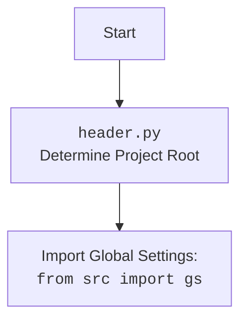

### **Системные инструкции для обработки кода проекта `hypotez`**

=========================================================================================

Описание функциональности и правил для генерации, анализа и улучшения кода. Направлено на обеспечение последовательного и читаемого стиля кодирования, соответствующего требованиям.

---

### **Основные принципы**

#### **1. Общие указания**:
- Соблюдай четкий и понятный стиль кодирования.
- Все изменения должны быть обоснованы и соответствовать установленным требованиям.

#### **2. Комментарии**:
- Используй `#` для внутренних комментариев.
- Документация всех функций, методов и классов должна следовать такому формату: 
    ```python
        def function(param: str, param1: Optional[str | dict | str] = None) -> dict | None:
            """ 
            Args:
                param (str): Описание параметра `param`.
                param1 (Optional[str | dict | str], optional): Описание параметра `param1`. По умолчанию `None`.
    
            Returns:
                dict | None: Описание возвращаемого значения. Возвращает словарь или `None`.
    
            Raises:
                SomeError: Описание ситуации, в которой возникает исключение `SomeError`.

            Ехаmple:
                >>> function('param', 'param1')
                {'param': 'param1'}
            """
    ```
- Комментарии и документация должны быть четкими, лаконичными и точными.

#### **3. Форматирование кода**:
- Используй одинарные кавычки. `a:str = 'value'`, `print('Hello World!')`;
- Добавляй пробелы вокруг операторов. Например, `x = 5`;
- Все параметры должны быть аннотированы типами. `def function(param: str, param1: Optional[str | dict | str] = None) -> dict | None:`;
- Не используй `Union`. Вместо этого используй `|`.

#### **4. Логирование**:
- Для логгирования Всегда Используй модуль `logger` из `src.logger.logger`.
- Ошибки должны логироваться с использованием `logger.error`.
Пример:
    ```python
        try:
            ...
        except Exception as ex:
            logger.error('Error while processing data', ех, exc_info=True)
    ```
#### **5 Не используй `Union[]` в коде. Вместо него используй `|`
Например:
```python
x: str | int ...
```


---

### **Основные требования**:

#### **1. Формат ответов в Markdown**:
- Все ответы должны быть выполнены в формате **Markdown**.

#### **2. Формат комментариев**:
- Используй указанный стиль для комментариев и документации в коде.
- Пример:

```python
from typing import Generator, Optional, List
from pathlib import Path


def read_text_file(
    file_path: str | Path,
    as_list: bool = False,
    extensions: Optional[List[str]] = None,
    chunk_size: int = 8192,
) -> Generator[str, None, None] | str | None:
    """
    Считывает содержимое файла (или файлов из каталога) с использованием генератора для экономии памяти.

    Args:
        file_path (str | Path): Путь к файлу или каталогу.
        as_list (bool): Если `True`, возвращает генератор строк.
        extensions (Optional[List[str]]): Список расширений файлов для чтения из каталога.
        chunk_size (int): Размер чанков для чтения файла в байтах.

    Returns:
        Generator[str, None, None] | str | None: Генератор строк, объединенная строка или `None` в случае ошибки.

    Raises:
        Exception: Если возникает ошибка при чтении файла.

    Example:
        >>> from pathlib import Path
        >>> file_path = Path('example.txt')
        >>> content = read_text_file(file_path)
        >>> if content:
        ...    print(f'File content: {content[:100]}...')
        File content: Example text...
    """
    ...
```
- Всегда делай подробные объяснения в комментариях. Избегай расплывчатых терминов, 
- таких как *«получить»* или *«делать»*. Вместо этого используйте точные термины, такие как *«извлечь»*, *«проверить»*, *«выполнить»*.
- Вместо: *«получаем»*, *«возвращаем»*, *«преобразовываем»* используй имя объекта *«функция получае»*, *«переменная возвращает»*, *«код преобразовывает»* 
- Комментарии должны непосредственно предшествовать описываемому блоку кода и объяснять его назначение.

#### **3. Пробелы вокруг операторов присваивания**:
- Всегда добавляйте пробелы вокруг оператора `=`, чтобы повысить читаемость.
- Примеры:
  - **Неправильно**: `x=5`
  - **Правильно**: `x = 5`

#### **4. Использование `j_loads` или `j_loads_ns`**:
- Для чтения JSON или конфигурационных файлов замените стандартное использование `open` и `json.load` на `j_loads` или `j_loads_ns`.
- Пример:

```python
# Неправильно:
with open('config.json', 'r', encoding='utf-8') as f:
    data = json.load(f)

# Правильно:
data = j_loads('config.json')
```

#### **5. Сохранение комментариев**:
- Все существующие комментарии, начинающиеся с `#`, должны быть сохранены без изменений в разделе «Улучшенный код».
- Если комментарий кажется устаревшим или неясным, не изменяйте его. Вместо этого отметьте его в разделе «Изменения».

#### **6. Обработка `...` в коде**:
- Оставляйте `...` как указатели в коде без изменений.
- Не документируйте строки с `...`.
```

#### **7. Аннотации**
Для всех переменных должны быть определены аннотации типа. 
Для всех функций все входные и выходные параметры аннотириваны
Для все параметров должны быть аннотации типа.


### **8. webdriver**
В коде используется webdriver. Он импртируется из модуля `webdriver` проекта `hypotez`
```python
from src.webdirver import Driver, Chrome, Firefox, Playwright, ...
driver = Driver(Firefox)

Пoсле чего может использоваться как

close_banner = {
  "attribute": null,
  "by": "XPATH",
  "selector": "//button[@id = 'closeXButton']",
  "if_list": "first",
  "use_mouse": false,
  "mandatory": false,
  "timeout": 0,
  "timeout_for_event": "presence_of_element_located",
  "event": "click()",
  "locator_description": "Закрываю pop-up окно, если оно не появилось - не страшно (`mandatory`:`false`)"
}

result = driver.execute_locator(close_banner)
```

## Анализ кода `hypotez/src/endpoints/advertisement/facebook/start_posting_my_groups.py`

### 1. Блок-схема

```mermaid
graph TD
    A[Начало: Инициализация] --> B{Импорт модулей: header, copy, Driver, Chrome, FacebookPromoter, logger};
    B --> C[Инициализация веб-драйвера: d = Driver(Chrome)];
    C --> D[Открытие Facebook: d.get_url("https://facebook.com")];
    D --> E{Определение списка файлов с группами: filenames = ['my_managed_groups.json']};
    E --> F{Определение списка кампаний: campaigns = ['brands', 'mom_and_baby', ..., 'man']};
    F --> G[Инициализация промоутера: promoter = FacebookPromoter(d, filenames, True)];
    G --> H{Цикл: while True};
    H --> I[Запуск кампаний: promoter.run_campaigns(copy.copy(campaigns), filenames)];
    I --> J{Обработка прерывания: KeyboardInterrupt};
    J -- Прерывание --> K[Логирование прерывания: logger.info("Campaign promotion interrupted.")];
    J -- Нет прерывания --> H;
```

**Примеры для логических блоков:**

*   **A (Начало: Инициализация)**: Код начинает работу с инициализации необходимых компонентов.
*   **B (Импорт модулей)**: Импортируются библиотеки и модули, такие как `header`, `copy`, `Driver`, `Chrome`, `FacebookPromoter` и `logger`. Это нужно для функционирования скрипта.
*   **C (Инициализация веб-драйвера)**: Создается экземпляр веб-драйвера `Chrome`, который будет использоваться для управления браузером.
*   **D (Открытие Facebook)**: Веб-драйвер открывает страницу Facebook.
*   **E (Определение списка файлов с группами)**: Задается список JSON-файлов, содержащих информацию о группах для постинга.
*   **F (Определение списка кампаний)**: Задается список названий рекламных кампаний.
*   **G (Инициализация промоутера)**: Создается объект `FacebookPromoter`, который будет заниматься продвижением объявлений в группах.
*   **H (Цикл: while True)**: Запускается бесконечный цикл, в котором происходит продвижение.
*   **I (Запуск кампаний)**: Вызывается метод `run_campaigns` объекта `promoter` для запуска рекламных кампаний.
*   **J (Обработка прерывания)**: Обрабатывается прерывание с клавиатуры (Ctrl+C), чтобы остановить выполнение скрипта.
*   **K (Логирование прерывания)**: При получении прерывания в лог записывается сообщение о том, что продвижение кампании прервано.

### 2. Диаграмма

```mermaid
flowchart TD
    A[start_posting_my_groups.py] --> B(header.py);
    A --> C(copy);
    A --> D(src.webdriver.driver.py);
    A --> E(src.endpoints.advertisement.facebook.promoter.py);
    A --> F(src.logger.logger.py);

    B --> G[gs (global settings)];
    D --> H[Driver, Chrome];
    E --> I[FacebookPromoter];
    F --> J[logger];
```

**Объяснение зависимостей:**

*   `start_posting_my_groups.py` зависит от:
    *   `header.py`: для определения корневого каталога проекта и импорта глобальных настроек.
    *   `copy`: для создания копий списков кампаний.
    *   `src.webdriver.driver.py`: для управления веб-драйвером (браузером).
    *   `src.endpoints.advertisement.facebook.promoter.py`: для логики продвижения объявлений в Facebook.
    *   `src.logger.logger.py`: для ведения журнала работы скрипта.
*   `header.py` импортирует `gs` (global settings) из `src`.
*   `src.webdriver.driver.py` предоставляет классы `Driver` и `Chrome` для управления браузером.
*   `src.endpoints.advertisement.facebook.promoter.py` содержит класс `FacebookPromoter`, который реализует логику продвижения объявлений.
*   `src.logger.logger.py` предоставляет объект `logger` для ведения журнала работы скрипта.



### 3. Объяснение

*   **Импорты:**
    *   `header`: Определяет корневой каталог проекта.
    *   `copy`: Используется для создания копии списка `campaigns`, чтобы избежать изменения исходного списка.
    *   `src.webdriver.driver.Driver`, `src.webdriver.driver.Chrome`: Импортируются классы для управления веб-драйвером Chrome. Класс `Driver` является базовым классом для веб-драйверов, а `Chrome` - его реализация для браузера Chrome.
    *   `src.endpoints.advertisement.facebook.promoter.FacebookPromoter`: Импортируется класс `FacebookPromoter`, который содержит логику для автоматизации процесса публикации рекламных объявлений в группах Facebook.
    *   `src.logger.logger.logger`: Импортируется объект `logger` для логирования событий и ошибок в процессе выполнения скрипта.

*   **Классы:**
    *   `FacebookPromoter`: Класс, отвечающий за продвижение объявлений в Facebook группах.
        *   Атрибуты:
            *   Принимает объект веб-драйвера (`d`), список путей к файлам с информацией о группах (`group_file_paths`), флаг отключения видео (`no_video`).
        *   Методы:
            *   `run_campaigns`: Запускает рекламные кампании, публикуя объявления в группах.
    *   `Driver`, `Chrome`: Классы из модуля `src.webdriver.driver`, используемые для управления браузером Chrome.
        *   `Driver`: Базовый класс для веб-драйверов.
        *   `Chrome`: Реализация веб-драйвера для браузера Chrome.

*   **Функции:**
    *   `FacebookPromoter.run_campaigns(campaigns: list, group_file_paths: list)`:
        *   Аргументы:
            *   `campaigns` (list): Список кампаний для запуска.
            *   `group_file_paths` (list): Список файлов с информацией о группах.
        *   Возвращаемое значение: `None`.
        *   Назначение: Запускает процесс публикации объявлений для каждой кампании в указанных группах.

*   **Переменные:**
    *   `d`: Объект класса `Driver(Chrome)`, представляющий веб-драйвер Chrome.
    *   `filenames` (list): Список имен файлов, содержащих информацию о группах, в которых будет размещаться реклама.
    *   `campaigns` (list): Список кампаний, которые будут запущены.
    *   `promoter`: Объект класса `FacebookPromoter`, который будет управлять процессом продвижения.

**Потенциальные ошибки и области для улучшения:**

*   Обработка исключений: Кроме `KeyboardInterrupt`, не обрабатываются другие возможные исключения, которые могут возникнуть в процессе выполнения скрипта (например, ошибки веб-драйвера, сетевые ошибки и т.д.).  Рекомендуется добавить более детальную обработку исключений с использованием `try...except` блоков и логированием ошибок с помощью `logger.error`.
*   Бесконечный цикл:  Цикл `while True` может привести к нежелательному поведению, если не будет предусмотрен механизм остановки или завершения работы скрипта.  Рекомендуется добавить условие для выхода из цикла или механизм автоматической остановки после выполнения определенного количества итераций.

**Цепочка взаимосвязей с другими частями проекта:**

1.  Скрипт `start_posting_my_groups.py` использует `FacebookPromoter` для продвижения объявлений.
2.  `FacebookPromoter` использует `src.webdriver.driver.Driver` и `src.webdriver.driver.Chrome` для управления браузером.
3.  `header` используется для определения корневого каталога проекта.
4.  `logger` используется для ведения журнала работы скрипта.