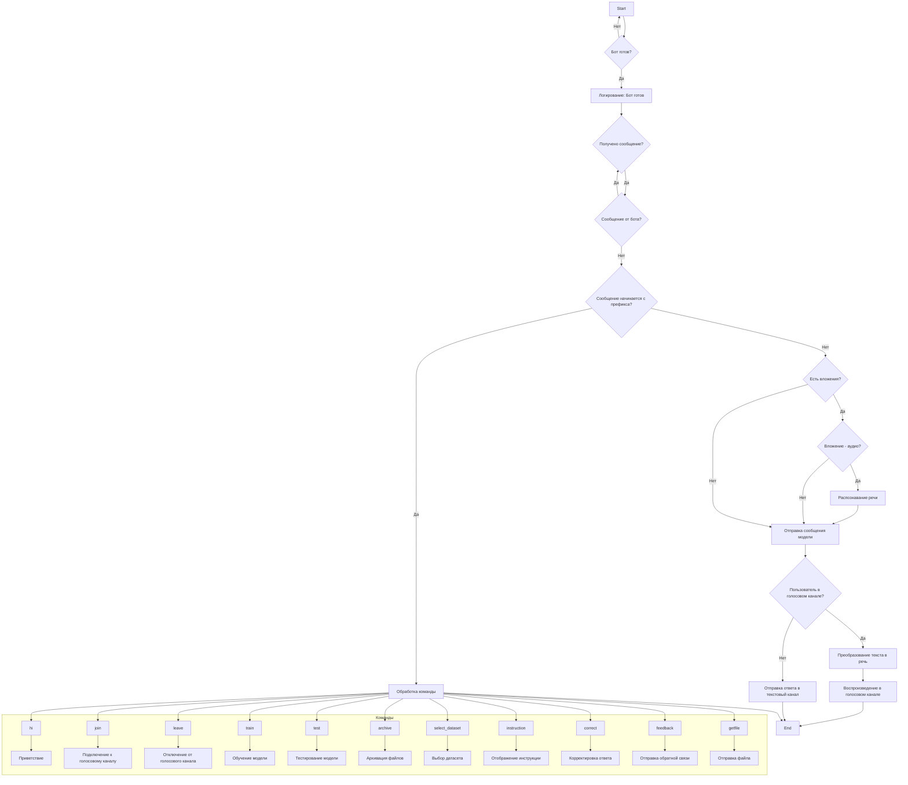
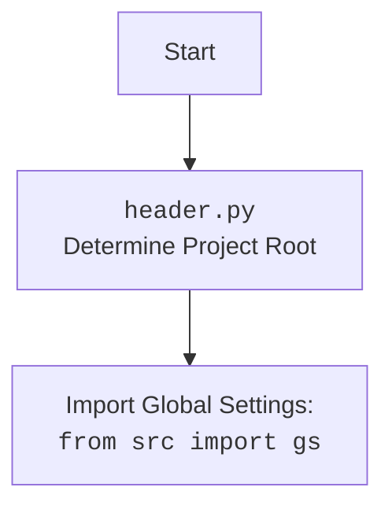

### **Системные инструкции для обработки кода проекта `hypotez`**

=========================================================================================

Описание функциональности и правил для генерации, анализа и улучшения кода. Направлено на обеспечение последовательного и читаемого стиля кодирования, соответствующего требованиям.

---

### **Основные принципы**

#### **1. Общие указания**:
- Соблюдай четкий и понятный стиль кодирования.
- Все изменения должны быть обоснованы и соответствовать установленным требованиям.

#### **2. Комментарии**:
- Используй `#` для внутренних комментариев.
- Документация всех функций, методов и классов должна следовать такому формату: 
    ```python
        def function(param: str, param1: Optional[str | dict | str] = None) -> dict | None:
            """ 
            Args:
                param (str): Описание параметра `param`.
                param1 (Optional[str | dict | str], optional): Описание параметра `param1`. По умолчанию `None`.
    
            Returns:
                dict | None: Описание возвращаемого значения. Возвращает словарь или `None`.
    
            Raises:
                SomeError: Описание ситуации, в которой возникает исключение `SomeError`.

            Ехаmple:
                >>> function('param', 'param1')
                {'param': 'param1'}
            """
    ```
- Комментарии и документация должны быть четкими, лаконичными и точными.

#### **3. Форматирование кода**:
- Используй одинарные кавычки. `a:str = 'value'`, `print('Hello World!')`;
- Добавляй пробелы вокруг операторов. Например, `x = 5`;
- Все параметры должны быть аннотированы типами. `def function(param: str, param1: Optional[str | dict | str] = None) -> dict | None:`;
- Не используй `Union`. Вместо этого используй `|`.

#### **4. Логирование**:
- Для логгирования Всегда Используй модуль `logger` из `src.logger.logger`.
- Ошибки должны логироваться с использованием `logger.error`.
Пример:
    ```python
        try:
            ...
        except Exception as ex:
            logger.error('Error while processing data', ех, exc_info=True)
    ```
#### **5 Не используй `Union[]` в коде. Вместо него используй `|`
Например:
```python
x: str | int ...
```


---

### **Основные требования**:

#### **1. Формат ответов в Markdown**:
- Все ответы должны быть выполнены в формате **Markdown**.

#### **2. Формат комментариев**:
- Используй указанный стиль для комментариев и документации в коде.
- Пример:

```python
from typing import Generator, Optional, List
from pathlib import Path


def read_text_file(
    file_path: str | Path,
    as_list: bool = False,
    extensions: Optional[List[str]] = None,
    chunk_size: int = 8192,
) -> Generator[str, None, None] | str | None:
    """
    Считывает содержимое файла (или файлов из каталога) с использованием генератора для экономии памяти.

    Args:
        file_path (str | Path): Путь к файлу или каталогу.
        as_list (bool): Если `True`, возвращает генератор строк.
        extensions (Optional[List[str]]): Список расширений файлов для чтения из каталога.
        chunk_size (int): Размер чанков для чтения файла в байтах.

    Returns:
        Generator[str, None, None] | str | None: Генератор строк, объединенная строка или `None` в случае ошибки.

    Raises:
        Exception: Если возникает ошибка при чтении файла.

    Example:
        >>> from pathlib import Path
        >>> file_path = Path('example.txt')
        >>> content = read_text_file(file_path)
        >>> if content:
        ...    print(f'File content: {content[:100]}...')
        File content: Example text...
    """
    ...
```
- Всегда делай подробные объяснения в комментариях. Избегай расплывчатых терминов, 
- таких как *«получить»* или *«делать»*. Вместо этого используйте точные термины, такие как *«извлечь»*, *«проверить»*, *«выполнить»*.
- Вместо: *«получаем»*, *«возвращаем»*, *«преобразовываем»* используй имя объекта *«функция получае»*, *«переменная возвращает»*, *«код преобразовывает»* 
- Комментарии должны непосредственно предшествовать описываемому блоку кода и объяснять его назначение.

#### **3. Пробелы вокруг операторов присваивания**:
- Всегда добавляйте пробелы вокруг оператора `=`, чтобы повысить читаемость.
- Примеры:
  - **Неправильно**: `x=5`
  - **Правильно**: `x = 5`

#### **4. Использование `j_loads` или `j_loads_ns`**:
- Для чтения JSON или конфигурационных файлов замените стандартное использование `open` и `json.load` на `j_loads` или `j_loads_ns`.
- Пример:

```python
# Неправильно:
with open('config.json', 'r', encoding='utf-8') as f:
    data = json.load(f)

# Правильно:
data = j_loads('config.json')
```

#### **5. Сохранение комментариев**:
- Все существующие комментарии, начинающиеся с `#`, должны быть сохранены без изменений в разделе «Улучшенный код».
- Если комментарий кажется устаревшим или неясным, не изменяйте его. Вместо этого отметьте его в разделе «Изменения».

#### **6. Обработка `...` в коде**:
- Оставляйте `...` как указатели в коде без изменений.
- Не документируйте строки с `...`.
```

#### **7. Аннотации**
Для всех переменных должны быть определены аннотации типа. 
Для всех функций все входные и выходные параметры аннотириваны
Для все параметров должны быть аннотации типа.


### **8. webdriver**
В коде используется webdriver. Он импртируется из модуля `webdriver` проекта `hypotez`
```python
from src.webdirver import Driver, Chrome, Firefox, Playwright, ...
driver = Driver(Firefox)

Пoсле чего может использоваться как

close_banner = {
  "attribute": null,
  "by": "XPATH",
  "selector": "//button[@id = 'closeXButton']",
  "if_list": "first",
  "use_mouse": false,
  "mandatory": false,
  "timeout": 0,
  "timeout_for_event": "presence_of_element_located",
  "event": "click()",
  "locator_description": "Закрываю pop-up окно, если оно не появилось - не страшно (`mandatory`:`false`)"
}

result = driver.execute_locator(close_banner)
```

## Анализ кода `discord_bot_trainger.py`

### 1. Блок-схема



### 2. Диаграмма

```mermaid
flowchart TD
    A[<code>discord_bot_trainer.py</code>] --> B(discord);
    A --> C(discord.ext.commands);
    A --> D(pathlib.Path);
    A --> E(tempfile);
    A --> F(asyncio);
    A --> G(header);
    A --> H(src.gs);
    A --> I(src.ai.openai.model.training.Model);
    A --> J(src.utils.jjson);
    A --> K(src.logger.logger);
    A --> L(speech_recognition);
    A --> M(requests);
    A --> N(pydub.AudioSegment);
    A --> O(gtts.gTTS);
    A --> P(src.endpoints.bots.discord.chatterbox);
    style A fill:#f9f,stroke:#333,stroke-width:2px
    
    subgraph src.utils
    J --> J1(src.utils.jjson.j_loads_ns);
    J --> J2(src.utils.jjson.j_dumps);
    end
    
    subgraph src.ai.openai.model
    I --> I1(src.ai.openai.model.training.train);
    I --> I2(src.ai.openai.model.training.predict);
    I --> I3(src.ai.openai.model.training.handle_errors);
    end
    
    subgraph src.logger
    K --> K1(src.logger.logger.logger);
    end
    
    subgraph src
    H --> H1(src.gs.path.bin);
    H --> H2(src.gs.credentials.discord.bot_token);
    end
```



**Объяснение зависимостей:**

-   **discord**: Основная библиотека для работы с Discord API. Позволяет создавать ботов, управлять каналами, сообщениями и т.д.
-   **discord.ext.commands**: Расширение для библиотеки discord, упрощающее создание команд для бота.
-   **pathlib.Path**: Модуль для работы с путями к файлам и директориям.
-   **tempfile**: Модуль для создания временных файлов и директорий.
-   **asyncio**: Модуль для асинхронного программирования.
-   **header**: Пользовательский модуль, вероятно, содержащий общие настройки проекта. (Требуется дополнительный анализ `header.py`).
-   **src.gs**: Пользовательский модуль, вероятно, содержащий глобальные настройки и переменные проекта.
    -   **src.gs.path.bin**: Переменная, содержащая путь к директории с бинарными файлами.
    -   **src.gs.credentials.discord.bot_token**: Переменная, содержащая токен Discord бота.
-   **src.ai.openai.model.training.Model**: Класс для работы с моделью машинного обучения OpenAI.
    -   **src.ai.openai.model.training.train**: Метод для обучения модели.
    -   **src.ai.openai.model.training.predict**: Метод для получения предсказаний от модели.
    -   **src.ai.openai.model.training.handle\_errors**: Метод для обработки ошибок, связанных с моделью.
-   **src.utils.jjson**: Пользовательский модуль для работы с JSON.
    -   **src.utils.jjson.j\_loads\_ns**: Функция для загрузки JSON из файла с обработкой namespace.
    -   **src.utils.jjson.j\_dumps**: Функция для преобразования данных в JSON строку.
-   **src.logger.logger**: Пользовательский модуль для логирования.
    -   **src.logger.logger.logger**: Объект logger для записи логов.
-   **speech\_recognition**: Библиотека для распознавания речи.
-   **requests**: Библиотека для выполнения HTTP запросов (например, для скачивания файлов).
-   **pydub.AudioSegment**: Класс для работы с аудио файлами.
-   **gtts.gTTS**: Класс для преобразования текста в речь.
-   **src.endpoints.bots.discord.chatterbox**: Пользовательский модуль, вероятно, содержащий логику для обработки сообщений бота.



### 3. Объяснение

#### Импорты:

*   `discord`: Библиотека для создания Discord ботов.
*   `discord.ext.commands`: Расширение для `discord`, упрощающее создание команд.
*   `pathlib.Path`: Для работы с путями файлов.
*   `tempfile`: Для создания временных файлов.
*   `asyncio`: Для асинхронного программирования.
*   `header`: Пользовательский модуль (требуется дополнительный анализ). Вероятно, определяет корень проекта.
*   `src.gs`: Пользовательский модуль, содержащий глобальные настройки (например, пути, credentials).
*   `src.ai.openai.model.training.Model`: Класс для обучения и использования модели OpenAI.
*   `src.utils.jjson`: Модуль для работы с JSON файлами.
*   `src.logger.logger`: Модуль для логирования.
*   `speech_recognition`: Библиотека для распознавания речи.
*   `requests`: Библиотека для выполнения HTTP запросов.
*   `pydub.AudioSegment`: Библиотека для работы с аудио.
*   `gtts.gTTS`: Библиотека для преобразования текста в речь.
*   `src.endpoints.bots.discord.chatterbox`: Модуль, возможно, содержащий вспомогательные функции для бота.

#### Классы:

*   `commands.Bot`: Основной класс для создания Discord бота. Атрибуты: `command_prefix` (префикс для команд), `intents` (права доступа бота).
*   `Model`: Класс для работы с моделью машинного обучения OpenAI (из `src.ai.openai.model.training`).

#### Функции:

*   `on_ready()`: Асинхронная функция, вызываемая при готовности бота. Логирует сообщение о готовности.
*   `hi(ctx)`: Асинхронная функция, команда для приветствия. Отправляет "HI!" в канал.
    *   `ctx`: Контекст команды (информация об отправителе, канале и т.д.).
*   `join(ctx)`: Асинхронная функция, команда для подключения бота к голосовому каналу.
    *   Если автор команды находится в голосовом канале, бот подключается к нему.
*   `leave(ctx)`: Асинхронная функция, команда для отключения бота от голосового канала.
    *   Если бот находится в голосовом канале, он отключается от него.
*   `train(ctx, data=None, data_dir=None, positive=True, attachment=None)`: Асинхронная функция, команда для обучения модели.
    *   `data`: Данные для обучения (строка или путь к файлу).
    *   `data_dir`: Директория с данными для обучения.
    *   `positive`: Флаг, указывающий, являются ли данные положительными примерами.
    *   `attachment`: Приложенный файл с данными.
    *   Сохраняет приложенный файл во временную директорию `/tmp/`.
    *   Вызывает метод `model.train()` для запуска обучения.
    *   Сохраняет `job_id` обучения.
*   `test(ctx, test_data)`: Асинхронная функция, команда для тестирования модели.
    *   `test_data`: Данные для тестирования (JSON строка).
    *   Вызывает метод `model.predict()` для получения предсказаний.
    *   Обрабатывает ошибки с помощью `model.handle_errors()`.
*   `archive(ctx, directory)`: Асинхронная функция, команда для архивации файлов в директории.
    *   `directory`: Директория для архивации.
    *   Вызывает метод `model.archive_files()`.
*   `select_dataset(ctx, path_to_dir_positive, positive=True)`: Асинхронная функция, команда для выбора датасета для обучения.
    *   `path_to_dir_positive`: Путь к директории с положительными примерами.
    *   `positive`: Флаг, указывающий, являются ли примеры положительными.
    *   Вызывает метод `model.select_dataset_and_archive()`.
*   `instruction(ctx)`: Асинхронная функция, команда для отображения инструкции из файла `_docs/bot_instruction.md`.
*   `correct(ctx, message_id, *, correction)`: Асинхронная функция, команда для корректировки предыдущего ответа бота.
    *   `message_id`: ID сообщения для корректировки.
    *   `correction`: Текст корректировки.
    *   Вызывает функцию `store_correction()`.
*   `store_correction(original_text, correction)`: Функция для сохранения корректировки в файл `corrections_log.txt`.
*   `feedback(ctx, *, feedback_text)`: Асинхронная функция, команда для отправки обратной связи.
    *   `feedback_text`: Текст обратной связи.
    *   Вызывает функцию `store_correction()`.
*   `getfile(ctx, file_path)`: Асинхронная функция, команда для отправки файла из указанного пути.
*   `text_to_speech_and_play(text, channel)`: Асинхронная функция для преобразования текста в речь и воспроизведения в голосовом канале.
    *   Использует `gTTS` для преобразования текста в речь.
    *   Использует `discord.FFmpegPCMAudio` для воспроизведения аудио.
*   `on_message(message)`: Асинхронная функция, вызываемая при получении сообщения.
    *   Обрабатывает команды, голосовые сообщения и текстовые сообщения.
    *   Использует `recognizer()` (закомментирована) для распознавания речи из голосовых сообщений.
    *   Использует `model.send_message()` для получения ответа от модели.

#### Переменные:

*   `PREFIX`: Префикс для команд бота (`!`).
*   `intents`: Объект `discord.Intents`, определяющий права доступа бота.
*   `bot`: Объект `commands.Bot`, представляющий Discord бота.
*   `model`: Объект `Model`, представляющий модель машинного обучения.
*   `path_to_ffmpeg`: Путь к исполняемому файлу `ffmpeg`.

#### Потенциальные ошибки и области для улучшения:

1.  **Обработка ошибок**: Многие функции используют общую обработку исключений `except Exception as ex:`, что может затруднить отладку. Рекомендуется использовать более конкретные типы исключений.
2.  **Безопасность**: Сохранение файлов во временную директорию `/tmp/` без дополнительной обработки может быть небезопасным.
3.  **`recognizer()`**: Функция распознавания речи закомментирована. Если она планируется к использованию, необходимо ее доработать и протестировать.
4.  **`j_loads_ns` duplication**: `j_loads_ns` imported twice.
5.  **`recognizer` function**: The `recognizer` function is commented out, but it's called in `on_message`. This will cause an error. Either remove the call or uncomment and fix the function.

#### Взаимосвязи с другими частями проекта:

*   Связь с `src.ai.openai.model.training.Model`: Бот использует модель машинного обучения для обучения, тестирования и получения ответов на сообщения.
*   Связь с `src.utils.jjson`: Бот использует функции для работы с JSON файлами.
*   Связь с `src.logger.logger`: Бот использует логгер для записи информации о своей работе.
*   Связь с `src.gs`: Бот использует глобальные настройки, такие как токен Discord бота и пути к файлам.

Этот код представляет собой Discord бота, который может обучаться, отвечать на сообщения, подключаться к голосовым каналам и выполнять другие функции. Бот использует модель машинного обучения OpenAI для генерации ответов.