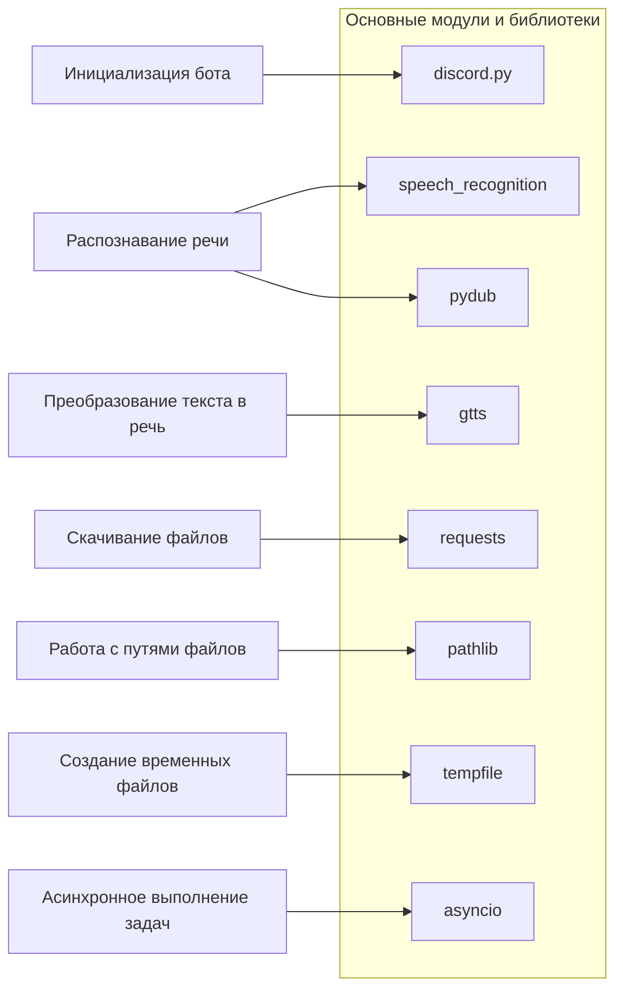

### **Системные инструкции для обработки кода проекта `hypotez`**

=========================================================================================

Описание функциональности и правил для генерации, анализа и улучшения кода. Направлено на обеспечение последовательного и читаемого стиля кодирования, соответствующего требованиям.

---

### **Основные принципы**

#### **1. Общие указания**:
- Соблюдай четкий и понятный стиль кодирования.
- Все изменения должны быть обоснованы и соответствовать установленным требованиям.

#### **2. Комментарии**:
- Используй `#` для внутренних комментариев.
- Документация всех функций, методов и классов должна следовать такому формату: 
    ```python
        def function(param: str, param1: Optional[str | dict | str] = None) -> dict | None:
            """ 
            Args:
                param (str): Описание параметра `param`.
                param1 (Optional[str | dict | str], optional): Описание параметра `param1`. По умолчанию `None`.
    
            Returns:
                dict | None: Описание возвращаемого значения. Возвращает словарь или `None`.
    
            Raises:
                SomeError: Описание ситуации, в которой возникает исключение `SomeError`.

            Ехаmple:
                >>> function('param', 'param1')
                {'param': 'param1'}
            """
    ```
- Комментарии и документация должны быть четкими, лаконичными и точными.

#### **3. Форматирование кода**:
- Используй одинарные кавычки. `a:str = 'value'`, `print('Hello World!')`;
- Добавляй пробелы вокруг операторов. Например, `x = 5`;
- Все параметры должны быть аннотированы типами. `def function(param: str, param1: Optional[str | dict | str] = None) -> dict | None:`;
- Не используй `Union`. Вместо этого используй `|`.

#### **4. Логирование**:
- Для логгирования Всегда Используй модуль `logger` из `src.logger.logger`.
- Ошибки должны логироваться с использованием `logger.error`.
Пример:
    ```python
        try:
            ...
        except Exception as ex:
            logger.error('Error while processing data', ех, exc_info=True)
    ```
#### **5 Не используй `Union[]` в коде. Вместо него используй `|`
Например:
```python
x: str | int ...
```


---

### **Основные требования**:

#### **1. Формат ответов в Markdown**:
- Все ответы должны быть выполнены в формате **Markdown**.

#### **2. Формат комментариев**:
- Используй указанный стиль для комментариев и документации в коде.
- Пример:

```python
from typing import Generator, Optional, List
from pathlib import Path


def read_text_file(
    file_path: str | Path,
    as_list: bool = False,
    extensions: Optional[List[str]] = None,
    chunk_size: int = 8192,
) -> Generator[str, None, None] | str | None:
    """
    Считывает содержимое файла (или файлов из каталога) с использованием генератора для экономии памяти.

    Args:
        file_path (str | Path): Путь к файлу или каталогу.
        as_list (bool): Если `True`, возвращает генератор строк.
        extensions (Optional[List[str]]): Список расширений файлов для чтения из каталога.
        chunk_size (int): Размер чанков для чтения файла в байтах.

    Returns:
        Generator[str, None, None] | str | None: Генератор строк, объединенная строка или `None` в случае ошибки.

    Raises:
        Exception: Если возникает ошибка при чтении файла.

    Example:
        >>> from pathlib import Path
        >>> file_path = Path('example.txt')
        >>> content = read_text_file(file_path)
        >>> if content:
        ...    print(f'File content: {content[:100]}...')
        File content: Example text...
    """
    ...
```
- Всегда делай подробные объяснения в комментариях. Избегай расплывчатых терминов, 
- таких как *«получить»* или *«делать»*. Вместо этого используйте точные термины, такие как *«извлечь»*, *«проверить»*, *«выполнить»*.
- Вместо: *«получаем»*, *«возвращаем»*, *«преобразовываем»* используй имя объекта *«функция получае»*, *«переменная возвращает»*, *«код преобразовывает»* 
- Комментарии должны непосредственно предшествовать описываемому блоку кода и объяснять его назначение.

#### **3. Пробелы вокруг операторов присваивания**:
- Всегда добавляйте пробелы вокруг оператора `=`, чтобы повысить читаемость.
- Примеры:
  - **Неправильно**: `x=5`
  - **Правильно**: `x = 5`

#### **4. Использование `j_loads` или `j_loads_ns`**:
- Для чтения JSON или конфигурационных файлов замените стандартное использование `open` и `json.load` на `j_loads` или `j_loads_ns`.
- Пример:

```python
# Неправильно:
with open('config.json', 'r', encoding='utf-8') as f:
    data = json.load(f)

# Правильно:
data = j_loads('config.json')
```

#### **5. Сохранение комментариев**:
- Все существующие комментарии, начинающиеся с `#`, должны быть сохранены без изменений в разделе «Улучшенный код».
- Если комментарий кажется устаревшим или неясным, не изменяйте его. Вместо этого отметьте его в разделе «Изменения».

#### **6. Обработка `...` в коде**:
- Оставляйте `...` как указатели в коде без изменений.
- Не документируйте строки с `...`.
```

#### **7. Аннотации**
Для всех переменных должны быть определены аннотации типа. 
Для всех функций все входные и выходные параметры аннотириваны
Для все параметров должны быть аннотации типа.


### **8. webdriver**
В коде используется webdriver. Он импртируется из модуля `webdriver` проекта `hypotez`
```python
from src.webdirver import Driver, Chrome, Firefox, Playwright, ...
driver = Driver(Firefox)

Пoсле чего может использоваться как

close_banner = {
  "attribute": null,
  "by": "XPATH",
  "selector": "//button[@id = 'closeXButton']",
  "if_list": "first",
  "use_mouse": false,
  "mandatory": false,
  "timeout": 0,
  "timeout_for_event": "presence_of_element_located",
  "event": "click()",
  "locator_description": "Закрываю pop-up окно, если оно не появилось - не страшно (`mandatory`:`false`)"
}

result = driver.execute_locator(close_banner)
```

## Анализ кода `hypotez/src/endpoints/bots/discord/readme.ru.md`

### 1. Блок-схема

```mermaid
graph LR
    A[Начало: Инициализация Discord-бота с префиксом команд и интентами] --> B{Обработка входящих сообщений};
    B -- Свое сообщение --> B;
    B -- Аудиофайл --> C[Распознавание речи: Скачивание, конвертация в WAV, распознавание с помощью Google Speech Recognition];
    B -- Текст --> D{Пользователь в голосовом канале?};
    B -- Команда --> E(Выполнение команды);
    D -- Да --> F[Преобразование текста в речь (gTTS) и воспроизведение в голосовом канале];
    D -- Нет --> G[Отправка текстового ответа];
    E -- !hi --> H[Отправка приветственного сообщения];
    E -- !join --> I[Подключение бота к голосовому каналу];
    E -- !leave --> J[Отключение бота от голосового канала];
    E -- !train --> K[Обучение модели на предоставленных данных (файл/текст)];
    E -- !test --> L[Тестирование модели на предоставленных данных];
    E -- !archive --> M[Архивация файлов в указанной директории];
    E -- !select_dataset --> N[Выбор датасета для обучения модели];
    E -- !instruction --> O[Отправка инструкций из внешнего файла];
    E -- !correct --> P[Исправление предыдущего сообщения бота];
    E -- !feedback --> Q[Отправка обратной связи о работе бота];
    E -- !getfile --> R[Отправка файла из указанного пути];
    C --> G;
    F --> G;
    H --> G;
    I --> G;
    J --> G;
    K --> G;
    L --> G;
    M --> G;
    N --> G;
    O --> G;
    P --> G;
    Q --> G;
    R --> G;
    G --> S[Логирование событий и ошибок];
    S --> T[Завершение];
```

### 2. Диаграмма



**Объяснение зависимостей:**

-   `discord.py`: Основная библиотека для создания Discord-ботов. Она предоставляет API для взаимодействия с Discord, обработки событий, отправки сообщений и управления каналами.
-   `speech_recognition`: Используется для распознавания речи из аудиофайлов. Позволяет преобразовывать аудио в текст.
-   `pydub`: Библиотека для работы с аудиофайлами. Используется для конвертации аудиофайлов в различные форматы, в данном случае, в формат WAV.
-   `gtts`: Google Text-to-Speech, библиотека для преобразования текста в речь. Используется для синтеза речи из текстовых сообщений и воспроизведения её в голосовом канале.
-   `requests`: Используется для отправки HTTP-запросов, например, для скачивания файлов из интернета.
-   `pathlib`: Предоставляет классы для представления путей файловой системы, что упрощает работу с файлами и директориями.
-   `tempfile`: Используется для создания временных файлов и директорий, которые автоматически удаляются после завершения работы программы.
-   `asyncio`: Библиотека для написания асинхронного кода, что позволяет боту одновременно обрабатывать несколько задач, таких как ожидание сообщений и выполнение команд.

### 3. Объяснение

**Импорты:**

-   `discord.py`: Как указано выше, это основная библиотека для взаимодействия с Discord API.
-   `speech_recognition`: Используется для распознавания речи из аудиофайлов.
-   `pydub`: Используется для конвертации аудиофайлов (например, в формат WAV, который требуется для `speech_recognition`).
-   `gtts`: Используется для преобразования текста в речь.
-   `requests`: Для скачивания файлов (например, аудиофайлов).
-   `pathlib`: Для удобной работы с путями к файлам.
-   `tempfile`: Для создания временных файлов, которые используются при обработке аудио.
-   `asyncio`: Для асинхронного выполнения операций, таких как обработка сообщений и воспроизведение аудио.
-   `logger`: Из `src.logger.logger` - используется для логирования событий и ошибок в работе бота.

**Основные функции и команды:**

-   `!hi`: Отправляет приветственное сообщение.
-   `!join`: Подключает бота к голосовому каналу пользователя.
-   `!leave`: Отключает бота от голосового канала.
-   `!train`: Обучает модель машинного обучения. Данные могут быть предоставлены в виде файла или текста.
-   `!test`: Тестирует модель машинного обучения.
-   `!archive`: Архивирует файлы в указанной директории.
-   `!select_dataset`: Выбирает датасет для обучения модели.
-   `!instruction`: Отправляет инструкции из внешнего файла.
-   `!correct`: Позволяет пользователю исправить сообщение бота.
-   `!feedback`: Позволяет пользователю отправить обратную связь.
-   `!getfile`: Отправляет запрошенный файл.

**Обработка сообщений:**

-   Бот игнорирует собственные сообщения.
-   При получении аудиофайла бот преобразует его в текст с помощью `speech_recognition` и отправляет ответ.
-   Если пользователь находится в голосовом канале, бот преобразует текст в речь и воспроизводит его.

**Распознавание речи:**

-   Функция `recognizer` скачивает аудиофайл, конвертирует его в формат WAV и использует Google Speech Recognition для преобразования аудио в текст.

**Текст в речь:**

-   Функция `text_to_speech_and_play` использует библиотеку `gTTS` для преобразования текста в речь и воспроизводит её в голосовом канале.

**Переменные:**

-   `gs.credentials.discord.bot_token`: Токен Discord-бота, используемый для запуска и аутентификации бота. Хранится в глобальных настройках проекта.

**Потенциальные ошибки и области для улучшения:**

1.  **Обработка ошибок при распознавании речи и преобразовании текста в речь:** Необходимо добавить обработку исключений для случаев, когда распознавание речи или преобразование текста в речь не удаются.
2.  **Безопасность:** Хранение токена бота в коде или файлах конфигурации может быть небезопасным. Рекомендуется использовать переменные окружения или другие безопасные способы хранения секретов.
3.  **Масштабируемость:** Асинхронность помогает, но необходимо учитывать ограничения ресурсов при большом количестве пользователей и команд.
4.  **Логирование:** Убедиться, что все важные события и ошибки залогированы для упрощения отладки и мониторинга.
5.  **Зависимости:** Управление зависимостями (например, с помощью `requirements.txt` или `poetry`) для упрощения развертывания и воспроизводимости.

**Взаимосвязи с другими частями проекта:**

-   `src.logger.logger`: Используется для логирования, что обеспечивает централизованное управление логированием в проекте.
-   `gs.credentials.discord.bot_token`: Получение токена из глобальных настроек, что обеспечивает централизованное управление конфигурацией.

Этот бот является частью модульной структуры `hypotez`, интегрируясь с другими модулями через общие ресурсы (например, логирование и конфигурация).