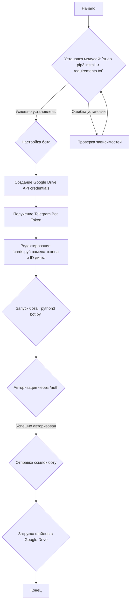

### **Системные инструкции для обработки кода проекта `hypotez`**

=========================================================================================

Описание функциональности и правил для генерации, анализа и улучшения кода. Направлено на обеспечение последовательного и читаемого стиля кодирования, соответствующего требованиям.

---

### **Основные принципы**

#### **1. Общие указания**:
- Соблюдай четкий и понятный стиль кодирования.
- Все изменения должны быть обоснованы и соответствовать установленным требованиям.

#### **2. Комментарии**:
- Используй `#` для внутренних комментариев.
- Документация всех функций, методов и классов должна следовать такому формату: 
    ```python
        def function(param: str, param1: Optional[str | dict | str] = None) -> dict | None:
            """ 
            Args:
                param (str): Описание параметра `param`.
                param1 (Optional[str | dict | str], optional): Описание параметра `param1`. По умолчанию `None`.
    
            Returns:
                dict | None: Описание возвращаемого значения. Возвращает словарь или `None`.
    
            Raises:
                SomeError: Описание ситуации, в которой возникает исключение `SomeError`.

            Ехаmple:
                >>> function('param', 'param1')
                {'param': 'param1'}
            """
    ```
- Комментарии и документация должны быть четкими, лаконичными и точными.

#### **3. Форматирование кода**:
- Используй одинарные кавычки. `a:str = 'value'`, `print('Hello World!')`;
- Добавляй пробелы вокруг операторов. Например, `x = 5`;
- Все параметры должны быть аннотированы типами. `def function(param: str, param1: Optional[str | dict | str] = None) -> dict | None:`;
- Не используй `Union`. Вместо этого используй `|`.

#### **4. Логирование**:
- Для логгирования Всегда Используй модуль `logger` из `src.logger.logger`.
- Ошибки должны логироваться с использованием `logger.error`.
Пример:
    ```python
        try:
            ...
        except Exception as ex:
            logger.error('Error while processing data', ех, exc_info=True)
    ```
#### **5 Не используй `Union[]` в коде. Вместо него используй `|`
Например:
```python
x: str | int ...
```


---

### **Основные требования**:

#### **1. Формат ответов в Markdown**:
- Все ответы должны быть выполнены в формате **Markdown**.

#### **2. Формат комментариев**:
- Используй указанный стиль для комментариев и документации в коде.
- Пример:

```python
from typing import Generator, Optional, List
from pathlib import Path


def read_text_file(
    file_path: str | Path,
    as_list: bool = False,
    extensions: Optional[List[str]] = None,
    chunk_size: int = 8192,
) -> Generator[str, None, None] | str | None:
    """
    Считывает содержимое файла (или файлов из каталога) с использованием генератора для экономии памяти.

    Args:
        file_path (str | Path): Путь к файлу или каталогу.
        as_list (bool): Если `True`, возвращает генератор строк.
        extensions (Optional[List[str]]): Список расширений файлов для чтения из каталога.
        chunk_size (int): Размер чанков для чтения файла в байтах.

    Returns:
        Generator[str, None, None] | str | None: Генератор строк, объединенная строка или `None` в случае ошибки.

    Raises:
        Exception: Если возникает ошибка при чтении файла.

    Example:
        >>> from pathlib import Path
        >>> file_path = Path('example.txt')
        >>> content = read_text_file(file_path)
        >>> if content:
        ...    print(f'File content: {content[:100]}...')
        File content: Example text...
    """
    ...
```
- Всегда делай подробные объяснения в комментариях. Избегай расплывчатых терминов, 
- таких как *«получить»* или *«делать»*. Вместо этого используйте точные термины, такие как *«извлечь»*, *«проверить»*, *«выполнить»*.
- Вместо: *«получаем»*, *«возвращаем»*, *«преобразовываем»* используй имя объекта *«функция получае»*, *«переменная возвращает»*, *«код преобразовывает»* 
- Комментарии должны непосредственно предшествовать описываемому блоку кода и объяснять его назначение.

#### **3. Пробелы вокруг операторов присваивания**:
- Всегда добавляйте пробелы вокруг оператора `=`, чтобы повысить читаемость.
- Примеры:
  - **Неправильно**: `x=5`
  - **Правильно**: `x = 5`

#### **4. Использование `j_loads` или `j_loads_ns`**:
- Для чтения JSON или конфигурационных файлов замените стандартное использование `open` и `json.load` на `j_loads` или `j_loads_ns`.
- Пример:

```python
# Неправильно:
with open('config.json', 'r', encoding='utf-8') as f:
    data = json.load(f)

# Правильно:
data = j_loads('config.json')
```

#### **5. Сохранение комментариев**:
- Все существующие комментарии, начинающиеся с `#`, должны быть сохранены без изменений в разделе «Улучшенный код».
- Если комментарий кажется устаревшим или неясным, не изменяйте его. Вместо этого отметьте его в разделе «Изменения».

#### **6. Обработка `...` в коде**:
- Оставляйте `...` как указатели в коде без изменений.
- Не документируйте строки с `...`.
```

#### **7. Аннотации**
Для всех переменных должны быть определены аннотации типа. 
Для всех функций все входные и выходные параметры аннотириваны
Для все параметров должны быть аннотации типа.


### **8. webdriver**
В коде используется webdriver. Он импртируется из модуля `webdriver` проекта `hypotez`
```python
from src.webdirver import Driver, Chrome, Firefox, Playwright, ...
driver = Driver(Firefox)

Пoсле чего может использоваться как

close_banner = {
  "attribute": null,
  "by": "XPATH",
  "selector": "//button[@id = 'closeXButton']",
  "if_list": "first",
  "use_mouse": false,
  "mandatory": false,
  "timeout": 0,
  "timeout_for_event": "presence_of_element_located",
  "event": "click()",
  "locator_description": "Закрываю pop-up окно, если оно не появилось - не страшно (`mandatory`:`false`)"
}

result = driver.execute_locator(close_banner)
```

### **Анализ кода `hypotez/src/endpoints/bots/google_drive/README.md`**

Этот файл `README.md` предоставляет информацию о Telegram-боте для загрузки файлов в Google Drive. Он включает в себя описание функциональности бота, инструкции по установке и настройке, а также список поддерживаемых команд и типов ссылок.

#### **1. Блок-схема**



**Примеры для логических блоков:**

*   **A (Начало)**: Начало работы с ботом.
*   **B (Установка модулей)**: Выполнение команды `sudo pip3 install -r requirements.txt` для установки необходимых библиотек.
*   **C (Настройка бота)**: Подготовка бота к запуску, включающая настройку учетных данных.
*   **D (Создание Google Drive API credentials)**: Переход по ссылке `https://console.cloud.google.com/apis/credentials` для создания учетных данных API Google Drive.
*   **E (Получение Telegram Bot Token)**: Обращение к BotFather в Telegram для получения токена бота.
*   **F (Редактирование `creds.py`)**: Открытие файла `creds.py` и замена заполнителей на фактический токен бота и ID Google Drive.
*   **G (Запуск бота)**: Выполнение команды `python3 bot.py` для запуска бота.
*   **H (Авторизация через /auth)**: Отправка команды `/auth` боту для начала процесса авторизации.
*   **I (Отправка ссылок боту)**: Отправка поддерживаемых ссылок (Direct Link, Mega.nz, Dropbox) боту.
*   **J (Загрузка файлов в Google Drive)**: Бот загружает файлы по предоставленным ссылкам в Google Drive.
*   **K (Конец)**: Завершение работы с ботом.
*   **L (Проверка зависимостей)**: В случае ошибки при установке модулей, проверка наличия необходимых зависимостей и их корректных версий.

#### **2. Диаграмма**

```mermaid
graph TD
    subgraph Основные компоненты
        TelegramBot[Telegram Bot]
        GoogleDriveAPI[Google Drive API]
        SupportedLinks[Поддерживаемые ссылки: Direct, Mega.nz, Dropbox]
        creds_py[creds.py: Bot Token, Google API Credentials]
        requirements_txt[requirements.txt: Список зависимостей]
    end

    subgraph Логика работы
        A[Начало] --> B{Установка зависимостей из requirements.txt}
        B -- Успешно установлены --> C{Настройка учетных данных в creds.py}
        C --> D[Запуск Telegram Bot]
        D --> E{Авторизация пользователя через /auth}
        E -- Успешно авторизован --> F{Получение ссылки от пользователя}
        F --> G{Обработка ссылки}
        G --> H{Загрузка файла в Google Drive через Google Drive API}
        H --> I[Конец]
    end

    TelegramBot -- Использует --> creds_py
    TelegramBot -- Отправляет запросы к --> GoogleDriveAPI
    TelegramBot -- Принимает --> SupportedLinks
    B -- Читает список зависимостей из --> requirements_txt
    GoogleDriveAPI -- Требует --> creds_py

    style Основные компоненты fill:#f9f,stroke:#333,stroke-width:2px
    style Логика работы fill:#ccf,stroke:#333,stroke-width:2px
```

**Объяснение зависимостей:**

*   **TelegramBot**: Представляет Telegram-бота, который взаимодействует с пользователем и Google Drive API.
*   **GoogleDriveAPI**: API Google Drive, используемый для загрузки файлов на Google Drive.
*   **SupportedLinks**: Различные типы ссылок, которые бот поддерживает для загрузки (Direct Link, Mega.nz, Dropbox).
*   **creds.py**: Файл, содержащий учетные данные бота (Telegram Bot Token) и API Google Drive.
*   **requirements.txt**: Файл, содержащий список всех необходимых Python-пакетов (зависимостей) для работы бота.

#### **3. Объяснение**

*   **Импорты**: В предоставленном коде отсутствуют явные операторы `import`, так как это файл `README.md`, а не Python-скрипт. Однако, подразумевается использование библиотек, перечисленных в `requirements.txt` (например, `telegram`, `google-api-python-client`, и другие), для работы с Telegram API и Google Drive API.
*   **Классы**: В данном файле нет описания классов. Информация о классах, скорее всего, находится в файлах, на которые ссылается `README.md` (например, `bot.py`).
*   **Функции**: В данном файле нет описания функций. Информация о функциях, скорее всего, находится в файлах, на которые ссылается `README.md` (например, `bot.py`).
*   **Переменные**:
    *   `TEAMDRIVE_FOLDER_ID`, `TEAMDRIVE_ID`: Переменные для идентификации Team Drive.
    *   Другие переменные (Bot Token, Google API credentials) хранятся в файле `creds.py`.

**Потенциальные ошибки и области для улучшения:**

*   **Безопасность**: Хранение учетных данных в файле `creds.py` не является безопасным способом. Рекомендуется использовать переменные окружения или другие способы хранения секретов.
*   **Обработка ошибок**: Недостаточно информации об обработке ошибок при загрузке файлов.
*   **Актуальность**: Упоминание о "not avalibe anymore" для openload link говорит о необходимости обновления и поддержки актуальных сервисов.

**Взаимосвязи с другими частями проекта:**

*   `creds.py`: Содержит учетные данные, необходимые для работы с Telegram API и Google Drive API.
*   `requirements.txt`: Определяет зависимости проекта, необходимые для запуска бота.
*   `bot.py`: Основной файл, содержащий логику работы бота.
*   `Plugins > TEXT.py` и `Plugins > dlopenload.py`: Плагины для работы с Mega и Openload соответственно.

Этот бот предоставляет пользователям возможность загружать файлы из различных источников (Direct Link, Mega.nz, Dropbox) на свой Google Drive через Telegram. Для его работы требуется настройка Google Drive API credentials и Telegram Bot Token.