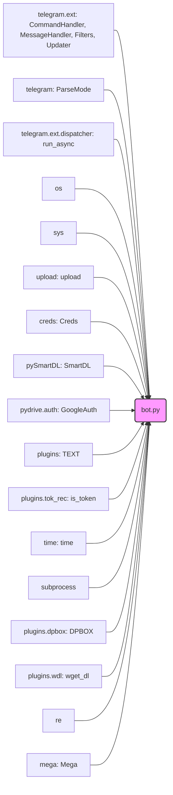

### **Системные инструкции для обработки кода проекта `hypotez`**

=========================================================================================

Описание функциональности и правил для генерации, анализа и улучшения кода. Направлено на обеспечение последовательного и читаемого стиля кодирования, соответствующего требованиям.

---

### **Основные принципы**

#### **1. Общие указания**:
- Соблюдай четкий и понятный стиль кодирования.
- Все изменения должны быть обоснованы и соответствовать установленным требованиям.

#### **2. Комментарии**:
- Используй `#` для внутренних комментариев.
- Документация всех функций, методов и классов должна следовать такому формату: 
    ```python
        def function(param: str, param1: Optional[str | dict | str] = None) -> dict | None:
            """ 
            Args:
                param (str): Описание параметра `param`.
                param1 (Optional[str | dict | str], optional): Описание параметра `param1`. По умолчанию `None`.
    
            Returns:
                dict | None: Описание возвращаемого значения. Возвращает словарь или `None`.
    
            Raises:
                SomeError: Описание ситуации, в которой возникает исключение `SomeError`.

            Ехаmple:
                >>> function('param', 'param1')
                {'param': 'param1'}
            """
    ```
- Комментарии и документация должны быть четкими, лаконичными и точными.

#### **3. Форматирование кода**:
- Используй одинарные кавычки. `a:str = 'value'`, `print('Hello World!')`;
- Добавляй пробелы вокруг операторов. Например, `x = 5`;
- Все параметры должны быть аннотированы типами. `def function(param: str, param1: Optional[str | dict | str] = None) -> dict | None:`;
- Не используй `Union`. Вместо этого используй `|`.

#### **4. Логирование**:
- Для логгирования Всегда Используй модуль `logger` из `src.logger.logger`.
- Ошибки должны логироваться с использованием `logger.error`.
Пример:
    ```python
        try:
            ...
        except Exception as ex:
            logger.error('Error while processing data', ех, exc_info=True)
    ```
#### **5 Не используй `Union[]` в коде. Вместо него используй `|`
Например:
```python
x: str | int ...
```


---

### **Основные требования**:

#### **1. Формат ответов в Markdown**:
- Все ответы должны быть выполнены в формате **Markdown**.

#### **2. Формат комментариев**:
- Используй указанный стиль для комментариев и документации в коде.
- Пример:

```python
from typing import Generator, Optional, List
from pathlib import Path


def read_text_file(
    file_path: str | Path,
    as_list: bool = False,
    extensions: Optional[List[str]] = None,
    chunk_size: int = 8192,
) -> Generator[str, None, None] | str | None:
    """
    Считывает содержимое файла (или файлов из каталога) с использованием генератора для экономии памяти.

    Args:
        file_path (str | Path): Путь к файлу или каталогу.
        as_list (bool): Если `True`, возвращает генератор строк.
        extensions (Optional[List[str]]): Список расширений файлов для чтения из каталога.
        chunk_size (int): Размер чанков для чтения файла в байтах.

    Returns:
        Generator[str, None, None] | str | None: Генератор строк, объединенная строка или `None` в случае ошибки.

    Raises:
        Exception: Если возникает ошибка при чтении файла.

    Example:
        >>> from pathlib import Path
        >>> file_path = Path('example.txt')
        >>> content = read_text_file(file_path)
        >>> if content:
        ...    print(f'File content: {content[:100]}...')
        File content: Example text...
    """
    ...
```
- Всегда делай подробные объяснения в комментариях. Избегай расплывчатых терминов, 
- таких как *«получить»* или *«делать»*
-  . Вместо этого используйте точные термины, такие как *«извлечь»*, *«проверить»*, *«выполнить»*.
- Вместо: *«получаем»*, *«возвращаем»*, *«преобразовываем»* используй имя объекта *«функция получае»*, *«переменная возвращает»*, *«код преобразовывает»* 
- Комментарии должны непосредственно предшествовать описываемому блоку кода и объяснять его назначение.

#### **3. Пробелы вокруг операторов присваивания**:
- Всегда добавляйте пробелы вокруг оператора `=`, чтобы повысить читаемость.
- Примеры:
  - **Неправильно**: `x=5`
  - **Правильно**: `x = 5`

#### **4. Использование `j_loads` или `j_loads_ns`**:
- Для чтения JSON или конфигурационных файлов замените стандартное использование `open` и `json.load` на `j_loads` или `j_loads_ns`.
- Пример:

```python
# Неправильно:
with open('config.json', 'r', encoding='utf-8') as f:
    data = json.load(f)

# Правильно:
data = j_loads('config.json')
```

#### **5. Сохранение комментариев**:
- Все существующие комментарии, начинающиеся с `#`, должны быть сохранены без изменений в разделе «Улучшенный код».
- Если комментарий кажется устаревшим или неясным, не изменяйте его. Вместо этого отметьте его в разделе «Изменения».

#### **6. Обработка `...` в коде**:
- Оставляйте `...` как указатели в коде без изменений.
- Не документируйте строки с `...`.
```

#### **7. Аннотации**
Для всех переменных должны быть определены аннотации типа. 
Для всех функций все входные и выходные параметры аннотириваны
Для все параметров должны быть аннотации типа.


### **8. webdriver**
В коде используется webdriver. Он импртируется из модуля `webdriver` проекта `hypotez`
```python
from src.webdirver import Driver, Chrome, Firefox, Playwright, ...
driver = Driver(Firefox)

Пoсле чего может использоваться как

close_banner = {
  "attribute": null,
  "by": "XPATH",
  "selector": "//button[@id = 'closeXButton']",
  "if_list": "first",
  "use_mouse": false,
  "mandatory": false,
  "timeout": 0,
  "timeout_for_event": "presence_of_element_located",
  "event": "click()",
  "locator_description": "Закрываю pop-up окно, если оно не появилось - не страшно (`mandatory`:`false`)"
}

result = driver.execute_locator(close_banner)
```

### **Анализ кода `hypotez/src/endpoints/bots/google_drive/bot.py`**

#### 1. Блок-схема

```mermaid
graph LR
    A[Начало: Запуск Telegram бота] --> B{Получение команды от пользователя};
    B -- /start --> C[Обработчик start: Отправка приветственного сообщения];
    B -- /help --> D[Обработчик help: Отправка справочного сообщения];
    B -- /auth --> E[Обработчик auth: Аутентификация в Google Drive];
    B -- /revoke --> F[Обработчик revoke: Удаление данных аутентификации];
    B -- URL --> G[Обработчик UPLOAD: Загрузка файла по URL];
    B -- /update --> H[Обработчик update: Отправка статуса];
    E --> I{Проверка наличия учетных данных};
    I -- Учетные данные есть --> J[Авторизация с использованием сохраненных учетных данных];
    I -- Учетные данные отсутствуют --> K[Получение URL для аутентификации];
    K --> L[Отправка URL пользователю];
    G --> M{Проверка наличия учетных данных};
    M -- Учетные данные есть --> N[Обработка URL: Скачивание файла];
    M -- Учетные данные отсутствуют --> O[Отправка сообщения об отсутствии аутентификации];
    N --> P{Определение типа URL};
    P -- Openload/Oload --> Q[Сообщение о недоступности Openload];
    P -- Dropbox --> R[Скачивание файла с Dropbox];
    P -- Mega.nz --> S[Скачивание файла с Mega.nz];
    P -- Другой URL --> T[Скачивание файла по обычному URL];
    T --> U{Проверка успешности скачивания};
    U -- Успешно --> V[Загрузка файла в Google Drive];
    U -- Ошибка --> W{Попытка альтернативной загрузки (если DOWN_TWO)};
    W -- Успешно --> V;
    W -- Ошибка --> X[Отправка сообщения об ошибке загрузки];
    V --> Y[Отправка ссылки на загруженный файл];
    F --> Z{Удаление файла};
```

#### 2. Диаграмма



**Объяснение зависимостей:**

-   `telegram.ext`: Библиотека `python-telegram-bot` для создания Telegram-ботов, включающая классы `CommandHandler` (для обработки команд), `MessageHandler` (для обработки сообщений), `Filters` (для фильтрации сообщений) и `Updater` (для получения обновлений от Telegram).
-   `telegram`: Основная библиотека `python-telegram-bot`, содержащая, в частности, `ParseMode` для форматирования текста.
-   `telegram.ext.dispatcher`: Содержит декоратор `run_async` для асинхронного выполнения функций.
-   `os`: Модуль для работы с операционной системой, например, для удаления файлов.
-   `sys`: Модуль для доступа к некоторым переменным и функциям, взаимодействующим с интерпретатором Python.
-   `upload`: Пользовательский модуль для загрузки файлов в Google Drive.
-   `creds`: Пользовательский модуль для хранения учетных данных, например, токена Telegram-бота.
-   `pySmartDL`: Библиотека для скачивания файлов с поддержкой возобновления загрузки.
-   `pydrive.auth`: Библиотека для аутентификации в Google Drive.
-   `plugins`: Пользовательский пакет, содержащий различные модули, такие как `TEXT` (текстовые константы), `tok_rec` (распознавание токенов), `dpbox` (работа с Dropbox), `wdl` (скачивание файлов с помощью wget).
-   `time`: Модуль для работы со временем.
-   `subprocess`: Модуль для запуска новых процессов.
-   `re`: Модуль для работы с регулярными выражениями.
-   `mega`: Библиотека для работы с Mega.nz.

#### 3. Объяснение

**Импорты:**

-   `json`: Используется для работы с данными в формате JSON, например, для чтения конфигурационных файлов.
-   `telegram.ext`: Модули из библиотеки `python-telegram-bot` для создания Telegram-ботов.
    -   `CommandHandler`: Используется для регистрации обработчиков команд (например, `/start`, `/help`).
    -   `MessageHandler`: Используется для регистрации обработчиков текстовых сообщений и других типов данных.
    -   `Filters`: Используется для фильтрации сообщений, например, для обработки только сообщений, содержащих URL.
    -   `Updater`: Используется для получения обновлений от Telegram и передачи их обработчикам.
-   `telegram`:
    -   `ParseMode`: Используется для указания формата текста сообщения (например, HTML).
-   `telegram.ext.dispatcher`:
    -   `run_async`: Декоратор, который позволяет запускать функции асинхронно, чтобы не блокировать основной поток бота.
-   `os`: Модуль для взаимодействия с операционной системой.
-   `sys`: Модуль для доступа к некоторым переменным и функциям, взаимодействующим с интерпретатором Python.
-   `upload`: Пользовательский модуль, содержащий функцию `upload` для загрузки файлов в Google Drive.
-   `creds`: Пользовательский модуль, содержащий класс `Creds` для хранения учетных данных (например, токена Telegram-бота).
-   `pySmartDL`: Библиотека для скачивания файлов с поддержкой возобновления загрузки.
-   `pydrive.auth`: Модуль для аутентификации в Google Drive.
    -   `GoogleAuth`: Класс для управления аутентификацией в Google Drive.
-   `plugins`: Пакет, содержащий различные модули.
    -   `TEXT`: Модуль, содержащий текстовые константы (например, сообщения для бота).
    -   `tok_rec`: Модуль, содержащий функцию `is_token` для проверки, является ли строка токеном.
    -   `dpbox`: Модуль, содержащий функцию `DPBOX` для работы с ссылками Dropbox.
    -   `wdl`: Модуль, содержащий функцию `wget_dl` для скачивания файлов с помощью wget.
-   `re`: Модуль для работы с регулярными выражениями.
-   `mega`: Библиотека для работы с Mega.nz.

**Переменные:**

-   `bot_token`: Токен Telegram-бота, полученный из `Creds.TG_TOKEN`.
-   `updater`: Объект класса `Updater`, используемый для получения обновлений от Telegram.
-   `dp`: Объект класса `Dispatcher`, используемый для регистрации обработчиков команд и сообщений.
-   `gauth`: Объект класса `GoogleAuth`, используемый для аутентификации в Google Drive.

**Функции:**

-   `help(update, context)`: Отправляет справочное сообщение пользователю.
    -   `update`: Объект `Update` от `python-telegram-bot`, содержащий информацию о полученном обновлении.
    -   `context`: Объект `CallbackContext` от `python-telegram-bot`, содержащий информацию о контексте выполнения.
-   `auth(update, context)`: Запускает процесс аутентификации в Google Drive.
    -   Проверяет, есть ли сохраненные учетные данные. Если нет, отправляет URL для аутентификации. Если есть, пытается авторизоваться с использованием сохраненных учетных данных.
-   `token(update, context)`: Обрабатывает токен, отправленный пользователем после аутентификации.
    -   Проверяет, является ли сообщение токеном. Если да, пытается авторизоваться с использованием токена и сохраняет учетные данные.
-   `start(update, context)`: Отправляет приветственное сообщение пользователю.
-   `revoke_tok(update, context)`: Удаляет сохраненные учетные данные пользователя.
-   `UPLOAD(update, context)`: Обрабатывает URL, отправленный пользователем, скачивает файл и загружает его в Google Drive.
    -   Определяет тип URL (Openload, Dropbox, Mega.nz, другой).
    -   Скачивает файл с использованием соответствующего метода.
    -   Загружает файл в Google Drive с использованием функции `upload`.
    -   Отправляет ссылку на загруженный файл пользователю.
-   `status(update, context)`: Отправляет сообщение о статусе бота.

**Классы:**

-   `Creds`: Класс для хранения учетных данных.
-   `GoogleAuth`: Класс из библиотеки `pydrive` для аутентификации в Google Drive.
-   `SmartDL`: Класс из библиотеки `pySmartDL` для скачивания файлов с поддержкой возобновления загрузки.
-   `Mega`: Класс из библиотеки `mega` для работы с Mega.nz.

**Потенциальные ошибки и области для улучшения:**

-   Обработка ошибок: В коде есть блоки `try...except`, но обработка ошибок не всегда достаточно подробная. Можно добавить логирование ошибок с использованием модуля `logging` для более детального анализа.
-   Использование констант: Многие строковые значения (например, сообщения для бота) хранятся непосредственно в коде. Лучше вынести их в отдельный файл конфигурации или использовать модуль `TEXT` более эффективно.
-   Безопасность: Хранение учетных данных в файле `creds.py` не является безопасным способом. Лучше использовать переменные окружения или другие способы хранения секретов.
-   Асинхронность: Использование `run_async` для всех обработчиков может привести к проблемам с конкурентным доступом к ресурсам. Необходимо внимательно следить за синхронизацией данных.
-   Обработка различных типов файлов: Код обрабатывает только скачивание и загрузку файлов. Можно добавить поддержку других типов данных, например, изображений или документов.
-   Openload/Oload: В коде указано, что Openload больше не доступен. Следует удалить этот блок кода или заменить его на другой сервис.

**Взаимосвязи с другими частями проекта:**

-   `upload.py`: Модуль, отвечающий за загрузку файлов в Google Drive.
-   `creds.py`: Модуль, содержащий учетные данные (токен Telegram-бота).
-   `plugins`: Пакет, содержащий различные модули, используемые ботом.

В целом, код представляет собой Telegram-бота, который позволяет скачивать файлы по URL и загружать их в Google Drive. Бот поддерживает различные типы URL (Dropbox, Mega.nz, другие) и использует несколько библиотек для скачивания файлов и аутентификации в Google Drive.