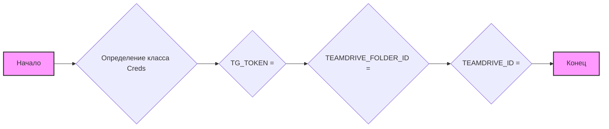
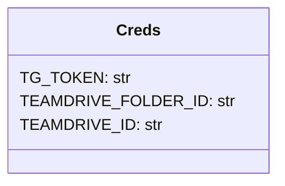

### **Системные инструкции для обработки кода проекта `hypotez`**

=========================================================================================

Описание функциональности и правил для генерации, анализа и улучшения кода. Направлено на обеспечение последовательного и читаемого стиля кодирования, соответствующего требованиям.

---

### **Основные принципы**

#### **1. Общие указания**:
- Соблюдай четкий и понятный стиль кодирования.
- Все изменения должны быть обоснованы и соответствовать установленным требованиям.

#### **2. Комментарии**:
- Используй `#` для внутренних комментариев.
- Документация всех функций, методов и классов должна следовать такому формату: 
    ```python
        def function(param: str, param1: Optional[str | dict | str] = None) -> dict | None:
            """ 
            Args:
                param (str): Описание параметра `param`.
                param1 (Optional[str | dict | str], optional): Описание параметра `param1`. По умолчанию `None`.
    
            Returns:
                dict | None: Описание возвращаемого значения. Возвращает словарь или `None`.
    
            Raises:
                SomeError: Описание ситуации, в которой возникает исключение `SomeError`.

            Ехаmple:
                >>> function('param', 'param1')
                {'param': 'param1'}
            """
    ```
- Комментарии и документация должны быть четкими, лаконичными и точными.

#### **3. Форматирование кода**:
- Используй одинарные кавычки. `a:str = 'value'`, `print('Hello World!')`;
- Добавляй пробелы вокруг операторов. Например, `x = 5`;
- Все параметры должны быть аннотированы типами. `def function(param: str, param1: Optional[str | dict | str] = None) -> dict | None:`;
- Не используй `Union`. Вместо этого используй `|`.

#### **4. Логирование**:
- Для логгирования Всегда Используй модуль `logger` из `src.logger.logger`.
- Ошибки должны логироваться с использованием `logger.error`.
Пример:
    ```python
        try:
            ...
        except Exception as ex:
            logger.error('Error while processing data', ех, exc_info=True)
    ```
#### **5 Не используй `Union[]` в коде. Вместо него используй `|`
Например:
```python
x: str | int ...
```


---

### **Основные требования**:

#### **1. Формат ответов в Markdown**:
- Все ответы должны быть выполнены в формате **Markdown**.

#### **2. Формат комментариев**:
- Используй указанный стиль для комментариев и документации в коде.
- Пример:

```python
from typing import Generator, Optional, List
from pathlib import Path


def read_text_file(
    file_path: str | Path,
    as_list: bool = False,
    extensions: Optional[List[str]] = None,
    chunk_size: int = 8192,
) -> Generator[str, None, None] | str | None:
    """
    Считывает содержимое файла (или файлов из каталога) с использованием генератора для экономии памяти.

    Args:
        file_path (str | Path): Путь к файлу или каталогу.
        as_list (bool): Если `True`, возвращает генератор строк.
        extensions (Optional[List[str]]): Список расширений файлов для чтения из каталога.
        chunk_size (int): Размер чанков для чтения файла в байтах.

    Returns:
        Generator[str, None, None] | str | None: Генератор строк, объединенная строка или `None` в случае ошибки.

    Raises:
        Exception: Если возникает ошибка при чтении файла.

    Example:
        >>> from pathlib import Path
        >>> file_path = Path('example.txt')
        >>> content = read_text_file(file_path)
        >>> if content:
        ...    print(f'File content: {content[:100]}...')
        File content: Example text...
    """
    ...
```
- Всегда делай подробные объяснения в комментариях. Избегай расплывчатых терминов, 
- таких как *«получить»* или *«делать»*. Вместо этого используйте точные термины, такие как *«извлечь»*, *«проверить»*, *«выполнить»*.
- Вместо: *«получаем»*, *«возвращаем»*, *«преобразовываем»* используй имя объекта *«функция получае»*, *«переменная возвращает»*, *«код преобразовывает»* 
- Комментарии должны непосредственно предшествовать описываемому блоку кода и объяснять его назначение.

#### **3. Пробелы вокруг операторов присваивания**:
- Всегда добавляйте пробелы вокруг оператора `=`, чтобы повысить читаемость.
- Примеры:
  - **Неправильно**: `x=5`
  - **Правильно**: `x = 5`

#### **4. Использование `j_loads` или `j_loads_ns`**:
- Для чтения JSON или конфигурационных файлов замените стандартное использование `open` и `json.load` на `j_loads` или `j_loads_ns`.
- Пример:

```python
# Неправильно:
with open('config.json', 'r', encoding='utf-8') as f:
    data = json.load(f)

# Правильно:
data = j_loads('config.json')
```

#### **5. Сохранение комментариев**:
- Все существующие комментарии, начинающиеся с `#`, должны быть сохранены без изменений в разделе «Улучшенный код».
- Если комментарий кажется устаревшим или неясным, не изменяйте его. Вместо этого отметьте его в разделе «Изменения».

#### **6. Обработка `...` в коде**:
- Оставляйте `...` как указатели в коде без изменений.
- Не документируйте строки с `...`.
```

#### **7. Аннотации**
Для всех переменных должны быть определены аннотации типа. 
Для всех функций все входные и выходные параметры аннотириваны
Для все параметров должны быть аннотации типа.


### **8. webdriver**
В коде используется webdriver. Он импртируется из модуля `webdriver` проекта `hypotez`
```python
from src.webdirver import Driver, Chrome, Firefox, Playwright, ...
driver = Driver(Firefox)

Пoсле чего может использоваться как

close_banner = {
  "attribute": null,
  "by": "XPATH",
  "selector": "//button[@id = 'closeXButton']",
  "if_list": "first",
  "use_mouse": false,
  "mandatory": false,
  "timeout": 0,
  "timeout_for_event": "presence_of_element_located",
  "event": "click()",
  "locator_description": "Закрываю pop-up окно, если оно не появилось - не страшно (`mandatory`:`false`)"
}

result = driver.execute_locator(close_banner)
```

## Анализ кода `hypotez/src/endpoints/bots/google_drive/creds.py`

### 1. Блок-схема



**Примеры для логических блоков:**

- **Определение класса `Creds`**: Класс предназначен для хранения учетных данных, необходимых для работы бота с Telegram и Google Drive.
- **`TG_TOKEN = ""`**: Токен Telegram-бота, используемый для аутентификации и взаимодействия с API Telegram. Например, если бот имеет токен `"123456:ABC-DEF1234ghIJKLmnO"` нужно заменить `""` на этот токен.
- **`TEAMDRIVE_FOLDER_ID = ""`**: ID папки на Google Team Drive, куда бот будет загружать файлы. Пример: `"1AbCdEfGhIjKlMnOpQrStUvWxYz"`.
- **`TEAMDRIVE_ID = ""`**: ID самого Google Team Drive. Пример: `"0ABCDEFGHIJKLMNOPQRSTUVWXYZ12"`.

**Поток данных:**

1.  Класс `Creds` определяет переменные для хранения учетных данных.
2.  Значения переменных `TG_TOKEN`, `TEAMDRIVE_FOLDER_ID` и `TEAMDRIVE_ID` должны быть заполнены пользователем для настройки бота.
3.  Эти переменные используются другими частями проекта для аутентификации и взаимодействия с Telegram API и Google Drive API.

### 2. Диаграмма



**Объяснение зависимостей:**

В данном коде нет импортов, поэтому диаграмма показывает только структуру класса `Creds` и его атрибуты. Атрибуты `TG_TOKEN`, `TEAMDRIVE_FOLDER_ID` и `TEAMDRIVE_ID` являются строками и предназначены для хранения учетных данных.

### 3. Объяснение

#### Импорты:

В данном коде импорты отсутствуют.

#### Классы:

-   **`class Creds()`**:
    *   **Роль**: Класс предназначен для хранения учетных данных, необходимых для работы бота. Он содержит атрибуты для токена Telegram бота, ID папки на Google Team Drive и ID самого Google Team Drive.
    *   **Атрибуты**:
        *   `TG_TOKEN: str`: Токен Telegram-бота.
        *   `TEAMDRIVE_FOLDER_ID: str`: ID папки на Google Team Drive.
        *   `TEAMDRIVE_ID: str`: ID Google Team Drive.
    *   **Методы**:
        Класс не содержит методов. Он используется как структура данных для хранения учетных данных.
    *   **Взаимодействие с другими компонентами проекта**:
        Другие модули проекта могут импортировать этот класс и получать доступ к учетным данным для взаимодействия с Telegram API и Google Drive API. Например, модуль, отвечающий за загрузку файлов на Google Drive, может использовать `TEAMDRIVE_FOLDER_ID` и `TEAMDRIVE_ID`.

#### Функции:

В данном коде функции отсутствуют.

#### Переменные:

-   `TG_TOKEN: str = ""`: Токен Telegram-бота.
-   `TEAMDRIVE_FOLDER_ID: str = ""`: ID папки на Google Team Drive.
-   `TEAMDRIVE_ID: str = ""`: ID Google Team Drive.

#### Потенциальные ошибки и области для улучшения:

1.  **Отсутствие валидации**: Не предусмотрена валидация введенных данных. Если, например, `TG_TOKEN` будет иметь неверный формат, это может привести к ошибкам при работе бота.
2.  **Безопасность**: Хранение токена и ID в коде не является безопасным. Рекомендуется использовать переменные окружения или другие механизмы для хранения секретной информации.
3.  **Отсутствие документации**: Отсутствует документация класса и переменных.

**Цепочка взаимосвязей с другими частями проекта:**

1.  Этот модуль (`creds.py`) предоставляет учетные данные для работы с Telegram API и Google Drive API.
2.  Другие модули, такие как модули для обработки команд Telegram-бота и загрузки файлов на Google Drive, будут зависеть от этого модуля.
3.  Например, модуль для обработки команды `/upload` может использовать `TEAMDRIVE_FOLDER_ID` и `TEAMDRIVE_ID` для загрузки файла на Google Drive.
4.  Модуль для отправки уведомлений в Telegram может использовать `TG_TOKEN` для аутентификации и отправки сообщений через Telegram API.