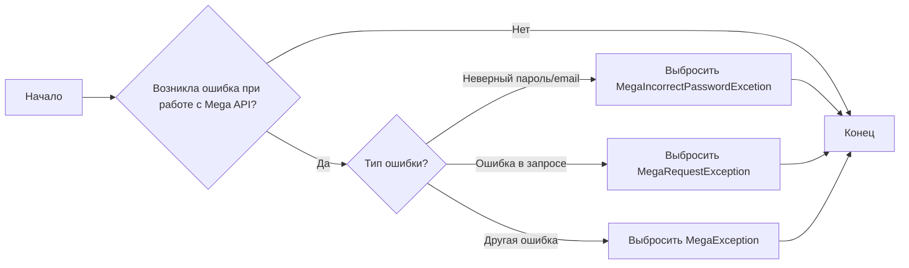
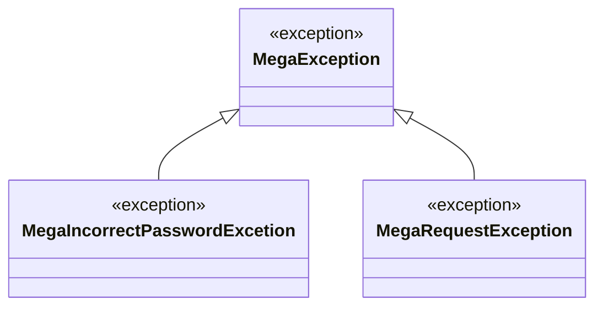

### **Анализ кода проекта `hypotez`**

=========================================================================================

#### **Расположение файла в проекте**:
- `hypotez/src/endpoints/bots/google_drive/mega/exceptions.py`
Файл содержит определения пользовательских исключений, специфичных для работы с Mega API в контексте Google Drive. Эти исключения используются для обработки ошибок, возникающих при взаимодействии с Mega API.

---

### **1. Блок-схема**:



**Примеры для каждого логического блока**:

- **A (Начало)**: Начало выполнения операций, связанных с Mega API.
- **B (Возникла ошибка при работе с Mega API?)**: Проверка, произошла ли ошибка во время взаимодействия с Mega API. Например, при попытке авторизации или загрузки файла.
- **C (Тип ошибки?)**: Определение типа возникшей ошибки. Это может быть неверный пароль, ошибка в запросе или другая специфическая ошибка.
- **D (Выбросить MegaIncorrectPasswordExcetion)**: Если ошибка связана с неверным паролем или email, выбрасывается исключение `MegaIncorrectPasswordExcetion`.
    - *Пример*: `raise MegaIncorrectPasswordExcetion("Неверный пароль или email")`
- **E (Выбросить MegaRequestException)**: Если произошла ошибка в запросе к Mega API, выбрасывается исключение `MegaRequestException`.
    - *Пример*: `raise MegaRequestException("Ошибка при выполнении запроса к Mega API")`
- **F (Выбросить MegaException)**: Если произошла другая ошибка, не подпадающая под конкретные типы, выбрасывается общее исключение `MegaException`.
    - *Пример*: `raise MegaException("Неизвестная ошибка при работе с Mega API")`
- **G (Конец)**: Завершение обработки ошибок.

---

### **2. Диаграмма**:



**Объяснение зависимостей**:

- **MegaException**: Базовый класс исключений для всех ошибок, связанных с Mega API.
- **MegaIncorrectPasswordExcetion**: Подкласс `MegaException`, представляющий ошибку, связанную с неверным паролем или email.
- **MegaRequestException**: Подкласс `MegaException`, представляющий ошибку, связанную с запросами к Mega API.

Все исключения наследуются от базового класса `Exception`, что позволяет обрабатывать их единообразно.

---

### **3. Объяснение**:

#### **Импорты**:
- Отсутствуют импорты.

#### **Классы**:
- **`MegaException(Exception)`**:
    - **Роль**: Базовый класс для всех исключений, связанных с Mega API.
    - **Атрибуты**: Отсутствуют.
    - **Методы**: Отсутствуют.
    - **Взаимодействие**: Используется как родительский класс для более специфичных исключений, таких как `MegaIncorrectPasswordExcetion` и `MegaRequestException`.

- **`MegaIncorrectPasswordExcetion(MegaException)`**:
    - **Роль**: Представляет исключение, возникающее при неверном пароле или email.
    - **Атрибуты**: Отсутствуют.
    - **Методы**: Отсутствуют.
    - **Взаимодействие**: Наследуется от `MegaException` и используется для обработки ошибок аутентификации.
    - **Пример**:
    ```python
    try:
        # Попытка аутентификации
        ...
    except Exception as e:
        raise MegaIncorrectPasswordExcetion("Неверный пароль или email") from e
    ```

- **`MegaRequestException(MegaException)`**:
    - **Роль**: Представляет исключение, возникающее при ошибке в запросе к Mega API.
    - **Атрибуты**: Отсутствуют.
    - **Методы**: Отсутствуют.
    - **Взаимодействие**: Наследуется от `MegaException` и используется для обработки ошибок, связанных с запросами.
    - **Пример**:
    ```python
    try:
        # Выполнение запроса к Mega API
        ...
    except Exception as e:
        raise MegaRequestException("Ошибка при выполнении запроса к Mega API") from e
    ```

#### **Функции**:
- Отсутствуют.

#### **Переменные**:
- Отсутствуют.

#### **Потенциальные ошибки или области для улучшения**:
- **Отсутствие обработки исключений**: В коде не представлены примеры обработки данных исключений. Рекомендуется добавить блоки `try...except` для перехвата и обработки этих исключений в местах их возникновения.
- **Отсутствие логирования**: Не предусмотрено логирование ошибок. Рекомендуется добавить логирование для упрощения отладки и анализа проблем.

#### **Цепочка взаимосвязей с другими частями проекта**:
- Данные исключения используются в модулях, взаимодействующих с Mega API (например, загрузка/выгрузка файлов, управление аккаунтом). Они позволяют унифицировать обработку ошибок и предоставлять более информативные сообщения об ошибках.