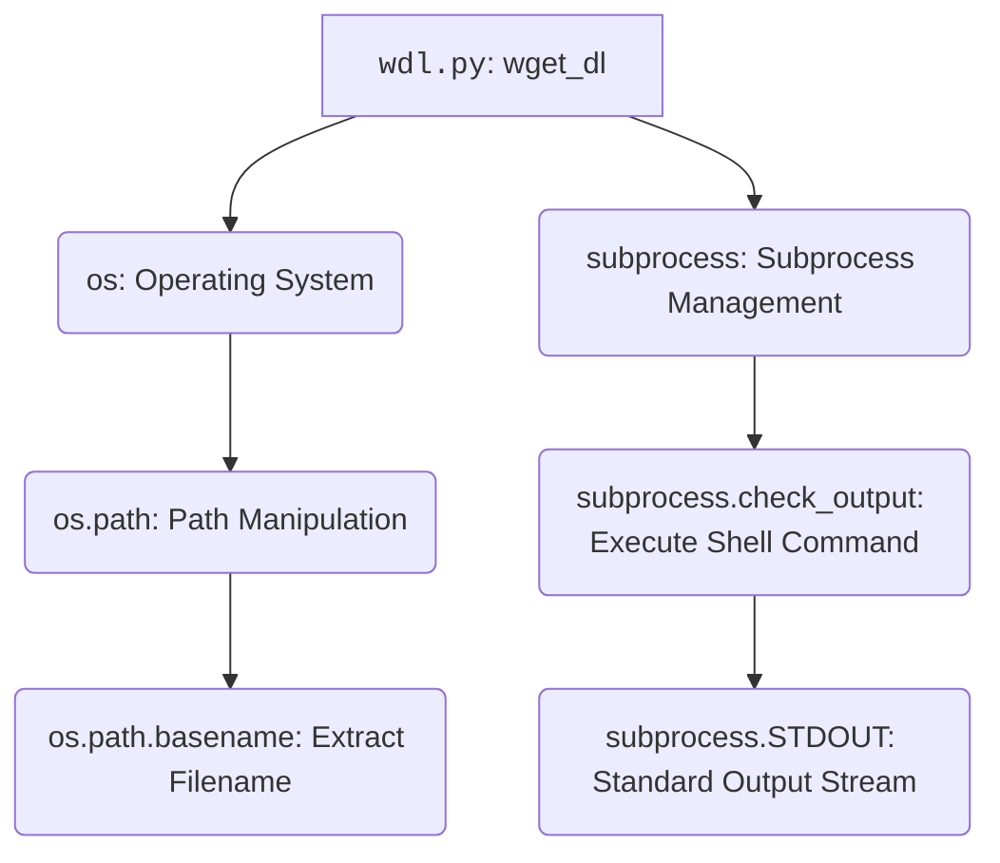

### **Системные инструкции для обработки кода проекта `hypotez`**

=========================================================================================

Описание функциональности и правил для генерации, анализа и улучшения кода. Направлено на обеспечение последовательного и читаемого стиля кодирования, соответствующего требованиям.

---

### **Основные принципы**

#### **1. Общие указания**:
- Соблюдай четкий и понятный стиль кодирования.
- Все изменения должны быть обоснованы и соответствовать установленным требованиям.

#### **2. Комментарии**:
- Используй `#` для внутренних комментариев.
- Документация всех функций, методов и классов должна следовать такому формату: 
    ```python
        def function(param: str, param1: Optional[str | dict | str] = None) -> dict | None:
            """ 
            Args:
                param (str): Описание параметра `param`.
                param1 (Optional[str | dict | str], optional): Описание параметра `param1`. По умолчанию `None`.
    
            Returns:
                dict | None: Описание возвращаемого значения. Возвращает словарь или `None`.
    
            Raises:
                SomeError: Описание ситуации, в которой возникает исключение `SomeError`.

            Ехаmple:
                >>> function('param', 'param1')
                {'param': 'param1'}
            """
    ```
- Комментарии и документация должны быть четкими, лаконичными и точными.

#### **3. Форматирование кода**:
- Используй одинарные кавычки. `a:str = 'value'`, `print('Hello World!')`;
- Добавляй пробелы вокруг операторов. Например, `x = 5`;
- Все параметры должны быть аннотированы типами. `def function(param: str, param1: Optional[str | dict | str] = None) -> dict | None:`;
- Не используй `Union`. Вместо этого используй `|`.

#### **4. Логирование**:
- Для логгирования Всегда Используй модуль `logger` из `src.logger.logger`.
- Ошибки должны логироваться с использованием `logger.error`.
Пример:
    ```python
        try:
            ...
        except Exception as ex:
            logger.error('Error while processing data', ех, exc_info=True)
    ```
#### **5 Не используй `Union[]` в коде. Вместо него используй `|`
Например:
```python
x: str | int ...
```


---

### **Основные требования**:

#### **1. Формат ответов в Markdown**:
- Все ответы должны быть выполнены в формате **Markdown**.

#### **2. Формат комментариев**:
- Используй указанный стиль для комментариев и документации в коде.
- Пример:

```python
from typing import Generator, Optional, List
from pathlib import Path


def read_text_file(
    file_path: str | Path,
    as_list: bool = False,
    extensions: Optional[List[str]] = None,
    chunk_size: int = 8192,
) -> Generator[str, None, None] | str | None:
    """
    Считывает содержимое файла (или файлов из каталога) с использованием генератора для экономии памяти.

    Args:
        file_path (str | Path): Путь к файлу или каталогу.
        as_list (bool): Если `True`, возвращает генератор строк.
        extensions (Optional[List[str]]): Список расширений файлов для чтения из каталога.
        chunk_size (int): Размер чанков для чтения файла в байтах.

    Returns:
        Generator[str, None, None] | str | None: Генератор строк, объединенная строка или `None` в случае ошибки.

    Raises:
        Exception: Если возникает ошибка при чтении файла.

    Example:
        >>> from pathlib import Path
        >>> file_path = Path('example.txt')
        >>> content = read_text_file(file_path)
        >>> if content:
        ...    print(f'File content: {content[:100]}...')
        File content: Example text...
    """
    ...
```
- Всегда делай подробные объяснения в комментариях. Избегай расплывчатых терминов, 
- таких как *«получить»* или *«делать»*
-  . Вместо этого используйте точные термины, такие как *«извлечь»*, *«проверить»*, *«выполнить»*.
- Вместо: *«получаем»*, *«возвращаем»*, *«преобразовываем»* используй имя объекта *«функция получае»*, *«переменная возвращает»*, *«код преобразовывает»* 
- Комментарии должны непосредственно предшествовать описываемому блоку кода и объяснять его назначение.

#### **3. Пробелы вокруг операторов присваивания**:
- Всегда добавляйте пробелы вокруг оператора `=`, чтобы повысить читаемость.
- Примеры:
  - **Неправильно**: `x=5`
  - **Правильно**: `x = 5`

#### **4. Использование `j_loads` или `j_loads_ns`**:
- Для чтения JSON или конфигурационных файлов замените стандартное использование `open` и `json.load` на `j_loads` или `j_loads_ns`.
- Пример:

```python
# Неправильно:
with open('config.json', 'r', encoding='utf-8') as f:
    data = json.load(f)

# Правильно:
data = j_loads('config.json')
```

#### **5. Сохранение комментариев**:
- Все существующие комментарии, начинающиеся с `#`, должны быть сохранены без изменений в разделе «Улучшенный код».
- Если комментарий кажется устаревшим или неясным, не изменяйте его. Вместо этого отметьте его в разделе «Изменения».

#### **6. Обработка `...` в коде**:
- Оставляйте `...` как указатели в коде без изменений.
- Не документируйте строки с `...`.
```

#### **7. Аннотации**
Для всех переменных должны быть определены аннотации типа. 
Для всех функций все входные и выходные параметры аннотириваны
Для все параметров должны быть аннотации типа.


### **8. webdriver**
В коде используется webdriver. Он импртируется из модуля `webdriver` проекта `hypotez`
```python
from src.webdirver import Driver, Chrome, Firefox, Playwright, ...
driver = Driver(Firefox)

Пoсле чего может использоваться как

close_banner = {
  "attribute": null,
  "by": "XPATH",
  "selector": "//button[@id = 'closeXButton']",
  "if_list": "first",
  "use_mouse": false,
  "mandatory": false,
  "timeout": 0,
  "timeout_for_event": "presence_of_element_located",
  "event": "click()",
  "locator_description": "Закрываю pop-up окно, если оно не появилось - не страшно (`mandatory`:`false`)"
}

result = driver.execute_locator(close_banner)
```

## Анализ кода `hypotez/src/endpoints/bots/google_drive/plugins/wdl.py`

### 1. Блок-схема

```mermaid
graph TD
    A[Начало: Вызов функции wget_dl(url)] --> B{try:};
    B --> C{Печать "Downloading Started"};
    C --> D[Извлечение имени файла: filename = os.path.basename(url)];
    D --> E[Выполнение команды wget: subprocess.check_output(...)];
    E --> F{Печать "Downloading Complete" и имя файла};
    F --> G[Возврат имени файла: return filename];
    B --> H{except Exception as e:};
    H --> I{Печать "DOWNLAOD ERROR :" и сообщение об ошибке};
    I --> J[Возврат "error" и имени файла: return "error", filename];
```

**Описание блок-схемы:**

1.  **Начало**: Функция `wget_dl(url)` вызывается с URL в качестве аргумента.
2.  **try**: Блок `try` пытается выполнить код загрузки файла.
3.  **Печать "Downloading Started"**: Выводит сообщение о начале загрузки.
4.  **Извлечение имени файла**: Использует `os.path.basename(url)` для получения имени файла из URL.
    *Пример:* Если `url` равен `'https://example.com/file.txt'`, то `filename` будет `'file.txt'`.
5.  **Выполнение команды wget**: Использует `subprocess.check_output` для выполнения команды `wget` в командной строке.
    *Пример:* `subprocess.check_output("wget '--output-document' 'file.txt' 'https://example.com/file.txt'", ...)`
6.  **Печать "Downloading Complete" и имя файла**: Выводит сообщение об успешном завершении загрузки и имя файла.
7.  **Возврат имени файла**: Возвращает имя загруженного файла.
8.  **except Exception as e**: Если в блоке `try` возникает исключение, управление передается в блок `except`.
9.  **Печать "DOWNLAOD ERROR :" и сообщение об ошибке**: Выводит сообщение об ошибке и информацию об исключении.
10. **Возврат "error" и имени файла**: Возвращает кортеж `("error", filename)`, указывающий на ошибку загрузки и имя файла.

### 2. Диаграмма зависимостей



**Объяснение зависимостей:**

*   **`wdl.py: wget_dl`**: Функция `wget_dl` является основной функцией в файле `wdl.py`, отвечающей за загрузку файла по URL.
*   **`os: Operating System`**: Модуль `os` предоставляет функции для взаимодействия с операционной системой. В данном случае используется для манипуляции с путями к файлам.
*   **`subprocess: Subprocess Management`**: Модуль `subprocess` позволяет запускать новые процессы и получать доступ к их входным/выходным потокам и кодам возврата. Здесь он используется для вызова команды `wget`.
*   **`os.path: Path Manipulation`**: Подмодуль `os.path` предоставляет функции для работы с путями к файлам и каталогам.
*   **`os.path.basename: Extract Filename`**: Функция `os.path.basename` извлекает имя файла из полного пути.
*   **`subprocess.check_output: Execute Shell Command`**: Функция `subprocess.check_output` выполняет команду в командной строке и возвращает вывод команды.
*   **`subprocess.STDOUT: Standard Output Stream`**: Атрибут `subprocess.STDOUT` перенаправляет стандартный поток вывода в `subprocess.check_output`, чтобы можно было получить вывод команды.

### 3. Объяснение кода

**Импорты:**

*   `import os`: Модуль `os` предоставляет функции для взаимодействия с операционной системой, такие как работа с файловой системой (создание, удаление, переименование файлов и каталогов), получение информации о системе, выполнение команд операционной системы и другие. В данном коде используется для извлечения имени файла из URL с помощью `os.path.basename`.
*   `import subprocess`: Модуль `subprocess` позволяет запускать новые процессы, подключаться к их входным/выходным/ошибочным потокам и получать их коды возврата.  В данном коде используется для выполнения команды `wget` через `subprocess.check_output`.

**Функции:**

*   `wget_dl(url: str) -> tuple[str, str] | str`:
    *   **Аргументы:**
        *   `url` (str): URL-адрес файла для загрузки.
    *   **Возвращаемое значение:**
        *   `tuple[str, str] | str`: В случае успеха возвращает имя файла (str). В случае ошибки возвращает кортеж `("error", filename)`, где filename - имя файла.
    *   **Назначение:**
        *   Функция `wget_dl` загружает файл по указанному URL, используя команду `wget`.  Она извлекает имя файла из URL, выполняет команду `wget` для загрузки файла и возвращает имя файла или сообщение об ошибке.
    *   **Пример:**

        ```python
        filename = wget_dl('https://example.com/file.txt')
        if filename == "error":
           print("file wasn't downloaded")
        else:
           print(f'Файл {filename} успешно загружен.')
        ```

**Переменные:**

*   `filename (str)`: Имя файла, извлеченное из URL с помощью `os.path.basename(url)`.
*   `output (bytes)`: Вывод команды `wget`, полученный с помощью `subprocess.check_output`.  Содержит информацию о процессе загрузки.
*   `e (Exception)`: Объект исключения, который возникает в случае ошибки при выполнении команды `wget`.

**Потенциальные ошибки и области для улучшения:**

1.  **Отсутствие аннотаций типов:** В коде отсутствуют аннотации типов для аргументов функции и возвращаемого значения.  Это может затруднить понимание кода и привести к ошибкам.
2.  **Обработка ошибок:** В случае ошибки функция возвращает строку "error" вместе с именем файла.  Было бы лучше использовать исключения для обработки ошибок, чтобы вызывающий код мог более гибко обрабатывать ошибки.
3.  **Безопасность:** Использование `shell=True` в `subprocess.check_output` может быть небезопасным, если `url` содержит вредоносный код.  Рекомендуется избегать `shell=True` и передавать аргументы команды `wget` в виде списка.
4.  **Логирование:** Вместо `print` следует использовать модуль `logger` из `src.logger.logger` для логирования сообщений.

**Цепочка взаимосвязей с другими частями проекта:**

*   Этот код, вероятно, используется в плагине для Google Drive, чтобы загружать файлы из интернета с помощью `wget`.  Он может быть частью более крупной системы, которая автоматизирует работу с файлами в Google Drive.
*   `wdl.py` находится в `hypotez/src/endpoints/bots/google_drive/plugins/`.  Это указывает на то, что он является плагином для бота, работающего с Google Drive. Бот, вероятно, использует этот плагин для загрузки файлов по URL, указанным пользователем.