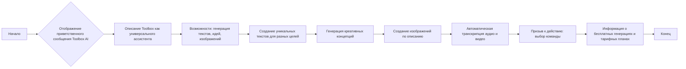

### **Анализ кода проекта `hypotez`**

=========================================================================================

#### **Описание функциональности**

Предоставленный код представляет собой HTML-разметку, описывающую приветственное сообщение для AI-ассистента под названием Toolbox. Это сообщение предназначено для отображения в интерфейсе бота Telegram, объясняет его функциональность и предлагает пользователю начать работу.

---

#### **1. Блок-схема**

**Пошаговое объяснение блок-схемы:**

1.  **Начало**: Процесс начинается с отображения приветственного сообщения.
2.  **Отображение приветственного сообщения Toolbox AI**: Представляет заголовок и приветствие пользователя.
3.  **Описание Toolbox как универсального ассистента**: Объясняет, что Toolbox является универсальным инструментом для генерации контента.
4.  **Возможности: генерация текстов, идей, изображений**: Описывает основные функции Toolbox.
    *   *Пример*: Генерация текста для SMM-поста, предложение креативной идеи для рекламной кампании, создание изображения для иллюстрации.
5.  **Создание уникальных текстов для разных целей**: Указывает на возможность создания текстов для SMM, email-рассылок, SEO и рекламы.
    *   *Пример*: Пользователь вводит тему "Новая акция", Toolbox генерирует текст для SMM-поста.
6.  **Генерация креативных концепций**: Подчеркивает способность Toolbox предлагать новые идеи.
    *   *Пример*: Пользователь запрашивает идеи для продвижения продукта, Toolbox предлагает несколько концепций.
7.  **Создание изображений по описанию**: Указывает на возможность генерации изображений на основе текстового описания.
    *   *Пример*: Пользователь вводит описание "Летний пейзаж", Toolbox генерирует соответствующее изображение.
8.  **Автоматическая транскрипция аудио и видео**: Предлагает функцию транскрипции для подкастов, вебинаров и видео.
    *   *Пример*: Пользователь загружает запись вебинара, Toolbox автоматически преобразует ее в текст.
9.  **Призыв к действию: выбор команды**: Предлагает пользователю выбрать команду для начала работы.
10. **Информация о бесплатных генерациях и тарифных планах**: Сообщает о наличии бесплатных генераций и возможности выбора тарифного плана.
11. **Конец**: Завершение процесса.

---

#### **2. Диаграмма**

В предоставленном коде нет импортов или зависимостей, поэтому диаграмма зависимостей не требуется. Код представляет собой статическую HTML-разметку.

---

#### **3. Объяснение**

##### **Общее описание**

Код представляет собой HTML-разметку, предназначенную для отображения приветственного сообщения бота Telegram под названием Toolbox AI. Сообщение описывает возможности бота, такие как генерация текстов, идей и изображений, а также предлагает пользователю начать работу.

##### **Элементы кода**

*   `<h1>Toolbox AI</h1>`: Заголовок первого уровня, отображающий название бота.
*   `<h3>🛠 Welcome to Toolbox! This is a universal assistant that can generate content for various work tasks!</h3>`: Заголовок третьего уровня, приветствующий пользователя и описывающий Toolbox как универсального ассистента.
*   `
...
`: Параграфы, содержащие подробное описание функциональности бота, его возможностей и призыв к действию.

##### **Функциональность**

1.  **Приветствие**: Бот приветствует пользователя и представляет себя как Toolbox AI.
2.  **Описание возможностей**: Бот описывает свои основные функции:
    *   Генерация текстов для SMM, email-рассылок, SEO и рекламы.
    *   Генерация креативных концепций.
    *   Создание изображений по текстовому описанию.
    *   Автоматическая транскрипция аудио и видео.
3.  **Призыв к действию**: Бот предлагает пользователю выбрать команду для начала работы.
4.  **Информация о тарифах**: Бот сообщает о наличии бесплатных генераций и возможности выбора тарифного плана.

##### **Потенциальные улучшения**

*   **Локализация**: Добавить поддержку разных языков для приветственного сообщения.
*   **Интерактивность**: Добавить кнопки или ссылки для быстрого доступа к основным функциям бота.
*   **Персонализация**: Персонализировать приветственное сообщение на основе данных о пользователе.

##### **Взаимосвязь с другими частями проекта**

Данный код является частью интерфейса пользователя бота Telegram. Он может быть связан с модулями, отвечающими за обработку команд пользователя, генерацию контента и управление тарифными планами.