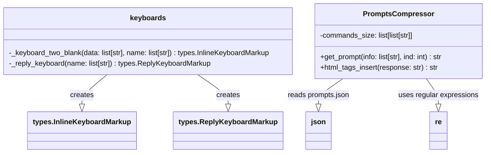

### **Системные инструкции для обработки кода проекта `hypotez`**

=========================================================================================

Описание функциональности и правил для генерации, анализа и улучшения кода. Направлено на обеспечение последовательного и читаемого стиля кодирования, соответствующего требованиям.

---

### **Основные принципы**

#### **1. Общие указания**:
- Соблюдай четкий и понятный стиль кодирования.
- Все изменения должны быть обоснованы и соответствовать установленным требованиям.

#### **2. Комментарии**:
- Используй `#` для внутренних комментариев.
- Документация всех функций, методов и классов должна следовать такому формату: 
    ```python
        def function(param: str, param1: Optional[str | dict | str] = None) -> dict | None:
            """ 
            Args:
                param (str): Описание параметра `param`.
                param1 (Optional[str | dict | str], optional): Описание параметра `param1`. По умолчанию `None`.
    
            Returns:
                dict | None: Описание возвращаемого значения. Возвращает словарь или `None`.
    
            Raises:
                SomeError: Описание ситуации, в которой возникает исключение `SomeError`.

            Ехаmple:
                >>> function('param', 'param1')
                {'param': 'param1'}
            """
    ```
- Комментарии и документация должны быть четкими, лаконичными и точными.

#### **3. Форматирование кода**:
- Используй одинарные кавычки. `a:str = 'value'`, `print('Hello World!')`;
- Добавляй пробелы вокруг операторов. Например, `x = 5`;
- Все параметры должны быть аннотированы типами. `def function(param: str, param1: Optional[str | dict | str] = None) -> dict | None:`;
- Не используй `Union`. Вместо этого используй `|`.

#### **4. Логирование**:
- Для логгирования Всегда Используй модуль `logger` из `src.logger.logger`.
- Ошибки должны логироваться с использованием `logger.error`.
Пример:
    ```python
        try:
            ...
        except Exception as ex:
            logger.error('Error while processing data', ех, exc_info=True)
    ```
#### **5 Не используй `Union[]` в коде. Вместо него используй `|`
Например:
```python
x: str | int ...
```


---

### **Основные требования**:

#### **1. Формат ответов в Markdown**:
- Все ответы должны быть выполнены в формате **Markdown**.

#### **2. Формат комментариев**:
- Используй указанный стиль для комментариев и документации в коде.
- Пример:

```python
from typing import Generator, Optional, List
from pathlib import Path


def read_text_file(
    file_path: str | Path,
    as_list: bool = False,
    extensions: Optional[List[str]] = None,
    chunk_size: int = 8192,
) -> Generator[str, None, None] | str | None:
    """
    Считывает содержимое файла (или файлов из каталога) с использованием генератора для экономии памяти.

    Args:
        file_path (str | Path): Путь к файлу или каталогу.
        as_list (bool): Если `True`, возвращает генератор строк.
        extensions (Optional[List[str]]): Список расширений файлов для чтения из каталога.
        chunk_size (int): Размер чанков для чтения файла в байтах.

    Returns:
        Generator[str, None, None] | str | None: Генератор строк, объединенная строка или `None` в случае ошибки.

    Raises:
        Exception: Если возникает ошибка при чтении файла.

    Example:
        >>> from pathlib import Path
        >>> file_path = Path('example.txt')
        >>> content = read_text_file(file_path)
        >>> if content:
        ...    print(f'File content: {content[:100]}...')
        File content: Example text...
    """
    ...
```
- Всегда делай подробные объяснения в комментариях. Избегай расплывчатых терминов, 
- таких как *«получить»* или *«делать»*. Вместо этого используйте точные термины, такие как *«извлечь»*, *«проверить»*, *«выполнить»*.
- Вместо: *«получаем»*, *«возвращаем»*, *«преобразовываем»* используй имя объекта *«функция получае»*, *«переменная возвращает»*, *«код преобразовывает»* 
- Комментарии должны непосредственно предшествовать описываемому блоку кода и объяснять его назначение.

#### **3. Пробелы вокруг операторов присваивания**:
- Всегда добавляйте пробелы вокруг оператора `=`, чтобы повысить читаемость.
- Примеры:
  - **Неправильно**: `x=5`
  - **Правильно**: `x = 5`

#### **4. Использование `j_loads` или `j_loads_ns`**:
- Для чтения JSON или конфигурационных файлов замените стандартное использование `open` и `json.load` на `j_loads` или `j_loads_ns`.
- Пример:

```python
# Неправильно:
with open('config.json', 'r', encoding='utf-8') as f:
    data = json.load(f)

# Правильно:
data = j_loads('config.json')
```

#### **5. Сохранение комментариев**:
- Все существующие комментарии, начинающиеся с `#`, должны быть сохранены без изменений в разделе «Улучшенный код».
- Если комментарий кажется устаревшим или неясным, не изменяйте его. Вместо этого отметьте его в разделе «Изменения».

#### **6. Обработка `...` в коде**:
- Оставляйте `...` как указатели в коде без изменений.
- Не документируйте строки с `...`.
```

#### **7. Аннотации**
Для всех переменных должны быть определены аннотации типа. 
Для всех функций все входные и выходные параметры аннотириваны
Для все параметров должны быть аннотации типа.


### **8. webdriver**
В коде используется webdriver. Он импртируется из модуля `webdriver` проекта `hypotez`
```python
from src.webdirver import Driver, Chrome, Firefox, Playwright, ...
driver = Driver(Firefox)

Пoсле чего может использоваться как

close_banner = {
  "attribute": null,
  "by": "XPATH",
  "selector": "//button[@id = 'closeXButton']",
  "if_list": "first",
  "use_mouse": false,
  "mandatory": false,
  "timeout": 0,
  "timeout_for_event": "presence_of_element_located",
  "event": "click()",
  "locator_description": "Закрываю pop-up окно, если оно не появилось - не страшно (`mandatory`:`false`)"
}

result = driver.execute_locator(close_banner)
```

## Анализ кода `hypotez/src/endpoints/bots/telegram/ToolBoxbot-main/ToolBox/BaseSettings/AuxiliaryClasses.py`

### 1. Блок-схема

```mermaid
graph LR
    A[Начало] --> B(Класс `keyboards`:);
    B --> C{Метод `_keyboard_two_blank`};
    C --> D[Создание клавиатуры `types.InlineKeyboardMarkup`];
    D --> E{Создание кнопок `types.InlineKeyboardButton` в цикле};
    E --> F{Проверка четности количества кнопок};
    F -- Да --> G[Добавление кнопок парами];
    F -- Нет --> H[Добавление кнопок парами, последняя кнопка отдельно];
    G --> I[Возврат клавиатуры];
    H --> I
    B --> J{Метод `_reply_keyboard`};
    J --> K[Создание клавиатуры `types.ReplyKeyboardMarkup`];
    K --> L{Создание кнопок `types.KeyboardButton` в цикле};
    L --> M[Добавление кнопок на клавиатуру];
    M --> N[Возврат клавиатуры];
    A --> O(Класс `PromptsCompressor`:);
    O --> P{Метод `__init__`};
    P --> Q[Инициализация `commands_size`];
    O --> R{Метод `get_prompt`};
    R --> S[Открытие и загрузка `prompts.json`];
    S --> T{Замена плейсхолдеров в `commands`];
    T --> U[Возврат `commands`];
    O --> V{Метод `html_tags_insert`};
    V --> W[Определение шаблонов для замены HTML тегов];
    W --> X{Замена шаблонов в `response` с использованием `re.sub`];
    X --> Y[Возврат `response`];
    I --> Z[Конец];
    N --> Z;
    U --> Z;
    Y --> Z;
```

### 2. Диаграмма



#### Объяснение зависимостей `mermaid`:

-   `keyboards` использует `types.InlineKeyboardMarkup` и `types.ReplyKeyboardMarkup` из библиотеки `telebot` для создания различных типов клавиатур для Telegram-бота.
-   `PromptsCompressor` использует `json` для чтения данных из файла `prompts.json`, который содержит текстовые шаблоны.
-   `PromptsCompressor` использует `re` (модуль регулярных выражений) для поиска и замены HTML-тегов в текстовых ответах.

### 3. Объяснение

#### Импорты:

*   `json`: Используется для работы с JSON-файлами, в частности, для чтения файла `prompts.json`.
*   `re`: Используется для работы с регулярными выражениями, необходимо для поиска и замены HTML-тегов в методе `html_tags_insert`.
*   `telebot`:  Используется для создания Telegram ботов.  `types` из `telebot` предоставляет классы для создания различных типов клавиатур.

#### Класс `keyboards`:

*   Роль: Предоставляет методы для создания различных типов клавиатур для Telegram-бота.
*   Методы:
    *   `_keyboard_two_blank(self, data: list[str], name: list[str]) -> types.InlineKeyboardMarkup`:
        *   Аргументы:
            *   `data`: Список строк, используемых как `callback_data` для кнопок.
            *   `name`: Список строк, используемых в качестве текста на кнопках.
        *   Возвращаемое значение: `types.InlineKeyboardMarkup` – объект инлайн-клавиатуры.
        *   Назначение: Создает инлайн-клавиатуру с кнопками, расположенными в два столбца.
    *   `_reply_keyboard(self, name: list[str])`:
        *   Аргументы:
            *   `name`: Список строк, используемых в качестве текста на кнопках.
        *   Возвращаемое значение: `types.ReplyKeyboardMarkup` – объект обычной клавиатуры.
        *   Назначение: Создает обычную клавиатуру (отображается внизу экрана мессенджера) с кнопками.

#### Класс `PromptsCompressor`:

*   Роль: Отвечает за получение и обработку текстовых подсказок (prompts) для бота.
*   Атрибуты:
    *   `commands_size`: Список списков строк.  Определяет, какие параметры (ключевые слова) должны быть заменены в текстовых шаблонах.
*   Методы:
    *   `__init__(self)`:
        *   Назначение: Инициализирует атрибут `commands_size`.
    *   `get_prompt(self, info: list[str], ind: int) -> str`:
        *   Аргументы:
            *   `info`: Список строк, содержащих значения для замены в текстовом шаблоне.
            *   `ind`: Индекс, указывающий, какой шаблон использовать из файла `prompts.json`.
        *   Возвращаемое значение: Строка – готовый текст подсказки (prompt).
        *   Назначение:  Загружает шаблон из `prompts.json` и заменяет в нем плейсхолдеры на значения из списка `info`.
    *   `html_tags_insert(response: str) -> str`:
        *   Аргументы:
            *   `response`: Строка, в которой нужно заменить HTML-теги.
        *   Возвращаемое значение: Строка с замененными HTML-тегами.
        *   Назначение: Использует регулярные выражения для поиска и замены определенных шаблонов в строке `response` на соответствующие HTML-теги.  Это позволяет форматировать текст, отправляемый ботом.

#### Переменные:

*   `keyboard` (в методах `_keyboard_two_blank` и `_reply_keyboard`): Объекты, представляющие клавиатуры разных типов.
*   `buttons` (в методах `_keyboard_two_blank` и `_reply_keyboard`): Списки объектов `InlineKeyboardButton` или `KeyboardButton`, представляющие кнопки на клавиатуре.
*   `markup` (в методе `_reply_keyboard`): Объект `ReplyKeyboardMarkup`, представляющий клавиатуру.
*   `commands_size` (в классе `PromptsCompressor`): Список, определяющий структуру подсказок (prompts) и порядок аргументов для каждого типа подсказок.
*   `commands` (в методе `get_prompt`): Словарь, загруженный из `prompts.json`, содержащий шаблоны подсказок.
*   `patterns` (в методе `html_tags_insert`):  Список кортежей, содержащих регулярные выражения для поиска и замены, а также строки для замены.
*   `response` (в методе `html_tags_insert`):  Строка, в которой производится замена HTML-тегов.

#### Потенциальные ошибки и области для улучшения:

*   **Обработка ошибок при чтении JSON**: В методе `PromptsCompressor.get_prompt` отсутствует обработка исключений при открытии и чтении файла `prompts.json`.  Если файл не существует или имеет неверный формат, программа завершится с ошибкой.  Следует добавить блок `try...except` для обработки возможных исключений.
*   **Отсутствие аннотаций типов**: В методах классов отсутствуют аннотации типов для `self`.
*    **Использование `with open` в `PromptsCompressor.get_prompt`**: Файлы конфигурации оптимальнее читать один раз, при инициализации `PromptsCompressor`.  Это позволит избежать повторного открытия файла при каждом вызове `get_prompt`.
*   **Разделение логики**: Класс `PromptsCompressor` выполняет две разные задачи: получение подсказок и вставку HTML-тегов.  Возможно, стоит разделить его на два класса: один для работы с подсказками, другой для форматирования текста.

#### Взаимосвязи с другими частями проекта:

*   Этот файл содержит вспомогательные классы, используемые в Telegram боте `ToolBoxbot`. Класс `keyboards` предоставляет функциональность для создания кастомных клавиатур, которые используются для взаимодействия с пользователем. Класс `PromptsCompressor` управляет текстовыми подсказками, предоставляемыми ботом. Эти подсказки могут быть использованы для предоставления пользователям инструкций или помощи.

```python
import json, re
from telebot import types

# Keyboard class
class keyboards:
#Protected
    # Keyboard with 2 fields
    def _keyboard_two_blank(self, data: list[str], name: list[str]) -> types.InlineKeyboardMarkup:
        keyboard = types.InlineKeyboardMarkup(row_width=2)
        buttons = [types.InlineKeyboardButton(str(name[i]), callback_data=str(data[i])) for i in range(len(data))]
        if len(buttons) % 2 == 0:
            [keyboard.add(buttons[i], buttons[i+1]) for i in range(0, len(buttons), 2)]
        else:
            [keyboard.add(buttons[i], buttons[i+1]) for i in range(0, len(buttons)-1, 2)]
            keyboard.add(buttons[-1])
        return keyboard
    def _reply_keyboard(self, name: list[str]):
        markup = types.ReplyKeyboardMarkup(resize_keyboard=True)
        buttons = [types.KeyboardButton(el) for el in name]
        [markup.add(btn) for btn in buttons]
        return markup
    
# Promts compression class
class PromptsCompressor:
    #__Init__
    def __init__(self):
        self.commands_size = [
                            ["TOPIC", "TA", "TONE", "STRUCT", "LENGTH", "EXTRA"], ["TOPIC", "TA", "STYLE", "LENGTH"],
                            ["TOPIC", "IDEA_NUM"], ["TYPE", "TOPIC", "TA", "LENGTH", "STYLE"],
                            ["HEADLINE", "NUM"], ["TOPIC", "KEYWORDS", "INFO", "LENGTH"],
                            ["TEXT", "LENGTH", "EXTRA"], ["TEXT", "RED_TYPE", "EXTRA"]
                            ]
        
    # Promts get function
    def get_prompt(self, info: list[str], ind: int) -> str:
        with open('ToolBox/BaseSettings/prompts.json', 'r') as file:
            commands = json.load(file)['commands'][ind]
        for i, el in enumerate(self.commands_size[ind]):
            commands = commands.replace(f"[{el}]", info[i])
        return commands
    
    # HTML tags insert function
    @staticmethod
    def html_tags_insert(response: str) -> str:
        patterns = [(r'#### (.*?)\\n', r'<b><u>\\1</u></b>\\n'),
                    (r'### (.*?)\\n', r'<u>\\1</u>\\n'),
                    (r'\\*\\*(.*?)\\*\\*', r'<b>\\1</b>'),
                    (r'\\*(.*?)\\*', r'<i>\\1</i>'),
                    (r'```(\\w+)?\\n(.*?)\\n```', r'<pre><code>\\n\\2\\n</code></pre>'),
                    (r'`(.*?)`', r'<code>\\1</code>')]
        for pattern in patterns:
            response = re.sub(pattern[0], pattern[1], response, flags=re.DOTALL)
        return response