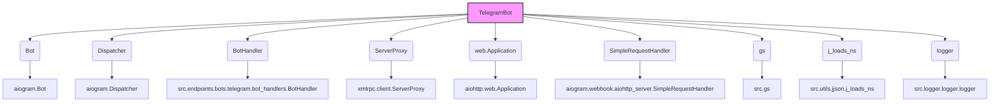
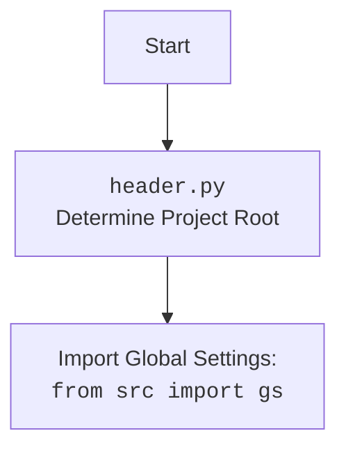

### **Системные инструкции для обработки кода проекта `hypotez`**

=========================================================================================

Описание функциональности и правил для генерации, анализа и улучшения кода. Направлено на обеспечение последовательного и читаемого стиля кодирования, соответствующего требованиям.

---

### **Основные принципы**

#### **1. Общие указания**:
- Соблюдай четкий и понятный стиль кодирования.
- Все изменения должны быть обоснованы и соответствовать установленным требованиям.

#### **2. Комментарии**:
- Используй `#` для внутренних комментариев.
- Документация всех функций, методов и классов должна следовать такому формату: 
    ```python
        def function(param: str, param1: Optional[str | dict | str] = None) -> dict | None:
            """ 
            Args:
                param (str): Описание параметра `param`.
                param1 (Optional[str | dict | str], optional): Описание параметра `param1`. По умолчанию `None`.
    
            Returns:
                dict | None: Описание возвращаемого значения. Возвращает словарь или `None`.
    
            Raises:
                SomeError: Описание ситуации, в которой возникает исключение `SomeError`.

            Ехаmple:
                >>> function('param', 'param1')
                {'param': 'param1'}
            """
    ```
- Комментарии и документация должны быть четкими, лаконичными и точными.

#### **3. Форматирование кода**:
- Используй одинарные кавычки. `a:str = 'value'`, `print('Hello World!')`;
- Добавляй пробелы вокруг операторов. Например, `x = 5`;
- Все параметры должны быть аннотированы типами. `def function(param: str, param1: Optional[str | dict | str] = None) -> dict | None:`;
- Не используй `Union`. Вместо этого используй `|`.

#### **4. Логирование**:
- Для логгирования Всегда Используй модуль `logger` из `src.logger.logger`.
- Ошибки должны логироваться с использованием `logger.error`.
Пример:
    ```python
        try:
            ...
        except Exception as ex:
            logger.error('Error while processing data', ех, exc_info=True)
    ```
#### **5 Не используй `Union[]` в коде. Вместо него используй `|`
Например:
```python
x: str | int ...
```


---

### **Основные требования**:

#### **1. Формат ответов в Markdown**:
- Все ответы должны быть выполнены в формате **Markdown**.

#### **2. Формат комментариев**:
- Используй указанный стиль для комментариев и документации в коде.
- Пример:

```python
from typing import Generator, Optional, List
from pathlib import Path


def read_text_file(
    file_path: str | Path,
    as_list: bool = False,
    extensions: Optional[List[str]] = None,
    chunk_size: int = 8192,
) -> Generator[str, None, None] | str | None:
    """
    Считывает содержимое файла (или файлов из каталога) с использованием генератора для экономии памяти.

    Args:
        file_path (str | Path): Путь к файлу или каталогу.
        as_list (bool): Если `True`, возвращает генератор строк.
        extensions (Optional[List[str]]): Список расширений файлов для чтения из каталога.
        chunk_size (int): Размер чанков для чтения файла в байтах.

    Returns:
        Generator[str, None, None] | str | None: Генератор строк, объединенная строка или `None` в случае ошибки.

    Raises:
        Exception: Если возникает ошибка при чтении файла.

    Example:
        >>> from pathlib import Path
        >>> file_path = Path('example.txt')
        >>> content = read_text_file(file_path)
        >>> if content:
        ...    print(f'File content: {content[:100]}...')
        File content: Example text...
    """
    ...
```
- Всегда делай подробные объяснения в комментариях. Избегай расплывчатых терминов, 
- таких как *«получить»* или *«делать»*. Вместо этого используйте точные термины, такие как *«извлечь»*, *«проверить»*, *«выполнить»*.
- Вместо: *«получаем»*, *«возвращаем»*, *«преобразовываем»* используй имя объекта *«функция получае»*, *«переменная возвращает»*, *«код преобразовывает»* 
- Комментарии должны непосредственно предшествовать описываемому блоку кода и объяснять его назначение.

#### **3. Пробелы вокруг операторов присваивания**:
- Всегда добавляйте пробелы вокруг оператора `=`, чтобы повысить читаемость.
- Примеры:
  - **Неправильно**: `x=5`
  - **Правильно**: `x = 5`

#### **4. Использование `j_loads` или `j_loads_ns`**:
- Для чтения JSON или конфигурационных файлов замените стандартное использование `open` и `json.load` на `j_loads` или `j_loads_ns`.
- Пример:

```python
# Неправильно:
with open('config.json', 'r', encoding='utf-8') as f:
    data = json.load(f)

# Правильно:
data = j_loads('config.json')
```

#### **5. Сохранение комментариев**:
- Все существующие комментарии, начинающиеся с `#`, должны быть сохранены без изменений в разделе «Улучшенный код».
- Если комментарий кажется устаревшим или неясным, не изменяйте его. Вместо этого отметьте его в разделе «Изменения».

#### **6. Обработка `...` в коде**:
- Оставляйте `...` как указатели в коде без изменений.
- Не документируйте строки с `...`.
```

#### **7. Аннотации**
Для всех переменных должны быть определены аннотации типа. 
Для всех функций все входные и выходные параметры аннотириваны
Для все параметров должны быть аннотации типа.


### **8. webdriver**
В коде используется webdriver. Он импртируется из модуля `webdriver` проекта `hypotez`
```python
from src.webdirver import Driver, Chrome, Firefox, Playwright, ...
driver = Driver(Firefox)

Пoсле чего может использоваться как

close_banner = {
  "attribute": null,
  "by": "XPATH",
  "selector": "//button[@id = 'closeXButton']",
  "if_list": "first",
  "use_mouse": false,
  "mandatory": false,
  "timeout": 0,
  "timeout_for_event": "presence_of_element_located",
  "event": "click()",
  "locator_description": "Закрываю pop-up окно, если оно не появилось - не страшно (`mandatory`:`false`)"
}

result = driver.execute_locator(close_banner)
```

## Анализ кода `hypotez/src/endpoints/bots/telegram/bot_aiogram.py`

### 1. Блок-схема

```mermaid
graph TD
    A[Начало] --> B{Инициализация TelegramBot};
    B --> C{Инициализация RPC Client};
    C --> D{Запуск RPC сервера};
    D --> E{Инициализация Webhook};
    E --> F{Регистрация Route через RPC};
    F --> G{Настройка Web Application};
    G --> H{Регистрация обработчика Webhook};
    H --> I{Запуск Web Application};
    I --> J[Регистрация Default handlers];
    J --> K{Обработка сообщений};
    K --> L{Инициализация Bot Webhook};
    L --> M{Регистрация Route через RPC};
    M --> N{Остановка};

    subgraph Инициализация TelegramBot
    B1[token: str] --> B2[route: str = 'telegram_webhook'];
    B2 --> B3[config: SimpleNamespace];
    B3 --> B4[bot: Bot];
    B4 --> B5[dp: Dispatcher];
    B5 --> B6[bot_handler: BotHandler];
    end

    subgraph Инициализация RPC Client
    C1[port: int = 9000] --> C2[rpc_client: ServerProxy];
    end

    subgraph Регистрация Default handlers
    J1[dp.message.register(bot_handler.start, Command('start'))] --> J2[dp.message.register(bot_handler.help_command, Command('help'))];
    J2 --> J3[dp.message.register(bot_handler.send_pdf, Command('sendpdf'))];
    J3 --> J4[dp.message.register(_handle_message)];
    J4 --> J5[dp.message.register(bot_handler.handle_voice, lambda message: message.voice is not None)];
    J5 --> J6[dp.message.register(bot_handler.handle_document, lambda message: message.document is not None)];
    J6 --> J7[dp.message.register(bot_handler.handle_log, lambda message: message.text is not None)];
    end

    style B fill:#f9f,stroke:#333,stroke-width:2px
    style C fill:#f9f,stroke:#333,stroke-width:2px
    style D fill:#f9f,stroke:#333,stroke-width:2px
    style E fill:#f9f,stroke:#333,stroke-width:2px
    style F fill:#f9f,stroke:#333,stroke-width:2px
    style G fill:#f9f,stroke:#333,stroke-width:2px
    style H fill:#f9f,stroke:#333,stroke-width:2px
    style I fill:#f9f,stroke:#333,stroke-width:2px
    style J fill:#f9f,stroke:#333,stroke-width:2px
    style K fill:#f9f,stroke:#333,stroke-width:2px
    style L fill:#f9f,stroke:#333,stroke-width:2px
    style M fill:#f9f,stroke:#333,stroke-width:2px
    style N fill:#f9f,stroke:#333,stroke-width:2px
```

### 2. Диаграмма



**Объяснение зависимостей:**

-   `TelegramBot` зависит от `Bot` (aiogram), `Dispatcher` (aiogram), `BotHandler` (src.endpoints.bots.telegram), `ServerProxy` (xmlrpc.client), `web.Application` (aiohttp), `SimpleRequestHandler` (aiogram.webhook.aiohttp_server), `gs` (src), `j_loads_ns` (src.utils.jjson) и `logger` (src.logger.logger).
-   `Bot` и `Dispatcher` являются компонентами библиотеки `aiogram`, используемыми для управления ботом и обработки событий.
-   `BotHandler` отвечает за обработку конкретных команд и сообщений, получаемых ботом.
-   `ServerProxy` используется для организации RPC-взаимодействия с сервером.
-   `web.Application` предоставляет веб-сервер для обработки webhook-запросов.
-   `SimpleRequestHandler` обрабатывает входящие webhook-запросы от Telegram.
-   `gs` (Global settings) содержит глобальные настройки приложения, такие как хост и порт.
-   `j_loads_ns` используется для загрузки конфигурации из JSON-файла в виде namespace.
-   `logger` используется для логирования событий и ошибок.



### 3. Объяснение

**Импорты:**

*   `asyncio`: Используется для асинхронного программирования.
*   `sys`: Предоставляет доступ к некоторым переменным и функциям, взаимодействующим с интерпретатором Python.
*   `os`: Предоставляет функции для взаимодействия с операционной системой.
*   `SimpleNamespace` (types): Класс для создания объектов, доступ к атрибутам которых осуществляется через точку.
*   `Optional` (typing): Используется для указания, что переменная может иметь значение `None`.
*   `Bot`, `Dispatcher`, `types` (aiogram): Основные классы и типы данных для работы с Telegram Bot API.
*   `ParseMode` (aiogram.enums): Перечисление, определяющее режим разбора текста сообщения (например, Markdown или HTML).
*   `Command` (aiogram.filters): Фильтр для обработки команд, начинающихся с `/`.
*   `SimpleRequestHandler`, `setup_application` (aiogram.webhook.aiohttp_server): Классы и функции для настройки webhook-сервера на основе aiohttp.
*   `web` (aiohttp): Библиотека для создания асинхронных веб-приложений.
*   `ServerProxy` (xmlrpc.client): Класс для создания RPC-клиента.
*   `header`: Кастомный модуль для определения корневой директории проекта.
*   `__root__` (header): Переменная, содержащая корневой путь проекта.
*   `gs` (src): Модуль, содержащий глобальные настройки проекта.
*   `BotHandler` (src.endpoints.bots.telegram.bot_handlers): Класс, содержащий обработчики для различных типов сообщений и команд бота.
*   `logger` (src.logger.logger): Модуль для логирования событий и ошибок.
*   `j_loads_ns` (src.utils.jjson): Функция для загрузки JSON-файла в пространство имен.

**Класс `TelegramBot`:**

*   **Назначение**: Управляет Telegram-ботом, обрабатывает сообщения, настраивает webhook и RPC.
*   **Атрибуты:**
    *   `token` (str): Токен Telegram-бота.
    *   `port` (int): Порт для webhook-сервера (по умолчанию 443).
    *   `route` (str): Маршрут для webhook (по умолчанию 'telegram\_webhook').
    *   `config` (SimpleNamespace): Конфигурация бота, загруженная из JSON-файла.
    *   `bot` (Bot): Экземпляр класса `Bot` из библиотеки `aiogram`.
    *   `dp` (Dispatcher): Экземпляр класса `Dispatcher` из библиотеки `aiogram`.
    *   `bot_handler` (BotHandler): Экземпляр класса `BotHandler`, отвечающий за обработку сообщений.
    *   `app` (Optional\[web.Application]): Экземпляр веб-приложения aiohttp (используется для webhook).
    *   `rpc_client` (Optional\[ServerProxy]): RPC-клиент для взаимодействия с сервером.

*   **Методы:**

    *   `__init__(self, token: str, route: str = 'telegram_webhook')`:
        *   **Аргументы**:
            *   `token` (str): Токен Telegram-бота.
            *   `route` (str, optional): Маршрут для webhook. По умолчанию 'telegram\_webhook'.
        *   **Назначение**: Инициализирует экземпляр класса `TelegramBot`.  Загружает конфигурацию, создает экземпляры `Bot`, `Dispatcher` и `BotHandler`, регистрирует обработчики по умолчанию.
        *   **Пример**:
            ```python
            bot = TelegramBot(token='YOUR_TELEGRAM_BOT_TOKEN')
            ```
    *   `run(self)`:
        *   **Аргументы**: Отсутствуют.
        *   **Назначение**: Запускает бота.  Инициализирует RPC-клиент, регистрирует маршрут webhook через RPC, настраивает и запускает веб-приложение aiohttp для обработки webhook-запросов. Если не удается настроить webhook, запускает бот в режиме polling.
    *   `_register_default_handlers(self)`:
        *   **Аргументы**: Отсутствуют.
        *   **Назначение**: Регистрирует обработчики по умолчанию для команд `/start`, `/help`, `/sendpdf`, а также для обработки текстовых сообщений, голосовых сообщений и документов. Использует экземпляр `BotHandler` для фактической обработки.
    *   `_handle_message(self, message: types.Message)`:
        *   **Аргументы**:
            *   `message` (types.Message): Объект сообщения, полученный от Telegram.
        *   **Назначение**: Обрабатывает текстовые сообщения, перенаправляя их в `BotHandler`.
    *   `initialize_bot_webhook(self, route: str)`:
        *   **Аргументы**:
            *   `route` (str): Маршрут для webhook.
        *   **Назначение**: Инициализирует webhook для бота.  Формирует URL webhook, используя `gs.host` и предоставленный маршрут. Если `gs.host` указывает на localhost, использует `ngrok` для создания публичного URL.  Устанавливает webhook для бота с использованием `bot.set_webhook`.
    *   `_register_route_via_rpc(self, rpc_client: ServerProxy)`:
        *   **Аргументы**:
            *   `rpc_client` (ServerProxy): RPC-клиент.
        *   **Назначение**: Регистрирует маршрут webhook через RPC, добавляя новый маршрут на сервере для обработки сообщений.
    *   `stop(self)`:
        *   **Аргументы**: Отсутствуют.
        *   **Назначение**: Останавливает бота, закрывает веб-приложение и удаляет webhook.

**Функции:**

*   `_handle_message(self, message: types.Message)`: Обрабатывает текстовые сообщения, вызывая соответствующий метод `handle_message` в `bot_handler`.
*   `initialize_bot_webhook(self, route: str)`:  Инициализирует webhook для Telegram-бота.  Определяет URL вебхука на основе конфигурации (`gs.host`) и маршрута.  Если хост локальный (`127.0.0.1` или `localhost`), использует `ngrok` для создания публичного URL.  Устанавливает вебхук с использованием `bot.set_webhook`.
*   `_register_route_via_rpc(self, rpc_client: ServerProxy)`:  Регистрирует маршрут вебхука на сервере через RPC.  Добавляет новый маршрут для обработки POST-запросов, связанных с вебхуком Telegram.
*   `stop(self)`:  Останавливает бота, удаляя вебхук и выполняя очистку ресурсов веб-приложения.

**Переменные:**

*   `token` (str): Токен Telegram-бота.
*   `port` (int): Порт для webhook-сервера (по умолчанию 443).
*   `route` (str): Маршрут для webhook (по умолчанию 'telegram\_webhook').
*   `config` (SimpleNamespace): Конфигурация бота, загруженная из JSON-файла.
*   `bot` (Bot): Экземпляр класса `Bot` из библиотеки `aiogram`.
*   `dp` (Dispatcher): Экземпляр класса `Dispatcher` из библиотеки `aiogram`.
*   `bot_handler` (BotHandler): Экземпляр класса `BotHandler`, отвечающий за обработку сообщений.
*   `app` (Optional\[web.Application]): Экземпляр веб-приложения aiohttp (используется для webhook).
*   `rpc_client` (Optional\[ServerProxy]): RPC-клиент для взаимодействия с сервером.
*   `webhook_url` (str): URL вебхука, используемый для регистрации в Telegram.

**Потенциальные ошибки и области для улучшения:**

*   Обработка исключений: В блоках `try...except` логируются ошибки, но в некоторых случаях можно добавить более детальную обработку (например, повторные попытки или уведомления администратора).
*   Использование `ngrok`: Использование `ngrok` для локальной разработки удобно, но в production-среде требуется настроить HTTPS и использовать настоящий домен.
*   Безопасность: Проверить безопасность RPC-взаимодействия, чтобы предотвратить несанкционированный доступ.
*   Конфигурация: Хранить токен Telegram-бота и другие секретные данные в переменных окружения или зашифрованном файле конфигурации.

**Взаимосвязи с другими частями проекта:**

*   `src.gs`: Используется для получения глобальных настроек, таких как хост.
*   `src.endpoints.bots.telegram.bot_handlers`: Используется для обработки различных типов сообщений и команд, получаемых ботом.
*   `src.logger.logger`: Используется для логирования событий и ошибок.
*   `src.utils.jjson`: Используется для загрузки конфигурации из JSON-файла.
*   `header`: Используется для определения корневой директории проекта и загрузки глобальных настроек.