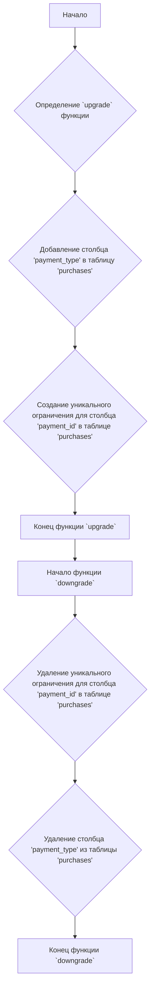
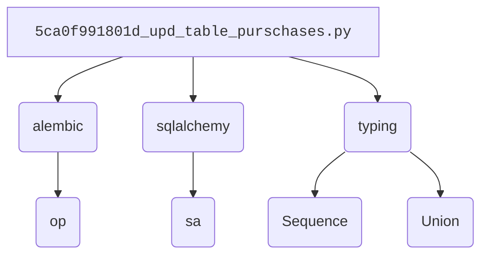

### Анализ кода проекта `hypotez`

=========================================================================================

#### **Расположение файла в проекте**:
Файл расположен в `hypotez/src/endpoints/bots/telegram/digital_market/bot/migration/versions/5ca0f991801d_upd_table_purschases.py`. Это скрипт миграции базы данных, используемый Alembic для обновления схемы базы данных.

---

### **1. Блок-схема**:

**Примеры для каждого блока**:

- **A (Начало)**: Начало выполнения скрипта миграции.
- **B (Определение `upgrade` функции)**: Определение функции, которая применяется при обновлении базы данных до этой версии.
- **C (Добавление столбца 'payment_type')**: `op.add_column('purchases', sa.Column('payment_type', sa.String(), nullable=False))` - добавляет столбец `payment_type` типа `String` в таблицу `purchases`. `nullable=False` означает, что столбец не может содержать `NULL` значения.
- **D (Создание уникального ограничения)**: `op.create_unique_constraint(None, 'purchases', ['payment_id'])` - создает уникальное ограничение для столбца `payment_id` в таблице `purchases`.
- **E (Конец функции `upgrade`)**: Завершение выполнения функции `upgrade`.
- **F (Начало функции `downgrade`)**: Определение функции, которая применяется при откате базы данных с этой версии.
- **G (Удаление уникального ограничения)**: `op.drop_constraint(None, 'purchases', type_='unique')` - удаляет уникальное ограничение из таблицы `purchases`.
- **H (Удаление столбца 'payment_type')**: `op.drop_column('purchases', 'payment_type')` - удаляет столбец `payment_type` из таблицы `purchases`.
- **I (Конец функции `downgrade`)**: Завершение выполнения функции `downgrade`.

### **2. Диаграмма зависимостей**:

**Объяснение зависимостей**:

- `alembic`: Используется для выполнения операций миграции базы данных.
- `sqlalchemy`: Используется для определения типов данных и выполнения операций с базой данных.
- `typing`: Используется для аннотации типов.

### **3. Объяснение**:

#### **Импорты**:
- `from typing import Sequence, Union`: Импортирует `Sequence` и `Union` из модуля `typing` для аннотации типов.
    - `Sequence` используется для указания типа последовательности (например, список).
    - `Union` используется для указания, что переменная может иметь один из нескольких типов.
- `from alembic import op`: Импортирует `op` из модуля `alembic` для выполнения операций с базой данных, таких как добавление или удаление столбцов.
- `import sqlalchemy as sa`: Импортирует модуль `sqlalchemy` как `sa` для определения типов данных и выполнения операций с базой данных.

#### **Переменные**:
- `revision: str = '5ca0f991801d'`: Идентификатор текущей ревизии миграции.
- `down_revision: Union[str, None] = '1720ca777755'`: Идентификатор предыдущей ревизии миграции.
- `branch_labels: Union[str, Sequence[str], None] = None`: Метки ветвей, используемые Alembic.
- `depends_on: Union[str, Sequence[str], None] = None`: Зависимости от других миграций.

#### **Функции**:
- `upgrade() -> None`: Функция, которая выполняет обновление схемы базы данных.
    - `op.add_column('purchases', sa.Column('payment_type', sa.String(), nullable=False))`: Добавляет столбец `payment_type` типа `String` в таблицу `purchases`. `nullable=False` означает, что столбец не может содержать `NULL` значения.
    - `op.create_unique_constraint(None, 'purchases', ['payment_id'])`: Создает уникальное ограничение для столбца `payment_id` в таблице `purchases`.
- `downgrade() -> None`: Функция, которая выполняет откат схемы базы данных.
    - `op.drop_constraint(None, 'purchases', type_='unique')`: Удаляет уникальное ограничение из таблицы `purchases`.
    - `op.drop_column('purchases', 'payment_type')`: Удаляет столбец `payment_type` из таблицы `purchases`.

#### **Потенциальные ошибки и области для улучшения**:
- Отсутствует обработка ошибок.
- Код сгенерирован автоматически и требует проверки на соответствие требованиям проекта.
- Использовать `|` вместо `Union[]`

#### **Взаимосвязи с другими частями проекта**:
- Этот скрипт миграции используется Alembic для обновления схемы базы данных, которая, вероятно, используется другими частями проекта, такими как модели данных и API.