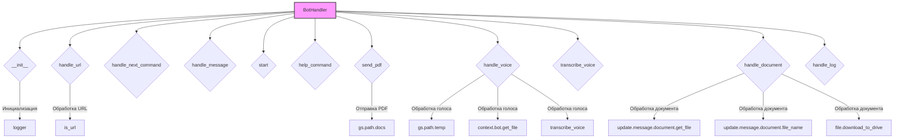
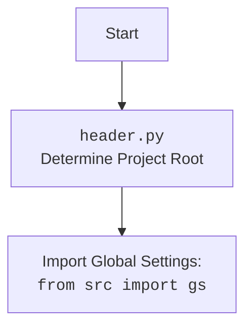

### **Системные инструкции для обработки кода проекта `hypotez`**

=========================================================================================

Описание функциональности и правил для генерации, анализа и улучшения кода. Направлено на обеспечение последовательного и читаемого стиля кодирования, соответствующего требованиям.

---

### **Основные принципы**

#### **1. Общие указания**:
- Соблюдай четкий и понятный стиль кодирования.
- Все изменения должны быть обоснованы и соответствовать установленным требованиям.

#### **2. Комментарии**:
- Используй `#` для внутренних комментариев.
- Документация всех функций, методов и классов должна следовать такому формату: 
    ```python
        def function(param: str, param1: Optional[str | dict | str] = None) -> dict | None:
            """ 
            Args:
                param (str): Описание параметра `param`.
                param1 (Optional[str | dict | str], optional): Описание параметра `param1`. По умолчанию `None`.
    
            Returns:
                dict | None: Описание возвращаемого значения. Возвращает словарь или `None`.
    
            Raises:
                SomeError: Описание ситуации, в которой возникает исключение `SomeError`.

            Ехаmple:
                >>> function('param', 'param1')
                {'param': 'param1'}
            """
    ```
- Комментарии и документация должны быть четкими, лаконичными и точными.

#### **3. Форматирование кода**:
- Используй одинарные кавычки. `a:str = 'value'`, `print('Hello World!')`;
- Добавляй пробелы вокруг операторов. Например, `x = 5`;
- Все параметры должны быть аннотированы типами. `def function(param: str, param1: Optional[str | dict | str] = None) -> dict | None:`;
- Не используй `Union`. Вместо этого используй `|`.

#### **4. Логирование**:
- Для логгирования Всегда Используй модуль `logger` из `src.logger.logger`.
- Ошибки должны логироваться с использованием `logger.error`.
Пример:
    ```python
        try:
            ...
        except Exception as ex:
            logger.error('Error while processing data', ех, exc_info=True)
    ```
#### **5 Не используй `Union[]` в коде. Вместо него используй `|`
Например:
```python
x: str | int ...
```


---

### **Основные требования**:

#### **1. Формат ответов в Markdown**:
- Все ответы должны быть выполнены в формате **Markdown**.

#### **2. Формат комментариев**:
- Используй указанный стиль для комментариев и документации в коде.
- Пример:

```python
from typing import Generator, Optional, List
from pathlib import Path


def read_text_file(
    file_path: str | Path,
    as_list: bool = False,
    extensions: Optional[List[str]] = None,
    chunk_size: int = 8192,
) -> Generator[str, None, None] | str | None:
    """
    Считывает содержимое файла (или файлов из каталога) с использованием генератора для экономии памяти.

    Args:
        file_path (str | Path): Путь к файлу или каталогу.
        as_list (bool): Если `True`, возвращает генератор строк.
        extensions (Optional[List[str]]): Список расширений файлов для чтения из каталога.
        chunk_size (int): Размер чанков для чтения файла в байтах.

    Returns:
        Generator[str, None, None] | str | None: Генератор строк, объединенная строка или `None` в случае ошибки.

    Raises:
        Exception: Если возникает ошибка при чтении файла.

    Example:
        >>> from pathlib import Path
        >>> file_path = Path('example.txt')
        >>> content = read_text_file(file_path)
        >>> if content:
        ...    print(f'File content: {content[:100]}...')
        File content: Example text...
    """
    ...
```
- Всегда делай подробные объяснения в комментариях. Избегай расплывчатых терминов, 
- таких как *«получить»* или *«делать»*. Вместо этого используйте точные термины, такие как *«извлечь»*, *«проверить»*, *«выполнить»*.
- Вместо: *«получаем»*, *«возвращаем»*, *«преобразовываем»* используй имя объекта *«функция получае»*, *«переменная возвращает»*, *«код преобразовывает»* 
- Комментарии должны непосредственно предшествовать описываемому блоку кода и объяснять его назначение.

#### **3. Пробелы вокруг операторов присваивания**:
- Всегда добавляйте пробелы вокруг оператора `=`, чтобы повысить читаемость.
- Примеры:
  - **Неправильно**: `x=5`
  - **Правильно**: `x = 5`

#### **4. Использование `j_loads` или `j_loads_ns`**:
- Для чтения JSON или конфигурационных файлов замените стандартное использование `open` и `json.load` на `j_loads` или `j_loads_ns`.
- Пример:

```python
# Неправильно:
with open('config.json', 'r', encoding='utf-8') as f:
    data = json.load(f)

# Правильно:
data = j_loads('config.json')
```

#### **5. Сохранение комментариев**:
- Все существующие комментарии, начинающиеся с `#`, должны быть сохранены без изменений в разделе «Улучшенный код».
- Если комментарий кажется устаревшим или неясным, не изменяйте его. Вместо этого отметьте его в разделе «Изменения».

#### **6. Обработка `...` в коде**:
- Оставляйте `...` как указатели в коде без изменений.
- Не документируйте строки с `...`.
```

#### **7. Аннотации**
Для всех переменных должны быть определены аннотации типа. 
Для всех функций все входные и выходные параметры аннотириваны
Для все параметров должны быть аннотации типа.


### **8. webdriver**
В коде используется webdriver. Он импртируется из модуля `webdriver` проекта `hypotez`
```python
from src.webdirver import Driver, Chrome, Firefox, Playwright, ...
driver = Driver(Firefox)

Пoсле чего может использоваться как

close_banner = {
  "attribute": null,
  "by": "XPATH",
  "selector": "//button[@id = 'closeXButton']",
  "if_list": "first",
  "use_mouse": false,
  "mandatory": false,
  "timeout": 0,
  "timeout_for_event": "presence_of_element_located",
  "event": "click()",
  "locator_description": "Закрываю pop-up окно, если оно не появилось - не страшно (`mandatory`:`false`)"
}

result = driver.execute_locator(close_banner)
```

## Анализ кода `hypotez/src/endpoints/bots/telegram/handlers.py`

### 1. Блок-схема

```mermaid
graph LR
    A[Начало] --> B{Получено обновление от Telegram};
    B -- Сообщение с текстом --> C{Определить тип сообщения};
    C -- URL --> D[handle_url];
    C -- "--next" или аналог --> E[handle_next_command];
    C -- "/start" --> F[start];
    C -- "/help" --> G[help_command];
    C -- "/sendpdf" --> H[send_pdf];
    C -- Голосовое сообщение --> I[handle_voice];
    C -- Документ --> J[handle_document];
    C -- Лог сообщение --> K[handle_log];
    C -- Текст --> L[handle_message];
    D --> M[Обработка URL];
    E --> N[Обработка следующей команды];
    F --> O[Ответное сообщение "/start"];
    G --> P[Ответное сообщение "/help"];
    H --> Q{Генерация и отправка PDF};
    I --> R[Обработка и транскрибация голоса];
    J --> S{Сохранение и обработка документа};
    K --> T[Обработка лог-сообщения];
    L --> U[Ответное сообщение "Message received by BotHandler."];
    Q -- Успех --> V[Отправка PDF];
    Q -- Ошибка --> W[Сообщение об ошибке];
    R --> X[Распознанный текст];
    S --> Y[Файл сохранен];
    T --> Z[Лог обработан];
    V --> Конец;
    W --> Конец;
    X --> Конец;
    Y --> Конец;
    Z --> Конец;
    M --> Конец;
    N --> Конец;
    O --> Конец;
    P --> Конец;
    U --> Конец;
```

Примеры для каждого логического блока:
- **Получено обновление от Telegram**: Пользователь отправляет сообщение боту.
- **Определить тип сообщения**:
    - *URL*: `https://www.example.com`
    - *"--next"*: `--next`
    - *"/start"*: `/start`
    - *"/help"*: `/help`
    - *"/sendpdf"*: `/sendpdf`
    - *Голосовое сообщение*: Аудиофайл
    - *Документ*: `document.pdf`
    - *Текст*: `Hello, bot!`
- **Обработка URL**: Извлечение информации с веб-страницы.
- **Обработка следующей команды**: Выполнение определенного действия в зависимости от команды.
- **Ответное сообщение "/start"**: `Hello! I am your simple bot. Type /help to see available commands.`
- **Ответное сообщение "/help"**: `Available commands:\n/start - Start the bot\n/help - Show this help message\n/sendpdf - Send a PDF file`
- **Генерация и отправка PDF**: Создание PDF-файла и отправка его пользователю.
- **Обработка и транскрибация голоса**: Преобразование голосового сообщения в текст.
- **Сохранение и обработка документа**: Сохранение файла на сервере.
- **Обработка лог-сообщения**: Запись сообщения в лог.
- **Ответное сообщение "Message received by BotHandler."**: `Message received by BotHandler.`

### 2. Диаграмма



**Объяснение зависимостей `mermaid`:**

*   `BotHandler`: Главный класс, обрабатывающий все команды бота.
*   `__init__`: Метод инициализации класса `BotHandler`.
*   `handle_url`: Метод для обработки URL, отправленных пользователем.
*   `handle_next_command`: Метод для обработки команды "--next".
*   `handle_message`: Метод для обработки текстовых сообщений.
*   `start`: Метод для обработки команды "/start".
*   `help_command`: Метод для обработки команды "/help".
*   `send_pdf`: Метод для отправки PDF-файла.
*   `handle_voice`: Метод для обработки голосовых сообщений.
*   `transcribe_voice`: Метод для транскрибации голосовых сообщений в текст.
*   `handle_document`: Метод для обработки полученных документов.
*   `handle_log`: Метод для обработки лог-сообщений.
*   `logger`: Модуль логирования для записи информации об операциях.
*   `is_url`: Функция для проверки, является ли строка URL.
*   `gs.path.docs`: Путь к директории с документами.
*   `gs.path.temp`: Путь к временной директории.
*   `context.bot.get_file`: Метод для получения информации о файле из Telegram.
*   `update.message.document.get_file`: Метод для получения файла из сообщения.
*   `update.message.document.file_name`: Метод для получения имени файла из сообщения.
*   `file.download_to_drive`: Метод для сохранения файла на диск.



### 3. Объяснение

#### Импорты:

*   `random`: Используется для генерации случайных чисел. В данном коде не используется.
*   `asyncio`: Используется для асинхронного программирования. В данном коде явно не используется, но функции определены как `async`.
*   `requests`: Используется для отправки HTTP-запросов. В данном коде не используется.
*   `typing.Optional, typing.Any`: Используется для аннотации типов. `Optional` указывает, что переменная может быть `None`, `Any` - любой тип.
*   `bs4.BeautifulSoup`: Используется для парсинга HTML и XML. В данном коде не используется.
*   `header`:  Предположительно, содержит определение корневой директории проекта, необходимое для построения путей к файлам.
*   `src.gs`:  Глобальные настройки проекта, содержащие пути и конфигурации.
*   `src.logger.logger`: Модуль логирования для записи информации о работе бота.
*   `src.utils.url.is_url`: Функция для проверки, является ли строка URL.
*   `src.utils.printer.pprint`: Функция для красивого вывода данных. В данном коде не используется.
*   `telegram.Update`: Класс, представляющий входящее обновление от Telegram.
*   `telegram.ext.CallbackContext`: Класс, предоставляющий контекст для обработчиков.
*   `pathlib.Path`: Класс для работы с путями к файлам и директориям.
*   `src.utils.file.read_text_file`: Функция для чтения содержимого текстового файла. В коде явно не используется.

#### Классы:

*   `BotHandler`:
    *   Роль: Обработка команд, полученных от Telegram-бота.
    *   Атрибуты:
        *   `update`: Объект `Update`, содержащий данные о последнем обновлении.
        *   `context`: Объект `CallbackContext`, содержащий контекст текущего разговора.
    *   Методы:
        *   `__init__(self)`: Инициализация обработчика.
        *   `handle_url(self, update: Update, context: CallbackContext) -> Any`: Обрабатывает URL, присланные пользователем.
        *   `handle_next_command(self, update: Update) -> None`: Обрабатывает команду '--next' и её аналоги.
        *   `handle_message(self, update: Update, context: CallbackContext) -> None`: Обрабатывает любые текстовые сообщения.
        *   `start(self, update: Update, context: CallbackContext) -> None`: Обрабатывает команду /start.
        *   `help_command(self, update: Update, context: CallbackContext) -> None`: Обрабатывает команду /help.
        *   `send_pdf(self, update: Update, context: CallbackContext) -> None`: Генерирует и отправляет PDF-файл.
        *   `handle_voice(self, update: Update, context: CallbackContext) -> None`: Обрабатывает голосовые сообщения и транскрибирует их.
        *   `transcribe_voice(self, file_path: Path) -> str`: Транскрибирует голосовое сообщение в текст.
        *   `handle_document(self, update: Update, context: CallbackContext) -> bool`: Обрабатывает полученные документы.
        *   `handle_log(self, update: Update, context: CallbackContext) -> None`: Обрабатывает log сообщения.

#### Функции:

*   `handle_url(self, update: Update, context: CallbackContext) -> Any`:
    *   Аргументы:
        *   `update (Update)`: Объект `Update`, содержащий информацию о сообщении.
        *   `context (CallbackContext)`: Контекст выполнения обработчика.
    *   Возвращаемое значение: `Any`.
    *   Назначение: Обработка URL, отправленных пользователем.
    *   Пример: Если пользователь отправил URL, функция может извлечь информацию с веб-страницы и отправить её пользователю.

*   `handle_next_command(self, update: Update) -> None`:
    *   Аргументы:
        *   `update (Update)`: Объект `Update`, содержащий информацию о сообщении.
    *   Возвращаемое значение: `None`.
    *   Назначение: Обработка команды `--next` и её аналогов.
    *   Пример: Если пользователь отправил команду `--next`, функция может выполнить следующее действие в некотором сценарии.

*   `handle_message(self, update: Update, context: CallbackContext) -> None`:
    *   Аргументы:
        *   `update (Update)`: Объект `Update`, содержащий информацию о сообщении.
        *   `context (CallbackContext)`: Контекст выполнения обработчика.
    *   Возвращаемое значение: `None`.
    *   Назначение: Обработка любого текстового сообщения.
    *   Пример: Просто отвечает пользователю "Message received by BotHandler.".

*   `start(self, update: Update, context: CallbackContext) -> None`:
    *   Аргументы:
        *   `update (Update)`: Объект `Update`, содержащий информацию о сообщении.
        *   `context (CallbackContext)`: Контекст выполнения обработчика.
    *   Возвращаемое значение: `None`.
    *   Назначение: Обработка команды `/start`.
    *   Пример: Отправляет приветственное сообщение пользователю.

*   `help_command(self, update: Update, context: CallbackContext) -> None`:
    *   Аргументы:
        *   `update (Update)`: Объект `Update`, содержащий информацию о сообщении.
        *   `context (CallbackContext)`: Контекст выполнения обработчика.
    *   Возвращаемое значение: `None`.
    *   Назначение: Обработка команды `/help`.
    *   Пример: Отправляет сообщение со списком доступных команд.

*   `send_pdf(self, update: Update, context: CallbackContext) -> None`:
    *   Аргументы:
        *   `update (Update)`: Объект `Update`, содержащий информацию о сообщении.
        *   `context (CallbackContext)`: Контекст выполнения обработчика.
    *   Возвращаемое значение: `None`.
    *   Назначение: Обработка команды `/sendpdf`.
    *   Пример: Отправляет PDF-файл пользователю.

*   `handle_voice(self, update: Update, context: CallbackContext) -> None`:
    *   Аргументы:
        *   `update (Update)`: Объект `Update`, содержащий информацию о сообщении.
        *   `context (CallbackContext)`: Контекст выполнения обработчика.
    *   Возвращаемое значение: `None`.
    *   Назначение: Обработка голосовых сообщений.
    *   Пример: Загружает голосовое сообщение, транскрибирует его и отправляет текст пользователю.

*   `transcribe_voice(self, file_path: Path) -> str`:
    *   Аргументы:
        *   `file_path (Path)`: Путь к файлу с голосовым сообщением.
    *   Возвращаемое значение: `str`.
    *   Назначение: Транскрибация голосового сообщения в текст.
    *   Пример: Возвращает "Распознавание голоса ещё не реализовано.".

*   `handle_document(self, update: Update, context: CallbackContext) -> bool`:
    *   Аргументы:
        *   `update (Update)`: Объект `Update`, содержащий информацию о сообщении.
        *   `context (CallbackContext)`: Контекст выполнения обработчика.
    *   Возвращаемое значение: `bool`.
    *   Назначение: Обработка полученных документов.
    *   Пример: Сохраняет файл и отправляет пользователю сообщение об успешном сохранении.

*   `handle_log(self, update: Update, context: CallbackContext) -> None`:
    *   Аргументы:
        *   `update (Update)`: Объект `Update`, содержащий информацию о сообщении.
        *   `context (CallbackContext)`: Контекст выполнения обработчика.
    *   Возвращаемое значение: `None`.
    *   Назначение: Обработка log сообщений.
    *   Пример: Логирует полученное сообщение и отправляет подтверждение.

#### Переменные:

*   `update`: Объект класса `telegram.Update`, представляющий входящее обновление от Telegram.
*   `context`: Объект класса `telegram.ext.CallbackContext`, предоставляющий контекст для обработчиков.
*   `voice`: Объект, представляющий голосовое сообщение.
*   `file`: Объект, представляющий файл голосового сообщения.
*   `file_path`: Объект класса `pathlib.Path`, представляющий путь к файлу.
*   `pdf_file`:  Объект класса `pathlib.Path`, представляющий путь к PDF файлу.
*   `log_message`: Сообщение лога.

#### Потенциальные ошибки и области для улучшения:

1.  **Обработка исключений**: В большинстве функций присутствует обработка исключений, но вывод ошибки в `logger.error` не содержит `exc_info=True`, что затрудняет отладку. Следует добавить `exc_info=True` для получения полной трассировки.
2.  **Реализация `transcribe_voice`**: Функция `transcribe_voice` не реализована и всегда возвращает строку "Распознавание голоса ещё не реализовано.". Необходимо реализовать транскрибацию голосовых сообщений.
3.  **Использование `random` и `BeautifulSoup`**: Модули `random` и `BeautifulSoup` импортированы, но не используются в коде. Следует удалить неиспользуемые импорты.
4.  **Аннотации типов**: Отсутствуют аннотации типов для `self.update` и `self.context` в методе `handle_document`.
5.  **Обработка ошибок в `handle_document`**: В блоке `except` метода `handle_document` используется `file_name` без проверки, было ли оно определено до этого.

#### Цепочка взаимосвязей с другими частями проекта:

*   `src.gs`: Глобальные настройки используются для получения путей к файлам (`gs.path.docs`, `gs.path.temp`).
*   `src.logger.logger`: Модуль логирования используется для записи информации об ошибках и событиях.
*   `src.utils.url.is_url`:  Используется для проверки, является ли входная строка URL-адресом, но не используется в предоставленном коде.

```python
try:
    ...
except Exception as ex:
    logger.error('Ошибка при отправке PDF-файла: ', ex, exc_info=True)