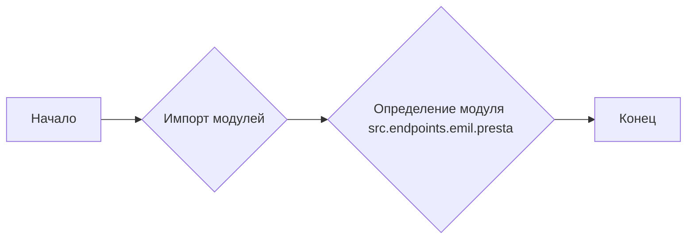
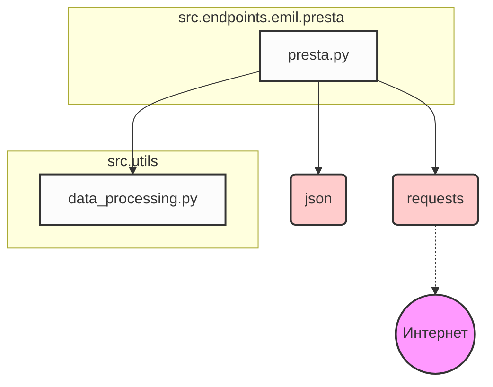

### **Анализ кода проекта `hypotez`**

=========================================================================================

#### **Расположение файла в проекте:**
Файл расположен по пути `hypotez/src/endpoints/emil/presta.py`. Это указывает на то, что файл, вероятно, является частью API-endpoint, связанного с обработкой данных или запросов, относящихся к `presta` (возможно, PrestaShop или какой-либо другой сервис с похожим названием) в подсистеме `emil`.

---

#### **1. Блок-схема:**



**Примеры для каждого логического блока:**

- **A (Начало)**: Начало выполнения скрипта `presta.py`.
- **B (Импорт модулей)**: Импорт необходимых модулей для работы скрипта. На данный момент в предоставленном коде нет импортированных модулей, но в реальном коде здесь будут импортироваться модули, необходимые для работы с PrestaShop API, обработкой данных и т. д.
    ```python
    import requests
    import json
    from src.utils import data_processing
    ```
- **C (Определение модуля src.endpoints.emil.presta)**: Определение модуля и его основных характеристик (платформа, синопсис).
    ```python
    """
    .. module:: src.endpoints.emil.presta
        :platform: Windows, Unix
        :synopsis:
    """
    ```
- **D (Конец)**: Завершение выполнения скрипта.

#### **2. Диаграмма зависимостей:**



**Объяснение зависимостей:**

- **`presta.py`**: Главный скрипт, который обрабатывает endpoint для PrestaShop.
- **`requests`**: Используется для выполнения HTTP-запросов к API PrestaShop.
- **`json`**: Используется для работы с данными в формате JSON (например, для сериализации и десериализации данных при взаимодействии с API).
- **`src.utils.data_processing`**: Модуль, содержащий функции для обработки данных, специфичные для проекта `hypotez`.

#### **3. Объяснение:**

**Импорты:**

- В предоставленном коде нет импортов, но если бы они были, пример:
    - `requests`: Этот модуль используется для выполнения HTTP-запросов. Например, он может быть использован для получения данных из API PrestaShop.
    ```python
    import requests
    response = requests.get('https://api.example.com/products')
    data = response.json()
    ```
    - `json`: Этот модуль используется для работы с данными в формате JSON. Он позволяет сериализовать объекты Python в JSON-строки и десериализовать JSON-строки в объекты Python.
    ```python
    import json
    data = {'name': 'Product', 'price': 100}
    json_data = json.dumps(data)
    loaded_data = json.loads(json_data)
    ```
    - `src.utils.data_processing`: Этот модуль, вероятно, содержит набор функций для обработки данных, специфичных для проекта `hypotez`. Например, он может содержать функции для очистки, преобразования и валидации данных.
    ```python
    from src.utils import data_processing
    processed_data = data_processing.clean_data(raw_data)
    ```

**Классы:**

В предоставленном коде нет классов.

**Функции:**

В предоставленном коде нет функций.

**Переменные:**

В предоставленном коде нет переменных.

**Потенциальные ошибки и области для улучшения:**

- **Отсутствие обработки исключений:** В реальном коде необходимо добавить обработку исключений для обработки ошибок при выполнении HTTP-запросов, работе с JSON и т. д.
- **Отсутствие логирования:** В реальном коде необходимо добавить логирование для отслеживания хода выполнения программы и записи ошибок.
- **Отсутствие документации:** Необходимо добавить документацию для всех функций, классов и модулей.

**Цепочка взаимосвязей с другими частями проекта:**

- Модуль `presta.py` является частью API-endpoint, который, вероятно, используется для взаимодействия с PrestaShop. Он может быть вызван из других частей проекта, таких как веб-интерфейс или другие backend-сервисы.
- Данные, полученные из PrestaShop, могут быть обработаны с использованием модуля `src.utils.data_processing` и сохранены в базе данных или использованы для других целей.

```mermaid
flowchart LR
    A[Web Interface] --> B(presta.py);
    B --> C{src.utils.data_processing};
    C --> D[Database];