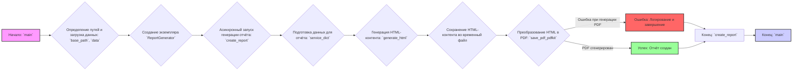
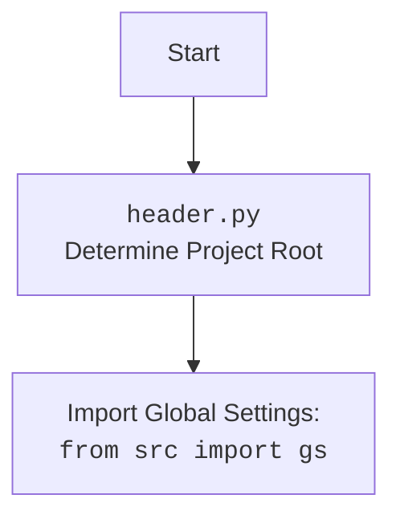

### **Системные инструкции для обработки кода проекта `hypotez`**

=========================================================================================

Описание функциональности и правил для генерации, анализа и улучшения кода. Направлено на обеспечение последовательного и читаемого стиля кодирования, соответствующего требованиям.

---

### **Основные принципы**

#### **1. Общие указания**:
- Соблюдай четкий и понятный стиль кодирования.
- Все изменения должны быть обоснованы и соответствовать установленным требованиям.

#### **2. Комментарии**:
- Используй `#` для внутренних комментариев.
- Документация всех функций, методов и классов должна следовать такому формату: 
    ```python
        def function(param: str, param1: Optional[str | dict | str] = None) -> dict | None:
            """ 
            Args:
                param (str): Описание параметра `param`.
                param1 (Optional[str | dict | str], optional): Описание параметра `param1`. По умолчанию `None`.
    
            Returns:
                dict | None: Описание возвращаемого значения. Возвращает словарь или `None`.
    
            Raises:
                SomeError: Описание ситуации, в которой возникает исключение `SomeError`.

            Ехаmple:
                >>> function('param', 'param1')
                {'param': 'param1'}
            """
    ```
- Комментарии и документация должны быть четкими, лаконичными и точными.

#### **3. Форматирование кода**:
- Используй одинарные кавычки. `a:str = 'value'`, `print('Hello World!')`;
- Добавляй пробелы вокруг операторов. Например, `x = 5`;
- Все параметры должны быть аннотированы типами. `def function(param: str, param1: Optional[str | dict | str] = None) -> dict | None:`;
- Не используй `Union`. Вместо этого используй `|`.

#### **4. Логирование**:
- Для логгирования Всегда Используй модуль `logger` из `src.logger.logger`.
- Ошибки должны логироваться с использованием `logger.error`.
Пример:
    ```python
        try:
            ...
        except Exception as ex:
            logger.error('Error while processing data', ех, exc_info=True)
    ```
#### **5 Не используй `Union[]` в коде. Вместо него используй `|`
Например:
```python
x: str | int ...
```


---

### **Основные требования**:

#### **1. Формат ответов в Markdown**:
- Все ответы должны быть выполнены в формате **Markdown**.

#### **2. Формат комментариев**:
- Используй указанный стиль для комментариев и документации в коде.
- Пример:

```python
from typing import Generator, Optional, List
from pathlib import Path


def read_text_file(
    file_path: str | Path,
    as_list: bool = False,
    extensions: Optional[List[str]] = None,
    chunk_size: int = 8192,
) -> Generator[str, None, None] | str | None:
    """
    Считывает содержимое файла (или файлов из каталога) с использованием генератора для экономии памяти.

    Args:
        file_path (str | Path): Путь к файлу или каталогу.
        as_list (bool): Если `True`, возвращает генератор строк.
        extensions (Optional[List[str]]): Список расширений файлов для чтения из каталога.
        chunk_size (int): Размер чанков для чтения файла в байтах.

    Returns:
        Generator[str, None, None] | str | None: Генератор строк, объединенная строка или `None` в случае ошибки.

    Raises:
        Exception: Если возникает ошибка при чтении файла.

    Example:
        >>> from pathlib import Path
        >>> file_path = Path('example.txt')
        >>> content = read_text_file(file_path)
        >>> if content:
        ...    print(f'File content: {content[:100]}...')
        File content: Example text...
    """
    ...
```
- Всегда делай подробные объяснения в комментариях. Избегай расплывчатых терминов, 
- таких как *«получить»* или *«делать»*
-  . Вместо этого используйте точные термины, такие как *«извлечь»*, *«проверить»*, *«выполнить»*.
- Вместо: *«получаем»*, *«возвращаем»*, *«преобразовываем»* используй имя объекта *«функция получае»*, *«переменная возвращает»*, *«код преобразовывает»* 
- Комментарии должны непосредственно предшествовать описываемому блоку кода и объяснять его назначение.

#### **3. Пробелы вокруг операторов присваивания**:
- Всегда добавляйте пробелы вокруг оператора `=`, чтобы повысить читаемость.
- Примеры:
  - **Неправильно**: `x=5`
  - **Правильно**: `x = 5`

#### **4. Использование `j_loads` или `j_loads_ns`**:
- Для чтения JSON или конфигурационных файлов замените стандартное использование `open` и `json.load` на `j_loads` или `j_loads_ns`.
- Пример:

```python
# Неправильно:
with open('config.json', 'r', encoding='utf-8') as f:
    data = json.load(f)

# Правильно:
data = j_loads('config.json')
```

#### **5. Сохранение комментариев**:
- Все существующие комментарии, начинающиеся с `#`, должны быть сохранены без изменений в разделе «Улучшенный код».
- Если комментарий кажется устаревшим или неясным, не изменяйте его. Вместо этого отметьте его в разделе «Изменения».

#### **6. Обработка `...` в коде**:
- Оставляйте `...` как указатели в коде без изменений.
- Не документируйте строки с `...`.
```

#### **7. Аннотации**
Для всех переменных должны быть определены аннотации типа. 
Для всех функций все входные и выходные параметры аннотириваны
Для все параметров должны быть аннотации типа.


### **8. webdriver**
В коде используется webdriver. Он импртируется из модуля `webdriver` проекта `hypotez`
```python
from src.webdirver import Driver, Chrome, Firefox, Playwright, ...
driver = Driver(Firefox)

Пoсле чего может использоваться как

close_banner = {
  "attribute": null,
  "by": "XPATH",
  "selector": "//button[@id = 'closeXButton']",
  "if_list": "first",
  "use_mouse": false,
  "mandatory": false,
  "timeout": 0,
  "timeout_for_event": "presence_of_element_located",
  "event": "click()",
  "locator_description": "Закрываю pop-up окно, если оно не появилось - не страшно (`mandatory`:`false`)"
}

result = driver.execute_locator(close_banner)
```

### Анализ кода `pricelist_generator.py`

#### 1. Блок-схема



**Примеры для логических блоков:**

- **B**: `base_path` определяется как путь к директории с данными мехирона, `data` загружается из JSON-файла. Пример: `base_path = gs.path.external_storage / 'kazarinov' / 'mexironim' / mexiron`, `data = j_loads(base_path / f'{lang}.json')`.
- **E**: Создается словарь `service_dict` с информацией о сервисе, которая добавляется к данным о продуктах.
- **F**: `generate_html` генерирует HTML на основе шаблона Jinja2 и данных.
- **H**: `save_pdf_pdfkit` пытается преобразовать HTML в PDF. Если это не удается, происходит логирование ошибки.

#### 2. Диаграмма

```mermaid
flowchart TD
    A[<code>pricelist_generator.py</code>] --> B(<code>header.py</code>);
    A --> C(<code>src.gs</code>);
    A --> D(<code>json</code>);
    A --> E(<code>pathlib.Path</code>);
    A --> F(<code>jinja2.Environment</code>);
    A --> G(<code>pdfkit</code>);
    A --> H(<code>src.utils.jjson.j_loads</code>);
    A --> I(<code>src.utils.file.read_text_file</code>);
    A --> J(<code>src.utils.file.save_text_file</code>);
    A --> K(<code>src.utils.pdf.PDFUtils</code>);
    A --> L(<code>src.utils.convertors.html.html2pdf</code>);
    A --> M(<code>src.utils.image.random_image</code>);
    A --> N(<code>src.utils.printer.pprint</code>);
    A --> O(<code>src.logger.logger.logger</code>);
    A --> P(<code>asyncio</code>);
    A --> Q(<code>dataclasses</code>);
    B --> C;

    style A fill:#f9f,stroke:#333,stroke-width:2px
    style B fill:#ccf,stroke:#333,stroke-width:2px
    style C fill:#ccf,stroke:#333,stroke-width:2px

```





**Объяснение зависимостей:**

- `header`: Определяет корень проекта.
- `src.gs`: Глобальные настройки проекта, содержащие пути и общие параметры.
- `json`: Используется для загрузки данных из JSON-файлов.
- `pathlib.Path`: Используется для работы с путями к файлам и директориям.
- `jinja2.Environment`: Используется для создания HTML-контента на основе шаблонов.
- `pdfkit`: Используется для преобразования HTML в PDF.
- `src.utils.jjson.j_loads`: Функция для загрузки JSON-данных.
- `src.utils.file.read_text_file`: Функция для чтения текстовых файлов.
- `src.utils.file.save_text_file`: Функция для сохранения текстовых файлов.
- `src.utils.pdf.PDFUtils`: Утилиты для работы с PDF, включая сохранение HTML в PDF.
- `src.utils.convertors.html.html2pdf`: Функция для конвертации HTML в PDF.
- `src.utils.image.random_image`: Функция для получения случайного изображения.
- `src.utils.printer.pprint`: Функция для "красивого" вывода данных.
- `src.logger.logger.logger`: Модуль для логирования событий и ошибок.
- `asyncio`: Используется для асинхронного выполнения задач.
- `dataclasses`: Используется для определения классов данных.

#### 3. Объяснение

**Импорты:**

- `header`: Определяет корень проекта для доступа к глобальным настройкам.
- `asyncio`: Используется для асинхронного выполнения операций, таких как генерация HTML и PDF.
- `dataclasses`: Модуль `dataclasses` используется для создания класса `ReportGenerator`, который хранит состояние генератора отчетов.
- `src.gs`: Импортирует глобальные настройки (например, пути к файлам) из пакета `src`.
- `json`: Используется для работы с JSON-файлами (загрузка данных).
- `pathlib.Path`: Предоставляет способ представления путей к файлам и директориям.
- `jinja2`: Используется для создания HTML-шаблонов и генерации HTML-кода на основе данных.
- `pdfkit`: Библиотека для конвертации HTML-страниц в PDF-файлы.
- `src.utils.jjson.j_loads`: Функция для загрузки JSON-данных.
- `src.utils.file.read_text_file`: Функция для чтения текстовых файлов.
- `src.utils.file.save_text_file`: Функция для сохранения текстовых файлов.
- `src.utils.pdf.PDFUtils`: Класс, предоставляющий утилиты для работы с PDF, включая сохранение HTML в PDF.
- `src.utils.convertors.html.html2pdf`: Функция для конвертации HTML в PDF.
- `src.utils.image.random_image`: Функция для получения случайного изображения.
- `src.utils.printer.pprint`: Функция для "красивого" вывода данных.
- `src.logger.logger.logger`: Модуль для логирования событий и ошибок.

**Классы:**

- `ReportGenerator`:
    - **Роль**: Генерация HTML и PDF отчётов на основе данных из JSON.
    - **Атрибуты**:
        - `env`: Объект `jinja2.Environment` для работы с шаблонами.
    - **Методы**:
        - `generate_html(self, data: dict, lang: str) -> str`: Генерирует HTML-контент на основе шаблона и данных.
        - `create_report(self, data: dict, lang: str, html_file: str | Path, pdf_file: str | Path) -> bool`: Запускает полный цикл генерации отчёта, включая подготовку данных, генерацию HTML, сохранение HTML и преобразование в PDF.

**Функции:**

- `main(mexiron: str, lang: str) -> bool`:
    - **Аргументы**:
        - `mexiron (str)`: Идентификатор мехирона.
        - `lang (str)`: Язык отчёта.
    - **Возвращаемое значение**: `bool`: Успешность выполнения.
    - **Назначение**: Загружает данные, создает экземпляр `ReportGenerator` и запускает процесс генерации отчёта.

**Переменные:**

- `config`: (Закомментировано) Конфигурация для `pdfkit` (путь к `wkhtmltopdf`).
- `template`: Путь к HTML-шаблону.
- `html_content`: Сгенерированный HTML-контент.
- `pdf`: Экземпляр класса `PDFUtils` для работы с PDF.
- `data`: Словарь с данными для генерации отчёта.
- `base_path`: Базовый путь к директории с данными мехирона.
- `html_file`: Путь к файлу для сохранения HTML-контента.
- `pdf_file`: Путь к файлу для сохранения PDF-отчёта.
- `service_dict`: Словарь с информацией о сервисе (продукт), который добавляется к данным о продуктах.

**Потенциальные ошибки и области для улучшения:**

- Обработка ошибок при чтении файлов (JSON, HTML-шаблоны).
- Обработка ошибок при генерации HTML и PDF.
- Добавление логирования для отслеживания процесса генерации отчёта.
- Улучшение структуры кода для повышения читаемости и поддерживаемости.
- Рассмотрение возможности использования более современных инструментов для генерации PDF (например, WeasyPrint).
- Необходимо добавить аннотации типа для всех переменных.

**Взаимосвязи с другими частями проекта:**

- Использует `src.gs` для доступа к глобальным настройкам и путям к файлам.
- Использует `src.utils.jjson.j_loads` для загрузки данных из JSON-файлов.
- Использует `src.utils.file.read_text_file` и `src.utils.file.save_text_file` для работы с файлами.
- Использует `src.utils.pdf.PDFUtils` для преобразования HTML в PDF.
- Использует `src.utils.image.random_image` для получения случайного изображения.
- Использует `src.logger.logger` для логирования.