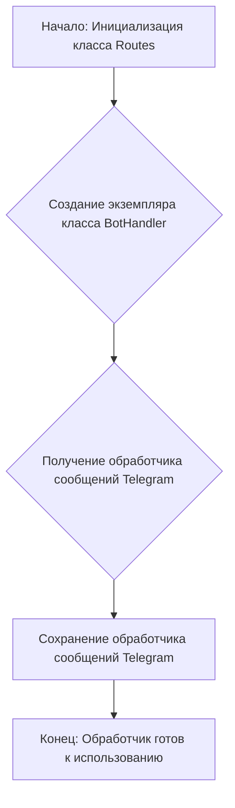
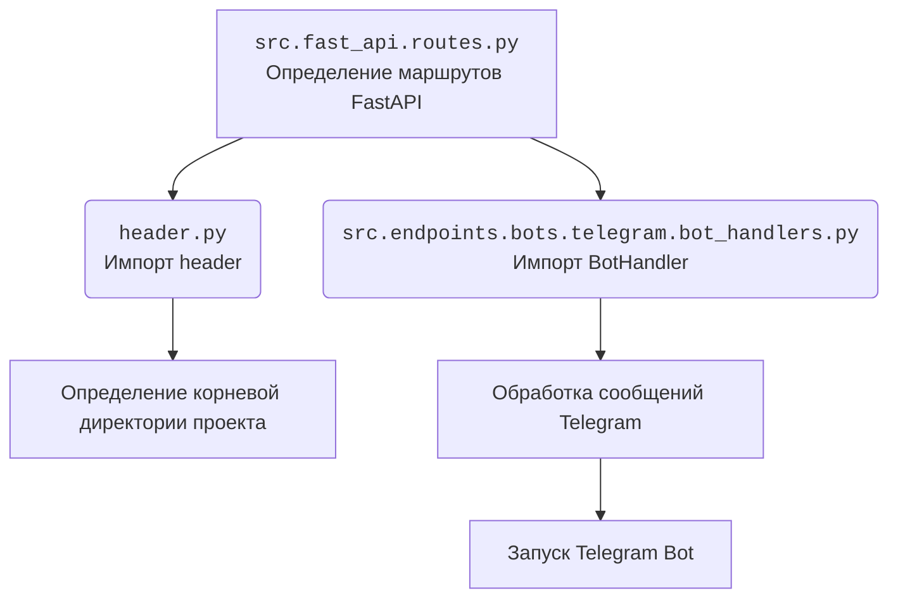
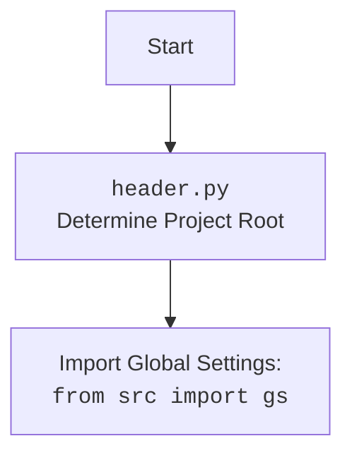

### **Системные инструкции для обработки кода проекта `hypotez`**

=========================================================================================

Описание функциональности и правил для генерации, анализа и улучшения кода. Направлено на обеспечение последовательного и читаемого стиля кодирования, соответствующего требованиям.

---

### **Основные принципы**

#### **1. Общие указания**:
- Соблюдай четкий и понятный стиль кодирования.
- Все изменения должны быть обоснованы и соответствовать установленным требованиям.

#### **2. Комментарии**:
- Используй `#` для внутренних комментариев.
- Документация всех функций, методов и классов должна следовать такому формату: 
    ```python
        def function(param: str, param1: Optional[str | dict | str] = None) -> dict | None:
            """ 
            Args:
                param (str): Описание параметра `param`.
                param1 (Optional[str | dict | str], optional): Описание параметра `param1`. По умолчанию `None`.
    
            Returns:
                dict | None: Описание возвращаемого значения. Возвращает словарь или `None`.
    
            Raises:
                SomeError: Описание ситуации, в которой возникает исключение `SomeError`.

            Ехаmple:
                >>> function('param', 'param1')
                {'param': 'param1'}
            """
    ```
- Комментарии и документация должны быть четкими, лаконичными и точными.

#### **3. Форматирование кода**:
- Используй одинарные кавычки. `a:str = 'value'`, `print('Hello World!')`;
- Добавляй пробелы вокруг операторов. Например, `x = 5`;
- Все параметры должны быть аннотированы типами. `def function(param: str, param1: Optional[str | dict | str] = None) -> dict | None:`;
- Не используй `Union`. Вместо этого используй `|`.

#### **4. Логирование**:
- Для логгирования Всегда Используй модуль `logger` из `src.logger.logger`.
- Ошибки должны логироваться с использованием `logger.error`.
Пример:
    ```python
        try:
            ...
        except Exception as ex:
            logger.error('Error while processing data', ех, exc_info=True)
    ```
#### **5 Не используй `Union[]` в коде. Вместо него используй `|`
Например:
```python
x: str | int ...
```


---

### **Основные требования**:

#### **1. Формат ответов в Markdown**:
- Все ответы должны быть выполнены в формате **Markdown**.

#### **2. Формат комментариев**:
- Используй указанный стиль для комментариев и документации в коде.
- Пример:

```python
from typing import Generator, Optional, List
from pathlib import Path


def read_text_file(
    file_path: str | Path,
    as_list: bool = False,
    extensions: Optional[List[str]] = None,
    chunk_size: int = 8192,
) -> Generator[str, None, None] | str | None:
    """
    Считывает содержимое файла (или файлов из каталога) с использованием генератора для экономии памяти.

    Args:
        file_path (str | Path): Путь к файлу или каталогу.
        as_list (bool): Если `True`, возвращает генератор строк.
        extensions (Optional[List[str]]): Список расширений файлов для чтения из каталога.
        chunk_size (int): Размер чанков для чтения файла в байтах.

    Returns:
        Generator[str, None, None] | str | None: Генератор строк, объединенная строка или `None` в случае ошибки.

    Raises:
        Exception: Если возникает ошибка при чтении файла.

    Example:
        >>> from pathlib import Path
        >>> file_path = Path('example.txt')
        >>> content = read_text_file(file_path)
        >>> if content:
        ...    print(f'File content: {content[:100]}...')
        File content: Example text...
    """
    ...
```
- Всегда делай подробные объяснения в комментариях. Избегай расплывчатых терминов, 
- таких как *«получить»* или *«делать»*
-  . Вместо этого используйте точные термины, такие как *«извлечь»*, *«проверить»*, *«выполнить»*.
- Вместо: *«получаем»*, *«возвращаем»*, *«преобразовываем»* используй имя объекта *«функция получае»*, *«переменная возвращает»*, *«код преобразовывает»* 
- Комментарии должны непосредственно предшествовать описываемому блоку кода и объяснять его назначение.

#### **3. Пробелы вокруг операторов присваивания**:
- Всегда добавляйте пробелы вокруг оператора `=`, чтобы повысить читаемость.
- Примеры:
  - **Неправильно**: `x=5`
  - **Правильно**: `x = 5`

#### **4. Использование `j_loads` или `j_loads_ns`**:
- Для чтения JSON или конфигурационных файлов замените стандартное использование `open` и `json.load` на `j_loads` или `j_loads_ns`.
- Пример:

```python
# Неправильно:
with open('config.json', 'r', encoding='utf-8') as f:
    data = json.load(f)

# Правильно:
data = j_loads('config.json')
```

#### **5. Сохранение комментариев**:
- Все существующие комментарии, начинающиеся с `#`, должны быть сохранены без изменений в разделе «Улучшенный код».
- Если комментарий кажется устаревшим или неясным, не изменяйте его. Вместо этого отметьте его в разделе «Изменения».

#### **6. Обработка `...` в коде**:
- Оставляйте `...` как указатели в коде без изменений.
- Не документируйте строки с `...`.
```

#### **7. Аннотации**
Для всех переменных должны быть определены аннотации типа. 
Для всех функций все входные и выходные параметры аннотириваны
Для все параметров должны быть аннотации типа.


### **8. webdriver**
В коде используется webdriver. Он импртируется из модуля `webdriver` проекта `hypotez`
```python
from src.webdirver import Driver, Chrome, Firefox, Playwright, ...
driver = Driver(Firefox)

Пoсле чего может использоваться как

close_banner = {
  "attribute": null,
  "by": "XPATH",
  "selector": "//button[@id = 'closeXButton']",
  "if_list": "first",
  "use_mouse": false,
  "mandatory": false,
  "timeout": 0,
  "timeout_for_event": "presence_of_element_located",
  "event": "click()",
  "locator_description": "Закрываю pop-up окно, если оно не появилось - не страшно (`mandatory`:`false`)"
}

result = driver.execute_locator(close_banner)
```

## Анализ кода `hypotez/src/endpoints/fast_api/routes.py`

### 1. Блок-схема:



**Примеры для каждого логического блока:**

- **A (Инициализация класса Routes):**
  ```python
  class Routes:
      pass  # Класс инициализируется
  ```
- **B (Создание экземпляра класса BotHandler):**
  ```python
  bot_nahdlers = BotHandler()  # Создается экземпляр класса BotHandler
  ```
- **C (Получение обработчика сообщений Telegram):**
  ```python
  telega_message_handler = bot_nahdlers.handle_message  # Получаем функцию handle_message из экземпляра BotHandler
  ```
- **D (Сохранение обработчика сообщений Telegram):**
  ```python
  # Функция telega_message_handler сохраняется как обработчик
  ```
- **E (Обработчик готов к использованию):**
  ```python
  # telega_message_handler может быть использована для обработки входящих сообщений Telegram
  ```

### 2. Диаграмма:



**Объяснение зависимостей:**

- `A` зависит от `B` и `C`:
  - `header.py`: Используется для определения корневой директории проекта. Это полезно для настройки путей к файлам конфигурации и другим ресурсам.
  - `src.endpoints.bots.telegram.bot_handlers.py`: Отвечает за обработку сообщений, полученных от Telegram Bot.



### 3. Объяснение:

**Импорты:**

- `import header`: Импортирует модуль `header`, который, вероятно, содержит информацию о заголовках и настройках проекта. Назначение: определение корневой директории проекта.
- `from src.endpoints.bots.telegram.bot_handlers import BotHandler`: Импортирует класс `BotHandler` из модуля `bot_handlers` в пакете `src.endpoints.bots.telegram`. Назначение: обработка сообщений от Telegram Bot.

**Классы:**

- `class Routes`:
  - Роль: Определение маршрутов для FastAPI.
  - Методы:
    - `tegram_message_handler`: Получает обработчик сообщений Telegram и сохраняет его для дальнейшего использования.
      - Аргументы: нет.
      - Возвращаемые значения: нет.
      - Назначение: Создание и получение обработчика сообщений Telegram.

**Функции:**

- `tegram_message_handler(self)`:
  ```python
  def tegram_message_handler(self):
      """ """
      bot_nahdlers = BotHandler()
      telega_message_handler = bot_nahdlers.handle_message
  ```
  - Аргументы: `self`.
  - Возвращаемые значения: нет.
  - Назначение: Инициализирует `BotHandler` и получает функцию `handle_message` для обработки сообщений Telegram.

**Переменные:**

- `bot_nahdlers`: Экземпляр класса `BotHandler`.
  - Тип: `BotHandler`.
  - Использование: Для доступа к методам обработки сообщений Telegram.
- `telega_message_handler`: Ссылка на метод `handle_message` класса `BotHandler`.
  - Тип: Функция.
  - Использование: Для обработки сообщений Telegram.

**Потенциальные ошибки и области для улучшения:**

1.  **Отсутствие обработки ошибок**: В коде отсутствует обработка ошибок. Рекомендуется добавить блоки `try...except` для обработки возможных исключений.
2.  **Отсутствие аннотаций типов**: В коде отсутствуют аннотации типов. Рекомендуется добавить аннотации типов для повышения читаемости и надежности кода.
3.  **Непоследовательность в именах переменных**: Имя переменной `bot_nahdlers` написано с опечаткой (вместо `handlers`). Следует исправить опечатку для улучшения читаемости.
4.  **Отсутствие документации**: Отсутствует документация для класса `Routes` и его методов. Рекомендуется добавить документацию, чтобы облегчить понимание кода.

**Цепочка взаимосвязей с другими частями проекта:**

- Модуль `src.fast_api.routes` использует `BotHandler` из `src.endpoints.bots.telegram.bot_handlers` для обработки сообщений Telegram.
- `header` используется для определения корневой директории проекта, что важно для доступа к другим модулям и ресурсам проекта.