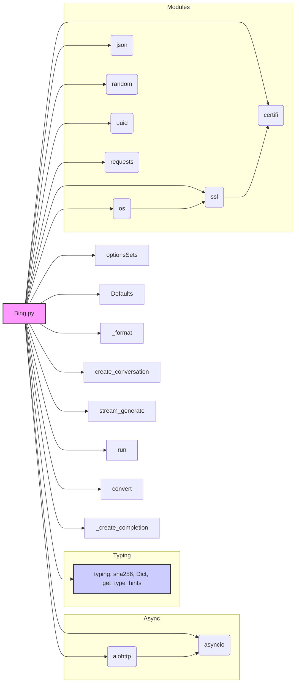

### **Системные инструкции для обработки кода проекта `hypotez`**

=========================================================================================

Описание функциональности и правил для генерации, анализа и улучшения кода. Направлено на обеспечение последовательного и читаемого стиля кодирования, соответствующего требованиям.

---

### **Основные принципы**

#### **1. Общие указания**:
- Соблюдай четкий и понятный стиль кодирования.
- Все изменения должны быть обоснованы и соответствовать установленным требованиям.

#### **2. Комментарии**:
- Используй `#` для внутренних комментариев.
- Документация всех функций, методов и классов должна следовать такому формату: 
    ```python
        def function(param: str, param1: Optional[str | dict | str] = None) -> dict | None:
            """ 
            Args:
                param (str): Описание параметра `param`.
                param1 (Optional[str | dict | str], optional): Описание параметра `param1`. По умолчанию `None`.
    
            Returns:
                dict | None: Описание возвращаемого значения. Возвращает словарь или `None`.
    
            Raises:
                SomeError: Описание ситуации, в которой возникает исключение `SomeError`.

            Ехаmple:
                >>> function('param', 'param1')
                {'param': 'param1'}
            """
    ```
- Комментарии и документация должны быть четкими, лаконичными и точными.

#### **3. Форматирование кода**:
- Используй одинарные кавычки. `a:str = 'value'`, `print('Hello World!')`;
- Добавляй пробелы вокруг операторов. Например, `x = 5`;
- Все параметры должны быть аннотированы типами. `def function(param: str, param1: Optional[str | dict | str] = None) -> dict | None:`;
- Не используй `Union`. Вместо этого используй `|`.

#### **4. Логирование**:
- Для логгирования Всегда Используй модуль `logger` из `src.logger.logger`.
- Ошибки должны логироваться с использованием `logger.error`.
Пример:
    ```python
        try:
            ...
        except Exception as ex:
            logger.error('Error while processing data', ех, exc_info=True)
    ```
#### **5 Не используй `Union[]` в коде. Вместо него используй `|`
Например:
```python
x: str | int ...
```


---

### **Основные требования**:

#### **1. Формат ответов в Markdown**:
- Все ответы должны быть выполнены в формате **Markdown**.

#### **2. Формат комментариев**:
- Используй указанный стиль для комментариев и документации в коде.
- Пример:

```python
from typing import Generator, Optional, List
from pathlib import Path


def read_text_file(
    file_path: str | Path,
    as_list: bool = False,
    extensions: Optional[List[str]] = None,
    chunk_size: int = 8192,
) -> Generator[str, None, None] | str | None:
    """
    Считывает содержимое файла (или файлов из каталога) с использованием генератора для экономии памяти.

    Args:
        file_path (str | Path): Путь к файлу или каталогу.
        as_list (bool): Если `True`, возвращает генератор строк.
        extensions (Optional[List[str]]): Список расширений файлов для чтения из каталога.
        chunk_size (int): Размер чанков для чтения файла в байтах.

    Returns:
        Generator[str, None, None] | str | None: Генератор строк, объединенная строка или `None` в случае ошибки.

    Raises:
        Exception: Если возникает ошибка при чтении файла.

    Example:
        >>> from pathlib import Path
        >>> file_path = Path('example.txt')
        >>> content = read_text_file(file_path)
        >>> if content:
        ...    print(f'File content: {content[:100]}...')
        File content: Example text...
    """
    ...
```
- Всегда делай подробные объяснения в комментариях. Избегай расплывчатых терминов, 
- таких как *«получить»* или *«делать»*. Вместо этого используйте точные термины, такие как *«извлечь»*, *«проверить»*, *«выполнить»*.
- Вместо: *«получаем»*, *«возвращаем»*, *«преобразовываем»* используй имя объекта *«функция получае»*, *«переменная возвращает»*, *«код преобразовывает»* 
- Комментарии должны непосредственно предшествовать описываемому блоку кода и объяснять его назначение.

#### **3. Пробелы вокруг операторов присваивания**:
- Всегда добавляйте пробелы вокруг оператора `=`, чтобы повысить читаемость.
- Примеры:
  - **Неправильно**: `x=5`
  - **Правильно**: `x = 5`

#### **4. Использование `j_loads` или `j_loads_ns`**:
- Для чтения JSON или конфигурационных файлов замените стандартное использование `open` и `json.load` на `j_loads` или `j_loads_ns`.
- Пример:

```python
# Неправильно:
with open('config.json', 'r', encoding='utf-8') as f:
    data = json.load(f)

# Правильно:
data = j_loads('config.json')
```

#### **5. Сохранение комментариев**:
- Все существующие комментарии, начинающиеся с `#`, должны быть сохранены без изменений в разделе «Улучшенный код».
- Если комментарий кажется устаревшим или неясным, не изменяйте его. Вместо этого отметьте его в разделе «Изменения».

#### **6. Обработка `...` в коде**:
- Оставляйте `...` как указатели в коде без изменений.
- Не документируйте строки с `...`.
```

#### **7. Аннотации**
Для всех переменных должны быть определены аннотации типа. 
Для всех функций все входные и выходные параметры аннотириваны
Для все параметров должны быть аннотации типа.


### **8. webdriver**
В коде используется webdriver. Он импртируется из модуля `webdriver` проекта `hypotez`
```python
from src.webdirver import Driver, Chrome, Firefox, Playwright, ...
driver = Driver(Firefox)

Пoсле чего может использоваться как

close_banner = {
  "attribute": null,
  "by": "XPATH",
  "selector": "//button[@id = 'closeXButton']",
  "if_list": "first",
  "use_mouse": false,
  "mandatory": false,
  "timeout": 0,
  "timeout_for_event": "presence_of_element_located",
  "event": "click()",
  "locator_description": "Закрываю pop-up окно, если оно не появилось - не страшно (`mandatory`:`false`)"
}

result = driver.execute_locator(close_banner)
```

### Анализ кода `hypotez/src/endpoints/freegpt-webui-ru/g4f/Provider/Providers/Bing.py`

#### 1. Блок-схема

```mermaid
graph LR
    A[Начало] --> B{Создание conversation};
    B -- Успешно --> C{Создание websocket соединения с Bing Chat};
    B -- Неуспешно --> E[Выброс исключения "Failed to create conversation."];
    C --> D{Форматирование и отправка запроса};
    D --> F{Получение и обработка ответов от Bing Chat};
    F -- type=1 --> G{Извлечение текстовых данных};
    F -- type=2 --> H{Обработка ошибок или завершение};
    G --> I{Генерация и выдача результата};
    H -- Ошибка --> J[Выброс исключения с деталями ошибки];
    H -- Завершение --> K[Закрытие websocket и сессии];
    I --> F;
    K --> L[Конец];
```

**Примеры для логических блоков:**

-   **Создание conversation:** Функция `create_conversation` отправляет HTTP-запрос к `https://www.bing.com/turing/conversation/create` и извлекает `conversationId`, `clientId` и `conversationSignature` из JSON-ответа.
-   **Создание websocket соединения с Bing Chat:** Функция `stream_generate` устанавливает защищенное websocket-соединение с сервером `wss://sydney.bing.com/sydney/ChatHub`.
-   **Форматирование и отправка запроса:** Функция `stream_generate` формирует JSON-структуру запроса с параметрами, такими как `prompt`, `conversationSignature`, `clientId` и `conversationId`, и отправляет ее через websocket.
-   **Получение и обработка ответов от Bing Chat:** В цикле `while not final` функция `stream_generate` получает данные через websocket, разделяет их по разделителю `\x1e` и обрабатывает каждый объект JSON.
-   **Извлечение текстовых данных:** Если `response['type'] == 1`, функция извлекает текстовые данные из полей `adaptiveCards[0]['body'][0]['text']` или `text` и формирует строку ответа.
-   **Обработка ошибок или завершение:** Если `response['type'] == 2`, функция проверяет наличие ошибок в поле `result.error`. Если ошибка есть, выбрасывается исключение. Если ошибок нет, устанавливается флаг `final = True`, и соединение закрывается.
-   **Генерация и выдача результата:** Функция `stream_generate` использует `yield` для выдачи промежуточных результатов по мере их получения.
-   **Закрытие websocket и сессии:** После завершения работы или при возникновении ошибки функция `stream_generate` закрывает websocket-соединение и сессию aiohttp.

#### 2. Диаграмма



**Объяснение зависимостей:**

-   `os`: Используется для генерации случайных данных (`os.urandom(16)`) и получения имени файла (`os.path.basename(__file__)`).
-   `json`: Используется для сериализации и десериализации данных в формате JSON.
-   `random`: Используется для генерации случайных чисел в IP-адресе (`random.randint(0, 255)`).
-   `uuid`: Используется для генерации уникальных идентификаторов (`uuid.uuid4()`).
-   `ssl`: Используется для создания SSL-контекста для защищенного соединения (`ssl.create_default_context()`).
-   `certifi`: Используется для получения пути к доверенным сертификатам (`certifi.where()`).
-   `aiohttp`: Используется для асинхронных HTTP-запросов и websocket-соединений.
-   `asyncio`: Используется для работы с асинхронным кодом.
-   `requests`: Используется для выполнения HTTP-запросов (в основном, для создания conversation).
-   `typing`: Используется для аннотации типов. `sha256`, `Dict`, `get_type_hints` используются для типизации данных.
-   `optionsSets`: Класс для хранения настроек запросов.
-   `Defaults`: Класс для хранения значений по умолчанию, таких как разделитель, IP-адрес и параметры местоположения.

#### 3. Объяснение

**Импорты:**

-   `os`: Предоставляет функции для взаимодействия с операционной системой, например, для работы с путями к файлам и генерации случайных байтов.
-   `json`: Используется для кодирования и декодирования данных в формате JSON.
-   `random`: Используется для генерации случайных чисел, в данном случае, для создания IP-адреса.
-   `uuid`: Используется для создания универсальных уникальных идентификаторов (UUID).
-   `ssl`: Используется для создания безопасных соединений, в частности, для проверки SSL-сертификатов.
-   `certifi`: Предоставляет набор доверенных SSL-сертификатов.
-   `aiohttp`: Библиотека для выполнения асинхронных HTTP-запросов и работы с WebSocket.
-   `asyncio`: Библиотека для написания асинхронного кода.
-   `requests`: Библиотека для выполнения HTTP-запросов.
-   `...typing`: Содержит `sha256`, `Dict` и `get_type_hints` для аннотации типов.

**Классы:**

-   `optionsSets`: Класс, содержащий настройки для запросов к Bing Chat.
    -   `optionSet`: Словарь с типами данных для настроек (`tone`, `optionsSets`).
    -   `jailbreak`: Набор настроек для "jailbreak" режима.
-   `Defaults`: Класс, содержащий значения по умолчанию.
    -   `delimiter`: Разделитель сообщений (`\x1e`).
    -   `ip_address`: Сгенерированный IP-адрес.
    -   `allowedMessageTypes`: Список разрешенных типов сообщений.
    -   `sliceIds`: Список идентификаторов для слайсов.
    -   `location`: Информация о местоположении.

**Функции:**

-   `_format(msg: dict) -> str`: Форматирует сообщение в JSON и добавляет разделитель.
    -   `msg`: Словарь, который необходимо отформатировать.
    -   Возвращает JSON-строку с разделителем.
-   `create_conversation() -> tuple[str, str, str]`: Создает conversation с Bing Chat.
    -   Выполняет несколько попыток запроса к Bing для создания conversation.
    -   Возвращает `conversationId`, `clientId` и `conversationSignature`.
    -   Вызывает исключение, если conversation не удалось создать после нескольких попыток.
-   `stream_generate(prompt: str, mode: optionsSets.optionSet, context: bool | str)`: Генерирует ответ от Bing Chat в режиме streaming.
    -   `prompt`: Текст запроса.
    -   `mode`: Настройки режима (по умолчанию `optionsSets.jailbreak`).
    -   `context`: Контекст запроса (может быть `False` или строкой).
    -   Устанавливает WebSocket соединение с Bing Chat.
    -   Форматирует и отправляет запрос.
    -   Получает и обрабатывает ответы в цикле.
    -   Использует `yield` для возврата промежуточных результатов.
-   `run(generator)`: Запускает асинхронный генератор.
    -   `generator`: Асинхронный генератор.
    -   Итерируется по генератору и возвращает значения.
    -   Обрабатывает исключение `StopAsyncIteration` при завершении генератора.
-   `convert(messages)`: Преобразует список сообщений в строку контекста.
    -   `messages`: Список сообщений.
    -   Возвращает строку, содержащую контекст сообщений.
-   `_create_completion(model: str, messages: list, stream: bool, **kwargs)`: Создает completion с использованием Bing Chat.
    -   `model`: Модель для использования.
    -   `messages`: Список сообщений.
    -   `stream`: Флаг, указывающий на использование streaming режима.
    -   Извлекает `prompt` и `context` из сообщений.
    -   Запускает `stream_generate` и возвращает результаты через `yield`.

**Переменные:**

-   `url`: URL для Bing Chat (`https://bing.com/chat`).
-   `model`: Список поддерживаемых моделей (`['gpt-4']`).
-   `supports_stream`: Флаг, указывающий на поддержку streaming (`True`).
-   `needs_auth`: Флаг, указывающий на необходимость аутентификации (`False`).
-   `ssl_context`: Контекст SSL для безопасного соединения.
-   `params`: Строка, содержащая информацию о поддерживаемых параметрах.

**Потенциальные ошибки и области для улучшения:**

-   Обработка ошибок при создании conversation может быть улучшена, например, можно добавить логирование.
-   IP-адрес генерируется случайным образом, что может привести к проблемам.
-   В коде используется устаревший способ форматирования строк (%). Рекомендуется использовать f-строки.
-   Отсутствуют аннотации типов для переменных `url`, `model`, `supports_stream`, `needs_auth`, `ssl_context`
-   В коде отсутствуют логи. Рекомендуется добавить логирование для отладки и мониторинга.

**Цепочка взаимосвязей с другими частями проекта:**

-   Этот файл является провайдером для `g4f`, который используется для доступа к различным моделям, включая `gpt-4` через Bing Chat.
-   Функция `_create_completion` является точкой входа для использования этого провайдера. Она принимает сообщения, преобразует их в формат, понятный для Bing Chat, и возвращает ответ.
-   Параметр `params` используется для динамического определения поддерживаемых параметров.