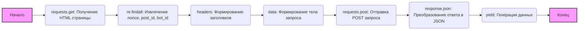

### **Системные инструкции для обработки кода проекта `hypotez`**

=========================================================================================

Описание функциональности и правил для генерации, анализа и улучшения кода. Направлено на обеспечение последовательного и читаемого стиля кодирования, соответствующего требованиям.

---

### **Основные принципы**

#### **1. Общие указания**:
- Соблюдай четкий и понятный стиль кодирования.
- Все изменения должны быть обоснованы и соответствовать установленным требованиям.

#### **2. Комментарии**:
- Используй `#` для внутренних комментариев.
- Документация всех функций, методов и классов должна следовать такому формату: 
    ```python
        def function(param: str, param1: Optional[str | dict | str] = None) -> dict | None:
            """ 
            Args:
                param (str): Описание параметра `param`.
                param1 (Optional[str | dict | str], optional): Описание параметра `param1`. По умолчанию `None`.
    
            Returns:
                dict | None: Описание возвращаемого значения. Возвращает словарь или `None`.
    
            Raises:
                SomeError: Описание ситуации, в которой возникает исключение `SomeError`.

            Ехаmple:
                >>> function('param', 'param1')
                {'param': 'param1'}
            """
    ```
- Комментарии и документация должны быть четкими, лаконичными и точными.

#### **3. Форматирование кода**:
- Используй одинарные кавычки. `a:str = 'value'`, `print('Hello World!')`;
- Добавляй пробелы вокруг операторов. Например, `x = 5`;
- Все параметры должны быть аннотированы типами. `def function(param: str, param1: Optional[str | dict | str] = None) -> dict | None:`;
- Не используй `Union`. Вместо этого используй `|`.

#### **4. Логирование**:
- Для логгирования Всегда Используй модуль `logger` из `src.logger.logger`.
- Ошибки должны логироваться с использованием `logger.error`.
Пример:
    ```python
        try:
            ...
        except Exception as ex:
            logger.error('Error while processing data', ех, exc_info=True)
    ```
#### **5 Не используй `Union[]` в коде. Вместо него используй `|`
Например:
```python
x: str | int ...
```


---

### **Основные требования**:

#### **1. Формат ответов в Markdown**:
- Все ответы должны быть выполнены в формате **Markdown**.

#### **2. Формат комментариев**:
- Используй указанный стиль для комментариев и документации в коде.
- Пример:

```python
from typing import Generator, Optional, List
from pathlib import Path


def read_text_file(
    file_path: str | Path,
    as_list: bool = False,
    extensions: Optional[List[str]] = None,
    chunk_size: int = 8192,
) -> Generator[str, None, None] | str | None:
    """
    Считывает содержимое файла (или файлов из каталога) с использованием генератора для экономии памяти.

    Args:
        file_path (str | Path): Путь к файлу или каталогу.
        as_list (bool): Если `True`, возвращает генератор строк.
        extensions (Optional[List[str]]): Список расширений файлов для чтения из каталога.
        chunk_size (int): Размер чанков для чтения файла в байтах.

    Returns:
        Generator[str, None, None] | str | None: Генератор строк, объединенная строка или `None` в случае ошибки.

    Raises:
        Exception: Если возникает ошибка при чтении файла.

    Example:
        >>> from pathlib import Path
        >>> file_path = Path('example.txt')
        >>> content = read_text_file(file_path)
        >>> if content:
        ...    print(f'File content: {content[:100]}...')
        File content: Example text...
    """
    ...
```
- Всегда делай подробные объяснения в комментариях. Избегай расплывчатых терминов, 
- таких как *«получить»* или *«делать»*. Вместо этого используйте точные термины, такие как *«извлечь»*, *«проверить»*, *«выполнить»*.
- Вместо: *«получаем»*, *«возвращаем»*, *«преобразовываем»* используй имя объекта *«функция получае»*, *«переменная возвращает»*, *«код преобразовывает»* 
- Комментарии должны непосредственно предшествовать описываемому блоку кода и объяснять его назначение.

#### **3. Пробелы вокруг операторов присваивания**:
- Всегда добавляйте пробелы вокруг оператора `=`, чтобы повысить читаемость.
- Примеры:
  - **Неправильно**: `x=5`
  - **Правильно**: `x = 5`

#### **4. Использование `j_loads` или `j_loads_ns`**:
- Для чтения JSON или конфигурационных файлов замените стандартное использование `open` и `json.load` на `j_loads` или `j_loads_ns`.
- Пример:

```python
# Неправильно:
with open('config.json', 'r', encoding='utf-8') as f:
    data = json.load(f)

# Правильно:
data = j_loads('config.json')
```

#### **5. Сохранение комментариев**:
- Все существующие комментарии, начинающиеся с `#`, должны быть сохранены без изменений в разделе «Улучшенный код».
- Если комментарий кажется устаревшим или неясным, не изменяйте его. Вместо этого отметьте его в разделе «Изменения».

#### **6. Обработка `...` в коде**:
- Оставляйте `...` как указатели в коде без изменений.
- Не документируйте строки с `...`.
```

#### **7. Аннотации**
Для всех переменных должны быть определены аннотации типа. 
Для всех функций все входные и выходные параметры аннотириваны
Для все параметров должны быть аннотации типа.


### **8. webdriver**
В коде используется webdriver. Он импртируется из модуля `webdriver` проекта `hypotez`
```python
from src.webdirver import Driver, Chrome, Firefox, Playwright, ...
driver = Driver(Firefox)

Пoсле чего может использоваться как

close_banner = {
  "attribute": null,
  "by": "XPATH",
  "selector": "//button[@id = 'closeXButton']",
  "if_list": "first",
  "use_mouse": false,
  "mandatory": false,
  "timeout": 0,
  "timeout_for_event": "presence_of_element_located",
  "event": "click()",
  "locator_description": "Закрываю pop-up окно, если оно не появилось - не страшно (`mandatory`:`false`)"
}

result = driver.execute_locator(close_banner)
```

### Анализ кода `hypotez/src/endpoints/freegpt-webui-ru/g4f/Provider/Providers/ChatgptAi.py`

#### 1. Блок-схема:

```mermaid
graph LR
    A[Начало] --> B{Подготовка сообщения для запроса};
    B --> C{Формирование тела запроса (data) и заголовков (headers)};
    C --> D{Отправка POST запроса к ChatGPT.ai};
    D --> E{Обработка ответа};
    E --> F{Извлечение данных из JSON};
    F --> G{Генерация ответа (yield)};
    G --> H[Конец];
```

1.  **Начало**: Начальная точка выполнения функции `_create_completion`.
2.  **Подготовка сообщения для запроса**:
    *   Собирает все сообщения из списка `messages` в одну строку `chat`.
    *   Пример: Если `messages` содержит `[{'role': 'user', 'content': 'Hello'}]`, то `chat` будет содержать `'user: Hello\nassistant: '`.
3.  **Формирование тела запроса (data) и заголовков (headers)**:
    *   Извлекает `nonce`, `post_id`, `bot_id` из HTML-кода страницы `https://chatgpt.ai/gpt-4/`.
    *   Формирует словарь `data` с параметрами для POST запроса.
    *   Определяет `headers` для запроса, включая `user-agent`, `referer` и другие.
4.  **Отправка POST запроса к ChatGPT.ai**:
    *   Отправляет POST запрос на `https://chatgpt.ai/wp-admin/admin-ajax.php` с сформированными `headers` и `data`.
    *   Использует библиотеку `requests` для выполнения запроса.
5.  **Обработка ответа**:
    *   Получает JSON ответ от сервера.
6.  **Извлечение данных из JSON**:
    *   Извлекает данные из поля `data` полученного JSON ответа.
    *   Пример: `response.json()['data']`.
7.  **Генерация ответа (yield)**:
    *   Генерирует (возвращает) извлеченные данные.
    *   Использование `yield` позволяет возвращать данные частями, что полезно для потоковой обработки.
8.  **Конец**: Конечная точка выполнения функции `_create_completion`.

#### 2. Диаграмма:



**Объяснение зависимостей:**

*   `requests`: Используется для отправки HTTP-запросов (GET и POST) к серверу ChatGPT.ai.
*   `re`: Используется для извлечения данных (`nonce`, `post_id`, `bot_id`) из HTML-кода, полученного от сервера с помощью регулярных выражений.

#### 3. Объяснение:

*   **Импорты**:
    *   `os`: Используется для получения имени файла скрипта.
    *   `requests`: Используется для отправки HTTP-запросов к API.
    *   `re`: Используется для работы с регулярными выражениями, в частности, для извлечения данных из HTML.
    *   `...typing`: Импортирует `sha256`, `Dict`, `get_type_hints` из родительского пакета `...typing`. Эти типы используются для аннотации типов в функциях.

*   **Переменные**:
    *   `url: str = 'https://chatgpt.ai/gpt-4/'`: URL страницы ChatGPT.ai.
    *   `model: list = ['gpt-4']`: Список поддерживаемых моделей.
    *   `supports_stream: bool = False`: Указывает, поддерживается ли потоковая передача.
    *   `needs_auth: bool = False`: Указывает, требуется ли аутентификация.

*   **Функции**:
    *   `_create_completion(model: str, messages: list, stream: bool, **kwargs)`:
        *   `model (str)`: Модель для использования.
        *   `messages (list)`: Список сообщений для отправки.
        *   `stream (bool)`: Флаг, указывающий, использовать ли потоковую передачу.
        *   `**kwargs`: Дополнительные аргументы.
        *   Функция формирует запрос к ChatGPT.ai и генерирует ответ. Она отправляет POST запрос на конечную точку `https://chatgpt.ai/wp-admin/admin-ajax.php` с телом, содержащим сообщения чата, и возвращает результат в виде генератора.

*   **Логика работы**:
    1.  Функция `_create_completion` принимает список сообщений, формирует тело запроса `chat`, объединяя сообщения.
    2.  Затем она выполняет GET запрос к `https://chatgpt.ai/gpt-4/` для получения значений `nonce`, `post_id` и `bot_id`, которые необходимы для последующего POST запроса.
    3.  Формируются заголовки `headers` и данные `data` для POST запроса.
    4.  Отправляется POST запрос на `https://chatgpt.ai/wp-admin/admin-ajax.php`.
    5.  Полученный ответ в формате JSON парсится, и извлекаются данные из поля `data`, которые генерируются с использованием `yield`.

*   **Потенциальные ошибки и области для улучшения**:
    *   Обработка ошибок при запросах: Код не содержит явной обработки ошибок при выполнении HTTP запросов. Если запрос не удастся (например, из-за проблем с сетью), программа может завершиться с ошибкой.
    *   Отсутствие логирования: В коде отсутствует логирование, что затрудняет отладку и мониторинг работы.
    *   Извлечение данных из HTML: Извлечение `nonce`, `post_id` и `bot_id` с использованием регулярных выражений может быть ненадежным, так как структура HTML может измениться.
    *   Потоковая передача: Хотя переменная `supports_stream` установлена в `False`, код использует `yield`, что подразумевает возможность потоковой передачи. Однако, фактической потоковой обработки не происходит.
    *   Отсутствие обработки исключений: В коде нет обработки исключений, которые могут возникнуть при выполнении запросов или при парсинге JSON.

*   **Взаимосвязи с другими частями проекта**:
    *   Этот файл является частью модуля `g4f` в проекте `hypotez`, который предоставляет API для доступа к различным языковым моделям. Он предоставляет конкретную реализацию для модели `gpt-4` через сервис `chatgpt.ai`.
    *   Импортированные типы из `...typing` используются для статической типизации, что улучшает читаемость и поддерживаемость кода.